# Technical Design Document — jd-matcher (PoC)

> **Status**: Draft — Part 1 only
> **Phase**: PoC
> **Last Updated**: 2026-04-24
> **Depends on**: PRD.md (drafted in parallel), DISCOVERY-NOTES.md, RESEARCH-REPORT.md, UX-SPEC.md, ROADMAP.md
> **Note**: Part 2 (per-component spec) is filled during `/milestone-plan`, NOT now. See §6 for the inventory.

---

## Part 1 — Project Architecture

### 1.0 Solution Approach (PoC scope)

A plain-language pipeline written for the user. Library names live in §1.3.

**M1 scope (closed 2026-04-27):** steps **1, 3, 4, 5, 11 (URL-keyed only), 12, 13** below are in scope. Steps 2 (open APIs), 6 (LLM), 7 (content-aware dedup), 8 (filter), 9 (rank), 10 (CV recommender) are deferred to later milestones. State management at M1 is keyed by `posting_id` (one URL → one posting); M2 generalises step 11 to canonical-id. **M1 development is unblocked by synthetic email/HTML fixtures**; real-data validation against the user's accumulating Gmail samples runs as a separate task within M1 — see Part 2 §"Cross-cutting M1 testing strategy — synthetic fixtures first".

**M2 scope (active milestone — Content-aware dedup + repost detection):** steps **6 (LLM extraction — normalisation only, full classification still deferred to M3), 7 (content-aware dedup with two-stage block + fuse), 11 (generalised from URL-keyed to canonical-id-keyed)** are added. The pipeline order extends to: fetch → parse → URL-dedup → hydrate → **LLM-extract (canonical fields + role_summary + top_skills only) → embed (role_summary preferred, full_jd fallback) → content-dedup (block + fuse) → merge (preserve first_seen, accumulate sources[], inherit state)** → store. **Himalayas API source (originally listed in PRD §5 M2) is deferred to M4** — see BACKLOG.md "PoC-M4 — Himalayas API source" — so M2 cross-source merge ACs are validated against LinkedIn↔Indeed pairs only. **LLM provider is cloud-default** (OpenAI `gpt-4o-mini` for extraction; `text-embedding-3-small` for embeddings) per ROADMAP §M2 / §M3; the architecture preserves a config-swappable local provider (Ollama + sentence-transformers) via a clean `LLMExtractor` / `EmbeddingProvider` interface (C28) — local swap is a config change, not a rewrite. **Repost detection threshold: 30 days** (ROADMAP §M2 verbatim). **Inactive/Expired interplay (from MVP-M1 BACKLOG)**: although the Inactive/Expired states do not exist until MVP-M1, the M2 dedup engine MUST be designed to treat such canonicals as non-existent for dedup purposes — a new posting matching an Inactive/Expired canonical surfaces as fresh. The mechanism (a `WHERE applied.status NOT IN (...)` predicate on the candidate-canonicals subquery) is wired into C21 from M2 and becomes load-bearing only when MVP-M1 introduces the new statuses. **M2 development is unblocked by synthetic test fixtures** (architect/data-pipeline-generated dedup pairs); real-data calibration via 10–15 user-labeled real pairs is a separate follow-on task within M2.


1. **Subscribe-and-receive (manual setup)** — user creates dedicated Gmail account, 7 LinkedIn saved searches, 2–3 Indeed alerts, and Job Bank Canada alerts. The system never logs into LinkedIn or Indeed; closed platforms push the list to us via email.
2. **Pull from open APIs** — for sources that publish a free structured feed (Himalayas, Remotive, Jobicy, HN), the pipeline polls directly. Strictly better data than email parsing where available.
3. **Parse alerts → extract URLs** — Gmail emails are filtered by sender; URL-regex extracts the canonical job URL from the plain-text part. URL is the most stable field across template changes.
4. **Hydrate to full JD** — for each newly-seen URL (once per URL, ever), fetch the public guest endpoint to get the full JD. Rate-limited 1 req / 30s. No login, no cookie.
5. **URL dedup (fast path)** — if the URL has been seen before, skip hydration and downstream work entirely. (M1 onwards.)
6. **Single LLM extraction call** — one prompt per posting produces canonical fields, salary, tags, primary focus, role-fit score, and a PR/citizenship requirement flag. Used by every downstream step (dedup normalisation, classification, filter, recommender). (M2 begins to use it for normalisation; M3 turns on full classification.)
7. **Content-aware dedup** — two semantically distinct stages. **BLOCK** ("are these in the same TEAM?") groups exact-match on `(canonical_company, team_or_department, canonical_location)`; different-team and different-location postings can never merge by construction. **FUSE** ("are these the same ROLE within the team?") scores remaining candidates with `0.4 × embedding_cosine(role_summary) + 0.3 × jaccard(top_skills) + 0.2 × title_cosine + 0.1 × seniority_match`; auto-merge at strict threshold 0.90 (tuned via M2-end calibration). Over-merge is worse than under-merge. (M2.)
8. **Filter (deterministic + LLM)** — hard rules first (location, seniority, PR/citizenship keywords) kill ~60–70% of postings before any LLM call. The LLM `fit_score` then gates the Main view (default ≥ 50). All postings remain stored regardless of filter outcome — filtering is a view policy. (M3.)
9. **Rank** — composite score (salary + industry bonus + recency decay) sorts the Main view. (M3.)
10. **CV recommendation** — at startup, each of the 5 user CVs is embedded once. For each posting, rank the 5 CVs by cosine similarity to `role_summary + top_skills` embedding; show top-1 with override dropdown. (M4.)
11. **State management** — applied / dismissed state is keyed off canonical-id from M2 onwards; new postings matching an applied or dismissed canonical are suppressed from Main automatically.
12. **Surface** — FastAPI serves a single HTML page on `localhost:PORT` with three tabs (Main / Applied / Dismissed). Keyboard-first triage; cards expand in place; CV chip and apply URLs visible in expanded state.
13. **Instrumentation** — every triage interaction (`card_viewed`, `card_dismissed`, `card_marked_applied`, session start/end) writes to an `events` table. Surfaced as `/analytics` at M4. **Logged in PoC; commercial evaluation deferred to MVP** (Beta Gate 1 input).

---

### 1.1 End-to-End Data Flow

```mermaid
flowchart LR
    subgraph "Manual setup (one-time)"
        U[User] -->|saved searches + alerts| LI[LinkedIn]
        U -->|alerts| IND[Indeed]
        U -->|alerts| JB[Job Bank Canada]
    end

    subgraph "Path A — Closed platforms (Gmail-mediated)"
        LI -->|alert email| GM[Gmail account]
        IND -->|alert email| GM
        JB -->|alert email| GM
        GM -->|messages.list / get| GI[Gmail Ingester]
        GI -->|raw emails| EP[Per-source email parsers<br/>LinkedIn / Indeed / Job Bank]
        EP -->|canonical URL + email teaser| HY[JD Hydrator<br/>guest endpoints, 1 req / 30s]
    end

    subgraph "Path B — Open APIs"
        H[Himalayas API] -->|structured JSON| AC[API Clients]
        R[Remotive API] -->|structured JSON| AC
        J[Jobicy API] -->|structured JSON| AC
        HN[HN HNRSS] -->|RSS items| AC
    end

    HY -->|full JD| URLD{URL seen?}
    AC -->|posting record| URLD
    URLD -->|new URL| LLM[LLM Extraction<br/>single call:<br/>canonical fields + salary + tags<br/>+ fit_score + PR flag]
    URLD -->|seen URL| SKIP[skip — already in DB]

    LLM -->|extracted fields| HF[Hard Filter<br/>location / seniority / PR keywords]
    HF -->|reject| ST[(SQLite — store always<br/>hedge 1)]
    HF -->|pass| EMB[Embedding<br/>text-embedding-3-small]
    EMB --> DD[Content-aware Dedup<br/>block + fuse cosine + structured]
    DD -->|merge| ST
    DD -->|new canonical| ST

    CV[5 CV files] -->|startup| CVE[CV Embeddings]
    CVE --> REC[CV Recommender<br/>cosine vs role_summary+top_skills]
    ST --> REC

    ST --> SC{State check<br/>applied/dismissed canonical?}
    SC -->|yes| HIDDEN[suppressed from Main]
    SC -->|no| RANK[Soft rank<br/>salary + industry + recency]
    RANK --> UI[FastAPI + HTML/JS<br/>Main / Applied / Dismissed tabs]

    UI -->|card_viewed / dismissed / applied / session events| EV[(events table)]
    UI -->|/analytics M4| ANL[Analytics view]
    EV --> ANL
```



Notes:
- Closed-platform JDs are NOT available until **after** hydration; open-API postings are complete from the start. Both branches converge at the URL-seen check.
- LLM extraction begins at M2 (normalisation only) and runs in full at M3. M1 ships URL-dedup + state without LLM.
- Below-threshold postings (Hard Filter reject + LLM `fit_score < threshold`) are stored, not discarded — hedge 1.

---

### 1.2 Component Inventory

| Component | Layer | Responsibility | Upstream | Downstream |
|-----------|-------|---------------|----------|------------|
| Gmail Ingester | Ingestion | OAuth loopback, poll dedicated job-search Gmail account, route emails by sender to per-source parsers | Gmail API | Email parsers |
| LinkedIn Email Parser | Ingestion | Extract `linkedin.com/jobs/view/{jobId}` URLs and teaser fields from alert emails (URL-regex primary) | Gmail Ingester | JD Hydrator |
| Indeed Email Parser | Ingestion | Extract Indeed posting URLs + teasers from alert emails | Gmail Ingester | JD Hydrator |
| Job Bank Email Parser | Ingestion | Extract Job Bank posting URLs + employer + NOC from email alerts (M4) | Gmail Ingester | URL-seen check |
| JD Hydrator | Ingestion | Fetch public guest endpoints for LinkedIn + Indeed URLs (1 req / 30s); parse JD HTML | Email parsers | URL-seen check |
| Himalayas API Client | Ingestion | Poll `himalayas.app/jobs/api/search` (M2) | None | URL-seen check |
| Remotive API Client | Ingestion | Poll `remotive.com/api/remote-jobs?category=ai-ml` (M4) | None | URL-seen check |
| Jobicy API Client | Ingestion | Poll `jobicy.com/api/v2/remote-jobs?geo=canada` (M4) | None | URL-seen check |
| HN HNRSS Client | Ingestion | Pull `hnrss.org/whoishiring/jobs`; regex-parse free text (M4) | None | URL-seen check |
| URL-seen Check | Processing | Lookup canonical URL in `seen_urls`; skip if seen | Ingestion | LLM Extraction |
| LLM Extraction | Processing | One-prompt-per-posting: canonical fields, salary, tags, `primary_focus`, `fit_score`, `requires_pr_or_citizenship`. Cloud-default `gpt-4o-mini`; Ollama optional. | URL-seen Check | Hard Filter, Embedding |
| Hard Filter | Processing | Deterministic location / seniority / PR-keyword filter; assigns reject reason but stores all rows | LLM Extraction | Storage |
| Embedding | Processing | `text-embedding-3-small` over full JD; cached per canonical record | Hard Filter (pass branch) | Dedup Engine |
| Dedup Engine | Processing | Block by (company, seniority, location); fuse cosine + structured similarity; merge or insert canonical; preserve `first_seen` and `sources[]`; repost detection | Embedding | Storage |
| State Manager | Processing | Maintains `applied` and `dismissed` keyed by canonical-id; cross-checks new postings | Storage, UI | Storage, UI |
| Soft Rank | Processing | Composite sort score (salary + industry + recency, configurable weights) | Storage | UI (Main view) |
| CV Recommender | Processing | At startup: extract + embed 5 CVs. Per posting: rank 5 CVs by cosine; expose top-1 + dropdown | Storage | UI (per-card) |
| Storage | Storage | SQLite — all tables namespaced by `user_id` | All Processing | All readers |
| Web UI | Presentation | FastAPI app + HTML/JS — three tabs, card list, expand-in-place, keyboard shortcuts, Settings, Analytics | Storage | User |
| Events Recorder | Observability | Writes triage interactions + session boundaries to `events` table | Web UI | Storage |
| Analytics View | Presentation | Reads `events` table; renders median time-per-card, sessions/day, time-to-clear, dismiss/apply ratio (M4) | Storage | User |

---

### 1.2a Data Model (SQLite — PoC)

ERD-level sketch only. Migration SQL is produced at the corresponding milestone-plan task. Every table is namespaced by a `user_id TEXT NOT NULL DEFAULT 'default'` column (hedge 3); not repeated below for brevity.

**`postings` — canonical record per unique role**
```
id              TEXT PRIMARY KEY      -- UUIDv4
user_id         TEXT
canonical_company       TEXT
canonical_seniority     TEXT
canonical_location      TEXT
canonical_title         TEXT
team_or_department      TEXT
top_skills              JSON          -- list[str]
role_summary            TEXT
salary_min_cad          INTEGER
salary_max_cad          INTEGER
industry                TEXT
primary_focus           TEXT          -- one tag from taxonomy
tags                    JSON          -- list[str]
fit_score               INTEGER       -- 0–100
fit_reasoning           TEXT
requires_pr_or_citizenship  BOOLEAN
hard_filter_status      TEXT          -- accept / reject_<reason>
embedding               BLOB          -- text-embedding-3-small vector (cached)
full_jd                 TEXT          -- richest JD across sources
first_seen              TIMESTAMP
last_seen               TIMESTAMP
extraction_status       TEXT          -- success / failed / pending
hydration_status        TEXT NOT NULL DEFAULT 'complete'  -- complete / partial / failed (C5; partial/failed STILL appear in Main)
created_at, updated_at  TIMESTAMP
INDEX idx_postings_user_block (user_id, canonical_company, canonical_seniority, canonical_location)
INDEX idx_postings_user_fit   (user_id, fit_score DESC)
```

**`postings_sources` — every source instance that maps to a canonical posting**
```
id              INTEGER PRIMARY KEY AUTOINCREMENT
user_id         TEXT
posting_id      TEXT  → postings.id
source          TEXT  -- linkedin / indeed / jobbank / himalayas / remotive / jobicy / hn
source_job_id   TEXT  -- platform-native job ID where available
url             TEXT
apply_url       TEXT
first_seen_at_source    TIMESTAMP
raw_payload     JSON   -- raw email body (LinkedIn/Indeed/JB) or API response
created_at      TIMESTAMP
UNIQUE(user_id, source, url)
INDEX idx_sources_posting (posting_id)
INDEX idx_sources_url     (url)
```

**`seen_urls` — fast URL-dedup index (M1)**
```
url             TEXT
user_id         TEXT
posting_id      TEXT  → postings.id  (nullable until canonicalisation lands at M2)
first_seen_at   TIMESTAMP
PRIMARY KEY (user_id, url)
```

**`applied` — applied-state cards**
```
id              INTEGER PRIMARY KEY AUTOINCREMENT
user_id         TEXT
posting_id      TEXT  → postings.id
status          TEXT  -- Applied / Screen / Interview / Offer / Rejected / Ghosted
applied_at      TIMESTAMP
status_updated_at  TIMESTAMP
notes           TEXT  -- 500-char limit (UX-SPEC.md §7)
auto_remove_at  TIMESTAMP  -- applied_at + 90 days; null when status=Offer  -- SUPERSEDED 2026-04-25 (see note below)
UNIQUE(user_id, posting_id)
INDEX idx_applied_user_age (user_id, applied_at)
```

> **Note (2026-04-25)**: `auto_remove_at` is superseded at MVP-M1 by the Inactive state model. The column is documented in M1 schema spec but is NOT populated by any M1 code (the scheduler that would have used it is deferred to MVP-M1, and at MVP-M1 the auto-remove model is replaced wholesale by auto-Inactivate on `status_updated_at`). At MVP-M1 this column may be removed or repurposed depending on the final implementation. Do not write code that depends on `auto_remove_at` semantics. See BACKLOG.md → "Inactive state lifecycle" and §C7 superseded note.

**`dismissed` — permanent blacklist**
```
id              INTEGER PRIMARY KEY AUTOINCREMENT
user_id         TEXT
posting_id      TEXT  → postings.id
dismissed_at    TIMESTAMP
UNIQUE(user_id, posting_id)
```

**`events` — hedge 2 instrumentation substrate**
```
id              INTEGER PRIMARY KEY AUTOINCREMENT
user_id         TEXT
session_id      TEXT          -- UUID per session
event_type      TEXT          -- session_start / session_end / card_viewed / card_expanded /
                              -- card_dismissed / card_marked_applied / cv_overridden / search_performed
posting_id      TEXT NULL → postings.id
metadata        JSON NULL     -- e.g. {"time_to_decide_ms": 1840} for card_dismissed
created_at      TIMESTAMP
INDEX idx_events_user_time   (user_id, created_at)
INDEX idx_events_user_session (user_id, session_id)
```

**`cv_variants` — 5 user-managed CVs**
```
id              INTEGER PRIMARY KEY AUTOINCREMENT
user_id         TEXT
slot            INTEGER       -- 1..5
filename        TEXT          -- short label shown in UI
filesystem_path TEXT
parsed_text     TEXT
embedding       BLOB
last_indexed_at TIMESTAMP
UNIQUE(user_id, slot)
```

**`cv_overrides` — per-posting CV override (M4)**
```
user_id         TEXT
posting_id      TEXT  → postings.id
cv_variant_id   INTEGER  → cv_variants.id
chosen_at       TIMESTAMP
PRIMARY KEY (user_id, posting_id)
```

**`pipeline_runs` — per-source last-run health for the UI sub-bar (UX-SPEC.md §8). One row per source per run — required, never optional.**
```
id                        INTEGER PRIMARY KEY AUTOINCREMENT
user_id                   TEXT
source                    TEXT          -- gmail_linkedin / gmail_indeed / hydrator_linkedin / hydrator_indeed / ...
run_id                    TEXT          -- UUID grouping all sources for one orchestrator invocation
health_status             TEXT NOT NULL -- healthy / degraded / failed  (NEVER null — Gate enforced at C11)
failure_reason            TEXT NULL     -- exception class + message; populated when health_status != healthy
started_at                TIMESTAMP
finished_at               TIMESTAMP
last_successful_fetch_at  TIMESTAMP NULL -- copied forward from the last healthy run for this source; drives sub-bar "stale" indicator
counts                    JSON          -- {"new": 5, "skipped_seen_urls": 12, "hydration_failed": 1}
INDEX idx_pipeline_runs_user_source_started (user_id, source, started_at DESC)
```

**`postings.hydration_status`** — added to the `postings` table above (TEXT NOT NULL DEFAULT `'complete'`, values `complete / partial / failed`). Postings with `partial` or `failed` MUST still be returned by the Main view query — hydration failure NEVER filters a card out of the UI.

**`email_ingest_log` — per-email ingestion telemetry (M1, TASK-M1-005c). One row per email fetched from Gmail, populated by C3 at fetch and updated in place by C4 (URL counts) and C5 (hydration counts). Drives the `python -m jd_matcher.report ingest` CLI (C13) so the user can manually cross-check Gmail vs the pipeline outcome.**
```
id                              INTEGER PRIMARY KEY AUTOINCREMENT
user_id                         TEXT
gmail_message_id                TEXT NOT NULL UNIQUE  -- Gmail's stable Message-ID; the join key for C4/C5 updates
source                          TEXT NOT NULL         -- linkedin / indeed / jobbank / ...
sender                          TEXT NOT NULL
subject                         TEXT NOT NULL
received_at                     TIMESTAMP NOT NULL    -- as reported by Gmail
ingested_at                     TIMESTAMP NOT NULL
pipeline_run_id                 TEXT NOT NULL         -- canonical orchestrator run_id (NOT `_ingest_<sender>` sub-run);
                                                      -- same B1 discriminator pattern used by /api/source-health
urls_extracted_count            INTEGER NOT NULL DEFAULT 0   -- written by C4
urls_new_count                  INTEGER NOT NULL DEFAULT 0   -- written by C4 (post URL-dedup, C6)
postings_created_count          INTEGER NOT NULL DEFAULT 0   -- written by C4/C6
postings_hydrated_count         INTEGER NOT NULL DEFAULT 0   -- written by C5 (per-posting accumulator)
postings_hydration_failed_count INTEGER NOT NULL DEFAULT 0   -- written by C5 (per-posting accumulator)
filter_status                   TEXT NULL                    -- M2: NULL or 'filtered' (set by C19 title filter when a posting is dropped pre-hydration)
filter_reason                   TEXT NULL                    -- M2: matched deny-pattern string when filter_status='filtered' (e.g. "Director", "Software Developer (no DS/ML adj)")
notes                           TEXT NULL
INDEX idx_email_ingest_log_run      (pipeline_run_id)
INDEX idx_email_ingest_log_received (received_at)
INDEX idx_email_ingest_log_filter   (filter_status)          -- M2: lookup all filtered postings for the planned MVP-M1 Filtered Tab UI
```

> **M2 schema delta (filter columns)**: `filter_status` and `filter_reason` are added to `email_ingest_log` for the C19 title-based interest filter. Default NULL — passed postings have NULL in both columns; dropped postings have `filter_status='filtered'` + `filter_reason=<matched pattern>`. Optional richer telemetry table `title_filter_decisions` (one row per pass/drop event) was considered and rejected for M2 — the email_ingest_log columns are sufficient for the audit trail + future Filtered Tab UI; revisit at MVP-M1 if richer per-event analytics are needed (e.g. time-series of filter precision over weeks).

**`canonical_postings` — one row per merged "canonical job" (M2). The unit a card represents on Main from M2 forward; postings_canonical_links many-to-one maps source variants onto a canonical.**
```
canonical_id            INTEGER PRIMARY KEY AUTOINCREMENT
user_id                 TEXT NOT NULL DEFAULT 'default'
canonical_title         TEXT NOT NULL          -- LLM-canonicalised; single source of truth
canonical_company       TEXT NOT NULL          -- LLM-canonicalised
canonical_seniority     TEXT NOT NULL          -- LLM-canonicalised; one of seed taxonomy values
canonical_location      TEXT NOT NULL          -- LLM-canonicalised (city, region, "Remote")
team_or_department      TEXT NULL              -- LLM-extracted; NULL if not stated
top_skills              JSON NOT NULL          -- list[str]; LLM-extracted; ordered by salience
role_summary            TEXT NOT NULL          -- LLM-extracted; ~3-4 sentence neutral summary; the embedding source
full_jd                 TEXT NOT NULL          -- longer of merged variants (per user-confirmed merge semantics)
full_jd_provenance      JSON NOT NULL          -- {"chosen_from_posting_id": <id>, "source": "linkedin|indeed|..."}
first_seen              TIMESTAMP NOT NULL     -- earliest first_seen across all linked postings (preserved on merge)
last_seen               TIMESTAMP NOT NULL     -- max last_seen across all linked postings
sources_summary         JSON NOT NULL          -- denormalised list e.g. ["linkedin", "indeed"]; rebuilt on every link insert
created_at, updated_at  TIMESTAMP
INDEX idx_canonical_user_block (user_id, canonical_company, team_or_department, canonical_location)  -- C21 BLOCK key: "same TEAM?"; seniority moved to FUSE (see C21)
INDEX idx_canonical_user_first_seen (user_id, first_seen DESC)
```

**`posting_canonical_links` — many-to-one mapping `postings → canonical_postings` (M2). Append-only; a row is inserted whenever C21 returns `merge` or creates a new canonical.**
```
id                      INTEGER PRIMARY KEY AUTOINCREMENT
user_id                 TEXT NOT NULL DEFAULT 'default'
posting_id              TEXT NOT NULL          -- → postings.id
canonical_id            INTEGER NOT NULL       -- → canonical_postings.canonical_id
similarity_score        REAL NOT NULL          -- the fused score from C21 at merge time; 1.0 for the seed posting that created the canonical
merge_kind              TEXT NOT NULL          -- one of 'new_canonical' | 'content_dedup' | 'repost'
merged_at               TIMESTAMP NOT NULL
UNIQUE(user_id, posting_id)                     -- a posting links to exactly one canonical
INDEX idx_links_canonical (canonical_id)        -- lookup all variants of a canonical
INDEX idx_links_posting (posting_id)            -- reverse lookup
INDEX idx_links_repost (canonical_id, merge_kind) -- repost-history queries
```

**`posting_embeddings` — embedding vectors keyed per posting (M2). Replaces the inline `postings.embedding` BLOB column noted in the original `postings` table — see "Schema delta" note below. Cached: a row persists across runs and is reused if the source text hash matches.**
```
posting_id              TEXT PRIMARY KEY       -- → postings.id
user_id                 TEXT NOT NULL DEFAULT 'default'
text_source             TEXT NOT NULL          -- 'role_summary' (preferred) | 'full_jd' (fallback when role_summary is empty)
text_hash               TEXT NOT NULL          -- SHA-256 of the source text — cache key for skip-on-unchanged
embedding               BLOB NOT NULL          -- packed float32 vector (1536 floats for text-embedding-3-small; 384 floats for all-MiniLM-L6-v2)
embedding_dim           INTEGER NOT NULL       -- vector length; cross-validated against model_name on read
model_name              TEXT NOT NULL          -- 'text-embedding-3-small' | 'all-MiniLM-L6-v2' | ...
embedded_at             TIMESTAMP NOT NULL
INDEX idx_embeddings_user_model (user_id, model_name)
```

**`llm_call_ledger` — per-call cost + latency log for cloud LLM/embedding calls (M2). Small but load-bearing: the cloud-vs-local benchmark sub-task at M3 reads this table; the BACKLOG cost-watchdog item also reads it.**
```
id                      INTEGER PRIMARY KEY AUTOINCREMENT
user_id                 TEXT NOT NULL DEFAULT 'default'
provider                TEXT NOT NULL          -- 'openai' | 'ollama' | 'sentence_transformers'
model_name              TEXT NOT NULL          -- e.g. 'gpt-4o-mini' | 'text-embedding-3-small'
call_kind               TEXT NOT NULL          -- 'extraction' | 'embedding'
input_tokens            INTEGER NULL           -- NULL for local providers that don't expose token counts
output_tokens           INTEGER NULL
cost_usd                REAL NOT NULL DEFAULT 0.0  -- 0.0 for local; computed from provider unit price for cloud
latency_ms              INTEGER NOT NULL
posting_id              TEXT NULL              -- → postings.id; NULL for batch/system calls
called_at               TIMESTAMP NOT NULL
status                  TEXT NOT NULL          -- 'success' | 'retry' | 'failure'
INDEX idx_ledger_user_called (user_id, called_at DESC)
INDEX idx_ledger_user_kind   (user_id, call_kind, model_name)
```

**Schema delta — `postings.embedding` BLOB column (M1)**: superseded at M2 by the `posting_embeddings` table. The M1 column was reserved but never written. The `posting_embeddings` table is the single source of truth from M2 forward. The `postings.embedding` column may be dropped at M2 implementation time (additive `ALTER TABLE postings DROP COLUMN embedding;` works on SQLite ≥3.35) OR left as a vestigial column ignored by all M2+ code; data-pipeline picks the cleaner option at TASKS-time. No M1 code reads or writes the column.

**Data preservation invariant for content-aware dedup (M2 — load-bearing):** the `postings` table is the source-of-truth, append-only record of every URL the pipeline has ingested; `canonical_postings` is a derived layer that the UI projects from (one card per canonical, sources accumulated). The dedup pipeline can be re-run from scratch against the preserved `postings` under a new threshold to produce fresh canonicals — no data loss. The audit trail in `posting_canonical_links.similarity_score` (captured at merge-time, never overwritten) lets future consumers query borderline merges (e.g., similarity 0.85–0.92 → candidates for re-review if the threshold changes). C29 enforces the append-only property on `postings`; a future admin command (out of M2 scope; backlog candidate at MVP) would expose threshold re-tuning as `python -m jd_matcher.dedup rebuild --threshold <new>`: drop `canonical_postings` + `posting_canonical_links` + `posting_embeddings`, re-run the M2 pipeline against `postings`. This invariant is the reason `postings.canonical_*` fields and `canonical_postings.canonical_*` fields coexist (the former preserves the LLM extraction at ingest-time per posting; the latter is the merged view).

Schema is declared in `schema.sql` and applied by a small bootstrap on first run. No migration framework in PoC; schema evolution is handled by additive changes during PoC and by a migration strategy added at MVP.

---

### 1.3 Technology Stack

| Layer | Technology | Rationale |
|-------|-----------|-----------|
| Language | Python 3.11+ | Portfolio standard (root CLAUDE.md). Type hints, `pathlib.Path`, structured logging. |
| Web framework | FastAPI ≥0.110 + Uvicorn ≥0.27 | Portfolio standard. Async support for I/O-heavy ingestion. Local serving on `localhost:PORT`. |
| Frontend | Vanilla HTML/JS + minimal CSS, optionally HTMX ≥1.9 for partial updates | UX-SPEC.md is keyboard-first and density-tight; React adds zero value at single-page PoC scope and adds build chrome. HTMX lets us swap card fragments without a full SPA. **Decision: ship pure HTML/JS first; introduce HTMX only if request-level complexity warrants.** |
| Storage (PoC) | SQLite ≥3.40 + `sqlite3` stdlib (or `aiosqlite` if FastAPI async needs it) | Portfolio standard for PoC. Schema migration to PostgreSQL deferred to MVP-M1 if needed. |
| ORM / migrations | None — raw SQL via `sqlite3` cursors with parameterised queries; schema declared in `schema.sql` checked into the repo | SQLAlchemy adds boilerplate; schema is small and stable. Hand-written SQL keeps the data model auditable. |
| Data contracts | Pydantic ≥2.5 | Structured I/O between every component (Gate 4 requirement: data contracts at component boundaries). Required for FastAPI request/response models too. |
| LLM (default — extraction) | OpenAI SDK `openai` ≥1.30 → `gpt-4o-mini` | Cloud-default per DISCOVERY-NOTES.md §10. ~$0.60/mo at 20 postings/day. Avoids multi-GB local model downloads. |
| LLM (optional fallback) | Ollama (local HTTP) → `qwen2.5:7b` | Config-swappable via `llm.extraction_model`. Personal-use opt-in at M3 only. |
| Embeddings (default) | OpenAI `text-embedding-3-small` | ~$0.04/mo. Cloud-default for portfolio consistency. |
| Embeddings (optional fallback) | `sentence-transformers` ≥2.5 → `all-MiniLM-L6-v2` (~80MB, CPU-friendly, zero cost) | Config-swappable via `llm.embedding_model`. |
| Gmail | `google-auth` ≥2.28 + `google-api-python-client` ≥2.120 | Loopback OAuth flow per RESEARCH-REPORT.md §4. Refresh-token reuse on subsequent runs. |
| HTTP | `httpx` ≥0.27 (async-capable) for hydration + API clients | Modern, type-friendly, supports both sync and async. |
| HTML parsing | `selectolax` ≥0.3 (preferred for speed) or `beautifulsoup4` ≥4.12 fallback | JD hydration HTML parsing only — emails are URL-regex first per RESEARCH-REPORT.md §3. |
| RSS parsing | `feedparser` ≥6.0 | HN HNRSS only. |
| PDF text extraction | `pymupdf` ≥1.24 (preferred) or `pdfplumber` ≥0.11 fallback | CV ingestion at startup. M4 only. |
| Code reuse | `py-linkedin-jobs-scraper` (reference only — JD-parsing helpers reused for the **hydration step**, not list/search) | Per DISCOVERY-NOTES.md §3 — search-step is the risky automation fingerprint; hydration of an email-discovered URL is not. Vendored with attribution if used; not added as a runtime dependency. |
| Testing | `pytest` ≥7.4 + `pytest-asyncio` ≥0.23 + `respx` ≥0.21 (httpx mock); ≥80% coverage on core logic | Portfolio standard. |
| Logging | stdlib `logging` (structured via `logging.config.dictConfig`) | Portfolio standard. No `print()`. |
| Secrets | `.env` via `python-dotenv` ≥1.0; `.env.example` checked in | Portfolio standard. |
| Versioning | All exact pinned in `requirements.txt` | Portfolio standard. |

---

### 1.4 Security Considerations

**Gmail authentication.** Loopback OAuth flow on `http://127.0.0.1:{port}` per Google's recommended desktop pattern (RESEARCH-REPORT.md §4). One-time browser consent; refresh-token reuse on subsequent runs. OAuth client credentials (`credentials.json`) and tokens stored under `~/.jd-matcher/` outside the repo. App in **Testing** status — single user, "App not verified" interstitial accepted on first consent. No publishing, no domain verification.

**API keys.** OpenAI API key in `.env`, loaded via `python-dotenv`. `.env` is in `.gitignore`. `.env.example` is checked in showing required keys without values. **No key, token, or credential is ever committed.** This is enforced by portfolio-level git hygiene (root CLAUDE.md §"Security").

**Local-only runtime.** FastAPI binds to `127.0.0.1`, never `0.0.0.0`. No external authentication layer required — single-user personal tool on author's desktop. Multi-user / per-user OAuth is out of scope; `user_id` namespace column exists for future multi-tenant additivity (hedge 3) but is not exercised in PoC.

**Data sensitivity.** No PII beyond what the user receives in their own Gmail account. Postings are public job listings. CV files referenced by filesystem path — not uploaded, not embedded server-side beyond the local SQLite + cosine vector. No PIPEDA scope (no commercial processing of third-party PII).

**Rate limiting (outbound).**
- LinkedIn / Indeed JD hydration: hard-coded 1 req / 30s ceiling. ~40 hydrations/day total — indistinguishable from a human clicking slowly. Documented in DATA-SOURCES.md.
- **Indeed `pagead/clk` URL resolution (C4 sub-step, TASK-M1-005b): SEPARATE budget — 3.0–4.5s jitter per request, ~40 calls/day.** This budget is intentionally tighter than hydration because the two operations mimic distinct human behaviors: pagead resolution mimics email-click cadence (3–4s between clicks); hydration mimics page-reading cadence (30s per page). The budgets coexist; pagead resolution does NOT count against the 1 req/30s hydration ceiling.
- Remotive: max 2x / minute, recommended 4x / day per RESEARCH-REPORT.md §5.
- Himalayas: rate limit triggers 429 — exponential backoff on 429.
- Gmail API: well under free quota (`messages.list` + `messages.get` = 5 units each; daily limit none).

**LinkedIn ToS-gray acknowledgment (on the record).** The guest-endpoint hydration approach (`linkedin.com/jobs-guest/jobs/api/jobPosting/{jobId}`) is technically prohibited by LinkedIn's Terms of Service, which broadly prohibits automation. At single-user personal volume (~40 requests/day, no authentication, no cookie, no login) enforcement risk is very low. The trade-off was presented to the user during discovery and explicitly accepted (DISCOVERY-NOTES.md §3). **This approach does not scale commercially** — the HiQ Labs precedent (MARKET-ANALYSIS.md Risk 1) means a commercial pivot requires a different LinkedIn ingestion layer (email-only or paid aggregator). Logged here so the constraint is auditable at every gate.

**Input validation.** All external API responses (Gmail, OpenAI, Himalayas, Remotive, Jobicy, HN, JD hydration HTML) are validated through Pydantic models before downstream use. Unexpected schemas raise warnings and abort that source's run — never silently accept malformed data (root CLAUDE.md §"Security").

**Security review escalation.** Per architect scope rules, formal security reviews begin at MVP (devops-engineer). PoC stays personal-use; no formal threat model.

---

### 1.5 Error Handling Strategy

All failures are tiered per Gate 5 (root CLAUDE.md):

| Layer | Tier | Retry / Fallback | Escalates to user |
|-------|------|-----------------|-------------------|
| Gmail Ingester | Major (auth refresh failure) → Directional (revoked token requires user re-auth) | Up to 3 retries with exponential backoff for transient HTTP. Refresh-token failure: stop pipeline, emit clear "Re-run auth flow" error, surface persistent banner per UX-SPEC.md §8. | Yes — refresh-token revocation always surfaces (UX banner + log). |
| Email parsers (LinkedIn / Indeed / Job Bank) | Minor (single-message parse failure: log + skip) → Major (URL-only fraction >20% over a run) | Per-message try/except — one bad email never kills the run. Raw email body persisted for replay. **Health metric "URL-only fraction"** computed per run; >20% logs WARNING and surfaces in `/analytics` admin (post-M4). | URL-only fraction >20%: logged WARNING; user reviews at quality-log time. Full template break (0% URL extraction): Major-tier root-cause + auto-fix attempts. |
| JD Hydrator | Minor (single 429 / timeout: backoff retry) → Major (sustained 429 across run) | 1 req / 30s rate limit baked in. On 429: backoff and skip that URL for this run; URL stays in `seen_urls` candidates for next run. **Graceful degradation**: store URL + email teaser even if hydration fails. | Sustained 429s across multiple sources: logged ERROR; user sees missing-JD count in run summary. |
| API clients (Himalayas / Remotive / Jobicy / HN) | Minor (single 5xx / timeout) → Major (consecutive failures across runs) | Per-source try/except. **Per-source isolation** — one source down does not cascade. Last-successful-fetch timestamp tracked per source. | Last-sync timestamp turns amber in UI sub-bar (UX-SPEC.md §8); tooltip lists failed sources. No persistent banner per source — too noisy. |
| LLM Extraction | Minor (single 429 / 5xx: retry) → Major (parse failures on response JSON) → Directional (model choice change) | OpenAI SDK retry policy + 3 attempts on JSON parse. On parse failure: store the raw response in the DB, mark posting as `extraction_failed`, leave for manual review. | Parse failure rate >5%: Major tier — root-cause first (likely prompt drift). Model change is a Directional decision — never auto-fixed. |
| Hard Filter | Minor only (deterministic logic — bug if it fails) | Up to 3 auto-fix attempts on bug discovery. | Only on tier escalation. |
| Embedding | Minor (transient API error: retry) → Major (sustained) | Cache embeddings by canonical record — never recompute on retry. | Sustained: surface in run summary. |
| Dedup Engine | Major-bias (false-merge on different-team is the catastrophic failure) | **Strict 0.90 auto-merge threshold by default.** Calibrated against hand-labeled set at M2. Below 0.90 → keep separate. **Different-team false-merge has zero tolerance** (SC-7) — failure here halts the milestone close. | Always — M2 quality log review. |
| State Manager | Minor (single API failure: snap card back, brief toast per UX-SPEC.md §"Touchpoint 2/3") | API failures roll back the UI optimistic update. | No — handled in UI. |
| CV Recommender | Probabilistic — user approval gate | No auto-fix for accuracy. M4 ships only after user reviews and approves. | Yes — M4 user-approval gate. |
| Web UI | Minor — rendering bugs | Up to 3 auto-fix attempts. | Only on tier escalation. |
| Events Recorder | Minor — best effort | Failures logged WARNING; event drop is acceptable (no business consequence). | No — observability data; failure does not block triage. |

**Observability substrate.** The `events` table is the single observability surface for hedge 2 instrumentation. Structured logging (Python `logging` with `dictConfig`) writes to `~/.jd-matcher/logs/jd-matcher.log` with rotation. Log level configurable (`LOG_LEVEL` env var). No `print()`.

**Per-source isolation.** The pipeline orchestrator wraps every source's full run (ingest → hydrate → extract → store) in a try/except that captures and logs failures per source. `last_run_status_<source>` is persisted in a small `pipeline_runs` table. UX surfaces are amber timestamp + tooltip (per UX-SPEC.md §8); per-source persistent banners are not built (too noisy for daily-use).

---

### 1.6 Configuration & Environment

Documented here at Part 1 level; concrete schema confirmed in §6 Part 2 work.

**Environment variables (`.env`)**
- `OPENAI_API_KEY` — required
- `GOOGLE_APPLICATION_CREDENTIALS` — path to `credentials.json` for Gmail OAuth
- `JD_MATCHER_PORT` — FastAPI port (default `8765`)
- `LOG_LEVEL` — default `INFO`
- `DB_PATH` — default `~/.jd-matcher/jd-matcher.db`

**Config file (`config.yaml`)** — covers the tunable knobs from DISCOVERY-NOTES.md §10:
- `dedup.auto_merge_threshold` (0.90)
- `dedup.fusion_weight_embedding` / `fusion_weight_structured` (0.5 / 0.5)
- `dedup.block_key` (`["company", "seniority", "location"]`)
- `filter.fit_threshold` (50)
- `filter.pr_keyword_list` (seed list)
- `llm.extraction_model` (`gpt-4o-mini`)
- `llm.embedding_model` (`text-embedding-3-small`)
- `classification.taxonomy` (10-tag seed)
- `ranking.weights` (salary / industry / recency)
- `user.current_user_id` (`"default"`)

**Persistent state path**: `~/.jd-matcher/`
- `jd-matcher.db` — SQLite
- `tokens.json` — Gmail OAuth refresh token
- `logs/` — rotated structured logs

---

### 1.7 Testing Approach

**Layout**
- `tests/unit/` — pure-Python unit tests for parsers, dedup logic, hard-filter rules, ranking, CV cosine math, schema invariants. Mocked external services.
- `tests/integration/` — end-to-end pipeline runs against fixture emails + recorded API responses. No live network. Hedge 2 events table populated and verified.
- `tests/live/` — gated by `SKIP_LIVE=1`; hits real Gmail API + OpenAI + Himalayas / Remotive / Jobicy / HN with minimal volume. Run only by user, never in CI/PR loops.

**Coverage**: ≥80% on core logic per portfolio standard. Aim higher on parsers (Gate 4 evaluation samples drive the validation, not coverage alone).

**Live-API gating.** Every test that touches the network is decorated `@pytest.mark.skipif(os.getenv("SKIP_LIVE") == "1", ...)`. The default `pytest -v` invocation in the Task Completion Checklist uses `SKIP_LIVE=1`. Live tests are run on demand by the user.

**Mock strategy.**
- `respx` for httpx mocking of API clients + JD hydration.
- Recorded fixture emails (raw RFC-822) for Gmail-driven parser tests. Stored under `tests/fixtures/emails/{linkedin,indeed,jobbank}/`.
- OpenAI: `respx` against `api.openai.com` with canned JSON for extraction tests; per-prompt fixtures for stability.
- SQLite: in-memory (`:memory:`) for unit tests; tmpfile for integration tests.

**Fixture location**
- `tests/fixtures/emails/` — raw email samples
- `tests/fixtures/api-responses/` — recorded API responses per source
- `tests/fixtures/jds/` — hydrated JD HTML samples (LinkedIn, Indeed)
- `tests/fixtures/labels/` — hand-labeled benchmark sets (dedup pairs, classification, CV recommender) — versioned with the repo so quality runs are reproducible.

**Quality-log evaluation samples (Gate 4)** — distinct from unit/integration tests. Stored under `projects/jd-matcher/docs/poc/quality-logs/<task-id>.md` per portfolio convention.

---

## Part 2 — Per-Component Spec

> Each component scoped to **M1** has a full entry below. Components scoped to M2/M3/M4 retain placeholder rows in the inventory table at the end of this section and will be filled at their milestone-plan step (Gate 6).

### Cross-cutting M1 testing strategy — synthetic fixtures first

The user is **actively setting up LinkedIn / Indeed alert subscriptions in parallel with M1 development**. Real alert emails will arrive over the first few days but cannot block implementation. M1 therefore uses a two-phase sample strategy:

1. **Development phase (synthetic fixtures, checked in):** Every email parser and hydrator is built and unit-tested against handcrafted RFC-822 MIME files modelling the LinkedIn and Indeed alert structure described in RESEARCH-REPORT.md §3 + DATA-SOURCES.md §"Path A". Fixtures live under `tests/fixtures/emails/{linkedin,indeed}/` and `tests/fixtures/jds/{linkedin,indeed}/` and are versioned with the repo so quality runs are reproducible (TDD §1.7).
2. **Validation phase (real-data quality run):** Once the user has accumulated ≥50 LinkedIn + ≥30 Indeed real alert emails in the dedicated Gmail account, a separate validation task per parser confirms the Gate 4 ≥95% threshold on real samples. **Real-data validation is a downstream task, not a development blocker.** Failure on real samples triggers Major-tier root-cause-first per Gate 5; synthetic fixtures are extended to cover the failing pattern.

**Rule for every M1 component below**: synthetic fixtures unblock implementation; real-data validation is deferred to a follow-on task within the same milestone but does not gate code completion. Parsers must **fail gracefully and log clearly** on partial parses — never crash the pipeline. URL-only fallback is the contract every parser owes the orchestrator.

---

### C1 — Repo bootstrap

| Field | Value |
|-------|-------|
| **Input** | None — first task. User Git identity already configured per portfolio standard. |
| **Output** | Public GitHub repo at `github.com/andrew-yuhochi/jd-matcher`; local working tree with skeleton; first commit pushed. |
| **Responsibility** | Stand up the repo (public, MIT, README with portfolio "Built with Claude Code" badge per root CLAUDE.md), the project skeleton (`src/jd_matcher/`, `tests/{unit,integration,live,fixtures}/`, `docs/`, `schema.sql`, `config.yaml`, `requirements.txt`, `.env.example`, `.gitignore`), and the structured-logging boilerplate. **Implements hedge 5 (open-source from day 1) — PRD §3 / ROADMAP §"Cross-Cutting Commercial Hedges" #5.** No business logic. |
| **Data stored** | None at runtime. Repo metadata only. |
| **Quality criteria + pass threshold** | Deterministic. (a) `git remote -v` shows `andrew-yuhochi/jd-matcher`; (b) `LICENSE` file is exactly the MIT template with current year + author name; (c) `README.md` contains the literal line `> Built with [Claude Code](https://claude.ai/code)` directly below the top description (root CLAUDE.md GitHub Rule #4); (d) `.gitignore` excludes `.env`, `~/.jd-matcher/` artefacts, `__pycache__/`, `.pytest_cache/`, `*.db`; (e) `python -c "import jd_matcher"` succeeds in the venv; (f) `pytest -v` runs (zero tests, zero failures) without import errors; (g) repo URL HTTP 200 and visible. **Pass threshold: 100% on all seven items.** |
| **Sample selection** | N/A — single-instance setup. |
| **Failure tier** | Minor. Setup script bugs are fixable; no auto-fix limit needed because the surface is small. |
| **Interface dependencies** | Upstream: none. Downstream: every other M1 component depends on the skeleton. |
| **Implementation notes** | Vendoring `py-linkedin-jobs-scraper` JD-parsing helpers (TDD §1.3, DATA-SOURCES.md §"LinkedIn JD Hydration") happens here if used: copy only the JD-parse helpers under `src/jd_matcher/_vendored/lijobs_jd_parse/` with attribution in `LICENSES/` — never the list/search code. |

---

### C2 — Data model / SQLite schema

| Field | Value |
|-------|-------|
| **Input** | None at runtime; schema declared in `schema.sql` (TDD §1.2a). |
| **Output** | SQLite database at `~/.jd-matcher/jd-matcher.db` with all M1-required tables created. |
| **Responsibility** | Apply `schema.sql` on first run via a small bootstrap (`jd_matcher.storage.init_db()`). For M1, the required tables are: `postings`, `postings_sources`, `seen_urls`, `applied`, `dismissed`, `events`, `cv_variants` (created empty for M4 forward-compat — costs nothing), `cv_overrides`, `pipeline_runs`. Every table carries `user_id TEXT NOT NULL DEFAULT 'default'` (hedge 3, PRD §3). |
| **Data stored** | See TDD §1.2a for the column list. M1-specific notes: |

| Table | M1 columns actively written | Purpose |
|-------|-----------------------------|---------|
| `postings` | `id`, `user_id`, `canonical_company` (best-effort from email), `canonical_location` (best-effort), `canonical_title`, `full_jd`, `first_seen`, `last_seen`, `extraction_status='pending'`, `created_at`, `updated_at` | One row per discovered posting; LLM-driven canonicalisation begins at M2, so M1 stores raw email-parsed values in the `canonical_*` columns and marks `extraction_status='pending'`. |
| `postings_sources` | `posting_id`, `source`, `source_job_id`, `url`, `apply_url`, `first_seen_at_source`, `raw_payload` | Raw email body in `raw_payload` for replay (R1 mitigation). |
| `seen_urls` | `url`, `user_id`, `posting_id`, `first_seen_at` | URL-dedup index — fast path. |
| `applied` | `posting_id`, `status='Applied'`, `applied_at`, `auto_remove_at = applied_at + 90 days` | M1 only writes `Applied` status; status-dropdown writes from M1 UI. |
| `dismissed` | `posting_id`, `dismissed_at` | Permanent blacklist. |
| `events` | `session_id`, `event_type`, `posting_id`, `metadata`, `created_at` | Hedge 2 substrate populated from M1 onwards (PRD §3, ROADMAP "Hedge 2"). |
| `pipeline_runs` | `source`, `run_id`, `health_status` (NOT NULL — `healthy`/`degraded`/`failed`), `failure_reason`, `started_at`, `finished_at`, `last_successful_fetch_at`, `counts` | Per-source health for sub-bar — **exactly one row per source per run, written even on success** (C11 invariant). Failures CANNOT be hidden — `health_status != 'healthy'` produces a visible sub-bar badge that auto-clears only on the next healthy run for that source. |
| `postings.hydration_status` | NOT NULL DEFAULT `'complete'`; values `complete`/`partial`/`failed` | Set by C5; postings with `partial` or `failed` are NEVER filtered out of Main (C8 invariant). |

| Field | Value |
|-------|-------|
| **Migration approach** | **Decision: raw SQL via `sqlite3` cursor + a single `schema.sql` checked into the repo. No Alembic, no SQLAlchemy.** Justification: the schema is small (~10 tables); SQLite tolerates additive `ALTER TABLE` cleanly through PoC; an ORM and a migration framework triple the surface area for a single-user PoC where every column is auditable in one file. PostgreSQL + a real migration framework is an MVP-M1 decision. Schema evolution during PoC is handled by additive `ALTER TABLE` statements appended to `schema.sql` plus a `schema_version` row in a tiny `_meta` table — bumped manually on each PoC schema change. Documented as a known shortcut in §1.2a. |
| **Quality criteria + pass threshold** | Deterministic. (a) `init_db()` is idempotent — running twice never throws; (b) all M1 tables exist with `user_id` column defaulted to `'default'`; (c) every UNIQUE constraint listed in §1.2a is enforced; (d) every INDEX listed in §1.2a is created; (e) a smoke test inserts 5 fixture rows into `postings` + `postings_sources` + `seen_urls` and reads them back. **Pass: 100% on all five.** |
| **Sample selection** | Synthetic only — schema correctness is structural. |
| **Failure tier** | Minor. Schema bugs surface immediately on first run. |
| **Interface dependencies** | Upstream: C1. Downstream: every component that reads or writes data (C3–C11). |

> **M2 update (2026-04-27)**: Schema gains four new tables — `canonical_postings`, `posting_canonical_links`, `posting_embeddings`, `llm_call_ledger` (full DDL in §1.2a above). `init_db()` becomes responsible for creating them idempotently alongside the M1 set. The `postings.embedding` BLOB column reserved at M1 is superseded by `posting_embeddings` (per §1.2a "Schema delta" note). All existing M1 invariants (a)–(e) extend to the new tables: idempotent init, UNIQUE constraints on `(user_id, posting_id)` for `posting_canonical_links` enforced, every new INDEX created, smoke test extended to insert one fixture row into each new table.

---

### C3 — Gmail Ingester

| Field | Value |
|-------|-------|
| **Input** | One-time: `~/.jd-matcher/credentials.json` (OAuth 2.0 desktop client). Per run: stored refresh token at `~/.jd-matcher/tokens.json`, list of sender filters from `config.yaml` (`gmail.senders.linkedin`, `gmail.senders.indeed`). |
| **Output** | List of raw RFC-822 messages (decoded `bytes`) with sender + message-id metadata, dispatched to per-source parsers (C4). On per-sender failure: returns an empty list AND writes a `failed` `pipeline_runs` row — never raises into the orchestrator. |
| **Responsibility** | (1) On first run, perform OAuth 2.0 loopback flow on `http://127.0.0.1:{ephemeral_port}` per RESEARCH-REPORT.md §4. Open browser, capture auth code, exchange for tokens, persist refresh token to `~/.jd-matcher/tokens.json` with `chmod 600`. (2) On subsequent runs, load refresh token and silently obtain access token. (3) Run `users.messages.list` with query `from:<sender> newer_than:2d` per source, then `users.messages.get(format='raw')` per message-id. (4) Decode the raw Base64URL payload, route to the per-source parser by sender domain. (5) **Per-sender failure isolation with mandatory persistence:** every per-sender fetch (`gmail_linkedin`, `gmail_indeed`) is wrapped in `try/except`. On failure: write a `pipeline_runs` row for that source with `health_status='failed'` and `failure_reason=<exception class>: <message>`; return an empty list to the orchestrator. **Never re-raise** — failure is persisted, not propagated. (6) **`last_successful_fetch_at`**: on a healthy fetch, write the timestamp into the new `pipeline_runs` row; on a failed fetch, copy forward the most recent successful timestamp for that source so the sub-bar can render a stale indicator with a known last-good time. |
| **Data stored** | Per-message: nothing direct — payload is forwarded to C4 which stores raw body in `postings_sources.raw_payload`. **Per fetched email (TASK-M1-005c): one `email_ingest_log` row inserted at fetch time, keyed by Gmail `Message-ID` (the stable join key reused by C4/C5 update writes). Required fields populated: `gmail_message_id`, `source`, `sender`, `subject`, `received_at`, `ingested_at`, `pipeline_run_id` (the orchestrator's canonical run_id — NOT a per-source `_ingest_<sender>` sub-run-id; same B1 discriminator pattern as `/api/source-health`). All `*_count` columns default to 0 — they are incremented in place by C4 and C5.** Per run: **exactly one** `pipeline_runs` row per Gmail source (`gmail_linkedin`, `gmail_indeed`) with non-null `health_status`, `started_at`, `finished_at`, `counts={"emails_fetched": N}`, and `last_successful_fetch_at`. Written on success AND failure paths. |
| **Quality criteria + pass threshold** | Deterministic. (a) OAuth completes without manual intervention on second-and-subsequent runs (refresh-token reuse proven); (b) `messages.list` returns expected message count from a fixture mailbox query (live-API test gated by `SKIP_LIVE`); (c) every fetched message is decoded to valid RFC-822 (Pydantic `EmailEnvelope` model parses without error); (d) sender-routing dispatches each message to exactly one parser (no double-dispatch, no drop); (e) **failure-persistence invariant** — a forced exception in the per-sender fetch (e.g. injected 500) produces exactly one `pipeline_runs` row with `health_status='failed'`, non-empty `failure_reason`, AND the orchestrator continues to the next source (no re-raise); (f) `last_successful_fetch_at` is correctly carried forward from the prior healthy run on a failed run. **Pass threshold: ≥95% successful fetch rate over a 7-day live window for healthy runs; 100% on (e) and (f).** |
| **Sample selection** | **Synthetic-fixture-first.** Unit tests use canned `messages.list` + `messages.get` JSON responses recorded under `tests/fixtures/api-responses/gmail/` via `respx`. Live-validation task runs against the user's real Gmail account once OAuth is set up — gated by `SKIP_LIVE=1` per TDD §1.7 and only by user. |
| **Failure tier** | **Minor** for transient HTTP / single-message decode failures (3 retries with exponential backoff). **Major** when `messages.list` returns malformed JSON (input-validation hit per TDD §1.4 — abort source, log WARNING). **Directional** for refresh-token revocation — pipeline halts for Gmail sources only (per-source isolation), surface persistent banner per UX-SPEC.md §5 and `[Connect Gmail]` action; user must re-run consent. Never auto-fixed. |
| **Interface dependencies** | Upstream: Gmail API. Downstream: C4 (LinkedIn parser), C4 (Indeed parser); will be extended to Job Bank parser at M4. Calls C2 to write `pipeline_runs`. |

---

### C4 — Email URL parser (LinkedIn + Indeed)

Single component with two sub-parsers (`linkedin_parser.py`, `indeed_parser.py`) sharing a `BaseEmailParser` interface. Spec applies to both unless noted.

| Field | Value |
|-------|-------|
| **Input** | Raw RFC-822 message bytes from C3, plus sender metadata. |
| **Output** | A list of `ParsedPosting` Pydantic models per email — `{source, source_job_id, url, apply_url, title, company, location, raw_email_body}` — handed to the URL-dedup check (C6). One email yields ≥0 postings; a typical alert email yields 5–25. |
| **Responsibility** | (1) Decode MIME parts; prefer `text/plain` over `text/html` (RESEARCH-REPORT.md §3 — Gmail rewrites the plain-text part of forwarded emails, so the user must NOT use forwarded samples; the dedicated Gmail account avoids this entirely). (2) **Primary extraction (URL regex):** apply `linkedin.com/jobs/view/(\d+)` for LinkedIn and Indeed's permalink regex (`indeed.com/(?:viewjob|rc/clk)?\?jk=([a-z0-9]+)` plus tracking-redirector patterns) over the entire decoded body. Each unique job ID yields one `ParsedPosting`. (3) **Indeed `pagead/clk` redirect resolution (TASK-M1-005b — split out of C4 into `parse/indeed_pagead.py` for isolated testability and a kill-switch).** A typical Indeed alert email contains 1 `rc/clk?jk=` URL (caught by the regex in (2)) and 5–12 `pagead/clk/dl?…` URLs (no `jk=` visible). The pagead URLs must be resolved by following the redirect chain to discover the canonical `viewjob?jk=<key>` URL. Empirically validated 8/8 in spike (~21% → ≥95% extraction). **Resolution contract (all 8 items mandatory — partial implementation will silently fail):** (a) one `requests.Session()` reused across all URLs in a single email batch — Cloudflare cookies (`__cf_bm`, `_cfuvid`) accumulate across the chain and the next request needs them; (b) browser-style static User-Agent (Chrome on macOS — rotation is overkill at this volume); (c) `Referer: https://mail.google.com/` — mimics what Indeed sees from a real Gmail click; (d) standard browser `Accept` / `Accept-Language` / `Accept-Encoding` headers; (e) **`html.unescape()` applied to the URL BEFORE the HTTP request** — email HTML contains `&amp;` entities and unescaped URLs are malformed; this is the single most likely silent-failure mode and MUST be unit-tested explicitly; (f) `time.sleep(3 + random.uniform(0, 1.5))` jitter between consecutive requests (3.0–4.5s range — mimics email-click cadence, NOT page-reading cadence); (g) `allow_redirects=True`, `timeout=30`; (h) discard tracking params (`tk`, `q`, `l`, `from`, …) from the resolved URL — keep only `jk=<hex>`. Helper signature: `resolve_pagead_urls(urls: list[str]) -> dict[str, str]` returning `{original: canonical}`; non-pagead URLs pass through unchanged (idempotent). **Offline-parse opt-out:** when `JD_MATCHER_OFFLINE_PARSE=1` is set the resolver short-circuits — every URL passes through unmodified. This breaks the C4 "no network at parse time" assumption from earlier drafts; the env-var lets the user restore offline parsing for replay/testing. **Rate-limit budget:** Indeed pagead resolution is a SEPARATE budget from C5 hydration (3.0–4.5s per request, ~40 calls/day) — it does NOT count against the §1.4 1 req/30s hydration ceiling because the two operations mimic different human behaviors (clicking through email links vs reading a JD page). Both budgets coexist; both are documented in §1.4. (4) **Secondary extraction (best-effort metadata):** template-aware heuristics extract title, company, location for each ID — used as metadata only; canonical fields come from C5/LLM at M2+. (5) **Always store** the full raw email body in `postings_sources.raw_payload` for replay against template changes (R1 mitigation, DATA-SOURCES.md §"LinkedIn"). (6) Compute the run-level **"URL-only fraction"** health metric — fraction of postings where only the URL was extracted, no title/company. Log WARNING if >20% (TDD §1.5). (7) **Per-email ingest-log update (TASK-M1-005c):** after parsing each email, locate the `email_ingest_log` row by `gmail_message_id` and update `urls_extracted_count` (from regex + pagead-resolved set) and `urls_new_count` (post URL-dedup, from C6). The row was inserted by C3; C4 only increments. |
| **Data stored** | Per posting: a row in `postings_sources` with the raw email body in `raw_payload`. The posting itself is not yet inserted into `postings` until C6 confirms the URL is new. |
| **Quality criteria + pass threshold** | Deterministic. **URL extraction is the regression-blocking metric.** Title/company/location are best-effort — partial extraction is acceptable. (a) **Synthetic-fixture phase:** ≥10 handcrafted LinkedIn fixtures + ≥10 Indeed fixtures, each with known expected URL set; every fixture must yield 100% URL extraction. (b) **Real-data validation phase (separate task within M1 once user collects samples):** ≥95% URL extraction on ≥50 real LinkedIn alert emails (PRD SC-1, ROADMAP M1 AC #2); ≥95% on ≥30 real Indeed alert emails (PRD SC-2). (c) Indeed redirect resolution: ≥95% of resolved URLs match the original `jk` job-id. (d) URL-only fraction ≤20% on real samples. (e) Zero crashes on malformed input (every fixture includes one corrupted MIME structure that must be logged and skipped). |
| **Sample selection** | **Both.** Synthetic fixtures (≥10 each, checked into `tests/fixtures/emails/{linkedin,indeed}/`) for development and unit tests. Real samples for the validation task — selected by sampling from the user's dedicated Gmail account once ≥50 LinkedIn + ≥30 Indeed have accumulated. Sample selection rule for the real-data run: include emails from at least three distinct LinkedIn saved searches (DISCOVERY-NOTES.md §4 list) and at least two Indeed saved searches; include any email where the `text/plain` part appears unusual (multi-language, very short, very long). |
| **Failure tier** | **Minor** per single-message parse failure — log + skip + record raw body in `postings_sources` so the message can be re-parsed once the parser is extended. **Major** when URL-only fraction >20% across a run, or when a fixture that previously passed regresses (root-cause first per Gate 5; raw email replay against a fixed parser; up to 3 auto-fix attempts). **Directional** when a full template break drops URL extraction below 50% on real samples — escalate to user, switch parsing strategy if needed. **Never silently fail** (CLAUDE.md §"Security"). |
| **Interface dependencies** | Upstream: C3 (Gmail Ingester). Downstream: C6 (URL-dedup) → C5 (Hydrator) for new URLs. Shares the rate-limited HTTP client with C5 for Indeed redirect resolution. |

---

### C5 — JD Hydrator

| Field | Value |
|-------|-------|
| **Input** | A list of `(source, url, source_job_id)` tuples from C6 representing **new** URLs only (URLs not in `seen_urls`). |
| **Output** | Per URL: a `HydratedJD` Pydantic model — `{full_jd_text, fetched_at, http_status, raw_html_path, hydration_status}` where `hydration_status ∈ {complete, partial, failed}` — handed to C11 (orchestrator) which writes the JD AND the status into `postings`. **Per-source health verdict** — written by C11 from the run-level fail-rate computed below. |
| **Responsibility** | (1) Fetch the public guest endpoint per source: `https://www.linkedin.com/jobs-guest/jobs/api/jobPosting/{jobId}` for LinkedIn; the equivalent guest job page for Indeed (DATA-SOURCES.md §"LinkedIn JD Hydration"). No authentication, no cookie — `httpx.AsyncClient` with a generic desktop User-Agent. (2) Apply a **process-wide 1 request per 30 seconds rate limiter** across LinkedIn + Indeed combined (TDD §1.4, DATA-SOURCES.md §"Rate limit"). Implemented via an `asyncio.Semaphore`-backed token bucket persisted in-memory. (3) Parse the response HTML with `selectolax` (fallback `beautifulsoup4`) — extract the full JD text. **JD-parsing helpers may be reused from `py-linkedin-jobs-scraper` JD parser only — never list/search.** (4) On success, return `HydratedJD` with `http_status=200`, `hydration_status='complete'`. (5) **Per-URL graceful degradation (NEVER drop a posting):** on 429 / timeout / parse failure / 4xx, the posting MUST still be inserted with `hydration_status='failed'` and best-effort fields from C4 (URL + email-teaser title/company/location preserved in `postings_sources.raw_payload`). On a partial HTML parse where some fields extract but JD body is empty, set `hydration_status='partial'`. **A failed hydration is logged + persisted, never silently dropped.** (6) **Source-level health detection (per run, per source — `hydrator_linkedin` and `hydrator_indeed` are tracked separately):** compute `fail_rate = failed / attempted` for each source within the run. **>20% fail-rate ⇒ `health_status='degraded'`. 100% fail-rate ⇒ `health_status='failed'` with `failure_reason='rate_limit'` (when 429s dominate) or `failure_reason=<dominant exception class>` otherwise.** Verdict is returned to C11 which writes the `pipeline_runs` row. (7) Write the raw HTML to disk under `~/.jd-matcher/raw_html/{source}/{job_id}.html` for replay against parser changes. |
| **Data stored** | Per URL: `postings.full_jd`, `postings.hydration_status`, `postings.last_seen` updated by C11 from the returned `HydratedJD`. Raw HTML on disk. **Per source per run: exactly one `pipeline_runs` row** — `source ∈ {hydrator_linkedin, hydrator_indeed}`, `health_status` populated by the rule above, `counts={"hydration_succeeded": N, "hydration_failed": M, "fail_rate": …}`. **Per-email ingest-log update (TASK-M1-005c):** for each hydration outcome, increment `postings_hydrated_count` (success path) or `postings_hydration_failed_count` (failure path) on the `email_ingest_log` row whose `gmail_message_id` matches the email this URL was extracted from. The hydrator therefore needs to receive the originating `gmail_message_id` alongside each URL — passed through by the orchestrator as part of the per-URL work item. **Result is cached per URL — never re-fetch a URL whose `full_jd` is already populated.** |
| **Quality criteria + pass threshold** | Deterministic. (a) **Synthetic-fixture phase:** ≥10 handcrafted HTML fixtures per source under `tests/fixtures/jds/{linkedin,indeed}/`, each with known expected JD text — 100% extraction on fixtures. (b) **Real-data validation phase (separate task within M1):** ≥95% successful full-JD fetch on ≥30 real sample URLs (PRD SC-3, ROADMAP M1 AC #3). (c) Rate-limit invariant: across a 100-URL run the wall-clock time is ≥ `(N-1) × 30` seconds — verifiable in the run summary. (d) Per-URL HTTP timeout 30s; on timeout, posting is inserted with `hydration_status='failed'` (graceful, not silent). (e) **No-drop invariant** — for any input batch of N URLs that survive C6, exactly N postings exist in `postings` after the run, regardless of hydration outcome (forced-failure test injects 429 on every URL → all N rows present with `hydration_status='failed'`). (f) **Source-health invariant** — injecting 25% failure into a 20-URL run produces a `pipeline_runs` row with `health_status='degraded'`; injecting 100% 429s produces `health_status='failed'`, `failure_reason='rate_limit'`. **Pass: 100% on (a), (c)–(f); ≥95% on (b).** |
| **Sample selection** | **Both.** Synthetic HTML fixtures for development and unit tests. Real validation: 30 URLs sampled from the first batch of real alert emails — the same set used for C4 real-data validation. Include URLs from both LinkedIn and Indeed in proportion to their inbox volume. |
| **Failure tier** | **Minor** for single 429 / timeout — backoff retry once. **Major** for sustained 429s across the run (root-cause first; check for IP-block warning signs; up to 3 auto-fix attempts likely tweaking rate-limit + User-Agent). **Major** for HTML structure changes breaking the parser — raw HTML on disk enables replay. **Directional** if LinkedIn explicitly IP-blocks (e.g. CAPTCHA challenge, persistent 403) — halt all hydration, surface to user, do not auto-retry; user decides whether to fall back to email-only mode for LinkedIn (DATA-SOURCES.md §"Failure modes"). |
| **Interface dependencies** | Upstream: C6 (URL-dedup, only new URLs forwarded). Downstream: C11 (orchestrator) writes into `postings`. Shares the rate-limited HTTP client with C4's Indeed redirect resolver. |

> **Note (2026-04-26 — MVP-M1 scope)**: At MVP-M1, the hydrator gains a new responsibility: when fetching a posting URL returns HTTP 404 (or platform-specific "no longer available" markers), invoke C7's `mark_expired(posting_id)` to transition the posting to `status='Expired'`. Other failure modes (403, 500, network timeout) remain `hydration_status='failed'` (transient). This auto-detection is the primary trigger for Expired; manual user action deferred to MVP-M2. See BACKLOG → "Inactive AND Expired state lifecycle".

> **M2 update (2026-04-27)**: No structural change to C5. The hydrator's output (`HydratedJD` with `full_jd` text) is unchanged, but downstream pipeline order extends — instead of going straight to storage, the orchestrator (C11) now routes the hydrated posting through C18 (LLM extraction) → C20 (embedding) → C21 (content-aware dedup) → C29 (merge) before final write. C5's contract — "exactly N postings persist for N input URLs, regardless of hydration outcome" — remains the no-drop invariant. Postings with `hydration_status ∈ {partial, failed}` still flow into the LLM extraction step (C18 handles the empty/short-JD path with a low-confidence extraction; the dedup engine downstream tolerates this gracefully).

---

### C6 — URL-based dedup

| Field | Value |
|-------|-------|
| **Input** | A `ParsedPosting` from C4 (or, post-M2, a `Posting` from any ingester). |
| **Output** | One of: `{status: 'new', posting_id: <new_uuid>}` → forward to C5; `{status: 'seen', posting_id: <existing>}` → skip hydration, update `last_seen` only. |
| **Responsibility** | (1) On every parsed posting, look up `(user_id, url)` in `seen_urls`. (2) If present: return `seen` — caller updates `postings.last_seen` and `postings_sources.first_seen_at_source` (if newer); skip C5 entirely. (3) If absent: `INSERT` into `postings` (with email-parsed best-effort fields), `INSERT` into `postings_sources`, `INSERT` into `seen_urls` — all in a single transaction. Return `new` so C11 dispatches the URL to C5. (4) **Atomicity invariant:** the `seen_urls` write is in the same transaction as the `postings` insert — partial failures must roll back; a URL is never recorded as seen unless its posting was successfully created. |
| **Data stored** | New URL: one row each in `postings`, `postings_sources`, `seen_urls`. Seen URL: only `postings.last_seen` and `postings_sources.first_seen_at_source` updates. |
| **Quality criteria + pass threshold** | Deterministic. **PRD SC-4 / ROADMAP M1 AC #5: 100%.** (a) Re-running the pipeline against the same Gmail inbox yields zero new rows in `postings` for URLs already in `seen_urls`. (b) Cross-process race test: two simulated concurrent inserts of the same URL produce exactly one row (UNIQUE constraint enforced — `INSERT OR IGNORE` + lookup pattern). (c) Transactional rollback test: a forced failure during `postings_sources` insert leaves zero entries in `seen_urls` for that URL. |
| **Sample selection** | **Synthetic only.** A 30-row fixture set re-played twice end-to-end through the orchestrator — second run must produce zero new postings. |
| **Failure tier** | **Minor** — pure deterministic logic. Any failure is a code bug. Up to 3 auto-fix attempts. |
| **Interface dependencies** | Upstream: C4. Downstream: C5 (for `new`); C11 (orchestrator). Reads/writes via C2. |

---

### C7 — State Manager

| Field | Value |
|-------|-------|
| **Input** | A `posting_id` and an action: `apply` / `dismiss` / `restore`. |
| **Output** | A `StateTransition` Pydantic model `{posting_id, from_state, to_state, ts}`. |
| **Responsibility** | (1) **Apply:** insert into `applied` `(posting_id, status='Applied', applied_at=now, auto_remove_at=now+90 days, status_updated_at=now)`. UNIQUE constraint guarantees idempotency. (2) **Dismiss:** insert into `dismissed` `(posting_id, dismissed_at=now)`. UNIQUE constraint guarantees idempotency. (3) **Restore (from Dismissed):** delete the row from `dismissed`. (4) **Main view query helper** — `select_main(user_id) -> List[Posting]` returns postings WHERE `posting_id NOT IN (SELECT posting_id FROM applied) AND posting_id NOT IN (SELECT posting_id FROM dismissed)` and `user_id = current_user_id`, ordered by `first_seen DESC` (M1 placeholder ordering before soft-rank lands at M3). (5) **Auto-removal helper** — `purge_stale_applied(user_id)` removes `applied` rows where `auto_remove_at < now AND status NOT IN ('Offer')`. **The helper exists in M1; the scheduler that triggers it is deferred to MVP-M1 (cron / launchd).** A `[Purge stale applied]` admin action may be wired but is not required for M1 acceptance. **Note (2026-04-25): This responsibility is superseded at MVP-M1.** The auto-remove model is replaced by the Inactive state model: instead of deleting rows, the helper transitions `status='Applied'/'Screen'/'Interview'` rows whose `status_updated_at < now - 90 days` to `status='Inactive'` (`Offer`/`Rejected`/`Withdrew` exempt). The current M1 implementation (`auto_remove_stale_applied(cutoff_date)` in `src/jd_matcher/state/manager.py`) ships as dead code per AC #6 (no M1 wiring) and will be replaced at MVP-M1. See BACKLOG.md → "Inactive state lifecycle" for the full MVP-M1 design. **Note (2026-04-26 update)**: The MVP-M1 lifecycle now also includes the `Expired` status (auto-set by C5/C6 on hydrator HTTP 404). State manager will gain `mark_expired(posting_id)` alongside the planned `update_status()` and `auto_inactivate_stale_applied()` functions. See BACKLOG → "Inactive AND Expired state lifecycle". |
| **Data stored** | Writes to `applied`, `dismissed`. Never deletes from `postings` — state is layered on top, postings are immutable in M1. |
| **Quality criteria + pass threshold** | Deterministic. **PRD SC-5 / ROADMAP M1 AC #6, #7: 100%.** (a) Apply → posting disappears from Main, appears in Applied; persists across server restart. (b) Dismiss → posting disappears from Main, appears in Dismissed; persists across server restart. (c) Restore → posting moves from Dismissed back to Main; the `dismissed` row is gone. (d) Re-ingestion of an applied or dismissed URL via C6 leaves the URL in `seen_urls` and updates `last_seen` only — does NOT resurface the posting in Main (M1 keys state by `posting_id`, which is the same UUID as long as the URL maps to the same posting; M2 will generalise to canonical-id). (e) `purge_stale_applied` deletes only rows with `auto_remove_at < now`; never touches `Offer` status. |
| **Sample selection** | **Synthetic only.** Fixture-driven end-to-end tests + a server-restart integration test. |
| **Failure tier** | **Minor.** Pure deterministic logic over a transactional store. Up to 3 auto-fix attempts. |
| **Interface dependencies** | Upstream: C8 (UI endpoints). Downstream: writes via C2. Read by C8 for tab queries. |

> **M2 update (2026-04-27)**: State management generalises from `posting_id` keying to `canonical_id` keying — a single `apply` or `dismiss` action now suppresses ALL source variants of the canonical from Main on subsequent runs (PRD §5 M2). Implementation: `applied` and `dismissed` tables continue to store `posting_id` (preserving M1 forensic history of which exact source variant the user actioned), but the Main view query (responsibility 4) and the C6 URL-dedup state-check both join through `posting_canonical_links` to test canonical-level membership. Concretely: `select_main(user_id)` becomes `WHERE NOT EXISTS (SELECT 1 FROM posting_canonical_links pcl JOIN applied a ON a.posting_id = pcl.posting_id WHERE pcl.canonical_id = <candidate_canonical_id> AND a.user_id = <user_id>)` and the equivalent for `dismissed`. The `restore` action remains posting-keyed (the user restored a specific source variant, not all of them). M2 implementation MUST add a unit test that confirms applying one source variant of a 2-source canonical suppresses the OTHER variant on re-ingest. The MVP-M1 supersession notes above (auto_remove → auto_inactivate, mark_expired) are unchanged by this M2 generalisation — they layer cleanly on top.

---

### C8 — Web UI: backend (FastAPI)

| Field | Value |
|-------|-------|
| **Input** | HTTP requests on `127.0.0.1:{JD_MATCHER_PORT}` (default 8765); template files under `src/jd_matcher/web/templates/`. |
| **Output** | Server-rendered HTML responses; JSON responses for the few state-mutation endpoints that HTMX consumes. |
| **Responsibility** | M1 endpoint set: |

| Method | Path | Purpose | Response |
|--------|------|---------|----------|
| GET | `/` | Main tab — render new postings (state-aware via C7) | HTML — full page |
| GET | `/applied` | Applied tab | HTML — full page |
| GET | `/dismissed` | Dismissed tab + search box | HTML — full page |
| POST | `/sync` | Trigger pipeline (C11) | HTML fragment for sub-bar status, or JSON |
| POST | `/postings/{id}/apply` | C7 apply transition | HTML fragment for the card (HTMX swap) |
| POST | `/postings/{id}/dismiss` | C7 dismiss transition | HTML fragment for the card (slide-left animation handled client-side) |
| POST | `/postings/{id}/restore` | C7 restore from Dismissed | HTML fragment / 204 |
| GET | `/healthz` | Liveness | JSON |
| GET | `/api/source-health` | Per-source health snapshot for the sub-bar (one entry per active source: `gmail_linkedin`, `gmail_indeed`, `hydrator_linkedin`, `hydrator_indeed`). Reads the latest `pipeline_runs` row per source. | JSON — `[{source, health_status, last_run, last_successful_fetch_at, failure_reason}]` |

| Field | Value |
|-------|-------|
| **More responsibility** | (2) Bind to `127.0.0.1` only, never `0.0.0.0` (TDD §1.4). (3) Server-rendered HTML with Jinja2 templates (TDD §1.3) — no SPA, no React. (4) Three tabs (Main / Applied / Dismissed) visible from M1 per UX-SPEC.md §1; placeholder slots for tags / salary / CV chip are NOT rendered at M1 (UX-SPEC.md §1 explicit). (5) On `/sync` invoke C11; on completion return updated sub-bar HTML. (6) Pydantic request/response models for every endpoint that mutates state. (7) **Main view query NEVER filters by `hydration_status`.** Every posting (including `partial` and `failed`) is returned to the UI; visual differentiation is C9's job. The query is `WHERE posting_id NOT IN (applied) AND posting_id NOT IN (dismissed)` only — no hydration predicate. (8) `/api/source-health` reads the latest `pipeline_runs` row per source (`SELECT … ORDER BY started_at DESC LIMIT 1` per source) joined with `last_successful_fetch_at` carry-forward. Always returns one entry per registered source — even if that source has never run, in which case `health_status='never_run'`. |
| **Data stored** | The backend itself stores nothing; it reads/writes via C2. Each interaction also writes an `events` row via C10. |
| **Quality criteria + pass threshold** | Deterministic. (a) Each endpoint returns the documented status code on a fixture-seeded DB; (b) Pydantic validation rejects malformed payloads with HTTP 422; (c) Bind address is exactly `127.0.0.1` (test `app.servers` config); (d) State-mutation endpoints are idempotent (calling `/postings/{id}/apply` twice yields one row in `applied`); (e) Re-render after a state mutation excludes the posting from Main. (f) **Hydration-failure no-filter invariant** — fixture DB seeded with 5 `complete`, 3 `partial`, 2 `failed` postings; `GET /` returns all 10. (g) **`/api/source-health` always returns N entries** for the N registered sources, even when some have never run (`health_status='never_run'`); a `failed` source's entry is present with non-null `failure_reason`. **Pass threshold: 100% on all seven.** |
| **Sample selection** | **Synthetic only.** A seeded SQLite DB (`:memory:` or tmpfile) with ~20 fixture postings exercises every endpoint. UX ergonomics are subjective (mixed quality bar in inventory) — assessed at M1 close in a manual user demo, not by sample threshold. |
| **Failure tier** | **Minor** for rendering bugs / endpoint bugs (3 auto-fix attempts). |
| **Interface dependencies** | Upstream: browser. Downstream: C7 (state), C11 (sync), C10 (events), C2 (read). |

> **M2 update (2026-04-27)**: The Main / Applied / Dismissed view queries now project from `canonical_postings` joined with `posting_canonical_links`, not directly from `postings`. One card per `canonical_id` (not per `posting_id`). Card payloads gain a `sources: [{source, source_job_id, apply_url}]` array — assembled by aggregating `postings_sources` rows for every `posting_id` that links to the canonical. The `apply` / `dismiss` / `restore` POST endpoints continue to take a `posting_id` path parameter (the specific variant clicked) — C7 handles canonical-level state suppression internally per its M2 update. New endpoint MAY be needed: `GET /api/canonical/{canonical_id}/repost-history` (only if C9 needs it for the Reposted badge tooltip; otherwise the badge can be computed from a JOIN on `posting_canonical_links.merge_kind = 'repost'` in the Main query). The Main-view no-filter invariant (test (f)) extends to canonicals: a canonical with all linked postings in `hydration_status='failed'` MUST still render — the longer of any partial JD wins for `full_jd` and the warning icon (C9) shows.

---

### C9 — Web UI: frontend

| Field | Value |
|-------|-------|
| **Input** | HTML + minimal JS + (optionally) HTMX served by C8. |
| **Output** | Rendered DOM in the user's browser at `localhost:8765`. |
| **Responsibility** | (1) Three tabs, top-level nav (UX-SPEC.md §1 — keyboard shortcuts `1/2/3`). (2) Card list with collapsed state for M1: title — company (bold), then `Location · Source · Apply URL`, then "First seen: today / N days ago" (UX-SPEC.md §1 M1 row). Cards are collapsed by default; press `e` to expand in place. **Tag chip / salary / CV chip slots are absent at M1** — not rendered at all (UX-SPEC.md §1 explicit). (3) **Keyboard shortcuts (UX-SPEC.md §6):** `j/k` (navigate), `e` (expand/collapse), `d` (dismiss), `a` (apply), `o` (open URL), `1/2/3` (tab switch), `/` (focus search), `?` (cheatsheet modal), `Esc` (priority-stacked close). `c` (copy CV) is a no-op at M1. (4) **Animations:** `d` triggers 180ms slide-left + 100ms collapse; `a` triggers 150ms fade-out (UX-SPEC.md §6). (5) **HTMX strategy:** ship pure HTML + minimal vanilla JS for keyboard handling; introduce HTMX **only** for `/postings/{id}/apply|dismiss|restore` partial swaps if vanilla `fetch` + manual DOM update proves too verbose. **Default decision in TDD §1.3 stands: pure HTML/JS first; HTMX is opt-in per swap.** (6) **Empty / error states** per UX-SPEC.md §5 — first-run, no-new-postings, Gmail disconnected banner, OpenAI not-configured banner (M1 harmless — no LLM yet), pipeline-failure log panel. (7) **Sub-bar source-health badges (non-hideable).** Reads `GET /api/source-health` on every page render and after every `/sync`. Renders one badge per active source (`gmail_linkedin`, `gmail_indeed`, `hydrator_linkedin`, `hydrator_indeed`): green = `healthy`, amber = `degraded`, red = `failed`, grey = `never_run`. Hover tooltip shows `failure_reason`, `last_successful_fetch_at`, and `last_run`. **No dismiss button. No close `x`. No "mark as read".** A non-healthy badge auto-clears ONLY when that source's next run returns `health_status='healthy'`. (8) **Card-level hydration indicator (non-hideable).** Cards with `hydration_status ∈ {partial, failed}` render a small inline icon next to the title (e.g. ⚠) with tooltip "JD hydration incomplete — open at source for full description." The card is fully interactive: all keyboard shortcuts (`d`, `a`, `o`) work; `o` opens the original URL. The card is NEVER hidden, NEVER greyed out, NEVER demoted to a separate list. |
| **Data stored** | None client-side; state lives server-side via C8. |
| **Quality criteria + pass threshold** | Mixed. (a) **Deterministic structural tests:** `pytest`-driven HTTP fetches confirm each tab's DOM contains the right card count, the right element classes, the right action buttons (DOM correctness via `selectolax`); the keyboard-handler JS is unit-tested via `pytest-playwright` headless or manual smoke. (b) **Source-health badge invariants (deterministic):** seed `pipeline_runs` with one `failed` row for `hydrator_linkedin` and assert (i) the red badge is rendered, (ii) the badge has NO dismiss/close button in the DOM, (iii) tooltip text contains the `failure_reason`. Subsequent test seeds a `healthy` row for the same source and asserts the badge is now green — auto-cleared by next-run-success path. (c) **Hydration-indicator invariants (deterministic):** seed two postings with `hydration_status='failed'` and `'partial'`; assert both render in Main, both have the warning icon, and `o` keyboard shortcut on the failed card opens the URL. (d) **Subjective ergonomics:** flagged for user approval at M1 demo — keyboard responsiveness, animation feel, density. **Pass threshold (deterministic): 100% on (a)–(c); (subjective): user-approval gate at milestone close.** |
| **Sample selection** | **Synthetic** — seeded fixture DB drives the rendered DOM. User demo on real data exercises ergonomics. |
| **Failure tier** | **Minor** for rendering / shortcut bugs (3 auto-fix). Subjective UX feedback escalates to user. |
| **Interface dependencies** | Upstream: C8. Downstream: writes events via C8 → C10. |

> **M2 update (2026-04-27)**: Card template renders the `sources[]` array from C8 as a row of apply links — `Sources: [Apply on LinkedIn] [Apply on Indeed]` — one button per linked source, in stable display order (LinkedIn → Indeed → Himalayas → … per a hard-coded source-precedence list in the template). Card collapsed view shows source count as a badge (`2 sources` next to the title) when `len(sources) > 1`. Cards whose canonical has any `posting_canonical_links.merge_kind = 'repost'` row in its history render a small "Reposted" badge inline (similar treatment to the M1 hydration warning icon — non-hideable, tooltip explains "This role was first seen N days ago and reposted under a new job ID"). The keyboard `o` shortcut opens the FIRST source's apply URL by default (LinkedIn precedence); `O` (shift-o) opens all source URLs in new tabs. **Subjective ergonomics for "Reposted" badge wording, position, and color** are flagged for user approval at M2 demo per the C9 mixed-quality-bar pattern.
>
> **M2 update (2026-04-29 — TASK-M2-014)**: Four M2-extracted LLM fields are now surfaced on the card, per BA verdict 2026-04-29 (ALIGNED). (1) `canonical_seniority` — rendered as a small chip (`.card-seniority-chip`) in the title row, right of the `#id` chip; absent when empty/null. (2) `team_or_department` — rendered on its own line (`.card-team-line`) in italic muted text between the location row and the date row; line is absent when null. (3) `role_summary` — rendered as a single-line teaser (`.card-role-summary-teaser`) truncated to 120 chars with `…` ellipsis, below the location row; absent when empty. (4) `top_skills` — rendered as a horizontal chip strip (`.card-skills-strip` / `.card-skill-chip`) in the expanded view before the JD body, capped at 10 chips; strip is absent when list is empty. Fields explicitly excluded from this task per BA: `role_orientation`/DS-fit (deferred to M3). `_main_view_canonical_list()` in `routes.py` extended to include the four fields in the posting dict passed to the template.
>
> **M2 update (2026-04-29 — TASK-M2-015)**: Collapsed-card layout restructured to a 5-line format for density and scannability. **Line 1**: `Title — Company` (left) + right-anchored cluster of variants badge / Reposted badge / seniority chip / `#id` chip, implemented with flexbox `justify-content: space-between`. **Line 2** (`.card-line2-meta`): dot-separated metadata row (`Location · Team/department`) built with a Jinja null-safe `_meta_parts` list — missing fields produce no stray dots; the div is absent entirely when both fields are null/empty. **Line 3**: `top_skills` chip strip (`.card-skills-strip`) moved from the expanded body to the collapsed view — always visible without expanding; absent when `top_skills` is empty. **Line 4**: `role_summary` first-sentence teaser (`.card-role-summary-teaser`) truncated at 120 chars. **Line 5** (`.card-line5-footer`): flexbox row with sources apply links on the left and "First seen:" date on the right, replacing the old location-inline-sources and standalone date rows. The expanded body (`_card_jd_body.html`) now renders only the JD text — the skills strip has been removed from it to avoid duplication.
>
> **M2 update (2026-04-29 — TASK-M2-016)**: Skills strip receives 3-layer tiering: (1) **Match state** — each chip is classified as `skill-chip-match` (in user's `core_skills`) or `skill-chip-nomatch` (not in `core_skills`); match is case-insensitive and alias-aware via a bi-directional alias map in `config/skill_categories.yaml`. (2) **Category color** — 4 buckets: DS/ML (purple, `.skill-chip-ds`), Languages (blue, `.skill-chip-lang`), Platforms/Tools (green, `.skill-chip-platform`), Other (gray, `.skill-chip-other`); matching skills show their category color, non-matching skills are always gray regardless of category class. (3) **Ordering** — matching skills first, sorted within matches by category priority (ds_ml → languages → platforms → other), then non-matching skills in original incoming order; the 10-chip cap is applied LAST to ensure matches are preserved. A `Skills match: X/Y` footer (`.card-skills-footer`) is rendered between the chip strip and the role summary teaser when `skills_total_count > 0`; absent when `top_skills` is empty. Implementation: new `src/jd_matcher/skills/__init__.py` module exposes `classify_and_sort_skills()`, `load_skill_categories()`, `load_user_profile()` (all `lru_cache`-backed); `CanonicalCard` gains `classified_skills: list[ClassifiedSkill]`, `skills_match_count: int`, `skills_total_count: int`; `routes.py` projects these into the posting dict; `_card.html` iterates `classified_skills` instead of `top_skills`. User profile lives in `config/user_profile.yaml` (31 core skills); category/alias map in `config/skill_categories.yaml`.

> **M2 follow-up (2026-04-29 — TASK-M2-015 UI re-validation)**: Role summary teaser changed to render the full `role_summary` text per user feedback during UI re-validation — the single-sentence truncation did not provide sufficient information to understand the role. The Jinja `truncate(120, true, '…')` filter is removed; the `<div>` now renders the complete `role_summary` string. CSS class renamed `.card-role-summary-teaser` → `.card-role-summary`; `white-space: nowrap`, `overflow: hidden`, and `text-overflow: ellipsis` removed from the rule; `white-space: normal` (multi-line wrap) applies instead. Card height now varies across canonicals — acceptable per user directive.

---

### C10 — Events instrumentation

| Field | Value |
|-------|-------|
| **Input** | Calls from C8/C9 emitting `EventEnvelope` objects: `{event_type, posting_id?, metadata?}`. Session ID generated client-side per visit, sent in a request header / cookie. |
| **Output** | One row per emitted event in `events` (TDD §1.2a). |
| **Responsibility** | (1) Hooks at every UI interaction listed in UX-SPEC.md §4 / TDD §1.2a `event_type` enum: `session_start`, `session_end`, `card_viewed`, `card_expanded`, `card_dismissed`, `card_marked_applied`, `sync_triggered`, `sync_completed`, `search_performed`, **`source_failure`**. (2) **M1 events actively emitted:** `session_start`, `session_end`, `card_viewed`, `card_expanded`, `card_dismissed`, `card_marked_applied`, `sync_triggered`, `sync_completed`, **`source_failure`**. `cv_overridden` and `search_performed` are wired in M1 schema but emitted from M3/M4 forward. (3) Best-effort writes for UI-emitted events — failure to write an event must NEVER block the triage interaction (TDD §1.5). (4) **`source_failure` event** — emitted by C11 whenever a source's `health_status` transitions on this run from a previous `healthy` (or `never_run`) to `degraded` or `failed`. `metadata = {"source": <name>, "previous_status": …, "new_status": …, "failure_reason": …, "timestamp": …}`. `posting_id` is null. **This event feeds the M4 analytics "source reliability" view** so failure history is auditable across runs. (5) **Schema is forward-compatible with the M4 analytics view (UX-SPEC.md §4):** `metadata` JSON carries `time_to_decide_ms` for `card_dismissed`/`card_marked_applied`; `session_id` enables session grouping with the 30-minute idle window (UX-SPEC.md §4 derivation table). |
| **Data stored** | One row per event. **Hedge 2 substrate (PRD §3, ROADMAP "Hedge 2") — populated in M1, surfaced in M4.** |
| **Quality criteria + pass threshold** | Deterministic structural. (a) Every UI interaction listed in M1 produces exactly one event row of the correct `event_type`; (b) `posting_id` is set on every card-scoped event; (c) `metadata.time_to_decide_ms` is present on every `card_dismissed` / `card_marked_applied` and is a positive integer; (d) `session_id` groups events from a single browser session; (e) write failures log a WARNING but never raise; (f) **`source_failure` invariant** — forcing a hydrator failure produces exactly one `source_failure` event per transitioning source with `metadata` containing `source`, `previous_status`, `new_status`, `failure_reason`. A subsequent successful run produces a transition event back to `healthy`. **Pass threshold: 100% on (a)–(d), (f); failure-tolerance for UI events verified by injecting a forced DB-write failure and asserting the triage interaction still succeeds.** |
| **Sample selection** | **Synthetic** — automated UI test seeds the DB then exercises each shortcut, asserts the events table state. |
| **Failure tier** | **Minor** — observability data; event drop is acceptable (TDD §1.5). Bugs in event emission are still Minor-tier code fixes. |
| **Interface dependencies** | Upstream: C8, C9. Downstream: C2. Will be consumed by Analytics view (M4 — not in M1). |

---

### C11 — Pipeline orchestrator

| Field | Value |
|-------|-------|
| **Input** | Triggered by `POST /sync` (C8) or by a CLI entry point `python -m jd_matcher.pipeline`. Reads `config.yaml` and `~/.jd-matcher/tokens.json`. |
| **Output** | Updates to `postings`, `postings_sources`, `seen_urls`, `pipeline_runs`. Returns a `PipelineRunSummary` Pydantic model surfaced to the UI sub-bar (UX-SPEC.md §5 step 1/2/3/4 progression). Writes a structured-JSON log line per step to `~/.jd-matcher/logs/jd-matcher.log`. |
| **Responsibility** | (1) Per-source sequencing for each enabled M1 source. M1 tracks **four** distinct sources in `pipeline_runs`: `gmail_linkedin`, `gmail_indeed`, `hydrator_linkedin`, `hydrator_indeed`. The pipeline runs C3 fetch (per Gmail source) → C4 parse → C6 URL-dedup → C5 hydrate (per hydrator source) → write to C2. (2) **Single-process, in-memory state during a run** — no external queue, no Celery; this is a PoC personal tool. (3) **Per-source isolation with mandatory persistence (failure CANNOT be hidden)** — each source's sub-pipeline is wrapped in `try/except`; one source breaking does NOT cascade. **Regardless of outcome, the orchestrator MUST write exactly one `pipeline_runs` row per source per run** with non-null `health_status` (`healthy` / `degraded` / `failed`). On exception: `health_status='failed'`, `failure_reason=<exception class>: <message>`. On C5 returning a degraded/failed verdict per source: persist that verdict verbatim. **Isolation NEVER means silence** — every source has a row, every failure has a `failure_reason`. (4) **`source_failure` event emission** — for each source whose status transitions from `healthy`/`never_run` to `degraded`/`failed` in this run, emit one `source_failure` event via C10 with `{source, previous_status, new_status, failure_reason, timestamp}`. (5) **Step progress emission** — yield UI-friendly step strings (`"Fetching Gmail… (1/4)"`, `"Hydrating JDs… (2/4)"`, etc., per UX-SPEC.md §5). (6) **Logging**: structured JSON log (Python `logging` + `dictConfig`, TDD §1.5) with run-id, source, step, count, duration. (7) **Rate-limit budget** (1 req / 30s, TDD §1.4) is enforced at C5; the orchestrator simply awaits C5. |
| **Data stored** | **Per run, exactly one `pipeline_runs` row per source** (M1: 4 rows minimum — `gmail_linkedin`, `gmail_indeed`, `hydrator_linkedin`, `hydrator_indeed`). Each row has non-null `health_status`, `started_at`, `finished_at`, `counts`, and `last_successful_fetch_at` (carried forward on failed runs). All downstream tables via the components above. **Canonical-run-id contract for `email_ingest_log` (TASK-M1-005c):** the orchestrator passes its single canonical `run_id` (the UUID grouping all sources for one invocation) to C3, C4, C5 as the value to write into `email_ingest_log.pipeline_run_id`. Writers MUST NOT use any per-source `_ingest_<sender>` sub-run-id. This matches the B1 discriminator already enforced by `/api/source-health` and lets the report CLI (C13) join across runs cleanly. |
| **Quality criteria + pass threshold** | Deterministic structural. (a) End-to-end run on a fixture Gmail mailbox produces the expected number of rows in `postings` and `seen_urls` — verified against a known-truth fixture. (b) Forcing an exception in C4 for `linkedin` does NOT prevent `indeed` from completing — `pipeline_runs` shows the failed source AND the healthy source for the same run (per-source isolation). (c) A second run against the same fixture mailbox produces zero new rows in `postings` (URL-dedup invariant — feeds PRD SC-4). (d) Log file contains one structured JSON line per major step; no `print()`. (e) **Mandatory-persistence invariant — the non-hideable rule.** For every run, query `pipeline_runs` grouped by `run_id`: the count MUST equal the number of registered sources (M1: 4). Every row MUST have a non-null `health_status`. No source is ever absent from the run summary, regardless of whether it succeeded, partially failed, fully failed, or threw an unhandled exception. (f) Forcing 100% hydration failure on `hydrator_linkedin` produces a `pipeline_runs` row with `health_status='failed'` AND a `source_failure` event AND every posting attempted in that source still exists in `postings` with `hydration_status='failed'` (no-drop invariant cross-checked from C5). **Pass threshold: 100% on (a)–(f).** |
| **Sample selection** | **Synthetic** — fixture mailbox + recorded HTML. Real-data validation happens through the same pipe once the user has accumulated emails — same task as C4/C5 real-data validation. |
| **Failure tier** | **Minor** for orchestrator wiring bugs (3 auto-fix). **Major** if per-source isolation regresses (one source breaking cascades to others — root-cause first). |
| **Interface dependencies** | Upstream: C8 (`/sync`) or CLI. Downstream: C3, C4, C5, C6, C2. Writes events via C10 (`sync_triggered`, `sync_completed`). |

> **M2 update (2026-04-27)**: Pipeline order extended for new postings: fetch (C3) → parse (C4) → **C19 title filter (drop obvious irrelevances pre-hydration)** → URL-dedup (C6) → hydrate (C5) → **LLM-extract (C18) → embed (C20) → content-dedup (C21) → merge (C29)** → store (C2). Filtered postings short-circuit after C19 — no hydration call, no LLM extraction, no embedding, no dedup work — saving an estimated 30–50% of LLM tokens that would otherwise be spent on uninteresting roles (Director / VP / generic Software Developer / Dashboard Developer / etc.). The new M2 stages are wired AFTER C5 hydration succeeds (or fails — partial/failed-hydration postings still flow through M2 stages, which handle empty/short JD gracefully). Two new per-source `pipeline_runs` rows MAY be added at M2 — `llm_extraction` and `embedding` — to surface cloud-LLM cost / latency / failure rate per run; alternatively the existing `hydrator_*` rows are extended with an additional `counts` field (`{"llm_calls": N, "llm_failures": M, "llm_cost_usd": …}`). **Decision: add separate `pipeline_runs` rows for `llm_extraction` and `embedding` from M2** — keeps cost/health observability one query away and aligns with the per-source M1 pattern. The M1 invariants — exactly one `pipeline_runs` row per source per run, `health_status` never null, `failure_reason` populated on non-healthy — extend to the new sources. Cost-watchdog: orchestrator queries `llm_call_ledger` at run-end and emits a WARNING log if monthly running total exceeds a configurable threshold (`config.yaml: llm.monthly_cost_warn_usd`, default `2.00`). Per-source `pipeline_runs.counts` for the existing `gmail_linkedin` / `gmail_indeed` rows is extended with a `{"filtered_by_title": N}` field so the filter's per-run drop-count is observable without joining to `email_ingest_log`.

---

### C12 — Setup task / saved-search keyword discussion

| Field | Value |
|-------|-------|
| **Input** | DATA-SOURCES.md §"Manual setup checklist" (the 10-step list); DISCOVERY-NOTES.md §4 (LinkedIn keyword seed list); user's preferred saved-search additions. |
| **Output** | A new file `projects/jd-matcher/docs/poc/SETUP.md` — a step-by-step checklist the user follows once before M1 runs end-to-end. **This is a manual task with a documentation deliverable, not code.** |
| **Responsibility** | (1) **content-writer drafts** the SETUP.md from DATA-SOURCES.md §"Manual setup checklist" — 10 numbered steps in user-facing prose with screenshots/links where useful (GCP console URL, LinkedIn saved-search URL, Indeed alerts URL). (2) **The "what search terms" discussion happens during this task** — architect surfaces the seed 7 LinkedIn keywords (DISCOVERY-NOTES.md §4) and the 4 candidate additions ("AI Engineer", "Applied AI Research", "ML Research Scientist", "Quant Research"); user reviews + chooses the final list; final list captured in SETUP.md §"LinkedIn saved searches" + recorded in `config.yaml` under a documentation comment (no runtime config — saved searches live on linkedin.com). (3) Same for Indeed (2–3 alerts) — user chooses location filters + keyword combinations; captured in SETUP.md. (4) **Gate 6 traceability**: this Part-2 entry exists so the task is visible in TASKS.md and traced to the M1 acceptance criteria — without it, a documentation-only task would be invisible to milestone close. |
| **Data stored** | None at runtime. The chosen keyword lists are documented in SETUP.md and (as comments) `config.yaml`. |
| **Quality criteria + pass threshold** | Deterministic structural for the document; subjective for the keyword lists. (a) SETUP.md exists at the correct path; (b) every step in DATA-SOURCES.md §"Manual setup checklist" is reflected; (c) final LinkedIn keyword list is captured (≥7 entries — the seed list at minimum); (d) final Indeed alert configuration is captured (≥2 alerts); (e) GCP / OAuth credentials.json placement instructions are unambiguous; (f) **user signs off** that the checklist is followable end-to-end before M1 implementation closes. **Pass threshold: 100% structural + user sign-off.** |
| **Sample selection** | N/A — single-instance documentation. |
| **Failure tier** | **Minor** — doc edits. **Directional** if user wants to materially change the keyword strategy from DISCOVERY-NOTES.md §4 (e.g. drop entire role-family) — that would require revisiting research and is not a doc edit. |
| **Interface dependencies** | Upstream: DATA-SOURCES.md, DISCOVERY-NOTES.md §4. Downstream: blocks the user-side of M1 end-to-end run; does not block code completion of any of C1–C11. |

---

### C27 — Ingest Report CLI (M1, TASK-M1-005c)

| Field | Value |
|-------|-------|
| **Input** | CLI args: `--since YYYY-MM-DD` (optional, filters `received_at >= date`); `--source <name>` (optional, filters `source = <name>`); `--format markdown|csv` (optional, default `markdown`). Reads from `email_ingest_log` (TDD §1.2a). |
| **Output** | Tabular report on stdout — markdown by default, CSV with `--format csv`. Columns: Date · Source · Subject (truncated to 40 chars) · URLs · New · Posts · Hydrated · Failed. Bottom row aggregates totals (total emails, total URLs, total new, total posts, total hydrated, total failed). |
| **Responsibility** | (1) Expose a CLI subcommand: `python -m jd_matcher.report ingest [--since …] [--source …] [--format …]`. (2) Query `email_ingest_log` with optional `received_at >= since` and `source = X` predicates; order by `received_at DESC`. (3) Render rows + aggregate footer. (4) **Read-only** — never mutates the DB. (5) **No anomaly detection at M1** — the CLI is for manual user cross-check (compare table against Gmail inbox, spot per-email gaps). Subject-line claim parsing ("X new jobs" → expected count), auto-flagged discrepancies, UI integration, daily-emailed reports, and anomaly thresholds are all deferred to MVP — see BACKLOG.md. |
| **Data stored** | None — pure read. |
| **Quality criteria + pass threshold** | Deterministic. (a) `python -m jd_matcher.report ingest` (no args) renders one row per `email_ingest_log` entry; (b) `--since YYYY-MM-DD` filters correctly; (c) `--source X` filters correctly; (d) `--format csv` emits valid CSV (parseable by `csv.DictReader`); (e) bottom row totals match column sums; (f) integration test runs full pipeline against a 5-email fixture mailbox, then asserts the report shows 5 rows with non-zero counters in all columns. **Pass threshold: 100% on all six.** |
| **Sample selection** | **Synthetic** — fixture-driven; the same 5-email fixture mailbox used for C11 integration tests. |
| **Failure tier** | **Minor** — read-only CLI; bugs are formatting / query glitches, fixable in 3 attempts. |
| **Interface dependencies** | Upstream: `email_ingest_log` rows written by C3 / C4 / C5. Downstream: stdout — manual user inspection. No UI integration in M1. |

---

### C18 — LLM Extraction (M2 — normalisation slice)

| Field | Value |
|-------|-------|
| **Input** | A `Posting` row from C5 with `full_jd` populated (any `hydration_status`). Optional metadata priors from C4: email-parsed `title`, `company`, `location` — passed to the prompt as hints to anchor the model. The provider is selected via `config.yaml: llm.extraction_provider` (`'openai'` default, `'ollama'` swap-in). |
| **Output** | A `CanonicalExtraction` Pydantic model: `{canonical_title: str, canonical_company: str, canonical_seniority: str (one of seed taxonomy), canonical_location: str, team_or_department: str|None, top_skills: list[str] (≤10, ordered), role_summary: str (3–4 sentence neutral summary)}`. Plus a side-effect ledger row in `llm_call_ledger`. **M2 scope only — `salary_*`, `tags`, `primary_focus`, `fit_score`, `fit_reasoning`, `requires_pr_or_citizenship` are NOT extracted at M2; those fields stay NULL on `postings` until M3 extends this same component.** |
| **Responsibility** | (1) Build the M2 extraction prompt from a versioned template at `prompts/canonical_extraction_v1.txt`. **The prompt MUST enforce STRICT canonical labels — the BLOCK stage of C21 is exact-match on three of these fields, so prompt drift directly causes false splits.** Specifically: (a) `canonical_company`: official short name only — NO Inc/Ltd/Corp/Co./Canada Ltd. suffixes. Few-shot examples in the prompt: `"Toronto-Dominion Bank Canada Ltd." → "TD Bank"`, `"Shopify Inc." → "Shopify"`, `"Royal Bank of Canada" → "RBC"`, `"Lululemon Athletica Canada Inc." → "Lululemon"`. (b) `canonical_seniority`: MUST come from a fixed enum: `Junior | Mid | Senior | Staff | Principal | Lead | Manager | Director`. Anything outside is coerced — examples in the prompt: `"Sr." → "Senior"`, `"Software Engineer II" → "Mid"`, `"Tech Lead" → "Lead"`, `"Engineering Manager" → "Manager"`, `"Architect" → "Principal"` (judgement call — model picks the closest enum value, never invents). (c) `canonical_location`: city-level only — strip province/country/postal. Allowed values: `"Vancouver" | "Toronto" | "Montreal" | "Calgary" | "Edmonton" | "Ottawa" | "Halifax" | "Remote — Canada" | "Remote — North America" | "Remote — Global" | "Hybrid — <City>"`. Few-shot in the prompt: `"Vancouver, BC" → "Vancouver"`, `"Vancouver British Columbia, Canada" → "Vancouver"`, `"Remote (Canada)" → "Remote — Canada"`, `"Hybrid - Toronto, ON" → "Hybrid — Toronto"`. Anything not in this list MAY be returned verbatim as a fallback (rare — flagged in quality review). (d) `team_or_department`: short canonical phrase, **2–5 words** ("Marketing Analytics", "Risk Analytics", "Engineering — Backend", "Data Platform"). MUST NOT include role-level details like "Customer LTV", "Pricing", or "Demand Forecasting" — those belong in `canonical_title`, not in the team. NULL if the JD does not explicitly name a team (over-fitting team names is the M2 false-merge risk). (e) Write a neutral `role_summary` stripped of marketing language and specific numbers (the embedding source — must be stable across reposts of the same role). **Prompt sketch (data-pipeline implements verbatim, prompt may be tuned during the M2 calibration task):** ```You are extracting canonical fields from a job description for deduplication. Return STRICT JSON matching the schema. Canonical company: official short name, no legal suffixes (TD Bank not Toronto-Dominion Bank Canada Ltd). Canonical seniority: pick exactly one of [Junior, Mid, Senior, Staff, Principal, Lead, Manager, Director]. Canonical location: city only (Vancouver not Vancouver, BC; Remote — Canada not Remote (Canada); Hybrid — <City> for hybrid roles). Team: 2-5 words, organisational unit only, NULL if not stated. Role summary: 3-4 neutral sentences, no marketing language, no salary figures.``` (2) Invoke the configured provider (C28) — pass `{full_jd, title_prior, company_prior, location_prior}`; receive a JSON string. (3) Validate the JSON against the Pydantic model — schema-validation failure raises `ExtractionParseError` (deterministic — gate 4 invariant). The Pydantic model SHOULD enforce the seniority enum at validation time (`Literal["Junior","Mid","Senior","Staff","Principal","Lead","Manager","Director"]`); a model-returned value outside the enum is a parse failure (retried per (4)). `canonical_location` and `team_or_department` are NOT enum-validated (allow rare fallbacks); quality review flags non-canonical values per the calibration task. (4) Retry up to 3 times on transient cloud failure (429, 5xx, network) with exponential backoff per TDD §1.5. (5) On parse failure: store the raw response in `postings.extraction_status='failed'` with `fit_reasoning` repurposed to hold the raw response (M2 only — repurposed cleanly at M3); leave the canonical fields NULL. (6) Write one `llm_call_ledger` row per call (success, retry, or failure) with `provider`, `model_name`, `call_kind='extraction'`, token counts, cost, latency, status. (7) **Cache:** if a posting's `full_jd` SHA-256 hash matches a previous extraction's hash for the same model_name, reuse the cached `CanonicalExtraction` (skip the LLM call, write a ledger row with `cost_usd=0`, `status='cache_hit'`). |
| **Data stored** | Updates `postings.canonical_*`, `postings.team_or_department`, `postings.top_skills`, `postings.role_summary`, `postings.extraction_status='success'|'failed'`. Inserts one `llm_call_ledger` row per invocation. |
| **Quality criteria + pass threshold** | **Mixed.** **(a) Deterministic JSON-schema validation: 100%** — every successful response MUST parse as `CanonicalExtraction`; failure rate above 0% on synthetic-fixture phase = code bug. **(b) Probabilistic field-content quality (Gate 4 user-approval gate):** field-level extraction accuracy on a synthetic eval set (≥10 handcrafted JDs with known canonical values) + the user-labeled gold set. Per-field accuracy targets (advisory, not blocking): `canonical_company` ≥95%, `canonical_seniority` ≥85%, `canonical_location` ≥90%, `team_or_department` (precision-only — recall is intentionally low because the model should NOT invent team names) ≥90% precision, `top_skills` Jaccard ≥0.6, `role_summary` user-judged "good enough for embedding" on ≥80% of samples. **All probabilistic results are flagged for user approval per Gate 4 before the M2 milestone closes.** (c) Cost: per-extraction cost recorded in `llm_call_ledger`; aggregate <$0.01 per posting on `gpt-4o-mini` expected. (d) Cache hit on identical `full_jd` re-runs is verified deterministically. |
| **Sample selection** | **Both.** Synthetic: ≥10 handcrafted JDs covering edge cases (very short JD, very long JD, multi-team JD, cross-listed location, ambiguous seniority — "Principal Engineer" maps to Staff or Principal?, missing company). User-labeled gold set: 10–15 real postings (post-implementation calibration task within M2; user labels canonical fields → quality run reports per-field accuracy). |
| **Failure tier** | **Minor** for transient cloud errors (3 retries baked into responsibility 4). **Major** for sustained JSON parse failures (>5% of calls) or per-field accuracy regression on the gold set after a prompt edit (root-cause: prompt drift; up to 3 auto-fix attempts on the prompt). **Directional** if the cloud `gpt-4o-mini` quality is insufficient (e.g. user-judged `role_summary` quality <80%) and prompts CANNOT be fixed within 3 attempts — escalate to user; the decision space is "swap to a stronger cloud model" or "swap to local Ollama" or "accept the lower quality for M2 and revisit at M3 prompt redesign". Never auto-fixed. |
| **Interface dependencies** | Upstream: C5 (hydrated posting) via C11. Downstream: C20 (embedding) consumes `role_summary`; C21 (dedup engine) consumes `canonical_*` for blocking and `top_skills` + `team_or_department` for fusion; C2 stores the result. Provider abstraction via C28. |

---

### C19 — Title-Based Interest Filter (M2)

> _Schema extended to 3-tier matching at TASK-M2-004 Iteration 4 (commit `9ff8178`, 2026-04-27) — see Responsibility (3) for details. The original 2-tier allow→deny semantics are preserved; a new `pre_deny[]` tier was added in front for policy categories with no carve-outs._

| Field | Value |
|-------|-------|
| **Input** | An email-extracted `title` string (from C4's `ParsedPosting.title`) for each new posting, plus the candidate's `(source, source_job_id, url)` so the orchestrator can short-circuit cleanly. Configuration: pre-deny, deny, and allow patterns (regex or substring) loaded from `config/title_filters.yaml`. |
| **Output** | A `FilterDecision` Pydantic model: `{action: 'pass'|'drop', matched_pattern: str|None, reason: str|None}`. Side effect on `'drop'`: writes `email_ingest_log.filter_status='filtered'` + `filter_reason=<matched pattern>` for the originating email's row (joined by `gmail_message_id`). |
| **Responsibility** | (1) **Pre-LLM filter sitting BETWEEN C4 (URL parser) and C6 (URL-dedup)** — a posting that fails this filter is short-circuited from the pipeline: no URL-dedup write, no hydration call, no LLM extraction, no embedding, no dedup work. The orchestrator (C11) consumes the `'drop'` decision and skips the posting; the filtered posting is NEVER persisted to `postings` or `seen_urls` (so a future config-change rescue can re-attempt it cleanly). (2) **Pattern matching is heuristic and config-driven** — patterns are case-insensitive substring or regex matches loaded from `config/title_filters.yaml`. Refined in TASK-M2-004 calibration; the active seed sets are listed under (3) by tier. (3) **Three-tier matching architecture (post-Iteration-4 calibration, 2026-04-27)** — patterns are evaluated in this order; the first matching tier decides the outcome: **(3a) `pre_deny[]`** — checked FIRST, unconditional drop. Used for policy categories where no carve-out is acceptable (e.g., the user is a senior IC who explicitly does not want leadership or entry-level roles surfaced — no `Director.*Data Science` rescue, no `New Grad.*ML` rescue). Pre-deny patterns express "this category is filtered, full stop." Seed M2 set: `Director`, `VP`, `Vice President`, `Head of`, `Chief`, plus the entry-level family (`Junior`, `Intern`, `Co-op`, `Apprentice`, `Trainee`, `Graduate`, `New Grad`, `Fresher`, `Entry Level`). **(3b) `allow[]`** — checked SECOND, escape hatch for regular `deny`. If any allow pattern matches a title that wasn't already pre-denied, the title passes regardless of any `deny` match. Used for "deny X by default but rescue these data-adjacent variants" patterns (e.g., deny generic `Software Engineer` but allow `Software Engineer (ML)`, `Backend Engineer (Data Platform)`). Allow does NOT rescue `pre_deny` matches. **(3c) `deny[]`** — checked LAST, default-drop. A title that wasn't pre-denied AND wasn't allowed AND matches any `deny` pattern → drop. Seed deny set: `Software (Developer|Engineer)` without DS/ML adjacent keyword, `Dashboard Developer`, `Business Intelligence Analyst`, `QA Engineer`, `DevOps Engineer`, `Frontend Engineer`, `Backend Engineer`, `Full[ -]?Stack` — all "Engineer" titles deny ONLY when no Data/ML/AI keyword is adjacent (the allow-rescue clears the data-adjacent variants). **Choosing between `pre_deny` and `deny`:** use `pre_deny` when the policy is uniform across all variants of a category ("all Director, no exceptions"). Use `deny` when the policy is "block by default but rescue specific variants" (e.g., the cheap heuristic of denying generic Engineer titles but rescuing ML/Data ones via allow). If neither pre_deny nor deny matches, the posting passes. (4) **Configurable via `config/title_filters.yaml`** — user can edit and re-run; no code changes needed. The file is committed to the repo as a runtime asset (per task-spec "Runtime files" standard). YAML schema: `{pre_deny: [{pattern: str, kind: 'substring'|'regex', note?: str}], allow: [{pattern: str, kind: 'substring'|'regex', note?: str}], deny: [{pattern: str, kind: 'substring'|'regex', note?: str}]}` — all three lists optional (default `[]`). (5) **Telemetry** — every filter decision (pass and drop) is observable: drop decisions write to `email_ingest_log.filter_status` / `filter_reason`; pass decisions are silent (the absence of `filter_status='filtered'` IS the pass signal — keeps row writes lean). The per-run drop count is also rolled up into `pipeline_runs.counts.filtered_by_title` (per the C11 M2 update note). (6) **Inactive/Expired/Repost flow unaffected** — filter happens BEFORE URL-dedup (C6), so it does not interact with the M2 dedup pipeline at all. (7) **FALSE-POSITIVE GUARDRAIL** — a posting filtered today, if re-extracted with the SAME `(source, source_job_id)` later, will be re-filtered (the deny match is deterministic on the title string). Crucially: the filtered posting is NOT recorded in `seen_urls`, so flipping a deny pattern to an allow pattern on the next run WILL let the posting through (the URL is "new" again from C6's perspective). To "rescue" a filtered posting, the user edits `config/title_filters.yaml` (add an allow pattern OR remove the deny pattern); on next sync the email's URLs are re-extracted by C4, re-tested by C19 (now passing), and flow normally. **M2 ships without rescue UI** — the planned MVP-M1 Filtered Tab UI (BACKLOG → "Filtered Postings tab UI") will provide a one-click "Rescue" button. (8) **Differentiation from M3 Hard Filter (C31)**: C19 is a CHEAP HEURISTIC deny list operating on the email-parsed title BEFORE hydration — saves the cost of fetching + extracting irrelevant roles. M3's Hard Filter (C31) operates on LLM-extracted canonical fields (location, seniority, PR keywords) AFTER LLM extraction — much richer signal but presupposes the LLM call has happened. **The two coexist at M3+: C19 catches obvious cases cheaply at the email-title stage; C31 handles the rest using full-JD LLM-extracted fields.** This is also DIFFERENT from a hypothetical M3+ "smart pre-filter" using LLM-based fit scoring on email teasers — that would add ~$0.0001 per posting and defeat C19's cost optimisation goal; the team-wisdom design choice is heuristic-first, LLM-second. |
| **Data stored** | No new tables. Updates `email_ingest_log.filter_status='filtered'` + `filter_reason=<pattern>` for dropped postings (joined by `gmail_message_id`). **Pre-deny drops are recorded the same way as deny drops** — `filter_status='filtered'`, `filter_reason=<matched pre_deny pattern>` — the tier distinction lives in the YAML config, not in the log row. Optional richer telemetry table `title_filter_decisions` (one row per pass/drop event) was considered and rejected for M2 — the email_ingest_log columns + the pipeline_runs.counts rollup are sufficient; revisit at MVP-M1 if richer per-event analytics become needed. |
| **Quality criteria + pass threshold** | **Mixed.** **(a) Deterministic** — pattern matching against synthetic test fixtures: 100% on a hand-crafted ≥20-pair fixture (10 should-drop, 10 should-pass) covering each pre_deny / deny pattern + allow override. Regex correctness, case-insensitivity, and the 3-tier evaluation ordering (pre_deny → allow → deny) are all covered. **(b) Probabilistic (validated by user in TASK-M2-004)**: filter precision ≥95% (95%+ of filtered postings should be genuinely irrelevant per user judgment); recall on legitimately relevant postings ≥98% (less than 2% false negatives — legitimate jobs we accidentally filtered). **All probabilistic results are flagged for user approval per Gate 4 before the M2 milestone closes.** Calibration: real titles from the existing 91 PoC postings + any new postings during M2 implementation window. The user reviews the filtered list (via `python -m jd_matcher.report ingest --filtered` — a new flag added to the C27 CLI, OR a one-off SQL query: `SELECT subject, filter_reason FROM email_ingest_log WHERE filter_status='filtered'`) and adjusts `config/title_filters.yaml` until precision/recall meet thresholds. The 91-posting calibration set is small; a deny pattern that's correct on 91 postings may be wrong on the 92nd — the calibration task explicitly accepts this and revisits the config periodically as new postings arrive. |
| **Sample selection** | **Both.** Synthetic: ≥20-pair hand-crafted fixture (`tests/fixtures/title_filters/`) covering each seed deny pattern + each seed allow override + edge cases (empty title, title in non-English characters, title with HTML escapes). Real: the existing 91 ingested postings in the user's M1 DB form the calibration set for TASK-M2-004; user labels each filtered title as correct-drop / false-positive AND each passed title as correct-pass / false-negative. |
| **Failure tier** | **Minor** for code bugs in pattern matching (regex compilation errors, case-sensitivity bugs, allow-vs-deny ordering bugs). **Major** if false-negative rate exceeds 2% on the calibration set (legitimate jobs being filtered) — this is **REGRESSION-BLOCKING per the M2 deliverable contract** (we don't want to lose real opportunities to save tokens). Root-cause first; up to 3 auto-fix attempts (typical fix: add allow patterns, narrow deny patterns, escape regex specials). **Directional** if the deny-list approach can't reach 98%+ recall AND the user is forced to either accept the loss or switch to LLM-based pre-filtering — the latter would add ~$0.0001 per posting and defeats the cost-optimisation goal; that decision is the user's, never auto-fixed. |
| **Interface dependencies** | Upstream: C4 (`ParsedPosting.title`). Downstream: C5 (hydrator) and C6 (URL-dedup) — both are skipped for `'drop'` decisions; passed postings flow normally. Writes to C2 (`email_ingest_log`). Read by C27 (Ingest Report CLI) for the future `--filtered` flag and by the planned MVP-M1 Filtered Tab UI. Config dependency: `config/title_filters.yaml` (committed runtime file). |

---

### C20 — Embedding Pipeline

| Field | Value |
|-------|-------|
| **Input** | A `Posting` row with `role_summary` populated (preferred) OR `full_jd` populated (fallback when `role_summary` is NULL — e.g. extraction failed). The provider is selected via `config.yaml: llm.embedding_provider` (`'openai'` default with `text-embedding-3-small`; `'sentence_transformers'` swap-in with `all-MiniLM-L6-v2`). |
| **Output** | A `PostingEmbedding` Pydantic model `{posting_id, text_source: 'role_summary'|'full_jd', text_hash, embedding: list[float], embedding_dim, model_name, embedded_at}` — written to `posting_embeddings`. Plus a side-effect `llm_call_ledger` row with `call_kind='embedding'`. |
| **Responsibility** | (1) Pick `text_source`: `role_summary` if non-empty, else `full_jd`. Compute SHA-256 over the chosen text → `text_hash`. (2) **Cache lookup:** if `posting_embeddings` has a row for this `posting_id` with the same `text_hash` AND `model_name`, reuse it (no API call, ledger row with `cost_usd=0`, `status='cache_hit'`). (3) **Cross-posting dedup of embedding calls within a single run:** if two postings in the same run share the same `text_hash`, batch them into a single API call (OpenAI accepts arrays in `inputs`); both posting rows reference the same vector. (4) Invoke the configured provider (C28). For OpenAI: `client.embeddings.create(model='text-embedding-3-small', input=[text])`; for sentence-transformers: local `model.encode([text], convert_to_numpy=True)`. (5) Pack the float vector to bytes (`numpy.float32 → tobytes()`) and store in `posting_embeddings.embedding` BLOB. Read path unpacks via `numpy.frombuffer(blob, dtype=numpy.float32)`. (6) Write one `llm_call_ledger` row per provider invocation (batch of N postings = one ledger row with `posting_id=NULL` and `notes` listing the IDs). (7) **No fail-loud on extraction-failed postings:** if `role_summary` AND `full_jd` are both empty (rare — total hydration failure + extraction failure), skip the embedding step, log a WARNING, leave `posting_embeddings` row absent. C21 handles missing embeddings as "force a new canonical" path. |
| **Data stored** | One row per posting in `posting_embeddings` (after first-ever embed for that text). One row per provider call in `llm_call_ledger`. |
| **Quality criteria + pass threshold** | **Deterministic.** (a) Every posting that completes C18 with non-empty `role_summary` OR `full_jd` produces exactly one `posting_embeddings` row by run-end. (b) `embedding_dim` matches the model's expected dimension (1536 for `text-embedding-3-small`; 384 for `all-MiniLM-L6-v2`). (c) **Cosine-similarity sanity check on a synthetic dup pair**: a hand-crafted pair of two near-identical JDs (same role, paraphrased wording) MUST produce cosine ≥0.85 on the cloud model and ≥0.80 on the local model. (d) Cache hit on identical text re-runs verified — second run produces zero new ledger rows of `status='success'`. (e) Batch dedup verified — two postings with same `text_hash` produce one provider call. **Pass threshold: 100% on (a)–(e); the 0.85 cosine threshold in (c) is a calibration check, not a regression-blocking gate (if the synthetic pair scores 0.82 on cloud, that's a flag for prompt review on the `role_summary` neutralisation, not an embedding bug).** |
| **Sample selection** | **Both.** Synthetic: 5 hand-crafted near-dup pairs (cosine sanity), 5 different-role pairs (cosine MUST be <0.7 — anti-test). The 10–15 user-labeled real pairs (same set as C21 calibration) — user labels are reused. |
| **Failure tier** | **Minor** for transient cloud errors (provider retries internally per OpenAI SDK), cache misses, byte-packing bugs. **Major** for embedding-row absence on a posting that should have one (no-row invariant violation), dimension mismatch (model swap without config-validation), or systematic cosine collapse (all pairs cosine ≈1.0 — would indicate a constant-vector bug). |
| **Interface dependencies** | Upstream: C18 output via C11. Downstream: C21 reads vectors for cosine-similarity computation. Provider abstraction via C28. Storage via C2. |

---

### C21 — Two-Stage Dedup Engine (Block + Fuse)

| Field | Value |
|-------|-------|
| **Input** | A candidate `Posting` row with `canonical_company`, `canonical_seniority`, `canonical_location`, `team_or_department`, `top_skills`, `canonical_title`, plus its `posting_embeddings` row. Reads `canonical_postings` (active candidates only — see Inactive/Expired bypass below) and `posting_canonical_links` for similarity comparisons. |
| **Output** | A `DedupDecision` Pydantic model: `{action: 'merge'|'new', target_canonical_id: int|None, similarity: float, merge_kind: 'content_dedup'|'repost'|'new_canonical', stage1_block_size: int, stage2_top_match_score: float, blocked_by: list[str]}`. Forwarded to C29 (merge logic) for the action step. |
| **Responsibility** | (1) **Stage 1 — BLOCK ("Same TEAM?"):** query `canonical_postings` for candidates matching the candidate's `(canonical_company, team_or_department, canonical_location)` exactly. **All three are exact-match (case-insensitive); no fuzzy matching at this stage.** `canonical_seniority` is intentionally REMOVED from the BLOCK key — within a single team it is normal to have Senior + Staff + Lead variants of related roles, and seniority is handled at FUSE instead. The index `idx_canonical_user_block` is updated to cover `(user_id, canonical_company, team_or_department, canonical_location)` (note: the index in §1.2a was originally seniority-based; the schema spec now reflects the team-based key). NULL `team_or_department` blocks ONLY against other NULL — a `(Shopify, NULL, Vancouver)` candidate does NOT block against a `(Shopify, "Marketing Analytics", Vancouver)` canonical. Returns ≤K candidates (typical: 0–3 for the user's volume; O(log N) on the index). If 0 candidates → short-circuit to `action='new'`, `merge_kind='new_canonical'`. (2) **Stage 2 — FUSE ("Same ROLE within team?"):** for each Stage-1 candidate, compute the fused similarity score: ```total_similarity = 0.4 × embedding_cosine(role_summary)\n                 + 0.3 × jaccard(top_skills)\n                 + 0.2 × title_cosine(canonical_title)\n                 + 0.1 × seniority_match  (1.0 if same canonical_seniority, 0.0 if different)``` where `embedding_cosine(role_summary)` reads the candidate's and existing canonical's `posting_embeddings` vectors; `jaccard(top_skills)` is set-Jaccard over the lowercased `top_skills` lists (skill-token equality; future-tunable to skill-stem matching at MVP); `title_cosine(canonical_title)` is a cheap embedding cosine over the two `canonical_title` strings (re-uses the embedding provider — small string, low cost; cached); `seniority_match` is 1.0 iff the two `canonical_seniority` enum values are identical, else 0.0. Weights are config-driven (`config.yaml: dedup.fuse_weight_embedding=0.4`, `dedup.fuse_weight_skills=0.3`, `dedup.fuse_weight_title=0.2`, `dedup.fuse_weight_seniority=0.1`). (3) Pick the highest-scoring candidate. If `total_similarity >= dedup.auto_merge_threshold` (default `0.90` — tune via the M2-end calibration task): `action='merge'`, `target_canonical_id=<best>`, `merge_kind='content_dedup'`. Otherwise: `action='new'`, `merge_kind='new_canonical'`. (4) **Repost detection** — DELEGATED to C30 (Repost Detector). C21 returns `merge_kind='content_dedup'` from this step; C30 inspects the merge decision and may re-tag it as `'repost'` if the repost criteria are met. C21 does NOT inline repost logic — keeps the dedup math simple. (5) **Inactive/Expired bypass (forward-compatibility for MVP-M1):** the Stage-1 query joins `applied` and EXCLUDES candidates where any linked posting has `applied.status IN ('Inactive', 'Expired')` — `WHERE NOT EXISTS (SELECT 1 FROM posting_canonical_links pcl JOIN applied a ON a.posting_id = pcl.posting_id WHERE pcl.canonical_id = canonical_postings.canonical_id AND a.status IN ('Inactive', 'Expired'))`. At M2 this predicate is a no-op (no Inactive/Expired statuses exist yet), but the wiring is in place so MVP-M1's Inactive/Expired introduction is a status-list config change, not a dedup-engine change. (6) Log Stage-1 block size and Stage-2 top score on every decision (debugging telemetry). |
| **Data stored** | Nothing directly — the merge action (insert/update of `canonical_postings` + `posting_canonical_links`) is C29's responsibility. C21 is a pure decision function. |
| **Quality criteria + pass threshold** | **Deterministic-with-LLM-inputs.** Quality is a function of the LLM-extracted fields (C18) AND the embedding model (C20) AND the dedup math (C21). **Semantic separation invariant for the new BLOCK + FUSE design:** BLOCK answers "are these in the same TEAM?" (company + team + location exact-match); FUSE answers "are these the same ROLE within the team?" (weighted similarity over role_summary embedding, skills, title, seniority). The split is deliberately load-bearing — different-team postings and different-location postings CAN'T merge by construction (BLOCK separates), and same-team different-role variants are distinguished by FUSE. **Regression-blocking metrics (PRD SC-6, SC-7, ROADMAP §M2 ACs):** (a) **≥90% accuracy on 30 hand-labeled posting pairs** (10 dup / 10 non-dup / 10 ambiguous) — the calibration set built post-implementation. (b) **0 false-merges on the 10 different-team cases** (regression-blocking — SC-7). (c) **Cross-source merge: ≥3 real LinkedIn↔Indeed pairs** collapse to one canonical. Threshold calibration: the `0.90` default is tuned against the 30-pair labeled set during the M2 closing task; the chosen value is recorded in `config.yaml` and in the M2 quality log. **Pass threshold: ≥90% on (a); 0 on (b); ≥3 on (c).** Synthetic-fixture phase (development unblocking): a 10-pair synthetic test fixture (5 dup, 5 different-team) — every fixture must produce the labeled outcome at the default threshold. |
| **Sample selection** | **Hybrid (per user direction).** Synthetic test fixtures (architect/data-pipeline-generated 10-pair set covering each of the four scenarios below) for first-iteration unblocking. **User-labeled real pairs (10–15)** for calibration after first implementation lands — the user reviews actual ingested postings and labels each pair as dup / non-dup / ambiguous; these become the held-out evaluation set for SC-6 and SC-7. **The labeled-pair calibration set MUST include cases for each of the user's four scenarios:** (i) **Same company + different teams** → BOTH shown (BLOCK separates: e.g., `(Shopify, "Marketing Analytics", Vancouver)` vs `(Shopify, "Risk Analytics", Vancouver)` — different team_or_department, never blocks together). (ii) **Same company + same team + different roles** → BOTH shown (BLOCK matches but FUSE distinguishes: e.g., two postings under `(TD Bank, "Risk Analytics", Toronto)` — one is "Senior Risk Modeller (Credit)", one is "Senior Risk Modeller (Operational)" — same seniority + similar skills but role_summary embedding diverges → fused score below 0.90). (iii) **Same role + cross-source (LinkedIn ↔ Indeed)** → MERGE (BLOCK matches and FUSE clears the threshold — the SC-7 cross-source AC). (iv) **Same company + same team + same role + DIFFERENT location (Vancouver vs Toronto)** → BOTH shown (BLOCK separates on `canonical_location` — never reaches FUSE). |
| **Failure tier** | **Major** — the dedup math is deterministic given inputs; failures here are root-cause-first up to 3 auto-fix attempts (typical fix: weight rebalance, threshold adjustment, blocking-key inclusion of an additional field). **Directional** if the 50/50 fusion at the calibrated threshold cannot reach 90% accuracy on the labeled set (e.g. tops out at 78%) — escalate to user; the decision space is "different similarity formula", "alternative blocking key", "richer LLM prompt to extract more discriminating signals". Never auto-fixed. **Different-team false-merge** (SC-7 violation) is treated as Directional regardless of overall accuracy — even one false-merge on the 10 different-team cases halts milestone close. |
| **Interface dependencies** | Upstream: C18 (canonical fields, top_skills, team_or_department), C20 (posting_embeddings). Downstream: C29 (merge logic acts on the decision), C30 (repost detector may re-tag). Reads from C2 (`canonical_postings`, `posting_canonical_links`, `applied`). |

---

### C22 — State Manager extension (canonical-id-keyed dedup state)

| Field | Value |
|-------|-------|
| **Input** | A candidate `posting_id` and its dedup-resolved `canonical_id` (from C21 + C29). Reads `applied`, `dismissed`, `posting_canonical_links` for state inheritance checks. |
| **Output** | A `CanonicalStateView` Pydantic model `{canonical_id, is_applied: bool, is_dismissed: bool, applied_via_posting_id: int|None, dismissed_via_posting_id: int|None, suppress_from_main: bool}`. Used by C11 to decide whether to surface the candidate on Main (or update it silently in place). |
| **Responsibility** | (1) **Generalises C7's M1 URL-keyed state to canonical-id-keyed state.** C7 functions remain the write API (`apply(posting_id)` / `dismiss(posting_id)` / `restore(posting_id)`); C22 is the read-side companion that resolves canonical-level state from posting-level rows. (2) `is_canonical_applied(canonical_id) -> bool`: `EXISTS (SELECT 1 FROM posting_canonical_links pcl JOIN applied a ON a.posting_id = pcl.posting_id WHERE pcl.canonical_id = ? AND a.user_id = ?)`. Same shape for `is_canonical_dismissed(canonical_id)`. (3) `select_main(user_id) -> List[CanonicalCard]`: returns canonicals NOT applied AND NOT dismissed (per the M1 semantic, generalised). The query joins through `posting_canonical_links` and aggregates `sources[]` from `postings_sources` (C8 update consumes this). (4) **State inheritance on merge (cross-posting):** when C29 merges a candidate posting into an existing canonical, C22's read functions IMMEDIATELY (next query) return the inherited state. No write-time propagation needed because the join is computed on read; this is the simpler, less error-prone design. (5) **Inactive/Expired forward-compatibility** (same as C21): the read predicates can be parameterised to include or exclude `applied.status IN ('Inactive', 'Expired')` rows. At M2 the `applied.status` enum is M1's narrow set (`'Applied'` only); the predicate is a no-op. MVP-M1 introduces the new statuses and flips the predicate; the C22 code path is unchanged — only the status-list config changes. |
| **Data stored** | None — pure read API. All writes go through C7 (which retains its M1 contract). |
| **Quality criteria + pass threshold** | **Deterministic. Pass: 100% on all five.** (a) A canonical with ANY linked posting in `applied` returns `is_canonical_applied=True`. (b) A canonical with ANY linked posting in `dismissed` returns `is_canonical_dismissed=True`. (c) **State inheritance test (the load-bearing M2 invariant):** seed canonical X with two source variants (LinkedIn posting + Indeed posting); apply the LinkedIn one via C7; assert the next `select_main()` call EXCLUDES canonical X entirely (the Indeed variant is suppressed too). (d) Re-ingest the Indeed variant (same `posting_id` would no-op via URL dedup; same canonical via re-dedup) — assert it does NOT resurface in Main, and `select_main()` still excludes canonical X. (e) Restore the LinkedIn variant via C7 — `select_main()` includes canonical X again (one card with both sources). |
| **Sample selection** | **Synthetic only** — fixture-driven end-to-end tests + a server-restart integration test (state persists across restarts via C2's tables). |
| **Failure tier** | **Minor.** Pure read logic over indexed joins; bugs are SQL-construction errors, fixed in 3 attempts. |
| **Interface dependencies** | Upstream: C8 (Main view query), C11 (orchestrator state-check during ingest), C21/C29 (dedup pipeline). Downstream: C8. Reads via C2 (`applied`, `dismissed`, `posting_canonical_links`, `canonical_postings`). C7 remains the only write API. |

---

### C28 — LLM Provider Abstraction

| Field | Value |
|-------|-------|
| **Input** | Configuration from `config.yaml: llm.extraction_provider` and `llm.embedding_provider`. Per-call inputs from C18 / C20 (extraction prompt + JD; embedding text). Provider credentials from `.env` (`OPENAI_API_KEY` for cloud; for Ollama, base URL `http://localhost:11434` from config). |
| **Output** | Two interfaces: |

| Interface | Method | Returns |
|-----------|--------|---------|
| `LLMExtractor` | `extract(prompt: str, system: str, response_format: dict) -> tuple[str, ExtractionMetadata]` | (raw JSON string, metadata: tokens + latency + cost) |
| `EmbeddingProvider` | `embed(texts: list[str]) -> tuple[list[list[float]], EmbeddingMetadata]` | (list of vectors, metadata: tokens + latency + cost) |

| Field | Value |
|-------|-------|
| **Responsibility** | (1) Define two thin Protocol/ABC interfaces in `src/jd_matcher/llm/_base.py`: `LLMExtractor` and `EmbeddingProvider`. (2) Two implementations of each — `cloud.OpenAIExtractor` / `cloud.OpenAIEmbeddings` (default), `local.OllamaExtractor` / `local.SentenceTransformersEmbeddings` (swap-in). (3) Factory functions `get_extractor(config) -> LLMExtractor` and `get_embeddings(config) -> EmbeddingProvider` read the config values and return the configured instance. **Single switch point — C18 and C20 know NOTHING about providers; they only call the interface.** (4) Each implementation is responsible for: provider-specific request/response handling, provider-specific error translation (OpenAI 429 → `RateLimitError`; Ollama connection refused → `ProviderUnavailableError`), and provider-specific cost calculation (cloud: per-token pricing tables maintained in `src/jd_matcher/llm/_pricing.py`; local: cost_usd = 0.0). (5) **Cost pricing tables are versioned in code** with a comment documenting the as-of date and source URL — the M3 cloud-vs-local benchmark sub-task and the M2 cost-watchdog rely on accurate pricing. (6) **Default config**: `extraction_provider='openai'`, `extraction_model='gpt-4o-mini'`, `embedding_provider='openai'`, `embedding_model='text-embedding-3-small'`. **Local swap is a config-only change** — no code change required to switch to Ollama + sentence-transformers. |
| **Data stored** | None — abstraction layer only. C18 / C20 own the storage side (`llm_call_ledger`). |
| **Quality criteria + pass threshold** | **Deterministic structural.** (a) Both `LLMExtractor` implementations satisfy the Protocol — verified by a `pytest` test that imports both and asserts they pass `isinstance` checks against the ABC. Same for `EmbeddingProvider`. (b) **Swap test**: setting `config.yaml: llm.extraction_provider='ollama'` (with Ollama running locally — gated by `SKIP_LIVE` per TDD §1.7) makes C18 use the Ollama implementation, no other code change. (c) **Mock-friendliness**: a `respx`-backed test of C18 mocks the OpenAI HTTP layer at the provider boundary, NOT inside C18 — confirms C18 has no SDK references. (d) Cost pricing table contains entries for at minimum: `gpt-4o-mini` (extraction), `text-embedding-3-small` (embedding); each entry has `input_per_1k_usd` and `output_per_1k_usd` (extraction) or `per_1k_tokens_usd` (embedding) AND an `as_of` date. **Pass: 100% on all four.** |
| **Sample selection** | **Synthetic + live opt-in.** Synthetic tests cover the abstraction conformance. Live swap test runs only when user opts in (Ollama installed locally). |
| **Failure tier** | **Minor** for plumbing bugs (3 auto-fix). **Directional** for any violation of the abstraction (e.g. a provider-specific exception type leaking through to C18) — those are design regressions, not bug fixes. |
| **Interface dependencies** | Upstream: `config.yaml`, `.env`. Downstream: C18, C20. Cross-cutting reference for the M3 cloud-vs-local benchmark sub-task. |

---

### C29 — Canonical Record Merge Logic

| Field | Value |
|-------|-------|
| **Input** | A `DedupDecision` from C21 plus the candidate posting (`Posting` row with all C18-extracted fields) and, when `action='merge'`, the target `canonical_postings` row. |
| **Output** | A `MergeResult` Pydantic model `{canonical_id, was_new: bool, fields_updated: list[str], merge_kind: str}`. Side-effects: write/update `canonical_postings`, insert `posting_canonical_links` row. |
| **Responsibility** | (1) **`action='new'` path:** `INSERT INTO canonical_postings` populated from the candidate posting's C18-extracted fields verbatim — `canonical_title/company/seniority/location` from C18, `team_or_department` from C18, `top_skills` from C18, `role_summary` from C18, `full_jd` from C5, `full_jd_provenance={"chosen_from_posting_id": <candidate_id>, "source": <candidate.source>}`, `first_seen=candidate.first_seen`, `last_seen=candidate.last_seen`, `sources_summary=[candidate.source]`. Then `INSERT INTO posting_canonical_links (posting_id=candidate, canonical_id=<new>, similarity_score=1.0, merge_kind='new_canonical', merged_at=now)`. (2) **`action='merge'` path** — apply the user-confirmed merge semantics: |

| Field on canonical | Merge rule |
|--------------------|-----------|
| `canonical_title / canonical_company / canonical_seniority / canonical_location / team_or_department / top_skills / role_summary` | Keep existing canonical's values UNCHANGED. The canonical's LLM-extracted values are the single source of truth (per user direction); the candidate's extracted values are dropped on merge. Rationale: re-extraction noise across reposts shouldn't cause the canonical to drift. |
| `first_seen` | `MIN(canonical.first_seen, candidate.first_seen)` — preserve oldest. |
| `last_seen` | `MAX(canonical.last_seen, candidate.last_seen)` — newest sighting wins. |
| `full_jd` | If `LENGTH(candidate.full_jd) > LENGTH(canonical.full_jd) × 1.10` (a 10% threshold to avoid swap thrash on near-equal lengths): replace, AND update `full_jd_provenance` to point to the candidate posting. Otherwise keep existing. |
| `sources_summary` | If `candidate.source` not already in the list: append AND `UPDATE` the canonical row. Stable order: insertion order (LinkedIn first if it was first, etc.). |
| `updated_at` | Always set to `now` on a merge. |

| Field | Value |
|-------|-------|
| **More responsibility** | (3) Insert `posting_canonical_links (posting_id=candidate, canonical_id=<existing>, similarity_score=<C21 fused>, merge_kind=<from C21 — 'content_dedup' or, if C30 retagged, 'repost'>, merged_at=now)`. (4) **State inheritance is implicit** — C22's read-side joins through `posting_canonical_links` mean the candidate posting automatically inherits the canonical's applied/dismissed state on the next `select_main` call. C29 does NOT touch `applied` or `dismissed` directly. (5) **All writes in a single transaction** — partial-failure invariant: an exception during the link insert MUST roll back the canonical update (BEGIN / COMMIT / ROLLBACK guards). (6) Log every merge with the chosen field-update set for auditability. (7) **Data preservation invariant (load-bearing — future threshold re-tuning depends on this):** the `postings` table is APPEND-ONLY. Merging two postings into a canonical NEVER deletes or modifies posting rows — C29's writes are confined to `canonical_postings` (INSERT or UPDATE) and `posting_canonical_links` (INSERT). All merge decisions are recorded in `posting_canonical_links` with `similarity_score` and `merge_kind` captured AT the time of decision (the score reflects the model + threshold in force at that moment, not the current model — never overwrite on later runs). This guarantees future threshold re-tuning is supported: drop `canonical_postings` + `posting_canonical_links` + `posting_embeddings`, re-run dedup against the preserved `postings`, and get fresh canonicals under a new threshold — zero data loss. A future admin command (out of M2 scope; captured as a backlog candidate at MVP) would expose this re-tuning operation: `python -m jd_matcher.dedup rebuild --threshold <new>`. |
| **Data stored** | INSERT or UPDATE on `canonical_postings`; INSERT on `posting_canonical_links`. Does not touch `postings` (the candidate posting row already exists from C5/C18/C20). |
| **Quality criteria + pass threshold** | **Deterministic. Pass: 100% on all eight.** (a) `action='new'` path: a fresh dedup case produces exactly one new `canonical_postings` row + one `posting_canonical_links` row with `merge_kind='new_canonical'` and `similarity_score=1.0`. (b) `action='merge'` path: an existing canonical's `canonical_*` fields are NOT modified by the merge (verified by snapshot before/after). (c) `first_seen` preservation: merging a 2024-01-01 candidate into a canonical with `first_seen=2024-03-01` yields `canonical.first_seen=2024-01-01`. (d) `last_seen` advancement verified symmetrically. (e) `full_jd` swap rule: a candidate JD 11% longer than the canonical's swaps in (with `full_jd_provenance` updated); a candidate 5% longer does NOT. (f) `sources_summary` append: merging an Indeed posting into a LinkedIn-only canonical yields `["linkedin", "indeed"]` (in insertion order). (g) State inheritance test (cross-link with C7+C22): apply the canonical's seed posting → merge a second source variant → verify `select_main()` excludes the canonical (per C22 invariant (c)). (h) Transactional rollback: a forced exception during `posting_canonical_links` insert leaves the canonical row UNCHANGED (snapshot before/after). |
| **Sample selection** | **Synthetic only** — pure logic over a fixture-seeded DB. The synthetic 10-pair fixture from C21 doubles as the merge-correctness fixture (the labeled "merge" cases drive the merge-path tests). |
| **Failure tier** | **Major.** Merge correctness is load-bearing for the M2 user-observable deliverable (one card per role, both sources visible, inherited state). Bugs surface as duplicate canonicals, lost `first_seen`, or state leakage. Root-cause first; up to 3 auto-fix attempts. |
| **Interface dependencies** | Upstream: C21 (decision input). Downstream: C22 (reads the result via joins), C8 (Main view consumes the merged canonical). Storage via C2. |

---

### C30 — Repost Detector

| Field | Value |
|-------|-------|
| **Input** | A `DedupDecision` from C21 with `action='merge'` and `target_canonical_id` set, plus the candidate posting's `first_seen`. Reads `posting_canonical_links` to find the most recent prior link for the target canonical. |
| **Output** | A possibly-retagged `DedupDecision` — same shape as the input, but with `merge_kind='repost'` if the repost criteria are met. (If the input was `action='new'`, C30 is a no-op pass-through — a brand-new canonical cannot be a repost by definition.) Side-effect: emits a `posting_reposted` event via C10 when retagging occurs. |
| **Responsibility** | (1) **Standalone component, not inlined into C21** — the repost decision is a separate, easily testable predicate on top of dedup. (2) **Repost criterion (per ROADMAP §M2 verbatim — 30 days)**: `candidate.first_seen >= MAX(posting_canonical_links.merged_at WHERE canonical_id = <target>) + INTERVAL '30 days'`. The 30 day threshold is config-driven (`config.yaml: dedup.repost_threshold_days`, default `30`). (3) When the criterion is met: retag the `DedupDecision.merge_kind` from `'content_dedup'` to `'repost'`; emit a `posting_reposted` event via C10 with `metadata = {"canonical_id": …, "candidate_posting_id": …, "days_since_last_link": …, "previous_link_merged_at": …}`. **The merge still happens** (C29 runs as normal) — repost-vs-content-dedup is an analytical distinction, not a routing distinction. The downstream `posting_canonical_links` row records the `merge_kind='repost'` for UI badge logic (C9 update) and analytics. (4) **Inactive/Expired interplay (forward-compatibility for MVP-M1):** by the time C30 sees a decision, C21 has already filtered out Inactive/Expired canonicals from candidates (its Stage-1 query EXCLUDES them per C21 responsibility 5). Therefore: a new posting whose true target was Inactive/Expired never reaches C30 as a merge — it arrives as `action='new'` and surfaces fresh on Main. **C30 explicitly documents this invariant** so the no-merge-into-Inactive behavior is auditable. (5) Repost detection on first M2 deployment: if no prior `posting_canonical_links` row exists for a canonical (impossible by design — a canonical is created from its seed posting which gets `merge_kind='new_canonical'`), C30 returns the input unchanged. |
| **Data stored** | None directly. The retagged `merge_kind` is written by C29 on the link insert; the `posting_reposted` event is written by C10. |
| **Quality criteria + pass threshold** | **Deterministic. Pass: 100% on all five.** (a) **Synthetic repost test (positive case):** seed canonical X via posting P1 (`merged_at=2024-01-01`). Submit P2 with `first_seen=2024-02-15` (45 days later) → C30 retags to `'repost'`; one `posting_reposted` event emitted. (b) **Within-window non-repost (negative case):** P3 with `first_seen=2024-01-15` (14 days later) → C30 leaves `'content_dedup'`; zero `posting_reposted` events. (c) **Threshold edge case:** `first_seen` exactly at `previous_link_merged_at + 30 days` → C30 retags as `'repost'` (`>=` semantics). (d) **`action='new'` pass-through:** when input is `action='new'`, C30 returns it unchanged AND emits no event. (e) **Inactive/Expired bypass invariant** (forward-compat): a forced fixture where C21 has filtered out an Inactive canonical produces an `action='new'` input to C30; verify C30 does NOT attempt to retag and does NOT emit a `posting_reposted` event for the Inactive canonical. (f) **Real-data validation phase (separate task within M2):** ≥3 real cross-source pairs and ≥3 real repost cases (or synthetic repost cases if real reposts haven't arrived yet during the M2 window) — verifies the wiring on real ingest. |
| **Sample selection** | **Hybrid.** Synthetic test fixtures cover (a)–(e). Real-data calibration: ≥3 real cross-source pairs (LinkedIn↔Indeed) — same set as C21 calibration. Real reposts may not arrive during the M2 development window; synthetic reposts (a duplicated JD with 35-day-shifted `first_seen`) are an acceptable substitute per ROADMAP §M2 AC #5 ("verified on ≥3 real cases or synthetic"). |
| **Failure tier** | **Major** for criterion bugs (off-by-one on the 30-day threshold, missed event emission). Root-cause first; up to 3 auto-fix attempts. **Minor** for event-emission failure (event drop is acceptable per C10 contract; the merge still completes). |
| **Interface dependencies** | Upstream: C21 (decision), C2 (`posting_canonical_links` for prior-link lookup). Downstream: C29 (consumes the possibly-retagged `merge_kind`), C10 (event emission), C9 (Main UI consumes the badge). |

---

### Components awaiting Part 2 entries (M3 / M4)

Filled at the corresponding `/milestone-plan` step (Gate 6). M2-scoped components (C18 normalisation slice, C20, C21, C22) are now filled above. Himalayas (C14) deferred from M2 to M4 — see BACKLOG.md.

| # | Component | Earliest milestone | Quality bar (deterministic vs probabilistic) |
|---|-----------|-------------------|----------------------------------------------|
| C13 | Job Bank Email Parser | M4 | Deterministic — ≥90% on ≥10 samples (Risk 3 — fragile) |
| C14 | Himalayas API Client | M4 (deferred from M2 — see BACKLOG) | Deterministic — ≥95% structural fetch success |
| C15 | Remotive API Client | M4 | Deterministic |
| C16 | Jobicy API Client | M4 | Deterministic |
| C17 | HN HNRSS Client | M4 | Deterministic |
| C18 (M3 extension) | LLM Extraction (full classification slice) | M3 | Probabilistic — `primary_focus` ≥80%, multi-tag Jaccard ≥70%, `fit_score` ≥90%, salary ±10% on ≥90% — user approval gate |
| C31 | Hard Filter (LLM-fields-based) | M3 | Deterministic — 0 false-negatives on 10 PR/citizenship test cases |
| C23 | Soft Rank | M3 | Deterministic — sort stability + correctness |
| C24 | CV Recommender (PDF extract + embed + cosine) | M4 | Probabilistic — ≥80% top-1 on 20 hand-labeled — user approval gate |
| C25 | Settings page | M4 | Deterministic — round-trip persistence |
| C26 | Analytics view | M4 | Deterministic — aggregation correctness over events table |

**§1.0 Solution Approach is updated or scoped at every `/milestone-plan` to reflect what's in scope for that milestone.** For M1: §1.0 steps 1, 3, 4, 5, 11 (URL-keyed only), 12, 13 are in scope. For M2 (active): the M1 set plus steps 6 (LLM extraction — normalisation slice, see C18 entry above), 7 (content-aware dedup, see C21 entry above), and step 11 generalised from URL-keyed to canonical-id-keyed (see C22 entry above). Steps 2, 6 (full classification — M3), 8 (M3), 9 (M3), 10 (M4) remain deferred.
