# Technical Design Document — jd-matcher (PoC)

> **Status**: Active — Part 1 + Part 2 entries through M3 components
> **Phase**: PoC (M3 — Smart Layer active 2026-04-29)
> **Last Updated**: 2026-05-01 (mid-M3 architecture revision — split single-call C18 into THREE LLM components, user-approved per /replanning revised step 2 following TASK-M3-002 prompt v1→v8 hitting LLM ceiling on fit_score: **C18a — M2 Data Extraction (LOCKED, preserved bit-identically — the original 7 M2-validated fields, prompt = `prompts/canonical_extraction_v1.txt` AS-IS, no re-extraction on existing canonicals)**, **C18b — M3 New Data Extraction (M3 factual fields lifted from JD: salary CAD min/max, citizenship 3-state + reason, can_hire 4-state, industry 16-sector — prompt = new `prompts/m3_extraction_v1.txt`)**, **C18c — User-Fit Classification (preference-driven judgment: fit_reasoning → fit_score, role_orientation — prompt = `prompts/classification_v1.txt`, industry sections REMOVED)**. Pipeline grows TWO new LLM phases (`m3_extract` and `classify`) running sequentially after merge; cache key extends to `prompt_section ∈ {m2_extraction, m3_extraction, classification}`; three independent `llm.{m2_extraction,m3_extraction,classification}` config knobs via C28 (all default `gpt-4o-mini` in PoC; classification can be overridden to `gpt-4o`). **Conceptual framing**: C18a + C18b answer "what is this job?" (factual extraction); C18c answers "does this job fit the user?" (judgment). **MVP forward path** (not in PoC scope): C18a + C18b can be consolidated into a single "Full Data Extraction" call once M3 extraction is validated and stable; C18c stays separate. Earlier same-day update: TASK-M3-013 promotion per ALIGNMENT-LOG 2026-05-01 Override BA — `expired_canonicals` table, expire/unexpire APIs, Expired tab + load-bearing C21 expired-bypass, C22 select_expired + extended select_main, C30 no-linkage decision.
> **Depends on**: PRD.md (M3 §5 + §7 synced), DISCOVERY-NOTES.md, RESEARCH-REPORT.md, UX-SPEC.md, ROADMAP.md (§M3 synced), ARCHITECTURE-REVIEW-2026-04-29.md
> **Note**: Part 2 entries are filled at each `/milestone-plan`. M4 components (C13–C17, C24–C26) remain placeholders pending /milestone-plan M4.

---

## Part 1 — Project Architecture

### 1.0 Solution Approach (PoC scope)

A plain-language pipeline written for the user. Library names live in §1.3.

**M1 scope (closed 2026-04-27):** steps **1, 3, 4, 5, 11 (URL-keyed only), 12, 13** below are in scope. Steps 2 (open APIs), 6 (LLM), 7 (content-aware dedup), 8 (filter), 9 (rank), 10 (CV recommender) are deferred to later milestones. State management at M1 is keyed by `posting_id` (one URL → one posting); M2 generalises step 11 to canonical-id. **M1 development is unblocked by synthetic email/HTML fixtures**; real-data validation against the user's accumulating Gmail samples runs as a separate task within M1 — see Part 2 §"Cross-cutting M1 testing strategy — synthetic fixtures first".

**M2 scope (closed 2026-04-29 — Content-aware dedup + repost detection):** steps **6 (LLM extraction — normalisation only, full classification still deferred to M3), 7 (content-aware dedup with two-stage block + fuse), 11 (generalised from URL-keyed to canonical-id-keyed)** are added. The pipeline order extends to: fetch → parse → URL-dedup → hydrate → **LLM-extract (canonical fields + role_summary + top_skills only) → embed (role_summary preferred, full_jd fallback) → content-dedup (block + fuse) → merge (preserve first_seen, accumulate sources[], inherit state)** → store. **Himalayas API source (originally listed in PRD §5 M2) is deferred to M4** — see BACKLOG.md "PoC-M4 — Himalayas API source" — so M2 cross-source merge ACs are validated against LinkedIn↔Indeed pairs only. **LLM provider is cloud-default** (OpenAI `gpt-4o-mini` for extraction; `text-embedding-3-small` for embeddings) per ROADMAP §M2 / §M3; the architecture preserves a config-swappable local provider (Ollama + sentence-transformers) via a clean `LLMExtractor` / `EmbeddingProvider` interface (C28) — local swap is a config change, not a rewrite. **Repost detection threshold: 30 days** (ROADMAP §M2 verbatim). **Inactive/Expired interplay (from MVP-M1 BACKLOG)**: although the Inactive/Expired states do not exist until MVP-M1, the M2 dedup engine MUST be designed to treat such canonicals as non-existent for dedup purposes — a new posting matching an Inactive/Expired canonical surfaces as fresh. The mechanism (a `WHERE applied.status NOT IN (...)` predicate on the candidate-canonicals subquery) is wired into C21 from M2 and becomes load-bearing only when MVP-M1 introduces the new statuses. **M2 development is unblocked by synthetic test fixtures** (architect/data-pipeline-generated dedup pairs); real-data calibration via 10–15 user-labeled real pairs is a separate follow-on task within M2.

**M3 scope (active milestone — Smart layer):** step **6 split into THREE specialized LLM calls** (architecture revision 2026-05-01 revised step 2, mid-M3, user-approved per /replanning following TASK-M3-002 prompt v1→v8 iteration hitting a structural LLM ceiling on fit_score at ~32% per-sample agreement on the locked ownership rubric — full transcript in `quality-logs/TASK-M3-002.md`). The single C18 call is decomposed into **C18a — M2 Data Extraction (LOCKED, preserved bit-identically)** owning the original 7 M2-validated fields (`canonical_title`, `canonical_company`, `canonical_seniority`, `canonical_location`, `team_or_department`, `top_skills`, `role_summary`); **C18b — M3 New Data Extraction** owning the M3 factual fields (`salary_min_cad`+`salary_max_cad`, `citizenship_requirement`+`citizenship_reason`, `can_hire_in_canada`, `industry`); and **C18c — User-Fit Classification** owning the preference-driven judgment fields (`fit_reasoning`, `fit_score`, `role_orientation`). All three LLMs receive the FULL JD text as input; none summarizes for the others; each owns its own prompt file (`prompts/canonical_extraction_v1.txt` for C18a — UNCHANGED M2 v1, locked permanently in PoC; `prompts/m3_extraction_v1.txt` for C18b — new file containing only the M3 factual sections from the v8 iteration; `prompts/classification_v1.txt` for C18c — the v8 classification sections WITHOUT industry, which moved to C18b because the user reframed industry as a fact about the employer, not a judgment about user fit) with examples scoped to its own fields only; each may use a different model (PoC default for all three: `gpt-4o-mini`; classification (C18c) can be overridden to `gpt-4o` via config if v1 quality is insufficient). **Conceptual framing (load-bearing for the split rationale)**: C18a + C18b together answer "**what is this job?**" — both are factual extraction; C18c answers "**does this job fit the user?**" — judgment / user-preference. **Why C18a is preserved bit-identically**: the existing 257 canonicals have M2 fields populated from the v1 prompt at original extraction time. Re-extracting them risks LLM non-determinism producing slightly different `role_summary` text, `top_skills` ordering, etc. The user explicitly wants M2 deliverables preserved as-is — **no re-extraction of C18a fields on existing canonicals**. C18a only runs on *new* canonicals coming in from future Gmail polls. **Critical pipeline-order change:** C18a (M2 extraction) runs at the same point as before — per posting, post-hydrate, pre-embed. C18b (M3 extraction) and C18c (classification) are BOTH REPOSITIONED to run on **canonical (deduplicated) blocks**, AFTER C29 (merge), not on raw postings — so each is invoked once per canonical (~257 calls for the existing corpus) instead of once per posting. This makes the post-merge LLMs cheaper-per-sample (justifies a stronger model for C18c if needed), isolates classification iteration from M2-validated extraction stability (M2 extraction cache invalidation no longer chains across the M3 extraction or classification fields), and isolates M3 extraction iteration from classification iteration (each prompt can bump versions independently). **Backfill semantics ("smallest-touch" rule, load-bearing for the existing 257 canonicals)**: for each canonical, (a) if `canonical_company IS NULL` (new canonical) → run C18a + C18b + C18c; (b) if `canonical_company IS NOT NULL` AND `salary_min_cad IS NULL` (M2-only canonical — the existing 257 fall into this bucket) → run C18b + C18c only, never C18a; (c) if both M2 and M3-extraction fields are populated AND `fit_score IS NULL` → run C18c only. Step **8 hard-filter** added as a new pipeline phase that runs AFTER C18c (NOT pre-LLM as originally specified — architectural change vs PRD original draft); step **9 ranking** added as a deterministic 4-tuple sort key (NOT a weighted-sum composite — locked at /milestone-plan Step 1 2026-04-29). The pipeline order extends to: fetch → parse → URL-dedup → hydrate → **LLM-extract M2 (C18a — 7 M2 fields, per-posting)** → embed → content-dedup → merge → **LLM-extract M3 (C18b — M3 factual fields, per-canonical)** → **LLM-classify (C18c — user-fit judgment, per-canonical)** → **hard-filter (new C33) → rank (new C34)** → store (12 phases total — was 10 pre-split, was 11 in the prior 2-component split). **MVP forward-looking note (NOT in PoC scope, documented as a known consolidation path)**: in MVP, C18a + C18b can be combined into a single "Full Data Extraction" call once M3 extraction is validated and stable; C18c stays separate. Do not spec this in PoC TDD. New components: **C33 — Hard Filter Engine** (post-LLM, null-tolerant; reads `user_profile.yaml::hard_filters` for `min_fit_score`, `min_salary_cad`, `acceptable_seniority`, `citizenship_status`, `require_canadian_hiring`; writes `is_filtered` + `filter_reason` on `canonical_postings`); **C34 — Card Ranker** (read-only deterministic 4-tuple `(fit_score, orientation_diversity, salary_max_cad, post_date)` DESC). Schema additions to `canonical_postings` (extends C2): the seven LLM fields + `is_filtered BOOLEAN NOT NULL DEFAULT 0` + `filter_reason TEXT NULL`. UI: new Filtered tab on the nav (parallel to Main / Applied / Dismissed) surfacing `is_filtered=1` canonicals with a `Filtered: <reason>` badge and a "Show anyway" override (`POST /postings/{id}/filter_override`); Main card layout gains a Smart Layer chip row (industry, fit-score, salary, role_orientation) and citizenship + Canadian-hire badges. **Architecture-review-driven cleanups (TASK-M3-000 scope per ARCHITECTURE-REVIEW-2026-04-29)**: C18a→postings propagation fix (the M2 fields are written back to `postings` after a successful LLM extraction — closes the Jobright bug class) and the C18b/C18c → canonical_postings + propagation paths (M3 fields written to canonical and propagated back to all linked postings), pipeline.py decomposition into per-phase modules under `pipeline/phases/{fetch,parse,filter,hydrate,extract,embed,dedup,merge,m3_extract,classify,hardfilter,rank}.py` (the 2026-05-01 revised split adds `m3_extract` and `classify` as TWO new phase modules, distinct from the original `extract`), drop dead `dedup.auto_merge_threshold` config field. ~257 existing M2 canonicals back-filled via the (b) bucket above (C18b + C18c only — no C18a re-extraction; cost: ~$0.20). Closing M3 task: industry-taxonomy revision pass after the M3 first pass on the corpus (tabulate distribution, user-approves rename/merge/split, prompt updated, affected canonicals re-extracted via C18b only). **No new external dependencies**; provider abstraction (C28) extended to three independent role-keyed factory selectors.


1. **Subscribe-and-receive (manual setup)** — user creates dedicated Gmail account, 7 LinkedIn saved searches, 2–3 Indeed alerts, and Job Bank Canada alerts. The system never logs into LinkedIn or Indeed; closed platforms push the list to us via email.
2. **Pull from open APIs** — for sources that publish a free structured feed (Himalayas, Remotive, Jobicy, HN), the pipeline polls directly. Strictly better data than email parsing where available.
3. **Parse alerts → extract URLs** — Gmail emails are filtered by sender; URL-regex extracts the canonical job URL from the plain-text part. URL is the most stable field across template changes.
4. **Hydrate to full JD** — for each newly-seen URL (once per URL, ever), fetch the public guest endpoint to get the full JD. Rate-limited 1 req / 30s. No login, no cookie.
5. **URL dedup (fast path)** — if the URL has been seen before, skip hydration and downstream work entirely. (M1 onwards.)
6. **Three specialized LLM calls — M2 extraction + M3 extraction + classification (M3 revised step 2, 2026-05-01).** **(6a) M2 Data Extraction (C18a — LOCKED, preserved bit-identically)** — runs per posting, post-hydrate, pre-embed, ONLY on new canonicals (never re-extracted on the existing 257 M2-validated canonicals). Prompt = `prompts/canonical_extraction_v1.txt` AS-IS, no additions. Produces only the 7 M2-validated factual fields: canonical_title, canonical_company, canonical_seniority, canonical_location, team_or_department, top_skills, role_summary. Cache key includes `prompt_section='m2_extraction'`. **(6b) M3 New Data Extraction (C18b)** — runs per canonical, AFTER content-dedup + merge. One prompt produces M3 factual fields lifted from JD text: salary_min_cad+salary_max_cad, citizenship_requirement+citizenship_reason, can_hire_in_canada, **industry** (16-sector closed taxonomy). Industry sits in C18b because it is a fact about the employer, not a judgment about user fit (user reframing per /replanning revised step 2). Prompt = new `prompts/m3_extraction_v1.txt` containing only the M3 factual sections from the v8 iteration. Cache key `prompt_section='m3_extraction'`. **(6c) User-Fit Classification (C18c)** — runs per canonical, AFTER C18b. One prompt produces preference-driven judgment: fit_reasoning (declared FIRST for chain-of-thought ordering), fit_score (1-5 ownership rubric), role_orientation (1-3 of {Engineering, Problem-Solving, Communication}). Prompt = `prompts/classification_v1.txt` with the FIT SCORE rubric + collaboration rule + manager paragraph + 6 worked examples + FIT REASONING instruction + ROLE ORIENTATION 3-label taxonomy + role_orientation worked examples. Industry sections REMOVED (moved to C18b). Cache key `prompt_section='classification'`. All three LLMs receive the FULL JD text — none summarizes for the others. Prompts iterate independently; classification may use a stronger model. **Conceptual framing**: C18a + C18b answer "what is this job?" (factual extraction); C18c answers "does this job fit the user?" (judgment). (M2 used a single C18 call for normalisation only; M3 first split into 2 components, then revised to 3 components on 2026-05-01 to preserve M2 bit-identically while letting M3 extraction and classification iterate independently.)
7. **Content-aware dedup** — two semantically distinct stages. **BLOCK** ("are these in the same TEAM?") groups exact-match on `(canonical_company, team_or_department, canonical_location)`; different-team and different-location postings can never merge by construction. **FUSE** ("are these the same ROLE within the team?") scores remaining candidates with `0.4 × embedding_cosine(role_summary) + 0.3 × jaccard(top_skills) + 0.2 × title_cosine + 0.1 × seniority_match`; auto-merge at strict threshold 0.90 (tuned via M2-end calibration). Over-merge is worse than under-merge. (M2.)
8. **Filter (deterministic + LLM)** — hard rules first (location, seniority, PR/citizenship keywords) kill ~60–70% of postings before any LLM call. The LLM `fit_score` then gates the Main view (default ≥ 50). All postings remain stored regardless of filter outcome — filtering is a view policy. (M3.)
9. **Rank** — composite score (salary + industry bonus + recency decay) sorts the Main view. (M3.)
10. **CV recommendation** — at startup, each of the 5 user CVs is embedded once. For each posting, rank the 5 CVs by cosine similarity to `role_summary + top_skills` embedding; show top-1 with override dropdown. (M4.)
11. **State management** — applied / dismissed state is keyed off canonical-id from M2 onwards; new postings matching an applied or dismissed canonical are suppressed from Main automatically.
12. **Surface** — FastAPI serves a single HTML page on `localhost:PORT` with three tabs (Main / Applied / Dismissed). Keyboard-first triage; cards expand in place; CV chip and apply URLs visible in expanded state.
13. **Instrumentation** — every triage interaction (`card_viewed`, `card_dismissed`, `card_marked_applied`, session start/end) writes to an `events` table. Surfaced as `/analytics` at M4. **Logged in PoC; commercial evaluation deferred to MVP** (Beta Gate 1 input).

---

### 1.1 End-to-End Data Flow

```mermaid
flowchart LR
    subgraph "Manual setup (one-time)"
        U[User] -->|saved searches + alerts| LI[LinkedIn]
        U -->|alerts| IND[Indeed]
        U -->|alerts| JB[Job Bank Canada]
    end

    subgraph "Path A — Closed platforms (Gmail-mediated)"
        LI -->|alert email| GM[Gmail account]
        IND -->|alert email| GM
        JB -->|alert email| GM
        GM -->|messages.list / get| GI[Gmail Ingester]
        GI -->|raw emails| EP[Per-source email parsers<br/>LinkedIn / Indeed / Job Bank]
        EP -->|canonical URL + email teaser| HY[JD Hydrator<br/>guest endpoints, 1 req / 30s]
    end

    subgraph "Path B — Open APIs"
        H[Himalayas API] -->|structured JSON| AC[API Clients]
        R[Remotive API] -->|structured JSON| AC
        J[Jobicy API] -->|structured JSON| AC
        HN[HN HNRSS] -->|RSS items| AC
    end

    HY -->|full JD| URLD{URL seen?}
    AC -->|posting record| URLD
    URLD -->|new URL| LLMX[C18a — M2 Data Extraction LLM<br/>LOCKED, preserved bit-identically<br/>7 M2 fields: canonical_*,<br/>team, top_skills, role_summary<br/>per-posting, new canonicals only]
    URLD -->|seen URL| SKIP[skip — already in DB]

    LLMX -->|M2 extracted factual fields| EMB[Embedding<br/>text-embedding-3-small]
    EMB --> DD[Content-aware Dedup<br/>block + fuse cosine + structured]
    DD -->|merge / new canonical| MRG[C29 Merge → canonical_postings]
    MRG --> LLMM3[C18b — M3 New Data Extraction LLM<br/>factual fields:<br/>salary CAD min/max,<br/>citizenship 3-state + reason,<br/>can_hire_in_canada 4-state,<br/>industry 16-sector<br/>per-canonical]
    LLMM3 --> LLMC[C18c — User-Fit Classification LLM<br/>preference-driven judgment:<br/>fit_reasoning → fit_score,<br/>role_orientation<br/>per-canonical, may use stronger model]
    LLMC --> HF[Hard Filter C33<br/>fit / salary / seniority /<br/>citizenship / Canadian-hire]
    HF -->|filtered=1| ST[(SQLite — store always<br/>hedge 1; surfaced on Filtered tab)]
    HF -->|filtered=0| RK[C34 Card Ranker<br/>4-tuple deterministic]
    RK --> ST

    CV[5 CV files] -->|startup| CVE[CV Embeddings]
    CVE --> REC[CV Recommender<br/>cosine vs role_summary+top_skills]
    ST --> REC

    ST --> SC{State check<br/>applied/dismissed canonical?}
    SC -->|yes| HIDDEN[suppressed from Main]
    SC -->|no| RANK[Soft rank<br/>salary + industry + recency]
    RANK --> UI[FastAPI + HTML/JS<br/>Main / Applied / Dismissed tabs]

    UI -->|card_viewed / dismissed / applied / session events| EV[(events table)]
    UI -->|/analytics M4| ANL[Analytics view]
    EV --> ANL
```



Notes:
- Closed-platform JDs are NOT available until **after** hydration; open-API postings are complete from the start. Both branches converge at the URL-seen check.
- LLM extraction begins at M2 (single-call normalisation only). M3 (revised step 2, 2026-05-01) splits the call into THREE components: **C18a M2 Data Extraction** (per-posting, factual, LOCKED — preserves M2 bit-identically; pre-dedup), **C18b M3 New Data Extraction** (per-canonical, factual M3 fields including industry; post-dedup), and **C18c User-Fit Classification** (per-canonical, preference-driven judgment; post-C18b). All three receive the full JD text; conceptually C18a + C18b = "what is this job?", C18c = "does this job fit the user?". M1 shipped URL-dedup + state without LLM.
- Below-threshold postings (Hard Filter reject) are stored, not discarded — hedge 1. Filtered canonicals surface on the Filtered tab; user can override via `/postings/{id}/filter_override`.

---

### 1.2 Component Inventory

| Component | Layer | Responsibility | Upstream | Downstream |
|-----------|-------|---------------|----------|------------|
| Gmail Ingester | Ingestion | OAuth loopback, poll dedicated job-search Gmail account, route emails by sender to per-source parsers | Gmail API | Email parsers |
| LinkedIn Email Parser | Ingestion | Extract `linkedin.com/jobs/view/{jobId}` URLs and teaser fields from alert emails (URL-regex primary) | Gmail Ingester | JD Hydrator |
| Indeed Email Parser | Ingestion | Extract Indeed posting URLs + teasers from alert emails | Gmail Ingester | JD Hydrator |
| Job Bank Email Parser | Ingestion | Extract Job Bank posting URLs + employer + NOC from email alerts (M4) | Gmail Ingester | URL-seen check |
| JD Hydrator | Ingestion | Fetch public guest endpoints for LinkedIn + Indeed URLs (1 req / 30s); parse JD HTML | Email parsers | URL-seen check |
| Himalayas API Client | Ingestion | Poll `himalayas.app/jobs/api/search` (M2) | None | URL-seen check |
| Remotive API Client | Ingestion | Poll `remotive.com/api/remote-jobs?category=ai-ml` (M4) | None | URL-seen check |
| Jobicy API Client | Ingestion | Poll `jobicy.com/api/v2/remote-jobs?geo=canada` (M4) | None | URL-seen check |
| HN HNRSS Client | Ingestion | Pull `hnrss.org/whoishiring/jobs`; regex-parse free text (M4) | None | URL-seen check |
| URL-seen Check | Processing | Lookup canonical URL in `seen_urls`; skip if seen | Ingestion | LLM Extraction |
| M2 Data Extraction LLM (C18a — LOCKED, renamed from C18 on 2026-05-01 revised step 2) | Processing | One-prompt-per-posting: factual lift of the 7 M2-validated fields ONLY (canonical_title, canonical_company, canonical_seniority, canonical_location, team_or_department, top_skills, role_summary). The M3 factual fields (salary, citizenship, can_hire, industry) MOVED to C18b; the classification fields (fit_score, fit_reasoning, role_orientation) MOVED to C18c. Prompt: `prompts/canonical_extraction_v1.txt` (M2 v1) AS-IS, no additions — locked permanently in PoC. **C18a runs ONLY on new canonicals** (per the backfill rule §1.0); the existing 257 canonicals are NEVER re-extracted by C18a (preserves M2 deliverables bit-identically). Cloud-default `gpt-4o-mini`; Ollama optional. | URL-seen Check | Embedding (C20), Dedup (C21), (M3) C18b M3 extraction |
| M3 New Data Extraction LLM (C18b — M3 NEW, restructured on 2026-05-01 revised step 2) | Processing | One-prompt-per-canonical (post-dedup): factual M3 fields lifted from JD. Inputs the FULL JD text (NOT structured output from C18a, NOT role_summary). Produces `salary_min_cad` / `salary_max_cad` (int|null, CAD-normalized), `citizenship_requirement` (3-state: required/preferred/not_mentioned) + `citizenship_reason`, `can_hire_in_canada` (4-state: yes/likely/no/unclear), and **`industry`** (16-sector closed taxonomy — moved here from C18c per user reframing: industry is a fact about the employer, not a judgment about user fit). Prompt: new file `prompts/m3_extraction_v1.txt` containing only the M3 factual sections lifted from the v8 iteration (salary CAD rules; citizenship 3-state + reason; can_hire 4-state; industry 16-sector closed list + examples). The classification fields (fit_score, fit_reasoning, role_orientation) are NOT in this prompt — they live in C18c. Cloud-default `gpt-4o-mini`; Ollama optional. | C29 Merge (operates on `canonical_postings`) | C18c Classification, Hard Filter (C33), Card Ranker (C34), Web UI (C9) |
| User-Fit Classification LLM (C18c — M3 NEW, split from C18b on 2026-05-01 revised step 2) | Processing | One-prompt-per-canonical (post-C18b): preference-driven judgment. Inputs the FULL JD text (NOT structured output from C18a/C18b, NOT role_summary). Produces `fit_reasoning` (declared FIRST in JSON schema for chain-of-thought ordering) → `fit_score 1-5` (DS ownership rubric), `role_orientation` (1-3 of {Engineering, Problem-Solving, Communication}). **Industry is NOT in this prompt** (moved to C18b — industry is factual, not preferential). Model freedom: may use a different model than C18a/C18b (e.g., gpt-4o for classification, gpt-4o-mini for extraction). Prompt: `prompts/classification_v1.txt` — the v8 classification sections (FIT SCORE rubric + collaboration rule + manager paragraph + 6 worked examples + FIT REASONING instruction + ROLE ORIENTATION 3-label taxonomy + role_orientation worked examples) WITH industry sections REMOVED. JSON schema preserves CoT order: `fit_reasoning` declared before `fit_score`. | C18b (post-M3-extraction on canonical) | Hard Filter (C33), Card Ranker (C34), Web UI (C9) |
| Hard Filter | Processing | Deterministic location / seniority / PR-keyword filter; assigns reject reason but stores all rows | LLM Extraction | Storage |
| Embedding | Processing | `text-embedding-3-small` over full JD; cached per canonical record | Hard Filter (pass branch) | Dedup Engine |
| Dedup Engine | Processing | Block by (company, seniority, location); fuse cosine + structured similarity; merge or insert canonical; preserve `first_seen` and `sources[]`; repost detection | Embedding | Storage |
| State Manager | Processing | Maintains `applied` and `dismissed` keyed by canonical-id; cross-checks new postings | Storage, UI | Storage, UI |
| Soft Rank | Processing | Composite sort score (salary + industry + recency, configurable weights) | Storage | UI (Main view) |
| CV Recommender | Processing | At startup: extract + embed 5 CVs. Per posting: rank 5 CVs by cosine; expose top-1 + dropdown | Storage | UI (per-card) |
| Storage | Storage | SQLite — all tables namespaced by `user_id` | All Processing | All readers |
| Web UI | Presentation | FastAPI app + HTML/JS — three tabs, card list, expand-in-place, keyboard shortcuts, Settings, Analytics | Storage | User |
| Events Recorder | Observability | Writes triage interactions + session boundaries to `events` table | Web UI | Storage |
| Analytics View | Presentation | Reads `events` table; renders median time-per-card, sessions/day, time-to-clear, dismiss/apply ratio (M4) | Storage | User |

---

### 1.2a Data Model (SQLite — PoC)

ERD-level sketch only. Migration SQL is produced at the corresponding milestone-plan task. Every table is namespaced by a `user_id TEXT NOT NULL DEFAULT 'default'` column (hedge 3); not repeated below for brevity.

**`postings` — canonical record per unique role**
```
id              TEXT PRIMARY KEY      -- UUIDv4
user_id         TEXT
canonical_company       TEXT
canonical_seniority     TEXT
canonical_location      TEXT
canonical_title         TEXT
team_or_department      TEXT
top_skills              JSON          -- list[str]
role_summary            TEXT
-- M3-extended fields (added by ALTER TABLE; the previous draft of this table predated /milestone-plan M3 Step 1 — the live values live below):
salary_min_cad          INTEGER       -- M3: parsed from JD, normalized to CAD; null when not stated
salary_max_cad          INTEGER       -- M3: parsed from JD, normalized to CAD; null when not stated
industry                TEXT          -- M3: one of the 16-sector closed taxonomy values (see C18)
role_orientation        TEXT          -- M3: JSON list[str], 1-3 of {Engineering, Problem-Solving, Communication}; replaces obsolete `primary_focus`
fit_score               INTEGER       -- M3: 1-5 scale (5 = pure DS; 1 = not a DS role); replaces obsolete 0-100 scale from initial PRD draft
fit_reasoning           TEXT          -- M3: 1-2 sentence rationale; surfaced in fit-score chip tooltip
citizenship_requirement TEXT          -- M3: 3-state (required/preferred/not_mentioned); replaces obsolete `requires_pr_or_citizenship` boolean
citizenship_reason      TEXT          -- M3: short explanation
can_hire_in_canada      TEXT          -- M3: 4-state (yes/likely/no/unclear)
hard_filter_status      TEXT          -- (legacy M1 placeholder; superseded at M3 by canonical_postings.is_filtered + .filter_reason)
embedding               BLOB          -- text-embedding-3-small vector (cached)
full_jd                 TEXT          -- richest JD across sources
first_seen              TIMESTAMP
last_seen               TIMESTAMP
extraction_status       TEXT          -- success / failed / pending
hydration_status        TEXT NOT NULL DEFAULT 'complete'  -- complete / partial / failed (C5; partial/failed STILL appear in Main)
created_at, updated_at  TIMESTAMP
INDEX idx_postings_user_block (user_id, canonical_company, canonical_seniority, canonical_location)
INDEX idx_postings_user_fit   (user_id, fit_score DESC)
```

**`postings_sources` — every source instance that maps to a canonical posting**
```
id              INTEGER PRIMARY KEY AUTOINCREMENT
user_id         TEXT
posting_id      TEXT  → postings.id
source          TEXT  -- linkedin / indeed / jobbank / himalayas / remotive / jobicy / hn
source_job_id   TEXT  -- platform-native job ID where available
url             TEXT
apply_url       TEXT
first_seen_at_source    TIMESTAMP
raw_payload     JSON   -- raw email body (LinkedIn/Indeed/JB) or API response
created_at      TIMESTAMP
UNIQUE(user_id, source, url)
INDEX idx_sources_posting (posting_id)
INDEX idx_sources_url     (url)
```

**`seen_urls` — fast URL-dedup index (M1)**
```
url             TEXT
user_id         TEXT
posting_id      TEXT  → postings.id  (nullable until canonicalisation lands at M2)
first_seen_at   TIMESTAMP
PRIMARY KEY (user_id, url)
```

**`applied` — applied-state cards**
```
id              INTEGER PRIMARY KEY AUTOINCREMENT
user_id         TEXT
posting_id      TEXT  → postings.id
status          TEXT  -- Applied / Screen / Interview / Offer / Rejected / Ghosted
applied_at      TIMESTAMP
status_updated_at  TIMESTAMP
notes           TEXT  -- 500-char limit (UX-SPEC.md §7)
auto_remove_at  TIMESTAMP  -- applied_at + 90 days; null when status=Offer  -- SUPERSEDED 2026-04-25 (see note below)
UNIQUE(user_id, posting_id)
INDEX idx_applied_user_age (user_id, applied_at)
```

> **Note (2026-04-25)**: `auto_remove_at` is superseded at MVP-M1 by the Inactive state model. The column is documented in M1 schema spec but is NOT populated by any M1 code (the scheduler that would have used it is deferred to MVP-M1, and at MVP-M1 the auto-remove model is replaced wholesale by auto-Inactivate on `status_updated_at`). At MVP-M1 this column may be removed or repurposed depending on the final implementation. Do not write code that depends on `auto_remove_at` semantics. See BACKLOG.md → "Inactive state lifecycle" and §C7 superseded note.

**`dismissed` — permanent blacklist**
```
id              INTEGER PRIMARY KEY AUTOINCREMENT
user_id         TEXT
posting_id      TEXT  → postings.id
dismissed_at    TIMESTAMP
UNIQUE(user_id, posting_id)
```

**`events` — hedge 2 instrumentation substrate**
```
id              INTEGER PRIMARY KEY AUTOINCREMENT
user_id         TEXT
session_id      TEXT          -- UUID per session
event_type      TEXT          -- session_start / session_end / card_viewed / card_expanded /
                              -- card_dismissed / card_marked_applied / cv_overridden / search_performed
posting_id      TEXT NULL → postings.id
metadata        JSON NULL     -- e.g. {"time_to_decide_ms": 1840} for card_dismissed
created_at      TIMESTAMP
INDEX idx_events_user_time   (user_id, created_at)
INDEX idx_events_user_session (user_id, session_id)
```

**`cv_variants` — 5 user-managed CVs**
```
id              INTEGER PRIMARY KEY AUTOINCREMENT
user_id         TEXT
slot            INTEGER       -- 1..5
filename        TEXT          -- short label shown in UI
filesystem_path TEXT
parsed_text     TEXT
embedding       BLOB
last_indexed_at TIMESTAMP
UNIQUE(user_id, slot)
```

**`cv_overrides` — per-posting CV override (M4)**
```
user_id         TEXT
posting_id      TEXT  → postings.id
cv_variant_id   INTEGER  → cv_variants.id
chosen_at       TIMESTAMP
PRIMARY KEY (user_id, posting_id)
```

**`pipeline_runs` — per-source last-run health for the UI sub-bar (UX-SPEC.md §8). One row per source per run — required, never optional.**
```
id                        INTEGER PRIMARY KEY AUTOINCREMENT
user_id                   TEXT
source                    TEXT          -- gmail_linkedin / gmail_indeed / hydrator_linkedin / hydrator_indeed / ...
run_id                    TEXT          -- UUID grouping all sources for one orchestrator invocation
health_status             TEXT NOT NULL -- healthy / degraded / failed  (NEVER null — Gate enforced at C11)
failure_reason            TEXT NULL     -- exception class + message; populated when health_status != healthy
started_at                TIMESTAMP
finished_at               TIMESTAMP
last_successful_fetch_at  TIMESTAMP NULL -- copied forward from the last healthy run for this source; drives sub-bar "stale" indicator
counts                    JSON          -- {"new": 5, "skipped_seen_urls": 12, "hydration_failed": 1}
INDEX idx_pipeline_runs_user_source_started (user_id, source, started_at DESC)
```

**`postings.hydration_status`** — added to the `postings` table above (TEXT NOT NULL DEFAULT `'complete'`, values `complete / partial / failed`). Postings with `partial` or `failed` MUST still be returned by the Main view query — hydration failure NEVER filters a card out of the UI.

**`email_ingest_log` — per-email ingestion telemetry (M1, TASK-M1-005c). One row per email fetched from Gmail, populated by C3 at fetch and updated in place by C4 (URL counts) and C5 (hydration counts). Drives the `python -m jd_matcher.report ingest` CLI (C13) so the user can manually cross-check Gmail vs the pipeline outcome.**
```
id                              INTEGER PRIMARY KEY AUTOINCREMENT
user_id                         TEXT
gmail_message_id                TEXT NOT NULL UNIQUE  -- Gmail's stable Message-ID; the join key for C4/C5 updates
source                          TEXT NOT NULL         -- linkedin / indeed / jobbank / ...
sender                          TEXT NOT NULL
subject                         TEXT NOT NULL
received_at                     TIMESTAMP NOT NULL    -- as reported by Gmail
ingested_at                     TIMESTAMP NOT NULL
pipeline_run_id                 TEXT NOT NULL         -- canonical orchestrator run_id (NOT `_ingest_<sender>` sub-run);
                                                      -- same B1 discriminator pattern used by /api/source-health
urls_extracted_count            INTEGER NOT NULL DEFAULT 0   -- written by C4
urls_new_count                  INTEGER NOT NULL DEFAULT 0   -- written by C4 (post URL-dedup, C6)
postings_created_count          INTEGER NOT NULL DEFAULT 0   -- written by C4/C6
postings_hydrated_count         INTEGER NOT NULL DEFAULT 0   -- written by C5 (per-posting accumulator)
postings_hydration_failed_count INTEGER NOT NULL DEFAULT 0   -- written by C5 (per-posting accumulator)
filter_status                   TEXT NULL                    -- M2: NULL or 'filtered' (set by C19 title filter when a posting is dropped pre-hydration)
filter_reason                   TEXT NULL                    -- M2: matched deny-pattern string when filter_status='filtered' (e.g. "Director", "Software Developer (no DS/ML adj)")
notes                           TEXT NULL
INDEX idx_email_ingest_log_run      (pipeline_run_id)
INDEX idx_email_ingest_log_received (received_at)
INDEX idx_email_ingest_log_filter   (filter_status)          -- M2: lookup all filtered postings for the planned MVP-M1 Filtered Tab UI
```

> **M2 schema delta (filter columns)**: `filter_status` and `filter_reason` are added to `email_ingest_log` for the C19 title-based interest filter. Default NULL — passed postings have NULL in both columns; dropped postings have `filter_status='filtered'` + `filter_reason=<matched pattern>`. Optional richer telemetry table `title_filter_decisions` (one row per pass/drop event) was considered and rejected for M2 — the email_ingest_log columns are sufficient for the audit trail + future Filtered Tab UI; revisit at MVP-M1 if richer per-event analytics are needed (e.g. time-series of filter precision over weeks).

**`canonical_postings` — one row per merged "canonical job" (M2). The unit a card represents on Main from M2 forward; postings_canonical_links many-to-one maps source variants onto a canonical.**
```
canonical_id            INTEGER PRIMARY KEY AUTOINCREMENT
user_id                 TEXT NOT NULL DEFAULT 'default'
canonical_title         TEXT NOT NULL          -- LLM-canonicalised; single source of truth
canonical_company       TEXT NOT NULL          -- LLM-canonicalised
canonical_seniority     TEXT NOT NULL          -- LLM-canonicalised; one of seed taxonomy values
canonical_location      TEXT NOT NULL          -- LLM-canonicalised (city, region, "Remote")
team_or_department      TEXT NULL              -- LLM-extracted; NULL if not stated
top_skills              JSON NOT NULL          -- list[str]; LLM-extracted; ordered by salience
role_summary            TEXT NOT NULL          -- LLM-extracted; ~3-4 sentence neutral summary; the embedding source
full_jd                 TEXT NOT NULL          -- longer of merged variants (per user-confirmed merge semantics)
full_jd_provenance      JSON NOT NULL          -- {"chosen_from_posting_id": <id>, "source": "linkedin|indeed|..."}
first_seen              TIMESTAMP NOT NULL     -- earliest first_seen across all linked postings (preserved on merge)
last_seen               TIMESTAMP NOT NULL     -- max last_seen across all linked postings
sources_summary         JSON NOT NULL          -- denormalised list e.g. ["linkedin", "indeed"]; rebuilt on every link insert
-- M3 additions (idempotent ALTER TABLE on existing DBs; defaulted on new DBs):
fit_score               INTEGER NULL CHECK (fit_score BETWEEN 1 AND 5)            -- M3/C18: 5 = pure DS, 1 = not a DS role; null when extraction failed
fit_reasoning           TEXT NULL                                                  -- M3/C18: 1-2 sentence rationale; surfaced in fit-score chip tooltip
industry                TEXT NULL                                                  -- M3/C18: one of the 16-sector closed taxonomy values; "Other" is the explicit fallback
role_orientation        TEXT NULL                                                  -- M3/C18: JSON list[str], 1-3 items from {Engineering, Problem-Solving, Communication}
salary_min_cad          INTEGER NULL                                               -- M3/C18: parsed from JD, normalized to CAD; null when JD doesn't state
salary_max_cad          INTEGER NULL                                               -- M3/C18: parsed from JD, normalized to CAD; null when JD doesn't state
citizenship_requirement TEXT NULL CHECK (citizenship_requirement IN ('required','preferred','not_mentioned'))  -- M3/C18: 3-state, includes implicit gates (security clearance, gov, ITAR)
citizenship_reason      TEXT NULL                                                  -- M3/C18: short explanation when citizenship_requirement != 'not_mentioned'
can_hire_in_canada      TEXT NULL CHECK (can_hire_in_canada IN ('yes','likely','no','unclear'))  -- M3/C18: 4-state, captures Canadian-domiciled AND US/global with Canadian subsidiary
is_filtered             BOOLEAN NOT NULL DEFAULT 0                                 -- M3/C33: 1 = hidden from Main, surfaced on Filtered tab
filter_reason           TEXT NULL                                                  -- M3/C33: short human-readable reason (e.g. "fit_score 2 < 3", "salary 95K < 120K", "citizenship: required")
created_at, updated_at  TIMESTAMP
INDEX idx_canonical_user_block (user_id, canonical_company, team_or_department, canonical_location)  -- C21 BLOCK key: "same TEAM?"; seniority moved to FUSE (see C21)
INDEX idx_canonical_user_first_seen (user_id, first_seen DESC)
INDEX idx_canonical_user_main_rank (user_id, is_filtered, fit_score DESC, salary_max_cad DESC)  -- M3/C34: supports the deterministic Main-view sort
```

**`posting_canonical_links` — many-to-one mapping `postings → canonical_postings` (M2). Append-only; a row is inserted whenever C21 returns `merge` or creates a new canonical.**
```
id                      INTEGER PRIMARY KEY AUTOINCREMENT
user_id                 TEXT NOT NULL DEFAULT 'default'
posting_id              TEXT NOT NULL          -- → postings.id
canonical_id            INTEGER NOT NULL       -- → canonical_postings.canonical_id
similarity_score        REAL NOT NULL          -- the fused score from C21 at merge time; 1.0 for the seed posting that created the canonical
merge_kind              TEXT NOT NULL          -- one of 'new_canonical' | 'content_dedup' | 'repost'
merged_at               TIMESTAMP NOT NULL
UNIQUE(user_id, posting_id)                     -- a posting links to exactly one canonical
INDEX idx_links_canonical (canonical_id)        -- lookup all variants of a canonical
INDEX idx_links_posting (posting_id)            -- reverse lookup
INDEX idx_links_repost (canonical_id, merge_kind) -- repost-history queries
```

**`posting_embeddings` — embedding vectors keyed per posting (M2). Replaces the inline `postings.embedding` BLOB column noted in the original `postings` table — see "Schema delta" note below. Cached: a row persists across runs and is reused if the source text hash matches.**
```
posting_id              TEXT PRIMARY KEY       -- → postings.id
user_id                 TEXT NOT NULL DEFAULT 'default'
text_source             TEXT NOT NULL          -- 'role_summary' (preferred) | 'full_jd' (fallback when role_summary is empty)
text_hash               TEXT NOT NULL          -- SHA-256 of the source text — cache key for skip-on-unchanged
embedding               BLOB NOT NULL          -- packed float32 vector (1536 floats for text-embedding-3-small; 384 floats for all-MiniLM-L6-v2)
embedding_dim           INTEGER NOT NULL       -- vector length; cross-validated against model_name on read
model_name              TEXT NOT NULL          -- 'text-embedding-3-small' | 'all-MiniLM-L6-v2' | ...
embedded_at             TIMESTAMP NOT NULL
INDEX idx_embeddings_user_model (user_id, model_name)
```

**`llm_call_ledger` — per-call cost + latency log for cloud LLM/embedding calls (M2). Small but load-bearing: the cloud-vs-local benchmark sub-task at M3 reads this table; the BACKLOG cost-watchdog item also reads it.**
```
id                      INTEGER PRIMARY KEY AUTOINCREMENT
user_id                 TEXT NOT NULL DEFAULT 'default'
provider                TEXT NOT NULL          -- 'openai' | 'ollama' | 'sentence_transformers'
model_name              TEXT NOT NULL          -- e.g. 'gpt-4o-mini' | 'text-embedding-3-small'
call_kind               TEXT NOT NULL          -- 'extraction' | 'embedding'
input_tokens            INTEGER NULL           -- NULL for local providers that don't expose token counts
output_tokens           INTEGER NULL
cost_usd                REAL NOT NULL DEFAULT 0.0  -- 0.0 for local; computed from provider unit price for cloud
latency_ms              INTEGER NOT NULL
posting_id              TEXT NULL              -- → postings.id; NULL for batch/system calls
called_at               TIMESTAMP NOT NULL
status                  TEXT NOT NULL          -- 'success' | 'retry' | 'failure'
INDEX idx_ledger_user_called (user_id, called_at DESC)
INDEX idx_ledger_user_kind   (user_id, call_kind, model_name)
```

**Schema delta — `postings.embedding` BLOB column (M1)**: superseded at M2 by the `posting_embeddings` table. The M1 column was reserved but never written. The `posting_embeddings` table is the single source of truth from M2 forward. The `postings.embedding` column may be dropped at M2 implementation time (additive `ALTER TABLE postings DROP COLUMN embedding;` works on SQLite ≥3.35) OR left as a vestigial column ignored by all M2+ code; data-pipeline picks the cleaner option at TASKS-time. No M1 code reads or writes the column.

**Data preservation invariant for content-aware dedup (M2 — load-bearing):** the `postings` table is the source-of-truth, append-only record of every URL the pipeline has ingested; `canonical_postings` is a derived layer that the UI projects from (one card per canonical, sources accumulated). The dedup pipeline can be re-run from scratch against the preserved `postings` under a new threshold to produce fresh canonicals — no data loss. The audit trail in `posting_canonical_links.similarity_score` (captured at merge-time, never overwritten) lets future consumers query borderline merges (e.g., similarity 0.85–0.92 → candidates for re-review if the threshold changes). C29 enforces the append-only property on `postings`; a future admin command (out of M2 scope; backlog candidate at MVP) would expose threshold re-tuning as `python -m jd_matcher.dedup rebuild --threshold <new>`: drop `canonical_postings` + `posting_canonical_links` + `posting_embeddings`, re-run the M2 pipeline against `postings`. This invariant is the reason `postings.canonical_*` fields and `canonical_postings.canonical_*` fields coexist (the former preserves the LLM extraction at ingest-time per posting; the latter is the merged view).

Schema is declared in `schema.sql` and applied by a small bootstrap on first run. No migration framework in PoC; schema evolution is handled by additive changes during PoC and by a migration strategy added at MVP.

---

### 1.3 Technology Stack

| Layer | Technology | Rationale |
|-------|-----------|-----------|
| Language | Python 3.11+ | Portfolio standard (root CLAUDE.md). Type hints, `pathlib.Path`, structured logging. |
| Web framework | FastAPI ≥0.110 + Uvicorn ≥0.27 | Portfolio standard. Async support for I/O-heavy ingestion. Local serving on `localhost:PORT`. |
| Frontend | Vanilla HTML/JS + minimal CSS, optionally HTMX ≥1.9 for partial updates | UX-SPEC.md is keyboard-first and density-tight; React adds zero value at single-page PoC scope and adds build chrome. HTMX lets us swap card fragments without a full SPA. **Decision: ship pure HTML/JS first; introduce HTMX only if request-level complexity warrants.** |
| Storage (PoC) | SQLite ≥3.40 + `sqlite3` stdlib (or `aiosqlite` if FastAPI async needs it) | Portfolio standard for PoC. Schema migration to PostgreSQL deferred to MVP-M1 if needed. |
| ORM / migrations | None — raw SQL via `sqlite3` cursors with parameterised queries; schema declared in `schema.sql` checked into the repo | SQLAlchemy adds boilerplate; schema is small and stable. Hand-written SQL keeps the data model auditable. |
| Data contracts | Pydantic ≥2.5 | Structured I/O between every component (Gate 4 requirement: data contracts at component boundaries). Required for FastAPI request/response models too. |
| LLM (default — C18a M2 extraction, LOCKED) | OpenAI SDK `openai` ≥1.30 → `gpt-4o-mini` | Cloud-default per DISCOVERY-NOTES.md §10. ~$0.60/mo at 20 postings/day. C18a runs ONLY on new canonicals (existing 257 canonicals are never re-extracted), so steady-state cost is bounded by ingest rate. |
| LLM (default — C18b M3 extraction, M3 NEW 2026-05-01 revised) | OpenAI SDK `openai` ≥1.30 → `gpt-4o-mini` | Independent of C18a. Per-canonical (~257 calls for back-fill, then per-new-canonical going forward). ~$0.10 for the M3 corpus back-fill. Cache survives prompt iteration on C18a / C18c per the 3-section cache-key split. |
| LLM (default — C18c classification, M3 NEW 2026-05-01 revised) | OpenAI SDK `openai` ≥1.30 → `gpt-4o-mini` (start parity); `gpt-4o` candidate if classification v1 quality is insufficient | Independent of C18a / C18b. Per-canonical (~257 calls for back-fill). ~$0.05 (mini) or ~$0.60 (full) for the M3 corpus back-fill. Cache survives prompt iteration on the two extraction sides per the cache-key split. |
| LLM (optional fallback) | Ollama (local HTTP) → `qwen2.5:7b` | Config-swappable via `llm.extraction_model`. Personal-use opt-in at M3 only. |
| Embeddings (default) | OpenAI `text-embedding-3-small` | ~$0.04/mo. Cloud-default for portfolio consistency. |
| Embeddings (optional fallback) | `sentence-transformers` ≥2.5 → `all-MiniLM-L6-v2` (~80MB, CPU-friendly, zero cost) | Config-swappable via `llm.embedding_model`. |
| Gmail | `google-auth` ≥2.28 + `google-api-python-client` ≥2.120 | Loopback OAuth flow per RESEARCH-REPORT.md §4. Refresh-token reuse on subsequent runs. |
| HTTP | `httpx` ≥0.27 (async-capable) for hydration + API clients | Modern, type-friendly, supports both sync and async. |
| HTML parsing | `selectolax` ≥0.3 (preferred for speed) or `beautifulsoup4` ≥4.12 fallback | JD hydration HTML parsing only — emails are URL-regex first per RESEARCH-REPORT.md §3. |
| RSS parsing | `feedparser` ≥6.0 | HN HNRSS only. |
| PDF text extraction | `pymupdf` ≥1.24 (preferred) or `pdfplumber` ≥0.11 fallback | CV ingestion at startup. M4 only. |
| Code reuse | `py-linkedin-jobs-scraper` (reference only — JD-parsing helpers reused for the **hydration step**, not list/search) | Per DISCOVERY-NOTES.md §3 — search-step is the risky automation fingerprint; hydration of an email-discovered URL is not. Vendored with attribution if used; not added as a runtime dependency. |
| Testing | `pytest` ≥7.4 + `pytest-asyncio` ≥0.23 + `respx` ≥0.21 (httpx mock); ≥80% coverage on core logic | Portfolio standard. |
| Logging | stdlib `logging` (structured via `logging.config.dictConfig`) | Portfolio standard. No `print()`. |
| Secrets | `.env` via `python-dotenv` ≥1.0; `.env.example` checked in | Portfolio standard. |
| Versioning | All exact pinned in `requirements.txt` | Portfolio standard. |

---

### 1.4 Security Considerations

**Gmail authentication.** Loopback OAuth flow on `http://127.0.0.1:{port}` per Google's recommended desktop pattern (RESEARCH-REPORT.md §4). One-time browser consent; refresh-token reuse on subsequent runs. OAuth client credentials (`credentials.json`) and tokens stored under `~/.jd-matcher/` outside the repo. App in **Testing** status — single user, "App not verified" interstitial accepted on first consent. No publishing, no domain verification.

**API keys.** OpenAI API key in `.env`, loaded via `python-dotenv`. `.env` is in `.gitignore`. `.env.example` is checked in showing required keys without values. **No key, token, or credential is ever committed.** This is enforced by portfolio-level git hygiene (root CLAUDE.md §"Security").

**Local-only runtime.** FastAPI binds to `127.0.0.1`, never `0.0.0.0`. No external authentication layer required — single-user personal tool on author's desktop. Multi-user / per-user OAuth is out of scope; `user_id` namespace column exists for future multi-tenant additivity (hedge 3) but is not exercised in PoC.

**Data sensitivity.** No PII beyond what the user receives in their own Gmail account. Postings are public job listings. CV files referenced by filesystem path — not uploaded, not embedded server-side beyond the local SQLite + cosine vector. No PIPEDA scope (no commercial processing of third-party PII).

**Rate limiting (outbound).**
- LinkedIn / Indeed JD hydration: hard-coded 1 req / 30s ceiling. ~40 hydrations/day total — indistinguishable from a human clicking slowly. Documented in DATA-SOURCES.md.
- **Indeed `pagead/clk` URL resolution (C4 sub-step, TASK-M1-005b): SEPARATE budget — 3.0–4.5s jitter per request, ~40 calls/day.** This budget is intentionally tighter than hydration because the two operations mimic distinct human behaviors: pagead resolution mimics email-click cadence (3–4s between clicks); hydration mimics page-reading cadence (30s per page). The budgets coexist; pagead resolution does NOT count against the 1 req/30s hydration ceiling.
- Remotive: max 2x / minute, recommended 4x / day per RESEARCH-REPORT.md §5.
- Himalayas: rate limit triggers 429 — exponential backoff on 429.
- Gmail API: well under free quota (`messages.list` + `messages.get` = 5 units each; daily limit none).

**LinkedIn ToS-gray acknowledgment (on the record).** The guest-endpoint hydration approach (`linkedin.com/jobs-guest/jobs/api/jobPosting/{jobId}`) is technically prohibited by LinkedIn's Terms of Service, which broadly prohibits automation. At single-user personal volume (~40 requests/day, no authentication, no cookie, no login) enforcement risk is very low. The trade-off was presented to the user during discovery and explicitly accepted (DISCOVERY-NOTES.md §3). **This approach does not scale commercially** — the HiQ Labs precedent (MARKET-ANALYSIS.md Risk 1) means a commercial pivot requires a different LinkedIn ingestion layer (email-only or paid aggregator). Logged here so the constraint is auditable at every gate.

**Input validation.** All external API responses (Gmail, OpenAI, Himalayas, Remotive, Jobicy, HN, JD hydration HTML) are validated through Pydantic models before downstream use. Unexpected schemas raise warnings and abort that source's run — never silently accept malformed data (root CLAUDE.md §"Security").

**Security review escalation.** Per architect scope rules, formal security reviews begin at MVP (devops-engineer). PoC stays personal-use; no formal threat model.

---

### 1.5 Error Handling Strategy

All failures are tiered per Gate 5 (root CLAUDE.md):

| Layer | Tier | Retry / Fallback | Escalates to user |
|-------|------|-----------------|-------------------|
| Gmail Ingester | Major (auth refresh failure) → Directional (revoked token requires user re-auth) | Up to 3 retries with exponential backoff for transient HTTP. Refresh-token failure: stop pipeline, emit clear "Re-run auth flow" error, surface persistent banner per UX-SPEC.md §8. | Yes — refresh-token revocation always surfaces (UX banner + log). |
| Email parsers (LinkedIn / Indeed / Job Bank) | Minor (single-message parse failure: log + skip) → Major (URL-only fraction >20% over a run) | Per-message try/except — one bad email never kills the run. Raw email body persisted for replay. **Health metric "URL-only fraction"** computed per run; >20% logs WARNING and surfaces in `/analytics` admin (post-M4). | URL-only fraction >20%: logged WARNING; user reviews at quality-log time. Full template break (0% URL extraction): Major-tier root-cause + auto-fix attempts. |
| JD Hydrator | Minor (single 429 / timeout: backoff retry) → Major (sustained 429 across run) | 1 req / 30s rate limit baked in. On 429: backoff and skip that URL for this run; URL stays in `seen_urls` candidates for next run. **Graceful degradation**: store URL + email teaser even if hydration fails. | Sustained 429s across multiple sources: logged ERROR; user sees missing-JD count in run summary. |
| API clients (Himalayas / Remotive / Jobicy / HN) | Minor (single 5xx / timeout) → Major (consecutive failures across runs) | Per-source try/except. **Per-source isolation** — one source down does not cascade. Last-successful-fetch timestamp tracked per source. | Last-sync timestamp turns amber in UI sub-bar (UX-SPEC.md §8); tooltip lists failed sources. No persistent banner per source — too noisy. |
| LLM Extraction | Minor (single 429 / 5xx: retry) → Major (parse failures on response JSON) → Directional (model choice change) | OpenAI SDK retry policy + 3 attempts on JSON parse. On parse failure: store the raw response in the DB, mark posting as `extraction_failed`, leave for manual review. | Parse failure rate >5%: Major tier — root-cause first (likely prompt drift). Model change is a Directional decision — never auto-fixed. |
| Hard Filter | Minor only (deterministic logic — bug if it fails) | Up to 3 auto-fix attempts on bug discovery. | Only on tier escalation. |
| Embedding | Minor (transient API error: retry) → Major (sustained) | Cache embeddings by canonical record — never recompute on retry. | Sustained: surface in run summary. |
| Dedup Engine | Major-bias (false-merge on different-team is the catastrophic failure) | **Strict 0.90 auto-merge threshold by default.** Calibrated against hand-labeled set at M2. Below 0.90 → keep separate. **Different-team false-merge has zero tolerance** (SC-7) — failure here halts the milestone close. | Always — M2 quality log review. |
| State Manager | Minor (single API failure: snap card back, brief toast per UX-SPEC.md §"Touchpoint 2/3") | API failures roll back the UI optimistic update. | No — handled in UI. |
| CV Recommender | Probabilistic — user approval gate | No auto-fix for accuracy. M4 ships only after user reviews and approves. | Yes — M4 user-approval gate. |
| Web UI | Minor — rendering bugs | Up to 3 auto-fix attempts. | Only on tier escalation. |
| Events Recorder | Minor — best effort | Failures logged WARNING; event drop is acceptable (no business consequence). | No — observability data; failure does not block triage. |

**Observability substrate.** The `events` table is the single observability surface for hedge 2 instrumentation. Structured logging (Python `logging` with `dictConfig`) writes to `~/.jd-matcher/logs/jd-matcher.log` with rotation. Log level configurable (`LOG_LEVEL` env var). No `print()`.

**Per-source isolation.** The pipeline orchestrator wraps every source's full run (ingest → hydrate → extract → store) in a try/except that captures and logs failures per source. `last_run_status_<source>` is persisted in a small `pipeline_runs` table. UX surfaces are amber timestamp + tooltip (per UX-SPEC.md §8); per-source persistent banners are not built (too noisy for daily-use).

---

### 1.6 Configuration & Environment

Documented here at Part 1 level; concrete schema confirmed in §6 Part 2 work.

**Environment variables (`.env`)**
- `OPENAI_API_KEY` — required
- `GOOGLE_APPLICATION_CREDENTIALS` — path to `credentials.json` for Gmail OAuth
- `JD_MATCHER_PORT` — FastAPI port (default `8765`)
- `LOG_LEVEL` — default `INFO`
- `DB_PATH` — default `~/.jd-matcher/jd-matcher.db`

**Config file (`config.yaml`)** — covers the tunable knobs from DISCOVERY-NOTES.md §10:
- `dedup.auto_merge_threshold` (0.90)
- `dedup.fusion_weight_embedding` / `fusion_weight_structured` (0.5 / 0.5)
- `dedup.block_key` (`["company", "seniority", "location"]`)
- `filter.fit_threshold` (50)
- `filter.pr_keyword_list` (seed list)
- `llm.m2_extraction_provider` (`openai`) / `llm.m2_extraction_model` (`gpt-4o-mini`) — C18a LOCKED-prompt extraction; runs only on new canonicals
- `llm.m3_extraction_provider` (`openai`) / `llm.m3_extraction_model` (`gpt-4o-mini`) — C18b M3 factual extraction (salary, citizenship, can_hire, industry); independent of M2 extraction so the M3 prompt can iterate v1→v2 without invalidating the M2 cache
- `llm.classification_provider` (`openai`) / `llm.classification_model` (`gpt-4o-mini`; user upgrades to `gpt-4o` if v1 fit_score quality is insufficient — independent of both extraction configs)
- `llm.embedding_model` (`text-embedding-3-small`)
- `classification.taxonomy` (10-tag seed)
- `ranking.weights` (salary / industry / recency)
- `user.current_user_id` (`"default"`)

**Persistent state path**: `~/.jd-matcher/`
- `jd-matcher.db` — SQLite
- `tokens.json` — Gmail OAuth refresh token
- `logs/` — rotated structured logs

---

### 1.7 Testing Approach

**Layout**
- `tests/unit/` — pure-Python unit tests for parsers, dedup logic, hard-filter rules, ranking, CV cosine math, schema invariants. Mocked external services.
- `tests/integration/` — end-to-end pipeline runs against fixture emails + recorded API responses. No live network. Hedge 2 events table populated and verified.
- `tests/live/` — gated by `SKIP_LIVE=1`; hits real Gmail API + OpenAI + Himalayas / Remotive / Jobicy / HN with minimal volume. Run only by user, never in CI/PR loops.

**Coverage**: ≥80% on core logic per portfolio standard. Aim higher on parsers (Gate 4 evaluation samples drive the validation, not coverage alone).

**Live-API gating.** Every test that touches the network is decorated `@pytest.mark.skipif(os.getenv("SKIP_LIVE") == "1", ...)`. The default `pytest -v` invocation in the Task Completion Checklist uses `SKIP_LIVE=1`. Live tests are run on demand by the user.

**Mock strategy.**
- `respx` for httpx mocking of API clients + JD hydration.
- Recorded fixture emails (raw RFC-822) for Gmail-driven parser tests. Stored under `tests/fixtures/emails/{linkedin,indeed,jobbank}/`.
- OpenAI: `respx` against `api.openai.com` with canned JSON for extraction tests; per-prompt fixtures for stability.
- SQLite: in-memory (`:memory:`) for unit tests; tmpfile for integration tests.

**Fixture location**
- `tests/fixtures/emails/` — raw email samples
- `tests/fixtures/api-responses/` — recorded API responses per source
- `tests/fixtures/jds/` — hydrated JD HTML samples (LinkedIn, Indeed)
- `tests/fixtures/labels/` — hand-labeled benchmark sets (dedup pairs, classification, CV recommender) — versioned with the repo so quality runs are reproducible.

**Quality-log evaluation samples (Gate 4)** — distinct from unit/integration tests. Stored under `projects/jd-matcher/docs/poc/quality-logs/<task-id>.md` per portfolio convention.

---

## Part 2 — Per-Component Spec

> Each component scoped to **M1** has a full entry below. Components scoped to M2/M3/M4 retain placeholder rows in the inventory table at the end of this section and will be filled at their milestone-plan step (Gate 6).

### Cross-cutting M1 testing strategy — synthetic fixtures first

The user is **actively setting up LinkedIn / Indeed alert subscriptions in parallel with M1 development**. Real alert emails will arrive over the first few days but cannot block implementation. M1 therefore uses a two-phase sample strategy:

1. **Development phase (synthetic fixtures, checked in):** Every email parser and hydrator is built and unit-tested against handcrafted RFC-822 MIME files modelling the LinkedIn and Indeed alert structure described in RESEARCH-REPORT.md §3 + DATA-SOURCES.md §"Path A". Fixtures live under `tests/fixtures/emails/{linkedin,indeed}/` and `tests/fixtures/jds/{linkedin,indeed}/` and are versioned with the repo so quality runs are reproducible (TDD §1.7).
2. **Validation phase (real-data quality run):** Once the user has accumulated ≥50 LinkedIn + ≥30 Indeed real alert emails in the dedicated Gmail account, a separate validation task per parser confirms the Gate 4 ≥95% threshold on real samples. **Real-data validation is a downstream task, not a development blocker.** Failure on real samples triggers Major-tier root-cause-first per Gate 5; synthetic fixtures are extended to cover the failing pattern.

**Rule for every M1 component below**: synthetic fixtures unblock implementation; real-data validation is deferred to a follow-on task within the same milestone but does not gate code completion. Parsers must **fail gracefully and log clearly** on partial parses — never crash the pipeline. URL-only fallback is the contract every parser owes the orchestrator.

---

### C1 — Repo bootstrap

| Field | Value |
|-------|-------|
| **Input** | None — first task. User Git identity already configured per portfolio standard. |
| **Output** | Public GitHub repo at `github.com/andrew-yuhochi/jd-matcher`; local working tree with skeleton; first commit pushed. |
| **Responsibility** | Stand up the repo (public, MIT, README with portfolio "Built with Claude Code" badge per root CLAUDE.md), the project skeleton (`src/jd_matcher/`, `tests/{unit,integration,live,fixtures}/`, `docs/`, `schema.sql`, `config.yaml`, `requirements.txt`, `.env.example`, `.gitignore`), and the structured-logging boilerplate. **Implements hedge 5 (open-source from day 1) — PRD §3 / ROADMAP §"Cross-Cutting Commercial Hedges" #5.** No business logic. |
| **Data stored** | None at runtime. Repo metadata only. |
| **Quality criteria + pass threshold** | Deterministic. (a) `git remote -v` shows `andrew-yuhochi/jd-matcher`; (b) `LICENSE` file is exactly the MIT template with current year + author name; (c) `README.md` contains the literal line `> Built with [Claude Code](https://claude.ai/code)` directly below the top description (root CLAUDE.md GitHub Rule #4); (d) `.gitignore` excludes `.env`, `~/.jd-matcher/` artefacts, `__pycache__/`, `.pytest_cache/`, `*.db`; (e) `python -c "import jd_matcher"` succeeds in the venv; (f) `pytest -v` runs (zero tests, zero failures) without import errors; (g) repo URL HTTP 200 and visible. **Pass threshold: 100% on all seven items.** |
| **Sample selection** | N/A — single-instance setup. |
| **Failure tier** | Minor. Setup script bugs are fixable; no auto-fix limit needed because the surface is small. |
| **Interface dependencies** | Upstream: none. Downstream: every other M1 component depends on the skeleton. |
| **Implementation notes** | Vendoring `py-linkedin-jobs-scraper` JD-parsing helpers (TDD §1.3, DATA-SOURCES.md §"LinkedIn JD Hydration") happens here if used: copy only the JD-parse helpers under `src/jd_matcher/_vendored/lijobs_jd_parse/` with attribution in `LICENSES/` — never the list/search code. |

---

### C2 — Data model / SQLite schema

| Field | Value |
|-------|-------|
| **Input** | None at runtime; schema declared in `schema.sql` (TDD §1.2a). |
| **Output** | SQLite database at `~/.jd-matcher/jd-matcher.db` with all M1-required tables created. |
| **Responsibility** | Apply `schema.sql` on first run via a small bootstrap (`jd_matcher.storage.init_db()`). For M1, the required tables are: `postings`, `postings_sources`, `seen_urls`, `applied`, `dismissed`, `events`, `cv_variants` (created empty for M4 forward-compat — costs nothing), `cv_overrides`, `pipeline_runs`. Every table carries `user_id TEXT NOT NULL DEFAULT 'default'` (hedge 3, PRD §3). |
| **Data stored** | See TDD §1.2a for the column list. M1-specific notes: |

| Table | M1 columns actively written | Purpose |
|-------|-----------------------------|---------|
| `postings` | `id`, `user_id`, `canonical_company` (best-effort from email), `canonical_location` (best-effort), `canonical_title`, `full_jd`, `first_seen`, `last_seen`, `extraction_status='pending'`, `created_at`, `updated_at` | One row per discovered posting; LLM-driven canonicalisation begins at M2, so M1 stores raw email-parsed values in the `canonical_*` columns and marks `extraction_status='pending'`. |
| `postings_sources` | `posting_id`, `source`, `source_job_id`, `url`, `apply_url`, `first_seen_at_source`, `raw_payload` | Raw email body in `raw_payload` for replay (R1 mitigation). |
| `seen_urls` | `url`, `user_id`, `posting_id`, `first_seen_at` | URL-dedup index — fast path. |
| `applied` | `posting_id`, `status='Applied'`, `applied_at`, `auto_remove_at = applied_at + 90 days` | M1 only writes `Applied` status; status-dropdown writes from M1 UI. |
| `dismissed` | `posting_id`, `dismissed_at` | Permanent blacklist. |
| `events` | `session_id`, `event_type`, `posting_id`, `metadata`, `created_at` | Hedge 2 substrate populated from M1 onwards (PRD §3, ROADMAP "Hedge 2"). |
| `pipeline_runs` | `source`, `run_id`, `health_status` (NOT NULL — `healthy`/`degraded`/`failed`), `failure_reason`, `started_at`, `finished_at`, `last_successful_fetch_at`, `counts` | Per-source health for sub-bar — **exactly one row per source per run, written even on success** (C11 invariant). Failures CANNOT be hidden — `health_status != 'healthy'` produces a visible sub-bar badge that auto-clears only on the next healthy run for that source. |
| `postings.hydration_status` | NOT NULL DEFAULT `'complete'`; values `complete`/`partial`/`failed` | Set by C5; postings with `partial` or `failed` are NEVER filtered out of Main (C8 invariant). |

| Field | Value |
|-------|-------|
| **Migration approach** | **Decision: raw SQL via `sqlite3` cursor + a single `schema.sql` checked into the repo, plus a consolidated `_apply_pending_migrations(conn, migrations)` helper in `init_db.py` (consolidated from per-column `_ensure_<column>` helpers in TASK-M3-000b). No Alembic, no SQLAlchemy.** Justification: the schema is small (~15 tables at M3 after TASK-M3-013 adds `expired_canonicals`); SQLite tolerates additive `ALTER TABLE` cleanly through PoC; an ORM and a migration framework triple the surface area for a single-user PoC where every column is auditable in one file. PostgreSQL + a real migration framework is an MVP-M1 decision. Schema evolution during PoC is handled by additive `ALTER TABLE` (and `CREATE TABLE IF NOT EXISTS`) statements registered as `(name, DDL_SQL, optional_default_backfill_sql)` tuples in the `migrations` list passed to `_apply_pending_migrations` — idempotency via `PRAGMA table_info` check (for column adds) or `sqlite_master` check (for new tables). **M2 added four tables** (`canonical_postings`, `posting_canonical_links`, `posting_embeddings`, `llm_call_ledger` — full DDL in §1.2a) and superseded the reserved `postings.embedding` BLOB (already-resolved schema delta, dropped from `schema.sql`). **M3 adds eleven columns to `canonical_postings`** (`fit_score`, `fit_reasoning`, `industry`, `role_orientation`, `salary_min_cad`, `salary_max_cad`, `citizenship_requirement`, `citizenship_reason`, `can_hire_in_canada`, `is_filtered`, `filter_reason`) plus one new index (`idx_canonical_user_main_rank`) and **one new table** `expired_canonicals` (TASK-M3-013, see new row below) — all registered as entries in the consolidated migrations list. |
| **`expired_canonicals` table (M3 NEW — TASK-M3-013, ALIGNMENT-LOG 2026-05-01 Override BA)** | DDL added to `src/jd_matcher/db/schema.sql` (NOT to `_COLUMN_MIGRATIONS` — that helper handles ALTER TABLE column adds only; new tables go in `schema.sql` and are created idempotently by the existing startup `executescript(schema_sql)` call): `CREATE TABLE IF NOT EXISTS expired_canonicals (canonical_id INTEGER NOT NULL, user_id TEXT NOT NULL DEFAULT 'default', marked_at TIMESTAMP NOT NULL DEFAULT CURRENT_TIMESTAMP, marked_by_user TEXT NOT NULL DEFAULT 'default', PRIMARY KEY (user_id, canonical_id), FOREIGN KEY (canonical_id) REFERENCES canonical_postings(canonical_id) ON DELETE CASCADE);` plus index `CREATE INDEX IF NOT EXISTS idx_expired_canonicals_user ON expired_canonicals(user_id, marked_at DESC);`. **Design intent**: canonical-keyed sticky state for "user marked this role expired/closed". Distinct from the existing `dismissed` table (per-posting, per-source-variant) — `expired_canonicals` is canonical-level by construction because Expire is "the role itself is gone", not "this particular source variant of the role doesn't suit me". `marked_by_user` mirrors the `user_id` namespace hedge for forward compatibility. **Asymmetry with Dismiss is deliberate (architect note)**: Dismiss preserves per-posting forensic provenance (which source variant the user dismissed) and inherits to the canonical via read-side joins; Expire is a canonical-level decision with no per-posting forensics needed (the user is asserting the role itself is closed, not "this LinkedIn variant"). Reactivation when a fresh posting arrives is the load-bearing semantic — the C21 dedup engine excludes `expired_canonicals` rows as match candidates so a fresh posting becomes a NEW canonical (not merged into the expired one). |
| **`expired_canonicals` reuse at MVP-M1** | MVP-M1's auto-Expire-via-hydrator-HTTP-404 work (BACKLOG → "Inactive lifecycle") inserts into the SAME `expired_canonicals` table from a different trigger (hydrator detecting HTTP 404 calls a new write path that `INSERT OR IGNORE`s into `expired_canonicals` with `marked_by_user='auto-hydrator-404'`). PoC M3 ships the manual user-driven path; MVP-M1 layers auto-detection additively. Future-compatibility note: the MVP-M1 auto path may want a `reason` column — leave that to MVP-M1; PoC M3 ships the table without it. |
| **Quality criteria + pass threshold** | Deterministic. (a) `init_db()` is idempotent — running twice never throws; (b) all tables (M1 + M2 + M3 added columns + M3 `expired_canonicals`) exist with `user_id` column defaulted to `'default'`; (c) every UNIQUE / PRIMARY KEY constraint listed in §1.2a is enforced (notably `(user_id, posting_id)` on `posting_canonical_links` and `(user_id, canonical_id)` on `expired_canonicals`); (d) every INDEX listed in §1.2a is created (including the M3 `idx_canonical_user_main_rank` and `idx_expired_canonicals_user`); (e) a smoke test inserts fixture rows into `postings`, `postings_sources`, `seen_urls`, `canonical_postings` (with M3 fields populated), `posting_canonical_links`, `posting_embeddings`, `llm_call_ledger`, `expired_canonicals` and reads them back; (f) M3 column CHECK constraints fire — inserting a `canonical_postings` row with `fit_score=6` is rejected; same for `citizenship_requirement='maybe'` and `can_hire_in_canada='dunno'`; (g) `expired_canonicals` FK + PK enforcement — inserting two rows with the same `(user_id, canonical_id)` rejected; deleting the parent canonical CASCADEs the expired row. **Pass: 100% on all seven.** |
| **Sample selection** | Synthetic only — schema correctness is structural. |
| **Failure tier** | Minor. Schema bugs surface immediately on first run. |
| **Interface dependencies** | Upstream: C1. Downstream: every component that reads or writes data (C3–C11, C18, C20–C22, C29–C30, C32–C34). |

---

### C3 — Gmail Ingester

| Field | Value |
|-------|-------|
| **Input** | One-time: `~/.jd-matcher/credentials.json` (OAuth 2.0 desktop client). Per run: stored refresh token at `~/.jd-matcher/tokens.json`, list of sender filters from `config.yaml` (`gmail.senders.linkedin`, `gmail.senders.indeed`). |
| **Output** | List of raw RFC-822 messages (decoded `bytes`) with sender + message-id metadata, dispatched to per-source parsers (C4). On per-sender failure: returns an empty list AND writes a `failed` `pipeline_runs` row — never raises into the orchestrator. |
| **Responsibility** | (1) On first run, perform OAuth 2.0 loopback flow on `http://127.0.0.1:{ephemeral_port}` per RESEARCH-REPORT.md §4. Open browser, capture auth code, exchange for tokens, persist refresh token to `~/.jd-matcher/tokens.json` with `chmod 600`. (2) On subsequent runs, load refresh token and silently obtain access token. (3) Run `users.messages.list` with query `from:<sender> newer_than:2d` per source, then `users.messages.get(format='raw')` per message-id. (4) Decode the raw Base64URL payload, route to the per-source parser by sender domain. (5) **Per-sender failure isolation with mandatory persistence:** every per-sender fetch (`gmail_linkedin`, `gmail_indeed`) is wrapped in `try/except`. On failure: write a `pipeline_runs` row for that source with `health_status='failed'` and `failure_reason=<exception class>: <message>`; return an empty list to the orchestrator. **Never re-raise** — failure is persisted, not propagated. (6) **`last_successful_fetch_at`**: on a healthy fetch, write the timestamp into the new `pipeline_runs` row; on a failed fetch, copy forward the most recent successful timestamp for that source so the sub-bar can render a stale indicator with a known last-good time. |
| **Data stored** | Per-message: nothing direct — payload is forwarded to C4 which stores raw body in `postings_sources.raw_payload`. **Per fetched email (TASK-M1-005c): one `email_ingest_log` row inserted at fetch time, keyed by Gmail `Message-ID` (the stable join key reused by C4/C5 update writes). Required fields populated: `gmail_message_id`, `source`, `sender`, `subject`, `received_at`, `ingested_at`, `pipeline_run_id` (the orchestrator's canonical run_id — NOT a per-source `_ingest_<sender>` sub-run-id; same B1 discriminator pattern as `/api/source-health`). All `*_count` columns default to 0 — they are incremented in place by C4 and C5.** Per run: **exactly one** `pipeline_runs` row per Gmail source (`gmail_linkedin`, `gmail_indeed`) with non-null `health_status`, `started_at`, `finished_at`, `counts={"emails_fetched": N}`, and `last_successful_fetch_at`. Written on success AND failure paths. |
| **Quality criteria + pass threshold** | Deterministic. (a) OAuth completes without manual intervention on second-and-subsequent runs (refresh-token reuse proven); (b) `messages.list` returns expected message count from a fixture mailbox query (live-API test gated by `SKIP_LIVE`); (c) every fetched message is decoded to valid RFC-822 (Pydantic `EmailEnvelope` model parses without error); (d) sender-routing dispatches each message to exactly one parser (no double-dispatch, no drop); (e) **failure-persistence invariant** — a forced exception in the per-sender fetch (e.g. injected 500) produces exactly one `pipeline_runs` row with `health_status='failed'`, non-empty `failure_reason`, AND the orchestrator continues to the next source (no re-raise); (f) `last_successful_fetch_at` is correctly carried forward from the prior healthy run on a failed run. **Pass threshold: ≥95% successful fetch rate over a 7-day live window for healthy runs; 100% on (e) and (f).** |
| **Sample selection** | **Synthetic-fixture-first.** Unit tests use canned `messages.list` + `messages.get` JSON responses recorded under `tests/fixtures/api-responses/gmail/` via `respx`. Live-validation task runs against the user's real Gmail account once OAuth is set up — gated by `SKIP_LIVE=1` per TDD §1.7 and only by user. |
| **Failure tier** | **Minor** for transient HTTP / single-message decode failures (3 retries with exponential backoff). **Major** when `messages.list` returns malformed JSON (input-validation hit per TDD §1.4 — abort source, log WARNING). **Directional** for refresh-token revocation — pipeline halts for Gmail sources only (per-source isolation), surface persistent banner per UX-SPEC.md §5 and `[Connect Gmail]` action; user must re-run consent. Never auto-fixed. |
| **Interface dependencies** | Upstream: Gmail API. Downstream: C4 (LinkedIn parser), C4 (Indeed parser); will be extended to Job Bank parser at M4. Calls C2 to write `pipeline_runs`. |

---

### C4 — Email URL parser (LinkedIn + Indeed)

Single component with two sub-parsers (`linkedin_parser.py`, `indeed_parser.py`) sharing a `BaseEmailParser` interface. Spec applies to both unless noted.

| Field | Value |
|-------|-------|
| **Input** | Raw RFC-822 message bytes from C3, plus sender metadata. |
| **Output** | A list of `ParsedPosting` Pydantic models per email — `{source, source_job_id, url, apply_url, title, company, location, raw_email_body}` — handed to the URL-dedup check (C6). One email yields ≥0 postings; a typical alert email yields 5–25. |
| **Responsibility** | (1) Decode MIME parts; prefer `text/plain` over `text/html` (RESEARCH-REPORT.md §3 — Gmail rewrites the plain-text part of forwarded emails, so the user must NOT use forwarded samples; the dedicated Gmail account avoids this entirely). (2) **Primary extraction (URL regex):** apply `linkedin.com/jobs/view/(\d+)` for LinkedIn and Indeed's permalink regex (`indeed.com/(?:viewjob|rc/clk)?\?jk=([a-z0-9]+)` plus tracking-redirector patterns) over the entire decoded body. Each unique job ID yields one `ParsedPosting`. (3) **Indeed `pagead/clk` redirect resolution (TASK-M1-005b — split out of C4 into `parse/indeed_pagead.py` for isolated testability and a kill-switch).** A typical Indeed alert email contains 1 `rc/clk?jk=` URL (caught by the regex in (2)) and 5–12 `pagead/clk/dl?…` URLs (no `jk=` visible). The pagead URLs must be resolved by following the redirect chain to discover the canonical `viewjob?jk=<key>` URL. Empirically validated 8/8 in spike (~21% → ≥95% extraction). **Resolution contract (all 8 items mandatory — partial implementation will silently fail):** (a) one `requests.Session()` reused across all URLs in a single email batch — Cloudflare cookies (`__cf_bm`, `_cfuvid`) accumulate across the chain and the next request needs them; (b) browser-style static User-Agent (Chrome on macOS — rotation is overkill at this volume); (c) `Referer: https://mail.google.com/` — mimics what Indeed sees from a real Gmail click; (d) standard browser `Accept` / `Accept-Language` / `Accept-Encoding` headers; (e) **`html.unescape()` applied to the URL BEFORE the HTTP request** — email HTML contains `&amp;` entities and unescaped URLs are malformed; this is the single most likely silent-failure mode and MUST be unit-tested explicitly; (f) `time.sleep(3 + random.uniform(0, 1.5))` jitter between consecutive requests (3.0–4.5s range — mimics email-click cadence, NOT page-reading cadence); (g) `allow_redirects=True`, `timeout=30`; (h) discard tracking params (`tk`, `q`, `l`, `from`, …) from the resolved URL — keep only `jk=<hex>`. Helper signature: `resolve_pagead_urls(urls: list[str]) -> dict[str, str]` returning `{original: canonical}`; non-pagead URLs pass through unchanged (idempotent). **Offline-parse opt-out:** when `JD_MATCHER_OFFLINE_PARSE=1` is set the resolver short-circuits — every URL passes through unmodified. This breaks the C4 "no network at parse time" assumption from earlier drafts; the env-var lets the user restore offline parsing for replay/testing. **Rate-limit budget:** Indeed pagead resolution is a SEPARATE budget from C5 hydration (3.0–4.5s per request, ~40 calls/day) — it does NOT count against the §1.4 1 req/30s hydration ceiling because the two operations mimic different human behaviors (clicking through email links vs reading a JD page). Both budgets coexist; both are documented in §1.4. (4) **Secondary extraction (best-effort metadata):** template-aware heuristics extract title, company, location for each ID — used as metadata only; canonical fields come from C5/LLM at M2+. (5) **Always store** the full raw email body in `postings_sources.raw_payload` for replay against template changes (R1 mitigation, DATA-SOURCES.md §"LinkedIn"). (6) Compute the run-level **"URL-only fraction"** health metric — fraction of postings where only the URL was extracted, no title/company. Log WARNING if >20% (TDD §1.5). (7) **Per-email ingest-log update (TASK-M1-005c):** after parsing each email, locate the `email_ingest_log` row by `gmail_message_id` and update `urls_extracted_count` (from regex + pagead-resolved set) and `urls_new_count` (post URL-dedup, from C6). The row was inserted by C3; C4 only increments. |
| **Data stored** | Per posting: a row in `postings_sources` with the raw email body in `raw_payload`. The posting itself is not yet inserted into `postings` until C6 confirms the URL is new. |
| **Quality criteria + pass threshold** | Deterministic. **URL extraction is the regression-blocking metric.** Title/company/location are best-effort — partial extraction is acceptable. (a) **Synthetic-fixture phase:** ≥10 handcrafted LinkedIn fixtures + ≥10 Indeed fixtures, each with known expected URL set; every fixture must yield 100% URL extraction. (b) **Real-data validation phase (separate task within M1 once user collects samples):** ≥95% URL extraction on ≥50 real LinkedIn alert emails (PRD SC-1, ROADMAP M1 AC #2); ≥95% on ≥30 real Indeed alert emails (PRD SC-2). (c) Indeed redirect resolution: ≥95% of resolved URLs match the original `jk` job-id. (d) URL-only fraction ≤20% on real samples. (e) Zero crashes on malformed input (every fixture includes one corrupted MIME structure that must be logged and skipped). |
| **Sample selection** | **Both.** Synthetic fixtures (≥10 each, checked into `tests/fixtures/emails/{linkedin,indeed}/`) for development and unit tests. Real samples for the validation task — selected by sampling from the user's dedicated Gmail account once ≥50 LinkedIn + ≥30 Indeed have accumulated. Sample selection rule for the real-data run: include emails from at least three distinct LinkedIn saved searches (DISCOVERY-NOTES.md §4 list) and at least two Indeed saved searches; include any email where the `text/plain` part appears unusual (multi-language, very short, very long). |
| **Failure tier** | **Minor** per single-message parse failure — log + skip + record raw body in `postings_sources` so the message can be re-parsed once the parser is extended. **Major** when URL-only fraction >20% across a run, or when a fixture that previously passed regresses (root-cause first per Gate 5; raw email replay against a fixed parser; up to 3 auto-fix attempts). **Directional** when a full template break drops URL extraction below 50% on real samples — escalate to user, switch parsing strategy if needed. **Never silently fail** (CLAUDE.md §"Security"). |
| **Interface dependencies** | Upstream: C3 (Gmail Ingester). Downstream: C6 (URL-dedup) → C5 (Hydrator) for new URLs. Shares the rate-limited HTTP client with C5 for Indeed redirect resolution. |

---

### C5 — JD Hydrator

| Field | Value |
|-------|-------|
| **Input** | A list of `(source, url, source_job_id)` tuples from C6 representing **new** URLs only (URLs not in `seen_urls`). |
| **Output** | Per URL: a `HydratedJD` Pydantic model — `{full_jd_text, fetched_at, http_status, raw_html_path, hydration_status}` where `hydration_status ∈ {complete, partial, failed}` — handed to C11 (orchestrator) which writes the JD AND the status into `postings`. **Per-source health verdict** — written by C11 from the run-level fail-rate computed below. |
| **Responsibility** | (1) Fetch the public guest endpoint per source: `https://www.linkedin.com/jobs-guest/jobs/api/jobPosting/{jobId}` for LinkedIn; the equivalent guest job page for Indeed (DATA-SOURCES.md §"LinkedIn JD Hydration"). No authentication, no cookie — `httpx.AsyncClient` with a generic desktop User-Agent. (2) Apply a **process-wide 1 request per 30 seconds rate limiter** across LinkedIn + Indeed combined (TDD §1.4, DATA-SOURCES.md §"Rate limit"). Implemented via an `asyncio.Semaphore`-backed token bucket persisted in-memory. (3) Parse the response HTML with `selectolax` (fallback `beautifulsoup4`) — extract the full JD text. **JD-parsing helpers may be reused from `py-linkedin-jobs-scraper` JD parser only — never list/search.** (4) On success, return `HydratedJD` with `http_status=200`, `hydration_status='complete'`. (5) **Per-URL graceful degradation (NEVER drop a posting):** on 429 / timeout / parse failure / 4xx, the posting MUST still be inserted with `hydration_status='failed'` and best-effort fields from C4 (URL + email-teaser title/company/location preserved in `postings_sources.raw_payload`). On a partial HTML parse where some fields extract but JD body is empty, set `hydration_status='partial'`. **A failed hydration is logged + persisted, never silently dropped.** (6) **Source-level health detection (per run, per source — `hydrator_linkedin` and `hydrator_indeed` are tracked separately):** compute `fail_rate = failed / attempted` for each source within the run. **>20% fail-rate ⇒ `health_status='degraded'`. 100% fail-rate ⇒ `health_status='failed'` with `failure_reason='rate_limit'` (when 429s dominate) or `failure_reason=<dominant exception class>` otherwise.** Verdict is returned to C11 which writes the `pipeline_runs` row. (7) Write the raw HTML to disk under `~/.jd-matcher/raw_html/{source}/{job_id}.html` for replay against parser changes. |
| **Data stored** | Per URL: `postings.full_jd`, `postings.hydration_status`, `postings.last_seen` updated by C11 from the returned `HydratedJD`. Raw HTML on disk. **Per source per run: exactly one `pipeline_runs` row** — `source ∈ {hydrator_linkedin, hydrator_indeed}`, `health_status` populated by the rule above, `counts={"hydration_succeeded": N, "hydration_failed": M, "fail_rate": …}`. **Per-email ingest-log update (TASK-M1-005c):** for each hydration outcome, increment `postings_hydrated_count` (success path) or `postings_hydration_failed_count` (failure path) on the `email_ingest_log` row whose `gmail_message_id` matches the email this URL was extracted from. The hydrator therefore needs to receive the originating `gmail_message_id` alongside each URL — passed through by the orchestrator as part of the per-URL work item. **Result is cached per URL — never re-fetch a URL whose `full_jd` is already populated.** |
| **Quality criteria + pass threshold** | Deterministic. (a) **Synthetic-fixture phase:** ≥10 handcrafted HTML fixtures per source under `tests/fixtures/jds/{linkedin,indeed}/`, each with known expected JD text — 100% extraction on fixtures. (b) **Real-data validation phase (separate task within M1):** ≥95% successful full-JD fetch on ≥30 real sample URLs (PRD SC-3, ROADMAP M1 AC #3). (c) Rate-limit invariant: across a 100-URL run the wall-clock time is ≥ `(N-1) × 30` seconds — verifiable in the run summary. (d) Per-URL HTTP timeout 30s; on timeout, posting is inserted with `hydration_status='failed'` (graceful, not silent). (e) **No-drop invariant** — for any input batch of N URLs that survive C6, exactly N postings exist in `postings` after the run, regardless of hydration outcome (forced-failure test injects 429 on every URL → all N rows present with `hydration_status='failed'`). (f) **Source-health invariant** — injecting 25% failure into a 20-URL run produces a `pipeline_runs` row with `health_status='degraded'`; injecting 100% 429s produces `health_status='failed'`, `failure_reason='rate_limit'`. **Pass: 100% on (a), (c)–(f); ≥95% on (b).** |
| **Sample selection** | **Both.** Synthetic HTML fixtures for development and unit tests. Real validation: 30 URLs sampled from the first batch of real alert emails — the same set used for C4 real-data validation. Include URLs from both LinkedIn and Indeed in proportion to their inbox volume. |
| **Failure tier** | **Minor** for single 429 / timeout — backoff retry once. **Major** for sustained 429s across the run (root-cause first; check for IP-block warning signs; up to 3 auto-fix attempts likely tweaking rate-limit + User-Agent). **Major** for HTML structure changes breaking the parser — raw HTML on disk enables replay. **Directional** if LinkedIn explicitly IP-blocks (e.g. CAPTCHA challenge, persistent 403) — halt all hydration, surface to user, do not auto-retry; user decides whether to fall back to email-only mode for LinkedIn (DATA-SOURCES.md §"Failure modes"). |
| **Interface dependencies** | Upstream: C6 (URL-dedup, only new URLs forwarded). Downstream: C11 (orchestrator) writes into `postings` and routes the hydrated posting through C18 → C20 → C21 → C29 → (M3) C33 → C34 before final write. The "exactly N postings persist for N input URLs, regardless of hydration outcome" no-drop invariant is unchanged across milestones. Postings with `hydration_status ∈ {partial, failed}` still flow into the LLM extraction step (C18 handles the empty/short-JD path with a low-confidence extraction; the dedup engine downstream tolerates this gracefully). Shares the rate-limited HTTP client with C4's Indeed redirect resolver. |

> **Note (2026-04-26 — MVP-M1 scope)**: At MVP-M1, the hydrator gains a new responsibility: when fetching a posting URL returns HTTP 404 (or platform-specific "no longer available" markers), invoke C7's `mark_expired(posting_id)` to transition the posting to `status='Expired'`. Other failure modes (403, 500, network timeout) remain `hydration_status='failed'` (transient). This auto-detection is the primary trigger for Expired; manual user action deferred to MVP-M2. See BACKLOG → "Inactive AND Expired state lifecycle".

---

### C6 — URL-based dedup

| Field | Value |
|-------|-------|
| **Input** | A `ParsedPosting` from C4 (or, post-M2, a `Posting` from any ingester). |
| **Output** | One of: `{status: 'new', posting_id: <new_uuid>}` → forward to C5; `{status: 'seen', posting_id: <existing>}` → skip hydration, update `last_seen` only. |
| **Responsibility** | (1) On every parsed posting, look up `(user_id, url)` in `seen_urls`. (2) If present: return `seen` — caller updates `postings.last_seen` and `postings_sources.first_seen_at_source` (if newer); skip C5 entirely. (3) If absent: `INSERT` into `postings` (with email-parsed best-effort fields), `INSERT` into `postings_sources`, `INSERT` into `seen_urls` — all in a single transaction. Return `new` so C11 dispatches the URL to C5. (4) **Atomicity invariant:** the `seen_urls` write is in the same transaction as the `postings` insert — partial failures must roll back; a URL is never recorded as seen unless its posting was successfully created. |
| **Data stored** | New URL: one row each in `postings`, `postings_sources`, `seen_urls`. Seen URL: only `postings.last_seen` and `postings_sources.first_seen_at_source` updates. |
| **Quality criteria + pass threshold** | Deterministic. **PRD SC-4 / ROADMAP M1 AC #5: 100%.** (a) Re-running the pipeline against the same Gmail inbox yields zero new rows in `postings` for URLs already in `seen_urls`. (b) Cross-process race test: two simulated concurrent inserts of the same URL produce exactly one row (UNIQUE constraint enforced — `INSERT OR IGNORE` + lookup pattern). (c) Transactional rollback test: a forced failure during `postings_sources` insert leaves zero entries in `seen_urls` for that URL. |
| **Sample selection** | **Synthetic only.** A 30-row fixture set re-played twice end-to-end through the orchestrator — second run must produce zero new postings. |
| **Failure tier** | **Minor** — pure deterministic logic. Any failure is a code bug. Up to 3 auto-fix attempts. |
| **Interface dependencies** | Upstream: C4. Downstream: C5 (for `new`); C11 (orchestrator). Reads/writes via C2. |

---

### C7 — State Manager

| Field | Value |
|-------|-------|
| **Input** | A `posting_id` and an action: `apply` / `dismiss` / `restore`. **(M3 NEW — TASK-M3-013)** Two canonical-keyed actions accept a `canonical_id`: `expire` / `unexpire`. |
| **Output** | A `StateTransition` Pydantic model `{posting_id, from_state, to_state, ts}` for posting-keyed actions; `{canonical_id, from_state, to_state, ts}` for the M3 expire/unexpire actions. |
| **Responsibility** | (1) **Apply:** insert into `applied` `(posting_id, status='Applied', applied_at=now, auto_remove_at=now+90 days, status_updated_at=now)`. UNIQUE constraint guarantees idempotency. (2) **Dismiss:** insert into `dismissed` `(posting_id, dismissed_at=now)`. UNIQUE constraint guarantees idempotency. (3) **Restore (from Dismissed):** delete the row from `dismissed`. The `restore` action remains posting-keyed (the user restored a specific source variant, not all of them). (3b) **(M3 NEW — TASK-M3-013) Expire (canonical-keyed):** `expire_canonical(canonical_id, user_id='default')` issues `INSERT OR IGNORE INTO expired_canonicals (user_id, canonical_id, marked_at, marked_by_user) VALUES (?, ?, CURRENT_TIMESTAMP, 'default')`. PRIMARY KEY guarantees idempotency — a second call is a no-op. The web layer (C8) resolves a clicked `posting_id` to its `canonical_id` via `posting_canonical_links` and calls this method. **Distinction from Dismiss is load-bearing**: Dismiss is per-posting + sticky-canonical-via-read-join (future re-ingests of the same canonical inherit the dismiss); Expire is canonical-level + reactivatable-on-fresh-canonical (future fresh postings for the same role create a NEW canonical that is NOT in `expired_canonicals`, so they appear on Main as a brand-new entity — see C21 §responsibility (5b) below). (3c) **(M3 NEW — TASK-M3-013) Unexpire (canonical-keyed):** `unexpire_canonical(canonical_id, user_id='default')` issues `DELETE FROM expired_canonicals WHERE user_id = ? AND canonical_id = ?`. Idempotent. The canonical reappears on Main on the next `select_main()` call. (4) **Canonical-id-keyed state generalisation (live from M2 onwards).** `applied` and `dismissed` continue to store `posting_id` (preserving forensic history of which exact source variant the user actioned), but C22's read-side joins through `posting_canonical_links` test canonical-level membership: a single `apply` or `dismiss` action suppresses ALL source variants of the canonical from Main on subsequent runs (PRD §5 M2). The Main-view filter is `WHERE NOT EXISTS (SELECT 1 FROM posting_canonical_links pcl JOIN applied a ON a.posting_id = pcl.posting_id WHERE pcl.canonical_id = <candidate_canonical_id> AND a.user_id = <user_id>)` and the equivalent for `dismissed`. C7 remains the write API; C22 owns the read joins. (5) **Auto-removal helper** — `purge_stale_applied(user_id)` removes `applied` rows where `auto_remove_at < now AND status NOT IN ('Offer')`. **The helper exists in M1 but ships as dead code (no M1 wiring per M1 AC #6); the scheduler is deferred to MVP-M1 (cron / launchd).** **Superseded at MVP-M1**: the auto-remove model is replaced by the Inactive state model — the helper transitions `status='Applied'/'Screen'/'Interview'` rows whose `status_updated_at < now - 90 days` to `status='Inactive'` (`Offer`/`Rejected`/`Withdrew` exempt). The current `auto_remove_stale_applied(cutoff_date)` in `src/jd_matcher/state/manager.py` will be replaced at MVP-M1; the API also gains `mark_expired(posting_id)` (auto-invoked by C5 on HTTP 404) and `update_status()`. See BACKLOG.md → "Inactive AND Expired state lifecycle". |
| **Data stored** | Writes to `applied`, `dismissed`. Never deletes from `postings` — state is layered on top, postings are immutable in M1. |
| **Quality criteria + pass threshold** | Deterministic. **PRD SC-5 / ROADMAP M1 AC #6, #7: 100%.** (a) Apply → posting disappears from Main, appears in Applied; persists across server restart. (b) Dismiss → posting disappears from Main, appears in Dismissed; persists across server restart. (c) Restore → posting moves from Dismissed back to Main; the `dismissed` row is gone. (d) **Canonical state inheritance test (the load-bearing M2 invariant)**: applying one source variant of a 2-source canonical suppresses the OTHER variant on re-ingest. (e) Re-ingestion of an applied or dismissed URL via C6 leaves the URL in `seen_urls` and updates `last_seen` only — does NOT resurface the canonical in Main. (f) `purge_stale_applied` deletes only rows with `auto_remove_at < now`; never touches `Offer` status. **(M3 NEW)** (g) `expire_canonical` is idempotent — two calls produce one row in `expired_canonicals`; canonical disappears from Main and appears in Expired tab; persists across server restart. (h) `unexpire_canonical` removes the row; canonical reappears on Main. (i) **Reactivation via fresh ingest invariant (load-bearing M3)**: expire canonical X; ingest a fresh posting whose LLM-extracted canonical fields would naturally match X's; assert (i) the fresh posting becomes a NEW canonical Y (NOT merged into X), (ii) Y appears on Main, (iii) X remains in the Expired tab unchanged, (iv) `posting_canonical_links` contains zero rows linking the fresh posting to X. |
| **Sample selection** | **Synthetic only.** Fixture-driven end-to-end tests + a server-restart integration test. |
| **Failure tier** | **Minor.** Pure deterministic logic over a transactional store. Up to 3 auto-fix attempts. |
| **Interface dependencies** | Upstream: C8 (UI endpoints — including M3 `POST /postings/{id}/expire` + `/unexpire`). Downstream: writes via C2 (including the M3 `expired_canonicals` table). Read by C8 for tab queries; canonical-level state read API is C22 (including M3 `select_expired`). |

---

### C8 — Web UI: backend (FastAPI)

| Field | Value |
|-------|-------|
| **Input** | HTTP requests on `127.0.0.1:{JD_MATCHER_PORT}` (default 8765); template files under `src/jd_matcher/web/templates/`. |
| **Output** | Server-rendered HTML responses; JSON responses for the few state-mutation endpoints that HTMX consumes. |
| **Responsibility** | M1 endpoint set: |

| Method | Path | Purpose | Response | Milestone |
|--------|------|---------|----------|-----------|
| GET | `/` | Main tab — render canonicals (state-aware via C22; M3+ also filters `is_filtered=0` and applies the C34 ranker) | HTML — full page | M1 / extended M2 / extended M3 |
| GET | `/applied` | Applied tab | HTML — full page | M1 |
| GET | `/dismissed` | Dismissed tab + search box | HTML — full page | M1 |
| GET | `/filtered` | **(M3 NEW)** Filtered tab — renders `WHERE is_filtered=1` canonicals with `Filtered: <reason>` badges and a "Show anyway" override button per card. Count badge in nav matches row count. | HTML — full page | M3 |
| GET | `/expired` | **(M3 NEW — TASK-M3-013)** Expired tab — renders canonicals present in `expired_canonicals` (NOT joined with `is_filtered` — Expired and Filtered are independent surfaces). Count badge in nav matches row count. Per-card "Restore" button POSTs to `/postings/{id}/unexpire`. | HTML — full page | M3 |
| POST | `/sync` | Trigger pipeline (C11) | HTML fragment for sub-bar status, or JSON | M1 |
| POST | `/postings/{id}/apply` | C7 apply transition | HTML fragment for the card (HTMX swap) | M1 |
| POST | `/postings/{id}/dismiss` | C7 dismiss transition | HTML fragment for the card (slide-left animation handled client-side) | M1 |
| POST | `/postings/{id}/restore` | C7 restore from Dismissed | HTML fragment / 204 | M1 |
| POST | `/postings/{id}/unapply` | **(M2 added)** C7 reverse-apply transition (delete from `applied`); the canonical returns to Main on next render. Used by the Applied tab's "Move back to Main" action. | HTML fragment / 204 | M2 |
| POST | `/postings/{id}/filter_override` | **(M3 NEW)** User reveals a filtered card. Flips `canonical_postings.is_filtered=0` for the canonical the posting links to (per-canonical, NOT per-posting; "Show anyway" is a canonical-level decision). Writes a `card_filter_overridden` event via C10 with `metadata = {filter_reason, override_at}`. Idempotent — a second call on an already-unfiltered canonical is a no-op. | HTML fragment for the card (slides into Main on next view) | M3 |
| POST | `/postings/{id}/expire` | **(M3 NEW — TASK-M3-013)** User clicks "Mark expired" on a Main card after discovering the apply link is dead. Resolves `posting_id → canonical_id` via `posting_canonical_links` and calls C7 `expire_canonical(canonical_id)`. Idempotent. Writes a `card_marked_expired` event via C10 with `metadata = {canonical_id, posting_id, marked_at}`. | HTML fragment / 204 | M3 |
| POST | `/postings/{id}/unexpire` | **(M3 NEW — TASK-M3-013)** User clicks "Restore" on an Expired tab card. Resolves `posting_id → canonical_id` and calls C7 `unexpire_canonical(canonical_id)`. Canonical reappears on Main next render. Idempotent. | HTML fragment / 204 | M3 |
| GET | `/healthz` | Liveness | JSON | M1 |
| GET | `/api/source-health` | Per-source health snapshot for the sub-bar (one entry per active source: `gmail_linkedin`, `gmail_indeed`, `hydrator_linkedin`, `hydrator_indeed`, plus M2-added `llm_extraction`, `embedding`, `dedup_c21`, `dedup_merge_c29`). Reads the latest `pipeline_runs` row per source. | JSON — `[{source, health_status, last_run, last_successful_fetch_at, failure_reason}]` | M1 / extended M2 |

| Field | Value |
|-------|-------|
| **More responsibility** | (2) Bind to `127.0.0.1` only, never `0.0.0.0` (TDD §1.4). (3) Server-rendered HTML with Jinja2 templates (TDD §1.3) — no SPA, no React. (4) From M2 the Main / Applied / Dismissed view queries project from `canonical_postings` joined with `posting_canonical_links` (one card per `canonical_id`, not per `posting_id`); card payloads gain a `sources: [{source, source_job_id, apply_url}]` array assembled by aggregating `postings_sources` rows for every linked posting. From M3 the Main view also applies `WHERE is_filtered=0` and the C34 deterministic 4-tuple sort `(fit_score, orientation_diversity, salary_max_cad, post_date) DESC`; `select_filtered(user_id)` (new C22 helper) returns `is_filtered=1` canonicals to `/filtered` with the same projection but ordered by `first_seen DESC`. (5) On `/sync` invoke C11; on completion return updated sub-bar HTML. (6) Pydantic request/response models for every endpoint that mutates state. (7) **Main view query NEVER filters by `hydration_status`.** A canonical with all linked postings in `hydration_status='failed'` MUST still render (the longer of any partial JD wins for `full_jd` and the warning icon shows in C9). The query has no hydration predicate. (8) `/api/source-health` reads the latest `pipeline_runs` row per source (`SELECT … ORDER BY started_at DESC LIMIT 1` per source) joined with `last_successful_fetch_at` carry-forward. Always returns one entry per registered source — even if that source has never run, in which case `health_status='never_run'`. (9) **`/postings/{id}/filter_override` (M3 NEW):** path parameter is a `posting_id` (clicked card variant), but the underlying mutation flips `canonical_postings.is_filtered` for the canonical that posting links to. Resolved via `SELECT canonical_id FROM posting_canonical_links WHERE posting_id = ?`. The override is per-canonical, not per-posting — re-ingestion of a different source variant of the same canonical does NOT re-hide it. (10) **`/filtered` route reads M3 fields** (`is_filtered`, `filter_reason`, the seven LLM fields) so the Filtered tab renders `Filtered: <reason>` badges with the canonical's chip strip alongside. **(11) `/expired` route (M3 NEW — TASK-M3-013)**: calls C22 `select_expired(user_id)` which returns canonicals JOINed with `expired_canonicals` ordered by `marked_at DESC`. Per-card "Restore" button POSTs to `/postings/{id}/unexpire`. Cards on this tab carry the same Smart Layer chip strip as Main (full M3 visual treatment — the user is reviewing roles they marked closed and may want full context to decide whether to unexpire). The `/expired` view does NOT exclude `is_filtered=1` canonicals — Expired and Filtered are independent surfaces; a canonical can be both expired AND filtered (the user marked it closed AND the hard filter independently hid it); both surfaces render it. **(12) Expire/unexpire endpoint resolution (M3 NEW)**: both endpoints resolve `posting_id → canonical_id` via `SELECT canonical_id FROM posting_canonical_links WHERE posting_id = ?` (same pattern as `/filter_override`). The mutation is canonical-level. Re-clicking "Mark expired" on a different source variant of the same canonical is idempotent (same canonical row already in `expired_canonicals`). |
| **Data stored** | The backend itself stores nothing; it reads/writes via C2. Each interaction also writes an `events` row via C10. The `/postings/{id}/filter_override` endpoint additionally `UPDATE canonical_postings SET is_filtered = 0 WHERE canonical_id = ?` (M3). |
| **Quality criteria + pass threshold** | Deterministic. (a) Each endpoint returns the documented status code on a fixture-seeded DB; (b) Pydantic validation rejects malformed payloads with HTTP 422; (c) Bind address is exactly `127.0.0.1` (test `app.servers` config); (d) State-mutation endpoints are idempotent (calling `/postings/{id}/apply` twice yields one row in `applied`; calling `/postings/{id}/filter_override` twice on an already-unfiltered canonical leaves `is_filtered=0` with one event row total — second call is a no-op); (e) Re-render after a state mutation excludes/includes the canonical correctly. (f) **Hydration-failure no-filter invariant** — fixture DB seeded with 5 `complete`, 3 `partial`, 2 `failed` postings; `GET /` returns all 10. (g) **`/api/source-health` always returns N entries** for the N registered sources, even when some have never run (`health_status='never_run'`); a `failed` source's entry is present with non-null `failure_reason`. (h) **(M3) `/filtered` count == `WHERE is_filtered=1` row count** on a fixture seeded with 4 unfiltered + 3 filtered canonicals. (i) **(M3) `/postings/{id}/filter_override` flips canonical-level**: seed canonical X with 2 source variants both linking to it; call `/postings/<variant_a>/filter_override`; assert `is_filtered=0` on canonical X AND X reappears on `GET /` regardless of which variant was POSTed. (j) **(M3) Main view applies the C34 ranker**: seed 4 canonicals with `(fit_score, orientation_diversity, salary_max_cad, post_date)` tuples in known shuffled order; assert `GET /` returns them in DESC tuple order. **(k) (M3 — TASK-M3-013) `/expired` count == `expired_canonicals` row count** on a fixture seeded with 5 canonicals where 2 are in `expired_canonicals`. **(l) (M3 — TASK-M3-013) `/postings/{id}/expire` resolves canonical-level**: seed canonical X with 2 source variants both linking to it; call `/postings/<variant_a>/expire`; assert `expired_canonicals` contains exactly one row for canonical X AND X disappears from `GET /` regardless of which variant was POSTed. **(m) (M3 — TASK-M3-013) `/postings/{id}/unexpire` round-trip**: expire then unexpire a canonical; assert `expired_canonicals` is empty AND canonical reappears on `GET /`. **Pass threshold: 100% on all thirteen.** |
| **Sample selection** | **Synthetic only.** A seeded SQLite DB (`:memory:` or tmpfile) with ~20 fixture canonicals exercises every endpoint. UX ergonomics are subjective (mixed quality bar in inventory) — assessed at milestone close in a manual user demo, not by sample threshold. |
| **Failure tier** | **Minor** for rendering bugs / endpoint bugs (3 auto-fix attempts). |
| **Interface dependencies** | Upstream: browser. Downstream: C7 (state — including M3 `expire_canonical`/`unexpire_canonical`), C11 (sync), C10 (events — including M3 `card_marked_expired`), C2 (read — including M3 `expired_canonicals`). M3 also depends on C22 `select_filtered`, `select_expired`, and the C34 ranker. |

---

### C9 — Web UI: frontend

| Field | Value |
|-------|-------|
| **Input** | HTML + minimal JS + (optionally) HTMX served by C8. |
| **Output** | Rendered DOM in the user's browser at `localhost:8765`. |
| **Responsibility** | (1) **Top-level nav** with **five tabs from M3 onwards** (Main / Applied / Dismissed / Filtered / Expired) — keyboard shortcuts `1/2/3/4/5`. M1 ships three tabs (Main / Applied / Dismissed); the Filtered tab arrives at M3 with a count badge that matches `WHERE is_filtered=1`. **(M3 NEW — TASK-M3-013) The Expired tab arrives at M3 with a count badge that matches `SELECT COUNT(*) FROM expired_canonicals WHERE user_id=?`**. The badge plumbing reuses the live tab-count update mechanism introduced at M2-013 (each Apply / Dismiss / Expire / Unexpire HTMX response carries an `HX-Trigger: refresh-tab-counts` header that re-renders the nav badges). **(M3 NEW — TASK-M3-013) Each Main card carries a red "Mark expired" button** in the line-6 footer cluster (alongside the existing Dismiss + Apply buttons; placement-mirror of Dismiss). Clicking POSTs to `/postings/{id}/expire`; the card slides out (180ms, mirrors Dismiss animation). **Each Expired-tab card carries a "Restore" button** that POSTs to `/postings/{id}/unexpire`; the card slides off the Expired tab and reappears on Main on next nav. (2) **Card list — collapsed-card layout (locked at M3 /milestone-plan Step 1, 2026-04-29).** Six lines, all built null-safe (a missing field collapses its line cleanly): **Line 1** `Title — Company` (bold left) · `#id` chip · seniority chip · variants/Reposted badge — flexbox `justify-content: space-between`. **Line 2** (`.card-line2-meta`): dot-separated `Location · Team/department  [Industry: <sector>]` — missing fields produce no stray dots; line absent if all three are null/empty. **Line 3** Smart Layer chip row (M3): `[DS-fit: 5/5]` (`.chip-fit-score`) · `[$130-160K CAD]` (`.chip-salary`) · `[Engineering · Problem-Solving]` (`.chip-orientation`); chips absent when their underlying field is null. The fit-score chip carries `title=<fit_reasoning>` so hover renders the LLM rationale (no dedicated tooltip JS — native browser tooltip). **Line 4** `top_skills` chip strip (`.card-skills-strip`) + `Skills match: X/Y` footer (`.card-skills-footer`) — strip + footer absent when `top_skills` is empty. **Line 5** `role_summary` full text (`.card-role-summary`, multi-line wrap; the M2-015 single-sentence truncation rule was retracted at user re-validation 2026-04-29 — the full string is now rendered). **Line 6** (`.card-line6-footer`): flexbox row — left: sources apply links (`Sources: [Apply on LinkedIn] [Apply on Indeed]` in source-precedence order LinkedIn → Indeed → Himalayas → ...) plus M3 badges `[PR/Citizen required]` (`.badge-citizenship`) and `[Canadian hire: yes]` (`.badge-canadian-hire`); right: `First seen: today / N days ago`. Cards expand on `e` to reveal full JD only (skills strip + role_summary already on the collapsed view). (3) **Filtered tab card layout**: same 6-line layout PLUS a prominent `Filtered: <reason>` badge in line 1 (right-anchored, before the variants/Reposted badge) AND a `[Show anyway]` button in line 6 next to the Sources cluster — POSTs to `/postings/{id}/filter_override`; on success the card slides into Main on next view. (4) **Smart Layer chip CSS classes (M3 — colored per UX-SPEC palette, exact values architect-decided here):** `.chip-fit-score` — fit_score=5 green, 4 light-green, 3 amber, 2 light-red, 1 red (5-step gradient); `.chip-salary` — neutral blue; `.chip-orientation` — purple bordered, comma-joined items; `.chip-industry` — gray-on-light-gray (low-emphasis, on line 2 to avoid competing with the fit chip on line 3); `.badge-citizenship` — red when `required`, amber when `preferred`, hidden when `not_mentioned`; `.badge-canadian-hire` — green when `yes`, light-green when `likely`, red when `no`, hidden when `unclear`. (5) **Skills strip 3-layer tiering (M2-016, unchanged at M3):** match state (`skill-chip-match` if in `user_profile.yaml::core_skills`, alias-aware via `config/skill_categories.yaml`; else `skill-chip-nomatch`), category color (`.skill-chip-ds` purple / `.skill-chip-lang` blue / `.skill-chip-platform` green / `.skill-chip-other` gray; non-matching skills are always gray regardless of category), ordering (matches first sorted by category priority ds_ml → languages → platforms → other; non-matches in original order; 10-chip cap applied LAST). Implementation in `src/jd_matcher/skills/__init__.py` exposing `classify_and_sort_skills()`, `load_skill_categories()`, `load_user_profile()` (all `lru_cache`-backed); `CanonicalCard` carries `classified_skills`, `skills_match_count`, `skills_total_count`. (6) **Keyboard shortcuts (UX-SPEC.md §6):** `j/k` (navigate), `e` (expand/collapse), `d` (dismiss), `a` (apply), `o` (open first source URL — LinkedIn precedence), `O` shift-o (open all source URLs in new tabs), `1/2/3/4/5` (tab switch — `4` = Filtered, `5` = Expired from M3), `/` (focus search), `?` (cheatsheet modal), `Esc` (priority-stacked close). `c` (copy CV) is a no-op until M4. **M3 NEW**: `s` (Show anyway — only on Filtered tab; calls `/postings/{id}/filter_override` for the focused card). **M3 NEW (TASK-M3-013)**: `x` (mark Expired — Main tab only; calls `/postings/{id}/expire` for the focused card). On the Expired tab, `x` is reused for unexpire (calls `/postings/{id}/unexpire`). (7) **Animations:** `d` triggers 180ms slide-left + 100ms collapse; `a` triggers 150ms fade-out; `s` triggers 150ms fade + slide-up; **`x` (M3 NEW — TASK-M3-013) triggers 180ms slide-left + 100ms collapse (mirrors Dismiss)** (UX-SPEC.md §6). (8) **HTMX strategy:** ship pure HTML + minimal vanilla JS for keyboard handling; introduce HTMX **only** for `/postings/{id}/{apply,dismiss,restore,unapply,filter_override,expire,unexpire}` partial swaps if vanilla `fetch` + manual DOM update proves too verbose. Default decision in TDD §1.3 stands: pure HTML/JS first; HTMX is opt-in per swap. (9) **Empty / error states** per UX-SPEC.md §5 — first-run, no-new-postings, Gmail disconnected banner, OpenAI not-configured banner, pipeline-failure log panel. (10) **Sub-bar source-health badges (non-hideable, M1 contract).** Reads `GET /api/source-health` on every page render and after every `/sync`. Renders one badge per active source (M1: `gmail_linkedin`, `gmail_indeed`, `hydrator_linkedin`, `hydrator_indeed`; M2 added: `llm_extraction`, `embedding`, `dedup_c21`, `dedup_merge_c29`): green = `healthy`, amber = `degraded`, red = `failed`, grey = `never_run`. Hover tooltip shows `failure_reason`, `last_successful_fetch_at`, `last_run`. **No dismiss button. No close `x`. No "mark as read".** A non-healthy badge auto-clears ONLY when that source's next run returns `health_status='healthy'`. (11) **Card-level hydration indicator (non-hideable, M1 contract).** Cards with `hydration_status ∈ {partial, failed}` render a small inline icon next to the title (e.g. ⚠) with tooltip "JD hydration incomplete — open at source for full description." The card is fully interactive: all keyboard shortcuts (`d`, `a`, `o`) work; `o` opens the original URL. NEVER hidden, NEVER greyed out, NEVER demoted. (12) **Reposted badge (M2 contract).** Canonicals with any `posting_canonical_links.merge_kind = 'repost'` row in history render a small "Reposted" badge in line 1; non-hideable; tooltip explains "This role was first seen N days ago and reposted under a new job ID." |
| **Data stored** | None client-side; state lives server-side via C8. |
| **Quality criteria + pass threshold** | Mixed. (a) **Deterministic structural tests:** `pytest`-driven HTTP fetches confirm each tab's DOM contains the right card count, the right element classes (`.card-line2-meta`, `.card-skills-strip`, `.chip-fit-score`, etc.), the right action buttons (DOM correctness via `selectolax`); keyboard-handler JS is unit-tested via `pytest-playwright` headless or manual smoke. (b) **Source-health badge invariants (deterministic):** seed `pipeline_runs` with one `failed` row for `hydrator_linkedin` and assert (i) the red badge is rendered, (ii) the badge has NO dismiss/close button in the DOM, (iii) tooltip text contains the `failure_reason`. Subsequent test seeds a `healthy` row for the same source and asserts the badge is now green — auto-cleared by next-run-success. (c) **Hydration-indicator invariants (deterministic):** seed two postings with `hydration_status='failed'` and `'partial'`; assert both render in Main, both have the warning icon, and `o` keyboard shortcut on the failed card opens the URL. (d) **(M3) Smart Layer chip rendering (deterministic):** seed canonicals with each combination of (fit_score, salary present/null, role_orientation 1/2/3 items, industry value); assert (i) chips render in the documented order/lines, (ii) chips are absent for null fields, (iii) `chip-fit-score` carries the documented gradient color class for each fit_score value, (iv) `chip-fit-score` carries `title=<fit_reasoning>` attribute. (e) **(M3) Filtered tab rendering (deterministic):** seed 4 unfiltered + 3 filtered canonicals; assert `/filtered` renders 3 cards each with a `Filtered: <reason>` badge AND a `[Show anyway]` button; assert `/` renders only the 4 unfiltered (sorted by C34 ranker order). (f) **(M3) `Show anyway` flow (deterministic):** click `[Show anyway]` on a filtered card → asserts `is_filtered=0` on the canonical, one `card_filter_overridden` event row, card re-appears on `/` on next render. **(g) (M3 — TASK-M3-013) Expired tab rendering (deterministic):** seed 5 unfiltered + 2 expired canonicals; assert `/expired` renders 2 cards each with a `[Restore]` button + full Smart Layer chips; assert `/` renders only the 5 non-expired (no badge needed — expired cards are simply absent from Main); assert nav badge for Expired = 2. **(h) (M3 — TASK-M3-013) `Mark expired` flow (deterministic):** click `[Mark expired]` on a Main card → asserts one row in `expired_canonicals` for the canonical, card disappears from Main on next render, card appears on `/expired` on next render. **(i) (M3 — TASK-M3-013) Reactivation cycle (deterministic, the load-bearing M3 invariant):** expire canonical X (1 source variant); ingest a fresh posting whose canonical fields naturally match X via the dedup engine; assert (i) the fresh posting becomes a NEW canonical Y in `canonical_postings` (Y.canonical_id ≠ X.canonical_id), (ii) Y appears on Main, (iii) X remains on `/expired` (not modified), (iv) zero `posting_canonical_links` rows link the fresh posting to X. (j) **Subjective ergonomics:** flagged for user approval at milestone demo — keyboard responsiveness, animation feel, chip density, fit-score color gradient, badge wording, Mark expired button color/placement. **Pass threshold (deterministic): 100% on (a)–(i); (subjective): user-approval gate at each milestone close.** |
| **Sample selection** | **Synthetic** — seeded fixture DB drives the rendered DOM. User demo on real data exercises ergonomics. |
| **Failure tier** | **Minor** for rendering / shortcut bugs (3 auto-fix). Subjective UX feedback escalates to user. |
| **Interface dependencies** | Upstream: C8. Downstream: writes events via C8 → C10 (M3 adds `card_filter_overridden`). Reads `config/user_profile.yaml` and `config/skill_categories.yaml` via the `skills` module. |

---

### C10 — Events instrumentation

| Field | Value |
|-------|-------|
| **Input** | Calls from C8/C9 emitting `EventEnvelope` objects: `{event_type, posting_id?, metadata?}`. Session ID generated client-side per visit, sent in a request header / cookie. |
| **Output** | One row per emitted event in `events` (TDD §1.2a). |
| **Responsibility** | (1) Hooks at every UI interaction listed in UX-SPEC.md §4 / TDD §1.2a `event_type` enum: `session_start`, `session_end`, `card_viewed`, `card_expanded`, `card_dismissed`, `card_marked_applied`, `sync_triggered`, `sync_completed`, `search_performed`, **`source_failure`**, **(M3) `card_filter_overridden`**. (2) **M1 events actively emitted:** `session_start`, `session_end`, `card_viewed`, `card_expanded`, `card_dismissed`, `card_marked_applied`, `sync_triggered`, `sync_completed`, **`source_failure`**. **M3 adds**: `card_filter_overridden`. `cv_overridden` and `search_performed` are wired in M1 schema but emitted from M4 forward. (3) Best-effort writes for UI-emitted events — failure to write an event must NEVER block the triage interaction (TDD §1.5). (4) **`source_failure` event** — emitted by C11 whenever a source's `health_status` transitions on this run from a previous `healthy` (or `never_run`) to `degraded` or `failed`. `metadata = {"source": <name>, "previous_status": …, "new_status": …, "failure_reason": …, "timestamp": …}`. `posting_id` is null. Feeds the M4 analytics "source reliability" view. (5) **(M3) `card_filter_overridden` event** — emitted by C8 when the user clicks `[Show anyway]` on a filtered card (or hits `s` shortcut on the Filtered tab). `posting_id` = the clicked card variant; `metadata = {"canonical_id": <resolved>, "filter_reason": <the reason at override time>, "override_at": <ISO ts>}`. Drives future Beta-phase analysis of "what kinds of filter rules are users overriding most often" — informs the eventual Beta-phase configurable filter slider work. (6) **Schema is forward-compatible with the M4 analytics view (UX-SPEC.md §4):** `metadata` JSON carries `time_to_decide_ms` for `card_dismissed`/`card_marked_applied`; `session_id` enables session grouping with the 30-minute idle window (UX-SPEC.md §4 derivation table). |
| **Data stored** | One row per event. **Hedge 2 substrate (PRD §3, ROADMAP "Hedge 2") — populated in M1, extended each milestone, surfaced in M4.** |
| **Quality criteria + pass threshold** | Deterministic structural. (a) Every UI interaction listed in the active milestone produces exactly one event row of the correct `event_type`; (b) `posting_id` is set on every card-scoped event; (c) `metadata.time_to_decide_ms` is present on every `card_dismissed` / `card_marked_applied` and is a positive integer; (d) `session_id` groups events from a single browser session; (e) write failures log a WARNING but never raise; (f) **`source_failure` invariant** — forcing a hydrator failure produces exactly one `source_failure` event per transitioning source with `metadata` containing `source`, `previous_status`, `new_status`, `failure_reason`. A subsequent successful run produces a transition event back to `healthy`. (g) **(M3) `card_filter_overridden` invariant** — clicking `[Show anyway]` on a filtered card produces exactly one event row with `posting_id` non-null, `metadata.canonical_id` matching the resolved canonical, `metadata.filter_reason` matching the canonical's `filter_reason` AT OVERRIDE TIME (snapshot, not a join), and a non-null `metadata.override_at`. A repeat `[Show anyway]` click on an already-unfiltered canonical does NOT emit a second event (idempotent — C8 short-circuits). **Pass threshold: 100% on (a)–(d), (f), (g); failure-tolerance for UI events verified by injecting a forced DB-write failure and asserting the triage interaction still succeeds.** |
| **Sample selection** | **Synthetic** — automated UI test seeds the DB then exercises each shortcut, asserts the events table state. |
| **Failure tier** | **Minor** — observability data; event drop is acceptable (TDD §1.5). Bugs in event emission are still Minor-tier code fixes. |
| **Interface dependencies** | Upstream: C8, C9. Downstream: C2. Will be consumed by Analytics view (M4 — not in M1). |

---

### C11 — Pipeline orchestrator

| Field | Value |
|-------|-------|
| **Input** | Triggered by `POST /sync` (C8) or by a CLI entry point `python -m jd_matcher.pipeline`. Reads `config.yaml` and `~/.jd-matcher/tokens.json`. |
| **Output** | Updates to `postings`, `postings_sources`, `seen_urls`, `pipeline_runs`. Returns a `PipelineRunSummary` Pydantic model surfaced to the UI sub-bar (UX-SPEC.md §5 step 1/2/3/4 progression). Writes a structured-JSON log line per step to `~/.jd-matcher/logs/jd-matcher.log`. |
| **Responsibility** | (1) **Per-phase sequencing** of the full pipeline. **At M3 the orchestrator is decomposed (TASK-M3-000 cleanup) from the M2 1480-line `pipeline.py` into per-phase modules under `src/jd_matcher/pipeline/phases/{fetch,parse,filter,hydrate,extract,embed,dedup,merge,m3_extract,classify,hardfilter,rank}.py`** (note: `m3_extract` AND `classify` are TWO new phase modules added 2026-05-01 revised step 2 with the 3-component split — the prior `extract` module is now scoped to C18a M2 fields only). Each phase exposes a `run(state) -> state` signature returning a `PhaseResult` dataclass; `pipeline/__init__.py` becomes a thin sequencer + `pipeline_runs` writer. Phase order (12 phases — was 10 pre-split, 11 in the prior 2-component split): **fetch (C3)** → **parse (C4)** → **filter (C19, M2)** → URL-dedup (C6) → **hydrate (C5)** → **extract (C18a — M2 factual fields, per-posting, new canonicals only)** → **embed (C20)** → **dedup (C21 + C32 gatekeeper)** → **merge (C29 + C30 repost retag)** → **(M3 NEW 2026-05-01 revised) m3_extract (C18b — M3 factual fields including industry, per-canonical)** → **(M3 NEW 2026-05-01 revised) classify (C18c — preference-driven judgment, per-canonical)** → **(M3) hardfilter (C33)** → **(M3) rank (C34, read-only)** → store (C2). C19-filtered postings short-circuit before URL-dedup (no hydration call, no LLM extraction, no embedding, no dedup work — saves ~30-50% of LLM tokens). Postings with `hydration_status ∈ {partial, failed}` still flow through extract/embed/dedup (handled gracefully). **Backfill dispatch (load-bearing per §1.0 backfill rule)**: for each canonical that emerges from `merge`, the orchestrator routes to the LLM phases per the §1.0 buckets — bucket (a) `canonical_company IS NULL` invokes ALL THREE (C18a → C18b → C18c, but C18a runs at the per-posting `extract` phase before merge); bucket (b) `canonical_company IS NOT NULL AND salary_min_cad IS NULL` invokes ONLY C18b + C18c (C18a is SKIPPED to preserve M2 bit-identically — this is the load-bearing route for the existing 257 canonicals); bucket (c) M2+M3 fields populated AND `fit_score IS NULL` invokes ONLY C18c. C18b and C18c are invoked on canonicals (NOT raw postings) so each fresh-merge canonical fires at most one M3-extract call and at most one classify call. (2) **C18a → postings propagation (M3 TASK-M3-000)**: after a successful C18a extraction, `_write_postings_m2_extracted()` writes the 7 M2 fields back to `postings`. **C18b → canonical_postings + postings propagation (M3 NEW 2026-05-01 revised)**: after a successful C18b extraction, `_write_canonical_m3_extracted()` writes `salary_min_cad`, `salary_max_cad`, `citizenship_requirement`, `citizenship_reason`, `can_hire_in_canada`, `industry` to `canonical_postings`, then propagates to `postings` for every row in `posting_canonical_links` for that canonical. **C18c → canonical_postings + postings propagation (M3 NEW 2026-05-01 revised)**: after a successful C18c classification, `_write_canonical_classified()` writes `fit_score`, `fit_reasoning`, `role_orientation` to `canonical_postings`, then propagates to `postings` similarly. Together these close the bug class flagged by ARCHITECTURE-REVIEW-2026-04-29 §2 + §4. After the fix, `dedup/engine.py` and `dedup/merge.py` switch from `seniority_band AS canonical_seniority` to the live `canonical_seniority`; `seniority_band` may be dropped after a quality run confirms parity (deferred to MVP-M1 cleanup). (3) **Single-process, in-memory state during a run** — no external queue, no Celery; this is a PoC personal tool. (4) **Per-source isolation with mandatory persistence (failure CANNOT be hidden)** — each source's sub-pipeline is wrapped in `try/except`; one source breaking does NOT cascade. **Regardless of outcome, the orchestrator MUST write exactly one `pipeline_runs` row per source per run** with non-null `health_status` (`healthy` / `degraded` / `failed`). On exception: `health_status='failed'`, `failure_reason=<exception class>: <message>`. On C5 returning a degraded/failed verdict per source: persist that verdict verbatim. (5) **`pipeline_runs` source set extends each milestone.** M1: 4 rows minimum (`gmail_linkedin`, `gmail_indeed`, `hydrator_linkedin`, `hydrator_indeed`). M2 adds 4 more (`llm_m2_extraction` — renamed from `llm_extraction` under the split, `embedding`, `dedup_c21`, `dedup_merge_c29`) to surface cloud-LLM cost / latency / failure rate per run. **M3 adds 4 more (two added by the 2026-05-01 revised split)**: `llm_m3_extraction` (C18b phase health — counts of M3-extraction calls + cache hits per run), `llm_classification` (C18c phase health — counts of classification calls + cache hits per run), `hardfilter` (C33 phase health — counts of `filtered`/`unfiltered` per run; `health_status` always `healthy` unless the read of `user_profile.yaml::hard_filters` itself failed), `rank` (C34 phase health — read-only; counts of `ranked` per run). M3 total = 12 source rows minimum. The M1 invariants extend to all new sources: exactly one row per source per run, `health_status` never null, `failure_reason` populated on non-healthy. (6) **`source_failure` event emission** — for each source whose status transitions from `healthy`/`never_run` to `degraded`/`failed` in this run, emit one `source_failure` event via C10. (7) **Step progress emission** — yield UI-friendly step strings; M3 step labels reflect the new phase count (`(1/12)` through `(12/12)` from M3 2026-05-01 revised onward — was `(1/11)` in the prior 2-component split, was `(1/10)` pre-split). (8) **Cost-watchdog (M2 contract preserved)**: orchestrator queries `llm_call_ledger` at run-end and emits a WARNING log if monthly running total exceeds `llm.monthly_cost_warn_usd` (default `2.00`). The watchdog now sums all three `prompt_section ∈ {m2_extraction, m3_extraction, classification}` rows. (9) **Logging**: structured JSON log (Python `logging` + `dictConfig`, TDD §1.5) with run-id, source, phase, count, duration. (10) **Rate-limit budget** (1 req / 30s, TDD §1.4) is enforced at C5; the orchestrator simply awaits C5. (11) **Canonical-run-id contract for `email_ingest_log`**: the orchestrator passes its single canonical `run_id` to C3, C4, C5 as the value to write into `email_ingest_log.pipeline_run_id`. Writers MUST NOT use any per-source `_ingest_<sender>` sub-run-id. |
| **Data stored** | **Per run, exactly one `pipeline_runs` row per source** (M3 from 2026-05-01 revised: 12 rows minimum). Each row has non-null `health_status`, `started_at`, `finished_at`, `counts`, and `last_successful_fetch_at` (carried forward on failed runs). The M2 `gmail_*` rows' `counts` JSON also carries `{"filtered_by_title": N}` (C19 drop count). The M3 `llm_m3_extraction` row's `counts` carries `{"extracted": N, "cache_hits": M, "failed": K}`. The M3 `llm_classification` row's `counts` carries `{"classified": N, "cache_hits": M, "failed": K}`. The M3 `hardfilter` row's `counts` carries `{"filtered": N, "unfiltered": M, "filter_reasons": {<reason>: count}}`. The M3 `rank` row's `counts` carries `{"ranked": N}`. All downstream tables via the components above. |
| **Quality criteria + pass threshold** | Deterministic structural. (a) End-to-end run on a fixture mailbox produces the expected number of rows in `postings`, `seen_urls`, `canonical_postings`, AND (M3) the expected `is_filtered` distribution + Main view ordering. (b) Forcing an exception in C4 for `linkedin` does NOT prevent `indeed` from completing — `pipeline_runs` shows both the failed and healthy sources for the same run. (c) A second run against the same fixture mailbox produces zero new rows in `postings` (URL-dedup invariant). (d) Log file contains one structured JSON line per phase; no `print()`. (e) **Mandatory-persistence invariant — the non-hideable rule.** For every run, query `pipeline_runs` grouped by `run_id`: the count MUST equal the number of registered sources for the active milestone (M1=4, M2=8, **M3=12 from the 2026-05-01 revised split** — was M3=11 in the prior 2-component split, was M3=10 pre-split). Every row MUST have a non-null `health_status`. (f) Forcing 100% hydration failure on `hydrator_linkedin` produces a `pipeline_runs` row with `health_status='failed'` AND a `source_failure` event AND every posting attempted in that source still exists in `postings` with `hydration_status='failed'`. (g) **(M3) C18a propagation invariant**: after a successful pipeline run on a NEW-canonical fixture, query `postings` for the 7 M2 fields — all non-null and equal to the values cached in `extraction_cache` for `prompt_section='m2_extraction'`. **(g2) (M3 NEW 2026-05-01 revised) C18b propagation invariant**: query `postings` and `canonical_postings` for the six M3 factual fields (`salary_min_cad`, `salary_max_cad`, `citizenship_requirement`, `citizenship_reason`, `can_hire_in_canada`, `industry`) — all non-null on the canonical AND equal-valued on every linked posting; values match the cached `extraction_cache` row for `prompt_section='m3_extraction'`. **(g3) (M3 NEW 2026-05-01 revised) C18c propagation invariant**: query `postings` and `canonical_postings` for the three classification fields (`fit_score`, `fit_reasoning`, `role_orientation`) — all non-null on the canonical AND equal-valued on every linked posting; values match the cached `extraction_cache` row for `prompt_section='classification'`. **(g4) (M3 NEW 2026-05-01 revised) Backfill no-re-extraction invariant (REGRESSION-BLOCKING — proves the bit-identical preservation rule)**: invoking the C11 backfill on the existing 257 canonicals produces ZERO new `prompt_section='m2_extraction'` ledger success rows. C18a is never invoked for bucket (b) canonicals. (h) **(M3) Phase decomposition invariant**: each `pipeline/phases/*.py` module exports exactly one public `run(state)` function; `pipeline/__init__.py` does NOT contain inline DB queries (the M2 `_count_*_since` / `_sum_*_since` helpers are consolidated into a single `_ledger_delta(call_kind, before_id)` per the architecture-review recommendation). (i) **(M3) Hardfilter phase invariant**: a fixture run with 5 below-threshold + 5 above-threshold canonicals produces `is_filtered=1` on exactly 5; `pipeline_runs.hardfilter.counts.filtered=5`. **(j) (M3 NEW 2026-05-01 revised) Three-way cache-isolation invariant**: bumping `m3_extraction_v1.txt → v2.txt` re-runs C18b for all canonicals but produces ZERO new `prompt_section='m2_extraction'` and ZERO new `prompt_section='classification'` ledger success rows; symmetrically, bumping `classification_v1.txt → v2.txt` re-runs C18c only and produces ZERO new rows in either extraction section. (Bumping the locked C18a prompt is OUT OF SCOPE — see C18a no-prompt-bump invariant.) **Pass threshold: 100% on (a)–(j).** |
| **Sample selection** | **Synthetic** — fixture mailbox + recorded HTML + seeded extraction outputs. Real-data validation happens through the same pipe once user-labeled extraction labels are produced (see C18b / C18c entries). |
| **Failure tier** | **Minor** for orchestrator wiring bugs (3 auto-fix). **Major** if per-source isolation regresses (one source breaking cascades to others — root-cause first). **Major** if any propagation invariant (g, g2, g3) regresses — root-cause first; the bug class is well-understood post-architecture-review. **Major** if the backfill no-re-extraction invariant (g4) regresses (running C18a on existing canonicals violates the bit-identical M2 preservation rule). |
| **Interface dependencies** | Upstream: C8 (`/sync`) or CLI. Downstream: C3, C4, C19, C5, C6, C18a, C20, C21, C29, C30, C32, **(M3) C18b, C18c, C33, C34**, C2. Writes events via C10 (`sync_triggered`, `sync_completed`, `source_failure`). |

---

### C12 — Setup task / saved-search keyword discussion

| Field | Value |
|-------|-------|
| **Input** | DATA-SOURCES.md §"Manual setup checklist" (the 10-step list); DISCOVERY-NOTES.md §4 (LinkedIn keyword seed list); user's preferred saved-search additions. |
| **Output** | A new file `projects/jd-matcher/docs/poc/SETUP.md` — a step-by-step checklist the user follows once before M1 runs end-to-end. **This is a manual task with a documentation deliverable, not code.** |
| **Responsibility** | (1) **content-writer drafts** the SETUP.md from DATA-SOURCES.md §"Manual setup checklist" — 10 numbered steps in user-facing prose with screenshots/links where useful (GCP console URL, LinkedIn saved-search URL, Indeed alerts URL). (2) **The "what search terms" discussion happens during this task** — architect surfaces the seed 7 LinkedIn keywords (DISCOVERY-NOTES.md §4) and the 4 candidate additions ("AI Engineer", "Applied AI Research", "ML Research Scientist", "Quant Research"); user reviews + chooses the final list; final list captured in SETUP.md §"LinkedIn saved searches" + recorded in `config.yaml` under a documentation comment (no runtime config — saved searches live on linkedin.com). (3) Same for Indeed (2–3 alerts) — user chooses location filters + keyword combinations; captured in SETUP.md. (4) **Gate 6 traceability**: this Part-2 entry exists so the task is visible in TASKS.md and traced to the M1 acceptance criteria — without it, a documentation-only task would be invisible to milestone close. |
| **Data stored** | None at runtime. The chosen keyword lists are documented in SETUP.md and (as comments) `config.yaml`. |
| **Quality criteria + pass threshold** | Deterministic structural for the document; subjective for the keyword lists. (a) SETUP.md exists at the correct path; (b) every step in DATA-SOURCES.md §"Manual setup checklist" is reflected; (c) final LinkedIn keyword list is captured (≥7 entries — the seed list at minimum); (d) final Indeed alert configuration is captured (≥2 alerts); (e) GCP / OAuth credentials.json placement instructions are unambiguous; (f) **user signs off** that the checklist is followable end-to-end before M1 implementation closes. **Pass threshold: 100% structural + user sign-off.** |
| **Sample selection** | N/A — single-instance documentation. |
| **Failure tier** | **Minor** — doc edits. **Directional** if user wants to materially change the keyword strategy from DISCOVERY-NOTES.md §4 (e.g. drop entire role-family) — that would require revisiting research and is not a doc edit. |
| **Interface dependencies** | Upstream: DATA-SOURCES.md, DISCOVERY-NOTES.md §4. Downstream: blocks the user-side of M1 end-to-end run; does not block code completion of any of C1–C11. |

---

### C27 — Ingest Report CLI (M1, TASK-M1-005c)

| Field | Value |
|-------|-------|
| **Input** | CLI args: `--since YYYY-MM-DD` (optional, filters `received_at >= date`); `--source <name>` (optional, filters `source = <name>`); `--format markdown|csv` (optional, default `markdown`). Reads from `email_ingest_log` (TDD §1.2a). |
| **Output** | Tabular report on stdout — markdown by default, CSV with `--format csv`. Columns: Date · Source · Subject (truncated to 40 chars) · URLs · New · Posts · Hydrated · Failed. Bottom row aggregates totals (total emails, total URLs, total new, total posts, total hydrated, total failed). |
| **Responsibility** | (1) Expose a CLI subcommand: `python -m jd_matcher.report ingest [--since …] [--source …] [--format …]`. (2) Query `email_ingest_log` with optional `received_at >= since` and `source = X` predicates; order by `received_at DESC`. (3) Render rows + aggregate footer. (4) **Read-only** — never mutates the DB. (5) **No anomaly detection at M1** — the CLI is for manual user cross-check (compare table against Gmail inbox, spot per-email gaps). Subject-line claim parsing ("X new jobs" → expected count), auto-flagged discrepancies, UI integration, daily-emailed reports, and anomaly thresholds are all deferred to MVP — see BACKLOG.md. |
| **Data stored** | None — pure read. |
| **Quality criteria + pass threshold** | Deterministic. (a) `python -m jd_matcher.report ingest` (no args) renders one row per `email_ingest_log` entry; (b) `--since YYYY-MM-DD` filters correctly; (c) `--source X` filters correctly; (d) `--format csv` emits valid CSV (parseable by `csv.DictReader`); (e) bottom row totals match column sums; (f) integration test runs full pipeline against a 5-email fixture mailbox, then asserts the report shows 5 rows with non-zero counters in all columns. **Pass threshold: 100% on all six.** |
| **Sample selection** | **Synthetic** — fixture-driven; the same 5-email fixture mailbox used for C11 integration tests. |
| **Failure tier** | **Minor** — read-only CLI; bugs are formatting / query glitches, fixable in 3 attempts. |
| **Interface dependencies** | Upstream: `email_ingest_log` rows written by C3 / C4 / C5. Downstream: stdout — manual user inspection. No UI integration in M1. |

---

### C18a — M2 Data Extraction LLM (LOCKED — renamed from C18 on 2026-05-01 revised step 2; preserved bit-identically)

> **Architecture revision 2026-05-01 revised step 2 (mid-M3, user-approved per /replanning):** the prior 2-component split (C18 + C18b) was further refined into a 3-component split: **C18a — M2 Data Extraction (this entry — LOCKED, the original 7 M2-validated fields)**, **C18b — M3 New Data Extraction (next entry — M3 factual fields including industry)**, **C18c — User-Fit Classification (after C18b — preference-driven judgment)**. The user explicitly chose the 3-way split to **preserve M2 deliverables bit-identically**: the existing 257 canonicals have M2 fields populated from the v1 prompt at original extraction time; re-extracting them risks LLM non-determinism producing slightly different `role_summary` text or `top_skills` ordering. **C18a is therefore preserved as-is and runs ONLY on new canonicals** going forward — the existing 257 canonicals are NEVER re-processed by C18a (the backfill rule §1.0 routes them to C18b + C18c only). Industry was also moved to C18b under this revision because the user reframed it as a fact about the employer, not a judgment about user fit.

| Field | Value |
|-------|-------|
| **Input** | A `Posting` row from C5 with `full_jd` populated (any `hydration_status`), **only when the posting will produce a NEW canonical** (per the §1.0 backfill rule — `canonical_company IS NULL` bucket). Optional metadata priors from C4: email-parsed `title`, `company`, `location` — passed to the prompt as hints to anchor the model. The provider is selected via `config.yaml: llm.m2_extraction_provider` (`'openai'` default `gpt-4o-mini`, `'ollama'` swap-in). The active prompt is `prompts/canonical_extraction_v1.txt` — the M2 v1 prompt UNCHANGED, no additions. **Locked permanently in PoC** — any future PoC bump would re-introduce the M2 drift risk the user wants to avoid. |
| **Output** | An `M2ExtractionResult` Pydantic model with **the seven M2-validated factual fields**: `{canonical_title: str, canonical_company: str, canonical_seniority: str (one of seed taxonomy), canonical_location: str, team_or_department: str\|None, top_skills: list[str] (≤10, ordered), role_summary: str (3–4 sentence neutral summary)}`. Plus a side-effect ledger row in `llm_call_ledger` with `call_kind='extraction'`, `prompt_section='m2_extraction'`. **The M3 factual fields (`salary_min_cad`, `salary_max_cad`, `citizenship_requirement`, `citizenship_reason`, `can_hire_in_canada`, `industry`) and the classification fields (`fit_reasoning`, `fit_score`, `role_orientation`) are NOT produced by C18a** — M3 factual fields come from C18b; classification fields come from C18c. |
| **Responsibility** | (1) **M2 normalisation slice — UNCHANGED from M2 (locked).** The M2-aligned prompt structure + canonical_* / team / top_skills / role_summary examples are preserved verbatim from the M2 v1 prompt: canonical_company short-name; canonical_seniority enum `Junior\|Mid\|Senior\|Staff\|Principal\|Lead\|Manager\|Director`; canonical_location city-level closed list; team_or_department 2-5 word phrase or NULL; role_summary 3-4 neutral sentences as the embedding source. The BLOCK stage of C21 is exact-match on three of these fields, so prompt drift directly causes false splits — these rules are LOCKED. (2) **No M3 fields.** Salary, citizenship, can_hire, industry are NOT extracted here — they belong to C18b. The classification fields belong to C18c. (3) **Backfill gating (load-bearing — see §1.0)**: C18a is invoked ONLY when the candidate posting will produce a new canonical. The existing 257 M2-validated canonicals are NEVER re-processed by C18a, regardless of cache state. The orchestrator (C11) checks the backfill bucket before dispatch. (4) Invoke the configured provider (C28, role=`m2_extraction`) — pass `{full_jd, title_prior, company_prior, location_prior}`; receive a JSON string. (5) Validate the JSON against the `M2ExtractionResult` Pydantic model — schema-validation failure raises `ExtractionParseError`. The Pydantic model enforces the `Literal` enum on `canonical_seniority` at validation time; out-of-enum values are parse failures (retried per (6)). (6) Retry up to 3 times on transient cloud failure (429, 5xx, network) with exponential backoff per TDD §1.5; up to 3 retries on JSON parse / schema validation failure with a "your last response failed validation: <error>; please re-emit valid JSON" reminder appended. (7) On final parse failure: store the raw response in `extraction_cache.raw_response_text`; mark `postings.extraction_status='failed'`. (8) **C18a → postings propagation (M3 TASK-M3-000 fix)**: after a successful extraction, invoke `_write_postings_m2_extracted(posting_id, m2_extraction)` to write the 7 M2 fields back to `postings`. The M3 fields (written by C18b) and classification fields (written by C18c) on `postings` come later in the run for new canonicals, or via the (b)/(c) backfill buckets for existing canonicals (which never invoke C18a). (9) Write one `llm_call_ledger` row per call (success, retry, cache_hit, or failure) with `provider`, `model_name`, `call_kind='extraction'`, `prompt_section='m2_extraction'`, token counts, cost, latency, status. (10) **Cache**: 4-tuple cache key **`(text_hash, model_name, prompt_section='m2_extraction', prompt_version='v1')`**. Bumping the M2 prompt-version invalidates ONLY M2-extraction cache rows; M3-extraction cache (C18b) and classification cache (C18c) are untouched. **Migration plan for existing v1 cache rows (per architect concern #1 from prior dispatch)**: existing v1 cache rows are assumed to carry only M2 fields (the v8 classification iteration was never committed to cache); on first M3-revised boot the migration script renames the existing rows to `prompt_section='m2_extraction', prompt_version='v1'` AS-IS — no field re-extraction. M3 extraction rows (C18b) and classification rows (C18c) are populated on first run via the backfill buckets. Reference: TASK-M3-002b will spec the migration script. |
| **Data stored** | Updates `postings.canonical_title`, `postings.canonical_company`, `postings.canonical_seniority`, `postings.canonical_location`, `postings.team_or_department`, `postings.top_skills`, `postings.role_summary`, `postings.extraction_status='success'\|'failed'`. **Does NOT write any M3 factual fields or classification fields** — those come from C18b / C18c respectively. Inserts one `llm_call_ledger` row per invocation with `prompt_section='m2_extraction'`. Inserts/updates one `extraction_cache` row per (posting, prompt_section='m2_extraction', prompt_version) tuple. Note: the canonical record is ultimately the source of truth on Main view — C29 reads from the seed posting's M2 fields when creating a canonical (C29 contract unchanged). |
| **Quality criteria + pass threshold** | **PREVIOUSLY VALIDATED IN M2 — no new validation required at M3.** The 7 M2 fields were validated through the full M2 milestone close (TASK-M2-008 calibration set; user-approved). Because C18a's prompt and field set are UNCHANGED from M2, the M2 quality verdict carries forward. New deterministic invariants for the split: (a) **Field-set invariant**: a successful C18a call writes EXACTLY the 7 M2 fields and never touches the M3 fields or classification fields on `postings` (verified by snapshot before/after on a fixture posting). (b) **No-re-extraction invariant**: invoking the C11 backfill on the existing 257 canonicals produces ZERO `prompt_section='m2_extraction'` ledger success rows (regression-blocking — proves the bit-identical preservation rule). (c) **Cache hit on identical re-runs**: same `(text_hash, model, prompt_section='m2_extraction', prompt_version='v1')` → zero new ledger success rows. (d) **Cross-section cache isolation**: bumping `m3_extraction_v1.txt → v2.txt` produces ZERO new `prompt_section='m2_extraction'` ledger success rows (regression-blocking). **Pass: 100% on (a)–(d).** No probabilistic re-validation needed — sample selection note "previously validated in M2; not re-sampled at M3 to preserve bit-identical M2 deliverables". |
| **Sample selection** | **N/A — previously validated in M2.** The original M2 calibration set (TASK-M2-008) is the validation of record. No new sampling at M3 — re-sampling would invite re-extraction, which violates the bit-identical preservation rule. Synthetic fixtures (a)–(d) above cover the structural invariants needed by the split. |
| **Failure tier** | **Major** on deterministic field-set / cache-isolation violations (a)–(d) — code bugs, root-cause first per Gate 5, up to 3 auto-fix attempts. **Minor** for transient cloud errors (3 retries baked into responsibility 6). The M2 prompt is locked, so prompt iteration is OUT OF SCOPE for C18a — Directional escalation if M2 fields ever need a re-validation pass; never auto-fixed. |
| **Interface dependencies** | Upstream: C5 (hydrated posting) via C11, gated on the §1.0 backfill bucket (a) `canonical_company IS NULL`. Downstream: C20 (embedding) consumes `role_summary`; C21 (dedup engine) consumes `canonical_*` for blocking and `top_skills` + `team_or_department` for fusion; **C18b (M3 extraction — M3 NEW)** runs AFTER C29 merge and consumes the FULL JD text from canonical_postings (NOT C18a's structured output); **C18c (classification)** runs AFTER C18b on canonicals; **C33 (hardfilter)** consumes `canonical_seniority` from C18a and the M3 / classification fields from C18b / C18c respectively; **C9 (frontend)** consumes the M2 fields directly. Storage via C2. Provider abstraction via C28 (role=`m2_extraction`). |

---

### C18b — M3 New Data Extraction LLM (M3 NEW — restructured on 2026-05-01 revised step 2)

> **Architecture revision 2026-05-01 revised step 2**: previously this slot held the full-classification LLM. Under the 3-component split, C18b is restructured as **M3 factual extraction** — the M3 fields (salary, citizenship, can_hire) PLUS **industry** (moved here from the prior C18b classification because the user reframed industry as a fact about the employer, not a judgment about user fit). The judgment fields (`fit_reasoning`, `fit_score`, `role_orientation`) move to the new C18c entry below. Conceptually C18b joins C18a in answering "**what is this job?**".

| Field | Value |
|-------|-------|
| **Input** | A `canonical_postings` row freshly post-C29-merge with `full_jd` populated. **The FULL raw `full_jd` text is the input — NOT structured output from C18a, NOT `role_summary`.** Optional priors: `canonical_title`, `canonical_company`, `canonical_seniority` from C18a (provided as hints to anchor the model on the role's identity but NOT authoritative — the LLM re-reads the JD). The provider is selected via `config.yaml: llm.m3_extraction_provider` (independent of `llm.m2_extraction_provider` and `llm.classification_provider` so all three can be tuned independently). The active prompt is **new file `prompts/m3_extraction_v1.txt`** containing only the M3 factual sections lifted from the v8 iteration: salary CAD rules + few-shot, citizenship 3-state + reason rules, can_hire 4-state rules, industry 16-sector closed taxonomy + examples. **No FIT / fit_reasoning / role_orientation content** — those live in C18c. |
| **Output** | An `M3ExtractionResult` Pydantic model with **six factual M3 fields**: `{salary_min_cad: int\|None, salary_max_cad: int\|None, citizenship_requirement: Literal['required','preferred','not_mentioned'], citizenship_reason: str (empty string when citizenship_requirement='not_mentioned'), can_hire_in_canada: Literal['yes','likely','no','unclear'], industry: Literal[<16-sector taxonomy>]}`. Plus a side-effect ledger row in `llm_call_ledger` with `call_kind='extraction'`, `prompt_section='m3_extraction'`. **C18b does NOT produce any of the 7 M2 fields** (those come from C18a) **and does NOT produce the 3 classification fields** (`fit_reasoning`, `fit_score`, `role_orientation` come from C18c). |
| **Responsibility** | (1) **Pure factual M3 extraction** running ONCE per canonical, AFTER C29 merge has produced a stable canonical_postings row, BEFORE C18c classification. The phase is registered in the orchestrator AS `m3_extract`, between `merge` and `classify`. C18b is invoked on (a) every NEW canonical the run produces (per backfill bucket (a)) and (b) every existing canonical with `canonical_company IS NOT NULL AND salary_min_cad IS NULL` (per backfill bucket (b) — the existing 257 canonicals all fall here). (c) It is also re-invoked on any canonical whose M3-extraction cache is invalidated by an `m3_extraction_v1.txt` bump. **Repositioning rationale**: per-canonical call is fewer calls than per-posting; isolates M3-extraction iteration from M2-locked extraction (C18a cache untouched) AND from classification iteration (C18c cache untouched). (2) **Field rules (lifted verbatim from the v8 iteration's M3 sections).** (a) **`salary_min_cad` / `salary_max_cad`**: parse from JD, normalize to CAD (USD * 1.37 fallback rate documented in the prompt; ±5% normalization noise on USD ranges accepted). Single spot value → both equal. Equity-only (no cash range) → both NULL. "Competitive" / "based on experience" with no numbers → both NULL. Few-shot: `"$130,000-$160,000 USD" → {178100, 219200}`, `"CAD 120K" → {120000, 120000}`, `"competitive package" → {null, null}`. (b) **`citizenship_requirement` 3-state** (`required` / `preferred` / `not_mentioned`) + **`citizenship_reason`** explanation. Detect explicit asks ("must be PR or Canadian citizen", "US citizenship required") AND implicit gates (security clearance, government work, ITAR-controlled tech, classified data). `required` = hard gate. `preferred` = stated preference but not disqualifying. `not_mentioned` = silent. `citizenship_reason` is the empty string when `not_mentioned`. (c) **`can_hire_in_canada` 4-state** (`yes` / `likely` / `no` / `unclear`). `yes` = Canadian-domiciled employer OR explicit Canadian subsidiary OR explicit "we hire in Canada" language. `likely` = US/global employer with Canadian engineering presence not explicitly stated for THIS role. `no` = US-only / explicitly excludes Canadian residents / EU-only. `unclear` = JD provides no signal either way. (d) **`industry`**: pick exactly ONE from the 16-sector closed taxonomy: `Financial Services / Asset Management | Insurance / Insurtech | Telecom / Digital Services | Gaming / Entertainment | Legal Tech / Compliance | Professional Services / Consulting | Construction / AEC | Energy / Oil & Gas / Cleantech | AI Training / Annotation Platforms | Staffing / Recruiting | AdTech / Marketing Tech | B2B SaaS | Healthcare / Healthtech | Retail / Ecommerce | Government / Public Sector / Crown Corp | Other`. NO `Multi`; `Other` is the explicit fallback. (3) Invoke the configured provider (C28, role=`m3_extraction`) — pass `{full_jd, canonical_title_prior, canonical_company_prior, canonical_seniority_prior}`; receive a JSON string. (4) Validate against `M3ExtractionResult` Pydantic — `Literal` enums on `citizenship_requirement`, `can_hire_in_canada`, `industry` at validation time; `salary_*` validated as `int | None`. Out-of-enum or non-int values are parse failures (retried per (5)). (5) Retry up to 3 times on transient cloud failure with exponential backoff per TDD §1.5; up to 3 retries on JSON parse / schema validation failure with the "your last response failed validation: <error>; please re-emit valid JSON" reminder. (6) On final parse failure: store raw response in `extraction_cache.raw_response_text` for the (canonical, prompt_section='m3_extraction') row; leave the six M3 fields on `canonical_postings` as NULL. C33 hard-filter respects null-tolerance — NULL fields are NOT filtered. (7) **C18b → canonical_postings + postings propagation**: after a successful M3 extraction, invoke `_write_canonical_m3_extracted(canonical_id, m3_extraction)` to write the six fields onto `canonical_postings`. **Also propagates back to `postings` for every linked posting** via `posting_canonical_links` — preserves the M3 TASK-M3-000 invariant. (8) Write one `llm_call_ledger` row per call (success, retry, cache_hit, or failure) with `provider`, `model_name`, `call_kind='extraction'`, **`prompt_section='m3_extraction'`**, token counts, cost, latency, status, plus `notes={"canonical_id": …}`. (9) **Cache** keyed on `(canonical.full_jd_hash, model_name, prompt_section='m3_extraction', prompt_version)`. Bumping `m3_extraction_v1.txt → v2.txt` invalidates ONLY M3-extraction rows; M2-extraction cache (C18a) and classification cache (C18c) are untouched. This is part of the architectural value of the 3-way split — M3 extraction can iterate v1→v2→v3 without re-extracting M2 fields and without re-running classification. |
| **Data stored** | Updates `canonical_postings.salary_min_cad`, `canonical_postings.salary_max_cad`, `canonical_postings.citizenship_requirement`, `canonical_postings.citizenship_reason`, `canonical_postings.can_hire_in_canada`, `canonical_postings.industry`. Propagates the same six fields to `postings` for every linked posting. Inserts one `llm_call_ledger` row per invocation with `prompt_section='m3_extraction'`. Inserts/updates one `extraction_cache` row per (canonical, prompt_section='m3_extraction', prompt_version) tuple. |
| **Quality criteria + pass threshold** | **Mixed.** **(a) Deterministic closed-list / parseable adherence: ≥95% on real data, 100% on synthetic fixtures** — every successful response MUST parse as `M3ExtractionResult`; `citizenship_requirement` ∈ {required, preferred, not_mentioned}; `can_hire_in_canada` ∈ {yes, likely, no, unclear}; `industry` ∈ the 16-sector taxonomy; `salary_*` parse as `int | None`. Major-tier root-cause-first if deterministic checks fail. **(b) Probabilistic on `citizenship_reason`** (free-text quality) — user-judged adequacy on the 30-canonical labeled set; flagged per Gate 4. (c) **Probabilistic field-content quality (Gate 4 user-approval gate)** measured against a 30-canonical labeled set: salary ≥90% within ±10% on the labeled subset where salary is stated (SC-12), `citizenship_requirement` ≥90% exact-match across 3 states (SC-15b), `can_hire_in_canada` ≥85% exact-match across 4 states (SC-15c), `industry` ≥75% exact-match (SC-15a — lower bar since 16-class is harder than 3-class). All flagged for user approval per Gate 4 before milestone close. (d) Cost: per-extraction cost recorded in `llm_call_ledger`; aggregate target ≤$0.004 per canonical on `gpt-4o-mini`. One-shot back-fill of 257 canonicals: ~$0.10. (e) Cache hit on re-run with same `(canonical.full_jd_hash, model, prompt_section='m3_extraction', prompt_version)` produces zero new `prompt_section='m3_extraction'` ledger success rows. (f) **Cross-section cache isolation invariant**: bumping `canonical_extraction_v1.txt` (theoretical — locked in PoC) produces ZERO new `prompt_section='m3_extraction'` ledger success rows; bumping `classification_v1.txt → v2.txt` produces ZERO new `prompt_section='m3_extraction'` ledger success rows. **(g) C18b → propagation invariant**: after successful M3 extraction on a fixture canonical, the six M3 fields on `canonical_postings` AND on every linked posting are non-null and equal to the values in the returned `M3ExtractionResult`; the M2 fields (C18a) and classification fields (C18c) are LEFT untouched. |
| **Sample selection** | **30 canonicals** drawn randomly from the current corpus (the existing 257 M2-validated canonicals — same draw as C18c so the user labels each canonical ONCE for both M3 LLMs). User labels the six M3 factual fields → quality run reports per-field accuracy. Probabilistic on `citizenship_reason` (free text); deterministic-with-quality-bar on the closed-list / parseable fields. |
| **Failure tier** | **Major** on deterministic check failure (salary not parseable, out-of-enum closed-list value, out-of-taxonomy `industry`) — root-cause first per Gate 5, up to 3 auto-fix attempts on the prompt. **Probabilistic** on field-content quality + free-text reason — user-approval gate per Gate 4. **Minor** for transient cloud errors (3 retries baked into responsibility 5). **Directional** if any per-field probabilistic threshold cannot be reached within 3 prompt-iteration attempts — escalate to user; decision space is "swap to a stronger model for M3 extraction" / "swap to local Ollama" / "redesign the failing field's prompt section" / "split the field out further". Never auto-fixed. |
| **Interface dependencies** | Upstream: **C29 (canonical_postings post-merge)** — C18b is invoked on canonicals, NOT raw postings; **C5 / C18a (full_jd populated on postings, propagated to canonical_postings.full_jd by C29)**. Downstream: **C18c (classification — M3 NEW)** runs AFTER C18b on the same canonical; **C33 (hardfilter)** consumes `salary_min_cad`/`salary_max_cad`, `citizenship_requirement`, `can_hire_in_canada`; **C34 (ranker)** consumes `salary_max_cad`; **C9 (frontend)** consumes the M3 fields directly (citizenship + Canadian-hire badges, industry chip, salary chip). Provider abstraction via C28 (role=`m3_extraction`, independent of C18a / C18c). Storage via C2 (`canonical_postings`, `postings` propagation, `llm_call_ledger`, `extraction_cache`). |

---

### C18c — User-Fit Classification LLM (M3 NEW — split from C18b on 2026-05-01 revised step 2)

> **Architecture revision 2026-05-01 revised step 2**: under the 3-component split, judgment fields (`fit_reasoning`, `fit_score`, `role_orientation`) live HERE in C18c. Industry was MOVED OUT of this entry to C18b because the user reframed it as a fact about the employer, not a judgment about user fit. C18c is the only LLM in the pipeline that answers "**does this job fit the user?**"; C18a + C18b together answer "what is this job?". This separation is the load-bearing architectural value of the 3-way split: classification can iterate v1→v2→v3 (and consider a stronger model) without paying any extraction-cache cost.

| Field | Value |
|-------|-------|
| **Input** | A `canonical_postings` row freshly post-C18b with `full_jd` populated AND the six M3 factual fields written. **The FULL raw `full_jd` text is the input — NOT structured output from C18a or C18b, NOT `role_summary`.** Optional priors: `canonical_title`, `canonical_company`, `canonical_seniority` (provided as hints to anchor the model on the role's identity but NOT authoritative — the LLM re-reads the JD). The provider is selected via `config.yaml: llm.classification_provider` (independent of M2 / M3 extraction so the user can pick e.g. `gpt-4o` for classification while keeping `gpt-4o-mini` for extraction). The active prompt is `prompts/classification_v1.txt` — the v8 classification sections from `quality-logs/TASK-M3-002.md`: FIT SCORE rubric + collaboration rule + manager paragraph + 6 worked examples + FIT REASONING instruction + ROLE ORIENTATION 3-label taxonomy + role_orientation worked examples. **Industry sections REMOVED** (moved to C18b). |
| **Output** | A `ClassificationResult` Pydantic model with **three preference-driven fields**, declared in this exact order in the JSON schema (chain-of-thought ordering preserved): `{fit_reasoning: str (1-2 sentences explaining the score, citing specific JD content — declared FIRST so the model writes the rationale before committing to a score), fit_score: int (1-5 on the locked ownership rubric), role_orientation: list[str] (1-3 items from {Engineering, Problem-Solving, Communication})}`. Plus a side-effect ledger row in `llm_call_ledger` with `call_kind='extraction'`, `prompt_section='classification'`. **C18c does NOT produce any of the 7 M2 fields** (C18a) **and does NOT produce any of the 6 M3 factual fields including industry** (C18b). |
| **Responsibility** | (1) **Pure-classification call** running ONCE per canonical, AFTER C18b has produced the six M3 factual fields. **C18c invocation is independent of C18b success. A null-state C18b output for a canonical does NOT block classification — C18c reads `canonical_postings.full_jd` directly, not C18b's outputs. The orchestrator must NOT couple C18c invocation to C18b's success status.** The phase is registered in the orchestrator AS `classify`, between `m3_extract` and `hardfilter`. Classification is invoked on (a) every NEW canonical (backfill bucket (a)), (b) every existing M2-only canonical (bucket (b) — runs after C18b on the same canonical), and (c) every canonical with `fit_score IS NULL` whose classification cache is empty (bucket (c)). It is also re-invoked when `classification_v1.txt` is bumped. **Repositioning rationale**: per-canonical call is fewer calls than per-posting (~257 canonicals); isolates classification iteration from BOTH extraction caches (C18a + C18b untouched). (2) **Locked rubric (verbatim from v8 in TASK-M3-002 quality log, with industry REMOVED).** (a) **`fit_score 1-5`**: `5 = pure DS / ML role (modeling, statistics, experimentation, ML engineering as core duties); 4 = primarily DS with adjacent duties (e.g. some product or eng work); 3 = mixed role where DS is one of several core duties (e.g. analytics + reporting + some modeling); 2 = adjacent role with limited DS scope (e.g. data engineer with light analytics); 1 = not a DS role (pure SWE / management / non-technical)`. The collaboration rule + manager paragraph + 6 worked examples carry over verbatim. (b) **`fit_reasoning`** declared FIRST in JSON output for chain-of-thought ordering — the model writes reasoning before score so the score is grounded in JD content the model has just summarized. (c) **`role_orientation`**: 1-3 items from `{Engineering, Problem-Solving, Communication}`. `Engineering` = building production-grade ML systems / pipelines / infra. `Problem-Solving` = open-ended analysis / experimentation / research. `Communication` = significant stakeholder / leadership / cross-team component. Worked examples carry over verbatim. (3) Invoke the configured provider (C28, role=`classification`) — pass `{full_jd, canonical_title_prior, canonical_company_prior, canonical_seniority_prior}`; receive a JSON string. (4) Validate against `ClassificationResult` Pydantic — `Literal` enum on `role_orientation` items at validation time; `fit_score` validated as `int` in `[1, 5]`. Out-of-enum or out-of-range values are parse failures (retried per (5)). (5) Retry up to 3 times on transient cloud failure with exponential backoff per TDD §1.5; up to 3 retries on JSON parse / schema validation failure with the "your last response failed validation: <error>; please re-emit valid JSON" reminder. (6) On final parse failure: store raw response in `extraction_cache.raw_response_text` for the (canonical, prompt_section='classification') row; leave `canonical_postings.fit_score / .fit_reasoning / .role_orientation` as NULL. C33 hard-filter respects null-tolerance — a NULL `fit_score` is NOT filtered. (7) **C18c → canonical_postings + postings propagation**: after a successful classification, invoke `_write_canonical_classified(canonical_id, classification)` to write the three fields onto `canonical_postings`. **Also propagates back to `postings` for every linked posting** via `posting_canonical_links` — preserves the M3 TASK-M3-000 invariant. (8) Write one `llm_call_ledger` row per call (success, retry, cache_hit, or failure) with `provider`, `model_name`, `call_kind='extraction'`, **`prompt_section='classification'`**, token counts, cost, latency, status, plus `notes={"canonical_id": …}`. (9) **Cache** keyed on `(canonical.full_jd_hash, model_name, prompt_section='classification', prompt_version)`. Bumping `classification_v1.txt → v2.txt` invalidates ONLY classification rows; M2-extraction cache (C18a) and M3-extraction cache (C18b) are untouched. |
| **Data stored** | Updates `canonical_postings.fit_score`, `canonical_postings.fit_reasoning`, `canonical_postings.role_orientation`. Propagates the same three fields to `postings` for every linked posting. Inserts one `llm_call_ledger` row per invocation with `prompt_section='classification'`. Inserts/updates one `extraction_cache` row per (canonical, prompt_section='classification', prompt_version) tuple. **Does NOT write `industry`** — that field is owned by C18b. |
| **Quality criteria + pass threshold** | **Mixed.** **(a) Deterministic closed-list adherence: ≥95%** — `role_orientation` items MUST all be in `{Engineering, Problem-Solving, Communication}` (Major-tier on any out-of-set element); `fit_score` MUST be an int in `[1, 5]` (Major-tier on any deviation). Synthetic-fixture phase: 100%. **(b) Probabilistic on `fit_score` (Gate 4 user-approval gate — ALWAYS flagged before Done; per Gate 4 there is NO fixed pass threshold).** Known LLM ceiling per TASK-M3-002 v7 + gpt-4o full: ~32% per-sample agreement at the locked ownership rubric. The 3-way split lets us iterate the classification prompt independently AND consider a stronger model without paying any extraction cache cost. Every result is reported to the user with per-sample agreement, distribution, and disagreement examples; user decides whether to accept v1, iterate to v2, or escalate to a stronger model. (c) **Probabilistic on `fit_reasoning`** (free-text quality) — user-judged adequacy on the 30-canonical labeled set; flagged per Gate 4. (d) **Probabilistic on `role_orientation`** (advisory): ≥80% set-equality (SC-9). Flagged per Gate 4. (e) Cost: per-classification cost recorded in `llm_call_ledger`; aggregate target ≤$0.004 per canonical on `gpt-4o-mini`, ≤$0.04 per canonical on `gpt-4o` (the user opts the model via config). One-shot back-fill of 257 canonicals: ~$0.05 (mini) or ~$0.60 (full) — user picks. (f) **Cross-section cache isolation invariant**: bumping `classification_v1.txt → v2.txt` re-runs C18c for all canonicals but produces zero new `prompt_section='m2_extraction'` ledger success rows AND zero new `prompt_section='m3_extraction'` ledger success rows. Cache hit on re-run with same prompt-version produces zero new `prompt_section='classification'` ledger success rows. |
| **Sample selection** | Same 30 canonicals as C18b (random draw from current corpus). User labels the three classification fields → quality run reports per-field accuracy. Reusing the same set means the user labels each canonical ONCE and the labels cover both M3 LLMs. |
| **Failure tier** | **Probabilistic on `fit_score`** — user-approval gate (Gate 4); known LLM ceiling at v7+gpt-4o. **Major** on closed-list violations (out-of-set `role_orientation`, out-of-range `fit_score`) — root-cause first per Gate 5, up to 3 auto-fix attempts on the prompt. **Minor** for transient cloud errors (3 retries baked into responsibility 5). **Directional** if `fit_score` quality cannot be lifted within reasonable iteration (e.g., v1→v2→v3 still plateau below the user's bar) AND a stronger model also stalls — escalate to user; decision space is "different rubric design", "human-in-the-loop spot-checks at MVP", "switch to a different scoring approach (e.g., binary accept/reject + ranker rather than 1-5 ordinal)". Never auto-fixed; this is an MVP-tier conversation if it surfaces. |
| **Interface dependencies** | Upstream: **C18b (canonical_postings post-M3-extraction)** — C18c runs AFTER C18b on the same canonical; **C29 (canonical_postings post-merge)** is the merge that produces the canonical row C18b/C18c both run on; **C5 / C18a (full_jd populated on postings, propagated to canonical_postings.full_jd by C29)**. Downstream: **C33 (hardfilter)** consumes `fit_score`; **C34 (ranker)** consumes `fit_score` + `role_orientation`; **C9 (frontend)** consumes `fit_score`+`fit_reasoning`, `role_orientation` for chip rendering (industry chip is sourced from C18b). Provider abstraction via C28 (role=`classification`, independent of C18a / C18b — `llm.classification_provider` / `llm.classification_model` keys). Storage via C2 (`canonical_postings`, `postings` propagation, `llm_call_ledger`, `extraction_cache`). |

---

### C19 — Title-Based Interest Filter (M2)

> _Schema extended to 3-tier matching at TASK-M2-004 Iteration 4 (commit `9ff8178`, 2026-04-27) — see Responsibility (3) for details. The original 2-tier allow→deny semantics are preserved; a new `pre_deny[]` tier was added in front for policy categories with no carve-outs._

| Field | Value |
|-------|-------|
| **Input** | An email-extracted `title` string (from C4's `ParsedPosting.title`) for each new posting, plus the candidate's `(source, source_job_id, url)` so the orchestrator can short-circuit cleanly. Configuration: pre-deny, deny, and allow patterns (regex or substring) loaded from `config/title_filters.yaml`. |
| **Output** | A `FilterDecision` Pydantic model: `{action: 'pass'|'drop', matched_pattern: str|None, reason: str|None}`. Side effect on `'drop'`: writes `email_ingest_log.filter_status='filtered'` + `filter_reason=<matched pattern>` for the originating email's row (joined by `gmail_message_id`). |
| **Responsibility** | (1) **Pre-LLM filter sitting BETWEEN C4 (URL parser) and C6 (URL-dedup)** — a posting that fails this filter is short-circuited from the pipeline: no URL-dedup write, no hydration call, no LLM extraction, no embedding, no dedup work. The orchestrator (C11) consumes the `'drop'` decision and skips the posting; the filtered posting is NEVER persisted to `postings` or `seen_urls` (so a future config-change rescue can re-attempt it cleanly). (2) **Pattern matching is heuristic and config-driven** — patterns are case-insensitive substring or regex matches loaded from `config/title_filters.yaml`. Refined in TASK-M2-004 calibration; the active seed sets are listed under (3) by tier. (3) **Three-tier matching architecture (post-Iteration-4 calibration, 2026-04-27)** — patterns are evaluated in this order; the first matching tier decides the outcome: **(3a) `pre_deny[]`** — checked FIRST, unconditional drop. Used for policy categories where no carve-out is acceptable (e.g., the user is a senior IC who explicitly does not want leadership or entry-level roles surfaced — no `Director.*Data Science` rescue, no `New Grad.*ML` rescue). Pre-deny patterns express "this category is filtered, full stop." Seed M2 set: `Director`, `VP`, `Vice President`, `Head of`, `Chief`, plus the entry-level family (`Junior`, `Intern`, `Co-op`, `Apprentice`, `Trainee`, `Graduate`, `New Grad`, `Fresher`, `Entry Level`). **(3b) `allow[]`** — checked SECOND, escape hatch for regular `deny`. If any allow pattern matches a title that wasn't already pre-denied, the title passes regardless of any `deny` match. Used for "deny X by default but rescue these data-adjacent variants" patterns (e.g., deny generic `Software Engineer` but allow `Software Engineer (ML)`, `Backend Engineer (Data Platform)`). Allow does NOT rescue `pre_deny` matches. **(3c) `deny[]`** — checked LAST, default-drop. A title that wasn't pre-denied AND wasn't allowed AND matches any `deny` pattern → drop. Seed deny set: `Software (Developer|Engineer)` without DS/ML adjacent keyword, `Dashboard Developer`, `Business Intelligence Analyst`, `QA Engineer`, `DevOps Engineer`, `Frontend Engineer`, `Backend Engineer`, `Full[ -]?Stack` — all "Engineer" titles deny ONLY when no Data/ML/AI keyword is adjacent (the allow-rescue clears the data-adjacent variants). **Choosing between `pre_deny` and `deny`:** use `pre_deny` when the policy is uniform across all variants of a category ("all Director, no exceptions"). Use `deny` when the policy is "block by default but rescue specific variants" (e.g., the cheap heuristic of denying generic Engineer titles but rescuing ML/Data ones via allow). If neither pre_deny nor deny matches, the posting passes. (4) **Configurable via `config/title_filters.yaml`** — user can edit and re-run; no code changes needed. The file is committed to the repo as a runtime asset (per task-spec "Runtime files" standard). YAML schema: `{pre_deny: [{pattern: str, kind: 'substring'|'regex', note?: str}], allow: [{pattern: str, kind: 'substring'|'regex', note?: str}], deny: [{pattern: str, kind: 'substring'|'regex', note?: str}]}` — all three lists optional (default `[]`). (5) **Telemetry** — every filter decision (pass and drop) is observable: drop decisions write to `email_ingest_log.filter_status` / `filter_reason`; pass decisions are silent (the absence of `filter_status='filtered'` IS the pass signal — keeps row writes lean). The per-run drop count is also rolled up into `pipeline_runs.counts.filtered_by_title` (per the C11 M2 update note). (6) **Inactive/Expired/Repost flow unaffected** — filter happens BEFORE URL-dedup (C6), so it does not interact with the M2 dedup pipeline at all. (7) **FALSE-POSITIVE GUARDRAIL** — a posting filtered today, if re-extracted with the SAME `(source, source_job_id)` later, will be re-filtered (the deny match is deterministic on the title string). Crucially: the filtered posting is NOT recorded in `seen_urls`, so flipping a deny pattern to an allow pattern on the next run WILL let the posting through (the URL is "new" again from C6's perspective). To "rescue" a filtered posting, the user edits `config/title_filters.yaml` (add an allow pattern OR remove the deny pattern); on next sync the email's URLs are re-extracted by C4, re-tested by C19 (now passing), and flow normally. **M2 ships without rescue UI** — the planned MVP-M1 Filtered Tab UI (BACKLOG → "Filtered Postings tab UI") will provide a one-click "Rescue" button. (8) **Differentiation from M3 Hard Filter (C31)**: C19 is a CHEAP HEURISTIC deny list operating on the email-parsed title BEFORE hydration — saves the cost of fetching + extracting irrelevant roles. M3's Hard Filter (C31) operates on LLM-extracted canonical fields (location, seniority, PR keywords) AFTER LLM extraction — much richer signal but presupposes the LLM call has happened. **The two coexist at M3+: C19 catches obvious cases cheaply at the email-title stage; C31 handles the rest using full-JD LLM-extracted fields.** This is also DIFFERENT from a hypothetical M3+ "smart pre-filter" using LLM-based fit scoring on email teasers — that would add ~$0.0001 per posting and defeat C19's cost optimisation goal; the team-wisdom design choice is heuristic-first, LLM-second. |
| **Data stored** | No new tables. Updates `email_ingest_log.filter_status='filtered'` + `filter_reason=<pattern>` for dropped postings (joined by `gmail_message_id`). **Pre-deny drops are recorded the same way as deny drops** — `filter_status='filtered'`, `filter_reason=<matched pre_deny pattern>` — the tier distinction lives in the YAML config, not in the log row. Optional richer telemetry table `title_filter_decisions` (one row per pass/drop event) was considered and rejected for M2 — the email_ingest_log columns + the pipeline_runs.counts rollup are sufficient; revisit at MVP-M1 if richer per-event analytics become needed. |
| **Quality criteria + pass threshold** | **Mixed.** **(a) Deterministic** — pattern matching against synthetic test fixtures: 100% on a hand-crafted ≥20-pair fixture (10 should-drop, 10 should-pass) covering each pre_deny / deny pattern + allow override. Regex correctness, case-insensitivity, and the 3-tier evaluation ordering (pre_deny → allow → deny) are all covered. **(b) Probabilistic (validated by user in TASK-M2-004)**: filter precision ≥95% (95%+ of filtered postings should be genuinely irrelevant per user judgment); recall on legitimately relevant postings ≥98% (less than 2% false negatives — legitimate jobs we accidentally filtered). **All probabilistic results are flagged for user approval per Gate 4 before the M2 milestone closes.** Calibration: real titles from the existing 91 PoC postings + any new postings during M2 implementation window. The user reviews the filtered list (via `python -m jd_matcher.report ingest --filtered` — a new flag added to the C27 CLI, OR a one-off SQL query: `SELECT subject, filter_reason FROM email_ingest_log WHERE filter_status='filtered'`) and adjusts `config/title_filters.yaml` until precision/recall meet thresholds. The 91-posting calibration set is small; a deny pattern that's correct on 91 postings may be wrong on the 92nd — the calibration task explicitly accepts this and revisits the config periodically as new postings arrive. |
| **Sample selection** | **Both.** Synthetic: ≥20-pair hand-crafted fixture (`tests/fixtures/title_filters/`) covering each seed deny pattern + each seed allow override + edge cases (empty title, title in non-English characters, title with HTML escapes). Real: the existing 91 ingested postings in the user's M1 DB form the calibration set for TASK-M2-004; user labels each filtered title as correct-drop / false-positive AND each passed title as correct-pass / false-negative. |
| **Failure tier** | **Minor** for code bugs in pattern matching (regex compilation errors, case-sensitivity bugs, allow-vs-deny ordering bugs). **Major** if false-negative rate exceeds 2% on the calibration set (legitimate jobs being filtered) — this is **REGRESSION-BLOCKING per the M2 deliverable contract** (we don't want to lose real opportunities to save tokens). Root-cause first; up to 3 auto-fix attempts (typical fix: add allow patterns, narrow deny patterns, escape regex specials). **Directional** if the deny-list approach can't reach 98%+ recall AND the user is forced to either accept the loss or switch to LLM-based pre-filtering — the latter would add ~$0.0001 per posting and defeats the cost-optimisation goal; that decision is the user's, never auto-fixed. |
| **Interface dependencies** | Upstream: C4 (`ParsedPosting.title`). Downstream: C5 (hydrator) and C6 (URL-dedup) — both are skipped for `'drop'` decisions; passed postings flow normally. Writes to C2 (`email_ingest_log`). Read by C27 (Ingest Report CLI) for the future `--filtered` flag and by the planned MVP-M1 Filtered Tab UI. Config dependency: `config/title_filters.yaml` (committed runtime file). |

---

### C20 — Embedding Pipeline

| Field | Value |
|-------|-------|
| **Input** | A `Posting` row with `role_summary` populated (preferred) OR `full_jd` populated (fallback when `role_summary` is NULL — e.g. extraction failed). The provider is selected via `config.yaml: llm.embedding_provider` (`'openai'` default with `text-embedding-3-small`; `'sentence_transformers'` swap-in with `all-MiniLM-L6-v2`). |
| **Output** | A `PostingEmbedding` Pydantic model `{posting_id, text_source: 'role_summary'|'full_jd', text_hash, embedding: list[float], embedding_dim, model_name, embedded_at}` — written to `posting_embeddings`. Plus a side-effect `llm_call_ledger` row with `call_kind='embedding'`. |
| **Responsibility** | (1) Pick `text_source`: `role_summary` if non-empty, else `full_jd`. Compute SHA-256 over the chosen text → `text_hash`. (2) **Cache lookup:** if `posting_embeddings` has a row for this `posting_id` with the same `text_hash` AND `model_name`, reuse it (no API call, ledger row with `cost_usd=0`, `status='cache_hit'`). (3) **Cross-posting dedup of embedding calls within a single run:** if two postings in the same run share the same `text_hash`, batch them into a single API call (OpenAI accepts arrays in `inputs`); both posting rows reference the same vector. (4) Invoke the configured provider (C28). For OpenAI: `client.embeddings.create(model='text-embedding-3-small', input=[text])`; for sentence-transformers: local `model.encode([text], convert_to_numpy=True)`. (5) Pack the float vector to bytes (`numpy.float32 → tobytes()`) and store in `posting_embeddings.embedding` BLOB. Read path unpacks via `numpy.frombuffer(blob, dtype=numpy.float32)`. (6) Write one `llm_call_ledger` row per provider invocation (batch of N postings = one ledger row with `posting_id=NULL` and `notes` listing the IDs). (7) **No fail-loud on extraction-failed postings:** if `role_summary` AND `full_jd` are both empty (rare — total hydration failure + extraction failure), skip the embedding step, log a WARNING, leave `posting_embeddings` row absent. C21 handles missing embeddings as "force a new canonical" path. |
| **Data stored** | One row per posting in `posting_embeddings` (after first-ever embed for that text). One row per provider call in `llm_call_ledger`. |
| **Quality criteria + pass threshold** | **Deterministic.** (a) Every posting that completes C18 with non-empty `role_summary` OR `full_jd` produces exactly one `posting_embeddings` row by run-end. (b) `embedding_dim` matches the model's expected dimension (1536 for `text-embedding-3-small`; 384 for `all-MiniLM-L6-v2`). (c) **Cosine-similarity sanity check on a synthetic dup pair**: a hand-crafted pair of two near-identical JDs (same role, paraphrased wording) MUST produce cosine ≥0.85 on the cloud model and ≥0.80 on the local model. (d) Cache hit on identical text re-runs verified — second run produces zero new ledger rows of `status='success'`. (e) Batch dedup verified — two postings with same `text_hash` produce one provider call. **Pass threshold: 100% on (a)–(e); the 0.85 cosine threshold in (c) is a calibration check, not a regression-blocking gate (if the synthetic pair scores 0.82 on cloud, that's a flag for prompt review on the `role_summary` neutralisation, not an embedding bug).** |
| **Sample selection** | **Both.** Synthetic: 5 hand-crafted near-dup pairs (cosine sanity), 5 different-role pairs (cosine MUST be <0.7 — anti-test). The 10–15 user-labeled real pairs (same set as C21 calibration) — user labels are reused. |
| **Failure tier** | **Minor** for transient cloud errors (provider retries internally per OpenAI SDK), cache misses, byte-packing bugs. **Major** for embedding-row absence on a posting that should have one (no-row invariant violation), dimension mismatch (model swap without config-validation), or systematic cosine collapse (all pairs cosine ≈1.0 — would indicate a constant-vector bug). |
| **Interface dependencies** | Upstream: C18 output via C11. Downstream: C21 reads vectors for cosine-similarity computation. Provider abstraction via C28. Storage via C2. |

---

### C21 — Two-Stage Dedup Engine (Block + Fuse)

| Field | Value |
|-------|-------|
| **Input** | A candidate `Posting` row with `canonical_company`, `canonical_seniority`, `canonical_location`, `team_or_department`, `top_skills`, `canonical_title`, plus its `posting_embeddings` row. Reads `canonical_postings` (active candidates only — see (5) Inactive bypass and (5b) Expired bypass below), `posting_canonical_links` for similarity comparisons, and **(M3 NEW)** `expired_canonicals` to exclude user-marked-expired canonicals as match candidates. |
| **Output** | A `DedupDecision` Pydantic model: `{action: 'merge'|'new', target_canonical_id: int|None, similarity: float, merge_kind: 'content_dedup'|'repost'|'new_canonical', stage1_block_size: int, stage2_top_match_score: float, blocked_by: list[str]}`. Forwarded to C29 (merge logic) for the action step. |
| **Responsibility** | (1) **Stage 1 — BLOCK ("Same TEAM?"):** query `canonical_postings` for candidates matching the candidate's `(canonical_company, team_or_department, canonical_location)` exactly. **All three are exact-match (case-insensitive); no fuzzy matching at this stage.** `canonical_seniority` is intentionally REMOVED from the BLOCK key — within a single team it is normal to have Senior + Staff + Lead variants of related roles, and seniority is handled at FUSE instead. The index `idx_canonical_user_block` is updated to cover `(user_id, canonical_company, team_or_department, canonical_location)` (note: the index in §1.2a was originally seniority-based; the schema spec now reflects the team-based key). NULL `team_or_department` blocks ONLY against other NULL — a `(Shopify, NULL, Vancouver)` candidate does NOT block against a `(Shopify, "Marketing Analytics", Vancouver)` canonical. Returns ≤K candidates (typical: 0–3 for the user's volume; O(log N) on the index). If 0 candidates → short-circuit to `action='new'`, `merge_kind='new_canonical'`. (2) **Stage 2 — FUSE ("Same ROLE within team?"):** for each Stage-1 candidate, compute the fused similarity score: ```total_similarity = 0.4 × embedding_cosine(role_summary)\n                 + 0.3 × jaccard(top_skills)\n                 + 0.2 × title_cosine(canonical_title)\n                 + 0.1 × seniority_match  (1.0 if same canonical_seniority, 0.0 if different)``` where `embedding_cosine(role_summary)` reads the candidate's and existing canonical's `posting_embeddings` vectors; `jaccard(top_skills)` is set-Jaccard over the lowercased `top_skills` lists (skill-token equality; future-tunable to skill-stem matching at MVP); `title_cosine(canonical_title)` is a cheap embedding cosine over the two `canonical_title` strings (re-uses the embedding provider — small string, low cost; cached); `seniority_match` is 1.0 iff the two `canonical_seniority` enum values are identical, else 0.0. Weights are config-driven (`config.yaml: dedup.fuse_weight_embedding=0.4`, `dedup.fuse_weight_skills=0.3`, `dedup.fuse_weight_title=0.2`, `dedup.fuse_weight_seniority=0.1`). (3) Pick the highest-scoring candidate. If `total_similarity >= dedup.auto_merge_threshold` (default `0.90` — tune via the M2-end calibration task): `action='merge'`, `target_canonical_id=<best>`, `merge_kind='content_dedup'`. Otherwise: `action='new'`, `merge_kind='new_canonical'`. (4) **Repost detection** — DELEGATED to C30 (Repost Detector). C21 returns `merge_kind='content_dedup'` from this step; C30 inspects the merge decision and may re-tag it as `'repost'` if the repost criteria are met. C21 does NOT inline repost logic — keeps the dedup math simple. (5) **Inactive bypass (forward-compatibility for MVP-M1):** the Stage-1 query joins `applied` and EXCLUDES candidates where any linked posting has `applied.status IN ('Inactive', 'Expired')` — `WHERE NOT EXISTS (SELECT 1 FROM posting_canonical_links pcl JOIN applied a ON a.posting_id = pcl.posting_id WHERE pcl.canonical_id = canonical_postings.canonical_id AND a.status IN ('Inactive', 'Expired'))`. At M2 this predicate is a no-op (no Inactive/Expired statuses exist yet); MVP-M1's status-enum extension flips the Inactive side of it to load-bearing without any C21 code change. **(5b) Expired bypass (M3 — load-bearing per TASK-M3-013, ALIGNMENT-LOG 2026-05-01 Override BA):** the Stage-1 query ADDITIONALLY excludes candidates whose `canonical_id` is present in `expired_canonicals` — `AND canonical_id NOT IN (SELECT canonical_id FROM expired_canonicals WHERE user_id = ?)`. **This filter is load-bearing in M3** (not no-op): it is the mechanism that makes "fresh posting for an expired role → new canonical surfaces on Main" work. Without this filter, a fresh posting matching an expired canonical's role would re-merge into the expired canonical's `posting_canonical_links` and the user would see no card on Main (the canonical is in `expired_canonicals` and excluded from `select_main`). The filter is independent of the (5) status-based filter — both apply at M3+; (5) is no-op at M3 and load-bearing at MVP-M1, while (5b) is load-bearing from M3 onward. (6) Log Stage-1 block size and Stage-2 top score on every decision (debugging telemetry). |
| **Data stored** | Nothing directly — the merge action (insert/update of `canonical_postings` + `posting_canonical_links`) is C29's responsibility. C21 is a pure decision function. |
| **Quality criteria + pass threshold** | **Deterministic-with-LLM-inputs.** Quality is a function of the LLM-extracted fields (C18) AND the embedding model (C20) AND the dedup math (C21). **Semantic separation invariant for the new BLOCK + FUSE design:** BLOCK answers "are these in the same TEAM?" (company + team + location exact-match); FUSE answers "are these the same ROLE within the team?" (weighted similarity over role_summary embedding, skills, title, seniority). The split is deliberately load-bearing — different-team postings and different-location postings CAN'T merge by construction (BLOCK separates), and same-team different-role variants are distinguished by FUSE. **Regression-blocking metrics (PRD SC-6, SC-7, ROADMAP §M2 ACs):** (a) **≥90% accuracy on 30 hand-labeled posting pairs** (10 dup / 10 non-dup / 10 ambiguous) — the calibration set built post-implementation. (b) **0 false-merges on the 10 different-team cases** (regression-blocking — SC-7). (c) **Cross-source merge: ≥3 real LinkedIn↔Indeed pairs** collapse to one canonical. Threshold calibration: the `0.90` default is tuned against the 30-pair labeled set during the M2 closing task; the chosen value is recorded in `config.yaml` and in the M2 quality log. **(d) (M3 NEW — load-bearing per TASK-M3-013) Expired-canonical exclusion invariant:** seed canonical X via posting P1; insert X into `expired_canonicals`; submit a synthetic candidate posting P2 whose `(canonical_company, team_or_department, canonical_location)` exactly match X's BLOCK key AND whose FUSE score against X would be `≥0.95` if X were a candidate; assert C21 returns `action='new'` (NOT `'merge'`), `target_canonical_id=None`, `merge_kind='new_canonical'`, `stage1_block_size=0` (X excluded from BLOCK by the `NOT IN expired_canonicals` clause). This is the load-bearing invariant for the manual Expire reactivation flow — without it, the M3 daily-triage UX gap (dead-link postings poisoning ranker evaluation) cannot be closed. **Pass threshold: ≥90% on (a); 0 on (b); ≥3 on (c); 100% on (d).** Synthetic-fixture phase (development unblocking): a 10-pair synthetic test fixture (5 dup, 5 different-team) — every fixture must produce the labeled outcome at the default threshold; the M3 expired-exclusion fixture (d) ships as part of TASK-M3-013. |
| **Sample selection** | **Hybrid (per user direction).** Synthetic test fixtures (architect/data-pipeline-generated 10-pair set covering each of the four scenarios below) for first-iteration unblocking. **User-labeled real pairs (10–15)** for calibration after first implementation lands — the user reviews actual ingested postings and labels each pair as dup / non-dup / ambiguous; these become the held-out evaluation set for SC-6 and SC-7. **The labeled-pair calibration set MUST include cases for each of the user's four scenarios:** (i) **Same company + different teams** → BOTH shown (BLOCK separates: e.g., `(Shopify, "Marketing Analytics", Vancouver)` vs `(Shopify, "Risk Analytics", Vancouver)` — different team_or_department, never blocks together). (ii) **Same company + same team + different roles** → BOTH shown (BLOCK matches but FUSE distinguishes: e.g., two postings under `(TD Bank, "Risk Analytics", Toronto)` — one is "Senior Risk Modeller (Credit)", one is "Senior Risk Modeller (Operational)" — same seniority + similar skills but role_summary embedding diverges → fused score below 0.90). (iii) **Same role + cross-source (LinkedIn ↔ Indeed)** → MERGE (BLOCK matches and FUSE clears the threshold — the SC-7 cross-source AC). (iv) **Same company + same team + same role + DIFFERENT location (Vancouver vs Toronto)** → BOTH shown (BLOCK separates on `canonical_location` — never reaches FUSE). |
| **Failure tier** | **Major** — the dedup math is deterministic given inputs; failures here are root-cause-first up to 3 auto-fix attempts (typical fix: weight rebalance, threshold adjustment, blocking-key inclusion of an additional field). **Directional** if the 50/50 fusion at the calibrated threshold cannot reach 90% accuracy on the labeled set (e.g. tops out at 78%) — escalate to user; the decision space is "different similarity formula", "alternative blocking key", "richer LLM prompt to extract more discriminating signals". Never auto-fixed. **Different-team false-merge** (SC-7 violation) is treated as Directional regardless of overall accuracy — even one false-merge on the 10 different-team cases halts milestone close. |
| **Interface dependencies** | Upstream: C18 (canonical fields, top_skills, team_or_department), C20 (posting_embeddings). Downstream: C29 (merge logic acts on the decision), C30 (repost detector may re-tag), **C32 (LLM Dedup Gatekeeper — when `total_similarity ≥ dedup.gatekeeper_threshold` (default 0.75), C21.decide() dispatches the candidate-pair to C32 and the gatekeeper's verdict OVERRIDES the FUSE merge proposal)**. Reads from C2 (`canonical_postings`, `posting_canonical_links`, `applied`, **(M3) `expired_canonicals`**). |

---

### C22 — State Manager extension (canonical-id-keyed dedup state)

| Field | Value |
|-------|-------|
| **Input** | A candidate `posting_id` and its dedup-resolved `canonical_id` (from C21 + C29). Reads `applied`, `dismissed`, `posting_canonical_links` for state inheritance checks. |
| **Output** | A `CanonicalStateView` Pydantic model `{canonical_id, is_applied: bool, is_dismissed: bool, applied_via_posting_id: int|None, dismissed_via_posting_id: int|None, suppress_from_main: bool}`. Used by C11 to decide whether to surface the candidate on Main (or update it silently in place). |
| **Responsibility** | (1) **Generalises C7's M1 URL-keyed state to canonical-id-keyed state.** C7 functions remain the write API; C22 is the read-side companion. (2) `is_canonical_applied(canonical_id) -> bool`: `EXISTS (SELECT 1 FROM posting_canonical_links pcl JOIN applied a ON a.posting_id = pcl.posting_id WHERE pcl.canonical_id = ? AND a.user_id = ?)`. Same shape for `is_canonical_dismissed(canonical_id)`. (3) **`select_main(user_id) -> List[CanonicalCard]`** (M2 contract; **extended at M3**): returns canonicals NOT applied AND NOT dismissed AND **(M3) NOT filtered** (`AND canonical_postings.is_filtered = 0`) AND **(M3 — TASK-M3-013) NOT expired** (`AND canonical_postings.canonical_id NOT IN (SELECT canonical_id FROM expired_canonicals WHERE user_id = ?)` — appended to the existing NOT EXISTS chain), with `sources[]` aggregated from `postings_sources`. **At M3 the result is sorted via the C34 ranker** — the SQL emits a deterministic `ORDER BY` clause derived from the C34 4-tuple: `ORDER BY fit_score DESC NULLS LAST, orientation_diversity DESC, COALESCE(salary_max_cad, <midpoint default>) DESC, post_date DESC`. The `orientation_diversity` value is computed inline in SQL via a CASE expression over `role_orientation` JSON or pre-projected from a view (data-pipeline picks the cleaner option at TASKS-time per C34's contract). The midpoint default for null `salary_max_cad` is the median of all non-null `salary_max_cad` values (computed once per query via subquery; documented in C34). (4) **`select_filtered(user_id) -> List[CanonicalCard]`** (M3 NEW): returns canonicals where `is_filtered = 1`, joined with the same `sources[]` projection, ordered by `first_seen DESC` (the Filtered tab is for "what got hidden" — recency is more useful than fit-rank here). The result MUST include `filter_reason` so C9 can render the `Filtered: <reason>` badge. **(4b) `select_expired(user_id) -> List[CanonicalCard]`** (M3 NEW — TASK-M3-013): returns canonicals JOINed with `expired_canonicals` (`INNER JOIN expired_canonicals ec ON ec.canonical_id = canonical_postings.canonical_id AND ec.user_id = ?`), with the same `sources[]` projection, ordered by `ec.marked_at DESC` (most-recently-expired first — matches user mental model of "what did I just close"). **Independence from `is_filtered`**: this query does NOT exclude `is_filtered=1` canonicals — Expired and Filtered are independent surfaces; a canonical can appear on both tabs. **Independence from applied/dismissed**: an expired canonical may also have a posting in `applied` (the user applied first, then later marked expired when checking back); the Expired tab still shows it (the Applied tab also shows it; both are forensic surfaces). (5) **State inheritance on merge (cross-posting):** when C29 merges a candidate posting into an existing canonical, C22's read functions IMMEDIATELY (next query) return the inherited state. No write-time propagation needed; the join is computed on read. (6) **Filter override (M3):** there is no special read API for "show this filtered canonical even though `is_filtered=1`" — C8's `/postings/{id}/filter_override` mutates the column, and the next `select_main()` call naturally includes the now-unfiltered canonical. C22 stays read-only. (7) **Inactive forward-compatibility (status-based, MVP-M1)**: the read predicates can be parameterised to include or exclude `applied.status IN ('Inactive', 'Expired')` rows. At PoC the `applied.status` enum is M1's narrow set; the predicate is a no-op. MVP-M1 flips the Inactive side to load-bearing once the auto-Inactivate job populates `Inactive` statuses. **(7b) Expired (table-based, M3 — TASK-M3-013)**: the M3 expired filter is table-based, NOT status-based — `select_main` joins `expired_canonicals` and excludes any canonical with a row there (regardless of `applied.status`). The two mechanisms are independent and complementary: status-based catches Inactive/Expired postings whose canonical was never directly marked expired by the user (e.g. MVP-M1 auto-Expire-on-HTTP-404 will write to `expired_canonicals` AND set `applied.status='Expired'` for the linked posting if the canonical was previously applied — both filter mechanisms suppress it on Main). |
| **Data stored** | None — pure read API. All writes go through C7 (state) or C8 (`is_filtered` flip via `/postings/{id}/filter_override`). |
| **Quality criteria + pass threshold** | **Deterministic. Pass: 100% on all eleven.** (a) A canonical with ANY linked posting in `applied` returns `is_canonical_applied=True`. (b) A canonical with ANY linked posting in `dismissed` returns `is_canonical_dismissed=True`. (c) **State inheritance test (load-bearing M2 invariant):** seed canonical X with two source variants; apply the LinkedIn one via C7; assert the next `select_main()` call EXCLUDES canonical X entirely. (d) Re-ingest the Indeed variant — assert it does NOT resurface in Main. (e) Restore the LinkedIn variant via C7 — `select_main()` includes canonical X again (one card with both sources). (f) **(M3) `select_main` excludes filtered canonicals**: seed 5 canonicals with `is_filtered=1` and 5 with `is_filtered=0`; `select_main()` returns exactly the 5 unfiltered. (g) **(M3) `select_main` ranks by C34 4-tuple**: seed 4 canonicals with `(fit_score, orientation_diversity, salary_max_cad, post_date)` tuples in known shuffled order; `select_main()` returns them in DESC tuple order (stable across re-queries). (h) **(M3) `select_filtered` returns only filtered canonicals**: same fixture; `select_filtered()` returns exactly the 5 filtered, each carrying `filter_reason`. **(i) (M3 — TASK-M3-013) `select_main` excludes expired canonicals**: seed 5 canonicals where 2 have rows in `expired_canonicals`; `select_main()` returns exactly the 3 non-expired. (j) **(M3 — TASK-M3-013) `select_expired` returns only expired canonicals**: same fixture; `select_expired()` returns exactly the 2 expired, ordered by `marked_at DESC`. (k) **(M3 — TASK-M3-013) Expired and Filtered independence**: seed canonical X marked both `is_filtered=1` AND in `expired_canonicals`; assert `select_filtered()` returns X AND `select_expired()` returns X AND `select_main()` excludes X. |
| **Sample selection** | **Synthetic only** — fixture-driven end-to-end tests + a server-restart integration test (state persists across restarts via C2's tables). |
| **Failure tier** | **Minor.** Pure read logic over indexed joins; bugs are SQL-construction errors, fixed in 3 attempts. |
| **Interface dependencies** | Upstream: C8 (Main view query, Filtered view query, **(M3) Expired view query**), C11 (orchestrator state-check during ingest), C21/C29 (dedup pipeline), **C34 (ranker — C22's M3 select_main embeds the C34 sort key)**. Downstream: C8. Reads via C2 (`applied`, `dismissed`, `posting_canonical_links`, `canonical_postings`, **(M3) `expired_canonicals`**). C7 remains the only state-write API (including M3 `expire_canonical` / `unexpire_canonical`); `is_filtered` is mutated only by C8's `/postings/{id}/filter_override` (and on every pipeline run by C33); `expired_canonicals` is mutated only by C7 via the M3 `expire_canonical` / `unexpire_canonical` API (called from C8's `/postings/{id}/expire` / `/unexpire` endpoints; future MVP-M1 hydrator-auto-trigger uses the same C7 API). |

---

### C28 — LLM Provider Abstraction

| Field | Value |
|-------|-------|
| **Input** | Configuration from `config.yaml`: **three independent role-keyed knobs** — `llm.m2_extraction_provider` / `llm.m2_extraction_model` (C18a), `llm.m3_extraction_provider` / `llm.m3_extraction_model` (C18b), `llm.classification_provider` / `llm.classification_model` (C18c) — plus `llm.embedding_provider` for C20. Per-call inputs from C18a / C18b / C18c / C20 (each with its own prompt + JD; embedding text). Provider credentials from `.env` (`OPENAI_API_KEY` for cloud; for Ollama, base URL `http://localhost:11434` from config). All three LLM-extractor provider configs are intentionally independent — the user may run e.g. `gpt-4o-mini` for both extractions and `gpt-4o` for classification, or swap classification to local Ollama while keeping extraction on cloud. |
| **Output** | Two interfaces: |

| Interface | Method | Returns |
|-----------|--------|---------|
| `LLMExtractor` | `extract(prompt: str, system: str, response_format: dict) -> tuple[str, ExtractionMetadata]` | (raw JSON string, metadata: tokens + latency + cost) |
| `EmbeddingProvider` | `embed(texts: list[str]) -> tuple[list[list[float]], EmbeddingMetadata]` | (list of vectors, metadata: tokens + latency + cost) |

| Field | Value |
|-------|-------|
| **Responsibility** | (1) Define two thin Protocol/ABC interfaces in `src/jd_matcher/llm/_base.py`: `LLMExtractor` and `EmbeddingProvider`. (2) Two implementations of each — `cloud.OpenAIExtractor` / `cloud.OpenAIEmbeddings` (default), `local.OllamaExtractor` / `local.SentenceTransformersEmbeddings` (swap-in). (3) Factory functions `get_extractor(config, *, role: Literal['m2_extraction', 'm3_extraction', 'classification'] = 'm2_extraction') -> LLMExtractor` and `get_embeddings(config) -> EmbeddingProvider` read the config values and return the configured instance. **Single switch point — C18a, C18b, C18c, and C20 know NOTHING about providers; they only call the interface.** The `role` parameter on `get_extractor()` selects among the three role-keyed config sections: `llm.m2_extraction_*` (C18a — default), `llm.m3_extraction_*` (C18b — M3 NEW 2026-05-01 revised), and `llm.classification_*` (C18c — M3 NEW 2026-05-01 revised). (4) Each implementation is responsible for: provider-specific request/response handling, provider-specific error translation (OpenAI 429 → `RateLimitError`; Ollama connection refused → `ProviderUnavailableError`), and provider-specific cost calculation (cloud: per-token pricing tables maintained in `src/jd_matcher/llm/_pricing.py`; local: cost_usd = 0.0). (5) **Cost pricing tables are versioned in code** with a comment documenting the as-of date and source URL — the M3 cloud-vs-local benchmark sub-task and the M2 cost-watchdog rely on accurate pricing. M3 adds entries for `gpt-4o` (the default candidate for classification's stronger model). (6) **Default config**: `m2_extraction_provider='openai'`, `m2_extraction_model='gpt-4o-mini'`, `m3_extraction_provider='openai'`, `m3_extraction_model='gpt-4o-mini'`, **`classification_provider='openai'`, `classification_model='gpt-4o-mini'` (start parity, user upgrades to `gpt-4o` if v1 quality is insufficient)**, `embedding_provider='openai'`, `embedding_model='text-embedding-3-small'`. **Local swap is a config-only change** — no code change required to switch any of the three roles to Ollama + sentence-transformers; each role is independently swappable. |
| **Data stored** | None — abstraction layer only. C18 / C20 own the storage side (`llm_call_ledger`). |
| **Quality criteria + pass threshold** | **Deterministic structural.** (a) Both `LLMExtractor` implementations satisfy the Protocol — verified by a `pytest` test that imports both and asserts they pass `isinstance` checks against the ABC. Same for `EmbeddingProvider`. (b) **Swap test**: setting `config.yaml: llm.m2_extraction_provider='ollama'` (with Ollama running locally — gated by `SKIP_LIVE` per TDD §1.7) makes C18a use the Ollama implementation, no other code change. Equivalent swap tests for `llm.m3_extraction_provider` (C18b) and `llm.classification_provider` (C18c) — each role is independently swappable. (c) **Role independence test**: setting different `provider` / `model` values across the three roles in `config.yaml` produces three separately-configured extractor instances on `get_extractor(role=…)` invocation; verified by a unit test that asserts each role returns the correct provider class + model name. (d) **Mock-friendliness**: `respx`-backed tests of C18a / C18b / C18c each mock the OpenAI HTTP layer at the provider boundary, NOT inside the LLM components — confirms none of C18a/b/c has direct SDK references. (e) Cost pricing table contains entries for at minimum: `gpt-4o-mini` (the three-extractor default), `gpt-4o` (the classification stronger-model candidate), `text-embedding-3-small` (embedding); each entry has `input_per_1k_usd` and `output_per_1k_usd` (extraction) or `per_1k_tokens_usd` (embedding) AND an `as_of` date. **Pass: 100% on all five.** |
| **Sample selection** | **Synthetic + live opt-in.** Synthetic tests cover the abstraction conformance. Live swap test runs only when user opts in (Ollama installed locally). |
| **Failure tier** | **Minor** for plumbing bugs (3 auto-fix). **Directional** for any violation of the abstraction (e.g. a provider-specific exception type leaking through to C18a/b/c) — those are design regressions, not bug fixes. |
| **Interface dependencies** | Upstream: `config.yaml`, `.env`. Downstream: C18a, C18b, C18c, C20. Cross-cutting reference for the M3 cloud-vs-local benchmark sub-task. |

---

### C29 — Canonical Record Merge Logic

| Field | Value |
|-------|-------|
| **Input** | A `DedupDecision` from C21 plus the candidate posting (`Posting` row with all C18-extracted fields) and, when `action='merge'`, the target `canonical_postings` row. |
| **Output** | A `MergeResult` Pydantic model `{canonical_id, was_new: bool, fields_updated: list[str], merge_kind: str}`. Side-effects: write/update `canonical_postings`, insert `posting_canonical_links` row. |
| **Responsibility** | (1) **`action='new'` path:** `INSERT INTO canonical_postings` populated from the candidate posting's C18-extracted fields verbatim — `canonical_title/company/seniority/location` from C18, `team_or_department` from C18, `top_skills` from C18, `role_summary` from C18, `full_jd` from C5, `full_jd_provenance={"chosen_from_posting_id": <candidate_id>, "source": <candidate.source>}`, `first_seen=candidate.first_seen`, `last_seen=candidate.last_seen`, `sources_summary=[candidate.source]`. Then `INSERT INTO posting_canonical_links (posting_id=candidate, canonical_id=<new>, similarity_score=1.0, merge_kind='new_canonical', merged_at=now)`. (2) **`action='merge'` path** — apply the user-confirmed merge semantics: |

| Field on canonical | Merge rule |
|--------------------|-----------|
| `canonical_title / canonical_company / canonical_seniority / canonical_location / team_or_department / top_skills / role_summary` | Keep existing canonical's values UNCHANGED. The canonical's LLM-extracted values are the single source of truth (per user direction); the candidate's extracted values are dropped on merge. Rationale: re-extraction noise across reposts shouldn't cause the canonical to drift. |
| `first_seen` | `MIN(canonical.first_seen, candidate.first_seen)` — preserve oldest. |
| `last_seen` | `MAX(canonical.last_seen, candidate.last_seen)` — newest sighting wins. |
| `full_jd` | If `LENGTH(candidate.full_jd) > LENGTH(canonical.full_jd) × 1.10` (a 10% threshold to avoid swap thrash on near-equal lengths): replace, AND update `full_jd_provenance` to point to the candidate posting. Otherwise keep existing. |
| `sources_summary` | If `candidate.source` not already in the list: append AND `UPDATE` the canonical row. Stable order: insertion order (LinkedIn first if it was first, etc.). |
| `updated_at` | Always set to `now` on a merge. |

| Field | Value |
|-------|-------|
| **More responsibility** | (3) Insert `posting_canonical_links (posting_id=candidate, canonical_id=<existing>, similarity_score=<C21 fused>, merge_kind=<from C21 — 'content_dedup' or, if C30 retagged, 'repost'>, merged_at=now)`. (4) **State inheritance is implicit** — C22's read-side joins through `posting_canonical_links` mean the candidate posting automatically inherits the canonical's applied/dismissed state on the next `select_main` call. C29 does NOT touch `applied` or `dismissed` directly. (5) **All writes in a single transaction** — partial-failure invariant: an exception during the link insert MUST roll back the canonical update (BEGIN / COMMIT / ROLLBACK guards). (6) Log every merge with the chosen field-update set for auditability. (7) **Data preservation invariant (load-bearing — future threshold re-tuning depends on this):** the `postings` table is APPEND-ONLY. Merging two postings into a canonical NEVER deletes or modifies posting rows — C29's writes are confined to `canonical_postings` (INSERT or UPDATE) and `posting_canonical_links` (INSERT). All merge decisions are recorded in `posting_canonical_links` with `similarity_score` and `merge_kind` captured AT the time of decision (the score reflects the model + threshold in force at that moment, not the current model — never overwrite on later runs). This guarantees future threshold re-tuning is supported: drop `canonical_postings` + `posting_canonical_links` + `posting_embeddings`, re-run dedup against the preserved `postings`, and get fresh canonicals under a new threshold — zero data loss. A future admin command (out of M2 scope; captured as a backlog candidate at MVP) would expose this re-tuning operation: `python -m jd_matcher.dedup rebuild --threshold <new>`. |
| **Data stored** | INSERT or UPDATE on `canonical_postings`; INSERT on `posting_canonical_links`. Does not touch `postings` (the candidate posting row already exists from C5/C18/C20). |
| **Quality criteria + pass threshold** | **Deterministic. Pass: 100% on all eight.** (a) `action='new'` path: a fresh dedup case produces exactly one new `canonical_postings` row + one `posting_canonical_links` row with `merge_kind='new_canonical'` and `similarity_score=1.0`. (b) `action='merge'` path: an existing canonical's `canonical_*` fields are NOT modified by the merge (verified by snapshot before/after). (c) `first_seen` preservation: merging a 2024-01-01 candidate into a canonical with `first_seen=2024-03-01` yields `canonical.first_seen=2024-01-01`. (d) `last_seen` advancement verified symmetrically. (e) `full_jd` swap rule: a candidate JD 11% longer than the canonical's swaps in (with `full_jd_provenance` updated); a candidate 5% longer does NOT. (f) `sources_summary` append: merging an Indeed posting into a LinkedIn-only canonical yields `["linkedin", "indeed"]` (in insertion order). (g) State inheritance test (cross-link with C7+C22): apply the canonical's seed posting → merge a second source variant → verify `select_main()` excludes the canonical (per C22 invariant (c)). (h) Transactional rollback: a forced exception during `posting_canonical_links` insert leaves the canonical row UNCHANGED (snapshot before/after). |
| **Sample selection** | **Synthetic only** — pure logic over a fixture-seeded DB. The synthetic 10-pair fixture from C21 doubles as the merge-correctness fixture (the labeled "merge" cases drive the merge-path tests). |
| **Failure tier** | **Major.** Merge correctness is load-bearing for the M2 user-observable deliverable (one card per role, both sources visible, inherited state). Bugs surface as duplicate canonicals, lost `first_seen`, or state leakage. Root-cause first; up to 3 auto-fix attempts. |
| **Interface dependencies** | Upstream: C21 (decision input). Downstream: C22 (reads the result via joins), C8 (Main view consumes the merged canonical). Storage via C2. |

---

### C32 — LLM Dedup Gatekeeper

| Field | Value |
|-------|-------|
| **Input** | A candidate-pair `(posting_a, posting_b)` where `posting_a` is the candidate posting being ingested and `posting_b` is the FUSE-best canonical match from C21 (resolved to its seed posting / representative posting). For each posting the gatekeeper receives: the **full raw `full_jd` text** (NOT `role_summary`), `canonical_title`, and `canonical_company`. Configuration: `dedup.gatekeeper_threshold` (default `0.75`) from `config/dedup.yaml` controls the upstream dispatch decision in C21; `llm.extraction_provider` + `llm.extraction_model` (from C28) determine the underlying LLM. |
| **Output** | A `GatekeeperVerdict` Pydantic model `{is_same_role: bool, reasoning: str}` returned synchronously to C21. C21 uses the verdict to set `DedupDecision.action` via the **3-tier locked logic** (Decision 1, 2026-04-29): **FUSE < 0.75 → `action='new'`, no gatekeeper call**; **ALL 4 FUSE components ≥ `1.0 - 1e-6` → `action='merge', merge_kind='exact_4f'`, no gatekeeper call** (4-feature exact-match short-circuit, Decision 1); **0.75 ≤ FUSE < 1.0-ε → gatekeeper called**: LLM `is_same_role=True` → `action='merge', merge_kind='gatekeeper_approved'`; LLM `is_same_role=False` → `action='new'`; **Hard failure (both retries exhausted) → `action='pending_gatekeeper'`** (fail-CLOSED, Decision 2 — posting deferred to next pipeline run, NO writes to `posting_canonical_links` or `canonical_postings`). Side-effect: writes one `llm_call_ledger` row with `call_kind='dedup_gatekeeper'`, `notes` JSON containing both posting_ids and the FUSE score that triggered the call. Per-pair verdict + reasoning logged at DEBUG level for user audit. |
| **Responsibility** | (1) Public API: `LLMDedupClassifier.classify(posting_a: dict, posting_b: dict, *, fuse_score: float, retry_count: int) -> GatekeeperVerdict | None` in `src/jd_matcher/dedup/classifier.py`. Returns `None` on hard failure (fail-CLOSED). (2) **Provider abstraction:** uses C28's `LLMExtractor` interface — NO direct `openai`/`anthropic` SDK imports in this module. The same `make_extractor()` factory that powers C18 powers C32; the swap to Ollama/local is config-only. (3) **Prompt:** new file `prompts/dedup_classifier_v1.txt`. The prompt asks: *"Are these the same role at the same employer?"* Inputs interpolated via `str.format()`: each posting's full `full_jd` text + `canonical_title` + `canonical_company`. JSON curly braces in prompt examples are double-braced (`{{...}}`) to avoid Python format() conflicts. **Why FULL JDs:** for hiring-agent and multi-role postings, `role_summary` strips the team/responsibility detail that distinguishes "Senior DS — Risk Modelling" from "Senior DS — Marketing Analytics" at the same company. The gatekeeper's job is over-merge protection on the borderline 0.75–0.95 FUSE band; that's exactly the band where role_summary collapses too much signal. (4) **Strict JSON output contract:** the prompt requests a JSON object with fields `is_same_role: bool` and `reasoning: str` (1–2 sentences). The raw response string is parsed and validated against the `GatekeeperVerdict` Pydantic model. JSON parse / schema validation failure → retry up to `retry_count` times; all retries exhausted → return `None` (fail-CLOSED — caller treats as `pending_gatekeeper`). (5) **Cost & telemetry:** every call writes `llm_call_ledger(posting_id=NULL, call_kind='dedup_gatekeeper', model=…, prompt_tokens, completion_tokens, cost_usd, latency_ms, status='success'|'parse_error'|'api_error', notes=JSON({"posting_a_id": …, "posting_b_id": …, "fuse_score": …, "is_same_role": …, "reasoning": …, "retry_count": …}))`. (6) **No write side-effects on dedup tables** — C32 is a pure decision function; the merge action remains C29's responsibility. (7) **`pending_gatekeeper` guard in C29**: C29 raises `ValueError` if called with `action='pending_gatekeeper'`; C21's pipeline loop skips pending_gatekeeper postings without DB writes. (8) **`notes` column migration**: `init_db.py` runs an idempotent `ALTER TABLE llm_call_ledger ADD COLUMN notes TEXT NULL` on startup if the column is absent. |
| **Data stored** | None directly on the dedup tables. One row per call in `llm_call_ledger`. |
| **Quality criteria + pass threshold** | **Probabilistic** (per Gate 4 — always flag to user for approval before TASK-M2-012 can be marked Done). (a) **JSON output validation**: ≥95% of calls on well-formed pair inputs return a parse-and-schema-valid `GatekeeperVerdict` (parse failures auto-fix per Minor tier, up to 3 attempts on the prompt + parser). (b) **Gatekeeper-augmented precision**: precision on the labeled calibration set with the gatekeeper enabled MUST be **≥ raw-FUSE precision** at the same FUSE threshold — the gatekeeper's purpose is to lift precision by catching FUSE over-merges. (c) **Hard regression gate (Major tier — blocks Done):** ZERO false-merges on the 10 different-team synthetic pairs from TASK-M2-008. A gatekeeper-augmented merge firing on a different-team pair is a Major bug — root-cause first (prompt issue, full-JD interpolation issue, verdict-override wiring issue), no merge into Done until the failing case passes. (d) **Pass threshold for Done**: precision **≥90% at the chosen FUSE threshold WITH gatekeeper enabled** AND zero false-merges on different-team synthetic cases. The chosen FUSE threshold is the C21 calibration outcome from TASK-M2-012; the gatekeeper threshold (default 0.75) and the auto-merge threshold (default 0.90) are both recorded in the M2 quality log alongside precision/recall numbers. |
| **Sample selection** | **Hybrid.** Synthetic: the 30-pair fixture from TASK-M2-008 (10 dup / 10 non-dup / 10 ambiguous), covering the four C21 dedup scenarios (cross-team / within-team-different-role / cross-source-same-role / same-everything-different-location). Real: 10–15 user-labeled pairs drawn from the live 148-canonical DB, mixing borderline FUSE 0.75–0.95 (where the gatekeeper changes outcomes), clear-yes FUSE 0.95+ (where gatekeeper should agree), and clear-no FUSE 0.50–0.75 (gatekeeper not called — sanity check on the dispatch threshold). |
| **Failure tier** | **Minor** for JSON parsing failures, API errors, integration-wiring bugs in `classify()` or in C21's dispatch — auto-fix up to 3 attempts (typical fixes: prompt tightening for JSON discipline, Pydantic validator relaxation, retry-on-rate-limit). **Major** for "gatekeeper says `is_same_role=True` on a different-team synthetic pair" — regression, root-cause first; up to 3 auto-fix attempts on prompt or interpolation. **Probabilistic** for general precision/recall numbers on real labeled data — always flag to user per Gate 4 before marking Done. **Directional** if the gatekeeper cannot lift precision above raw FUSE at any reasonable threshold combination (e.g. precision plateaus below the FUSE-only baseline) — escalate to user; the decision space is "different prompt design", "different LLM model", "different input format (e.g. structured JD slices instead of full text)". Never auto-fixed. |
| **Interface dependencies** | Upstream: **C21** (`decide()` dispatches to C32 when `total_similarity ≥ dedup.gatekeeper_threshold`). Downstream: **C28** (`LLMExtractor` provider abstraction — single switch point, no direct SDK use), **`llm_call_ledger` table via C2** (telemetry per call), and back to C21 which folds the verdict into the final `DedupDecision` consumed by C29. The verdict drives the `action` field on `DedupDecision`; C29 sees only the final action and is unaware C32 was involved. |

---

### C33 — Hard Filter Engine (M3 NEW)

| Field | Value |
|-------|-------|
| **Input** | A `canonical_id` (or, in batch mode, the full set of canonicals for the user) freshly post-merge with C18-extracted fields populated on `canonical_postings`: `fit_score`, `salary_min_cad`, `salary_max_cad`, `canonical_seniority`, `citizenship_requirement`, `can_hire_in_canada`. Configuration from `config/user_profile.yaml::hard_filters`: `{min_fit_score: int, min_salary_cad: int, acceptable_seniority: list[str], citizenship_status: str (the consumer's status; e.g. 'pr_canada' / 'open_work_permit' / 'citizen_canada' / 'citizen_us'), require_canadian_hiring: bool}`. |
| **Output** | A `FilterResult` Pydantic model `{canonical_id: int, is_filtered: bool, filter_reason: str | None}`. Side-effect: `UPDATE canonical_postings SET is_filtered = ?, filter_reason = ? WHERE canonical_id = ?` per canonical. Never throws on a single canonical — degraded values (NULL fit_score, NULL salary, etc.) are treated per the null-tolerance rule below; a malformed `user_profile.yaml::hard_filters` config raises at startup, not per-canonical. |
| **Responsibility** | (1) **Pure decision function operating on already-extracted fields**, run as the new `hardfilter` pipeline phase AFTER C29 (merge) and BEFORE C34 (rank). The phase iterates over all canonicals in the run's working set and writes `is_filtered` + `filter_reason` for each. **C33 does NOT call the LLM** — it is fundamentally distinct from C19's pre-LLM title heuristic (which runs BEFORE the LLM and short-circuits ingestion). C33 runs AFTER the LLM and operates on structured extracted fields; the two coexist. (2) **Null-tolerance rule (load-bearing — locked at /milestone-plan Step 1, 2026-04-29):** *innocent until proven guilty*. If the LLM could not determine a field (e.g. salary not stated in JD → `salary_min_cad = salary_max_cad = NULL`; or extraction failed entirely → all fields NULL), the posting is NOT filtered on that field. Only confident `false` / `no` / `< threshold` triggers a hide. This means the user's MVP-M3 settings sliders will produce predictable behavior — the filter never silently hides a posting because the LLM didn't have data. (3) **Five filter rules (evaluated in order; FIRST match wins for `filter_reason`; on no match → `is_filtered=0`):** **(a) min_fit_score:** if `fit_score IS NOT NULL AND fit_score < hard_filters.min_fit_score`: `is_filtered=1`, `filter_reason="fit_score {fit_score} < {min_fit_score}"`. **(b) min_salary_cad:** if `salary_max_cad IS NOT NULL AND salary_max_cad < hard_filters.min_salary_cad`: `is_filtered=1`, `filter_reason="salary {salary_max_cad} < {min_salary_cad}"`. (Decision: filter on `salary_max_cad` not `salary_min_cad` — the user's bar is "would the top of this range clear my floor?", which is a generous read; if even max doesn't clear, the role isn't worth surfacing.) **(c) acceptable_seniority:** if `canonical_seniority IS NOT NULL AND canonical_seniority NOT IN hard_filters.acceptable_seniority`: `is_filtered=1`, `filter_reason="seniority {canonical_seniority} not in {acceptable_seniority}"`. **(d) citizenship_requirement:** the rule depends on the user's `citizenship_status`. For `'pr_canada'` (the user's status — PR-eligible OWP holder targeting PR via Canadian employment): `citizenship_requirement='required'` is checked against the implicit ask. The MVP-M3 work will let the user encode their actual status; for PoC M3 the seed `user_profile.yaml::hard_filters.citizenship_status: pr_canada` is treated as: `required` → filtered with `filter_reason="citizenship: required"` UNLESS the JD's `citizenship_reason` field explicitly contains "PR" or "permanent resident" (substring match — accepts PR-eligible asks). `preferred` → NOT filtered (just a preference). `not_mentioned` → NOT filtered. **(e) require_canadian_hiring:** if `hard_filters.require_canadian_hiring=true AND can_hire_in_canada='no'`: `is_filtered=1`, `filter_reason="cannot hire in Canada"`. The `unclear` and `likely` cases are NOT filtered (null-tolerance — let the user decide). (4) **Filter override interaction:** the C8 `/postings/{id}/filter_override` endpoint flips `is_filtered=0` for THIS specific canonical. C33 on the NEXT pipeline run will RE-EVALUATE this canonical and may flip it back to `is_filtered=1` if it still matches a filter rule. **Decision (locked at Step 1)**: this is acceptable for PoC — the user can re-override on the next run if needed. **MVP-M1 backlog item**: add a `manual_filter_override BOOLEAN` column on `canonical_postings` that suppresses C33 re-evaluation for that canonical; for PoC the simpler "re-evaluate every run" semantics ship. (5) **Telemetry**: per-run rollup written to `pipeline_runs.hardfilter.counts = {"filtered": N, "unfiltered": M, "filter_reasons": {<reason_template>: count}}`. The `filter_reasons` rollup uses templated reason strings (e.g. `"fit_score {x} < {y}"` becomes the bucket `"fit_score below threshold"`) so the rollup is countable across runs. (6) **Config change handling**: when the user edits `user_profile.yaml::hard_filters`, the next pipeline run's C33 phase re-evaluates ALL canonicals (not just newly-ingested ones). This is expected behavior — the config change should be visible immediately. To enable this, C33 in batch mode iterates `SELECT canonical_id FROM canonical_postings WHERE user_id = ?` (no `is_filtered` predicate) and writes the result for each. |
| **Data stored** | Updates `canonical_postings.is_filtered` (BOOLEAN, default 0) and `canonical_postings.filter_reason` (TEXT, NULL when unfiltered). Writes one `pipeline_runs` row per run with `source='hardfilter'`. |
| **Quality criteria + pass threshold** | **Deterministic — Pass: 100% on all seven.** (a) Each filter rule fires correctly on a synthetic fixture canonical with ONE field violating the threshold (5 separate fixtures, one per rule). (b) Null-tolerance: a fixture canonical with all M3 fields NULL → `is_filtered=0` (never filtered). (c) Mixed-rule precedence: a fixture canonical violating rules (a) AND (c) AND (e) → `is_filtered=1` with `filter_reason` matching rule (a)'s template (FIRST match wins). (d) **Regression-blocking eligibility-gate test (PRD SC-13):** 10 hand-crafted JDs covering `citizenship_requirement='required'` cases that the user (as an OWP holder) cannot apply to (security clearance, US citizen required, ITAR, government, etc.); ALL 10 must produce `is_filtered=1` with a `filter_reason` containing `"citizenship"`. Zero false-negatives. (e) Override flow: `UPDATE canonical_postings SET is_filtered=0` for a canonical → next C33 run re-evaluates and may re-filter (asserts the re-evaluation behavior — not a bug). (f) Config edit propagation: editing `min_fit_score` from 3 to 4 → next run flips canonicals with `fit_score=3` from `is_filtered=0` to `is_filtered=1` (this is the M3 hard-filter "view policy" semantic — proves hedge 1). (g) Telemetry rollup: a fixture run with 7 unfiltered + 3 filtered canonicals produces `pipeline_runs.hardfilter.counts.filtered=3`, `unfiltered=7`. |
| **Sample selection** | **Both.** Synthetic: ≥10 hand-crafted fixture canonicals covering each rule individually + null-tolerance cases + edge cases (fit_score = exactly threshold; salary_max = exactly threshold; multi-rule violations). **Real (regression-blocking)**: 10 hand-crafted JD fixtures from the citizenship-blocking eligibility space (PRD SC-13 — the load-bearing test) — same set the user labels for SC-15b but framed as "would the user be eligible to apply?" |
| **Failure tier** | **Minor** for code bugs (rule-evaluation order, SQL update bugs) — Gate 5 root-cause-first, up to 3 auto-fix attempts. **Major** if the SC-13 regression test fails (eligibility-blocking JD slips through unfiltered) — root-cause first, no Done until the failing case passes. **Directional** if the null-tolerance rule produces too many false-negatives in real use (user-judged: "too many irrelevant roles still on Main") — escalate to user; the decision space is "tighten thresholds", "add per-field stricter modes", or "swap to a different filter design entirely". The PoC ships with the locked null-tolerant design; refinements are MVP work. |
| **Interface dependencies** | Upstream: C29 (canonical_postings populated with M3 fields via C18 propagation). Downstream: C22 `select_main` (filters `is_filtered=0`), C22 `select_filtered` (returns `is_filtered=1`), C8 `GET /filtered` route, C9 Filtered tab rendering. Reads `config/user_profile.yaml::hard_filters` (loaded once per run via the same `lru_cache` pattern as the M2-016 `load_user_profile`; the cache is invalidated at orchestrator-start so config edits take effect on the next run). |

---

### C34 — Card Ranker (M3 NEW)

| Field | Value |
|-------|-------|
| **Input** | A `canonical_id` (or, in batch mode, the full set of `is_filtered=0` canonicals) with M3 LLM-extracted fields populated on `canonical_postings`: `fit_score`, `role_orientation`, `salary_max_cad`, plus `first_seen` (used as the `post_date` proxy — the canonical's first sighting timestamp). |
| **Output** | A 4-tuple sort key per canonical: `(fit_score, orientation_diversity, salary_max_cad_for_sort, post_date)` — all DESC (higher first). Sort key is a Python tuple OR equivalent SQL `ORDER BY` clause embedded in C22's `select_main` query (data-pipeline picks: tuple-in-Python sort over a fetched list, OR SQL `ORDER BY` with inline derivation of `orientation_diversity` and the salary-null midpoint). The result is the deterministic order in which the Main view renders cards. |
| **Responsibility** | (1) **Read-only — does NOT modify data.** C34 is a pure ordering function over already-extracted fields; the orchestrator's `rank` phase invokes it solely for its telemetry side effect (`pipeline_runs.rank.counts.ranked = N`). The actual sort happens at C8 read time via C22's `select_main`. (2) **Sort key — the locked 4-tuple (Step 1, 2026-04-29):** **(a) `fit_score` (1-5, INTEGER, DESC).** Higher first; nulls treated as 0 (sort last). The user's primary signal — "show me the most DS-heavy roles". **(b) `orientation_diversity` (0-3, computed, DESC).** Computed: `(0 if 'Engineering' in role_orientation else 1) + count(item for item in role_orientation if item != 'Engineering')`. Examples: `['Engineering']` = 0 (engineer-heaviest, sorts last among same-fit). `['Engineering', 'Problem-Solving']` = 1. `['Problem-Solving']` = 2 (1 because no Engineering + 1 non-Engineering item). `['Problem-Solving', 'Communication']` = 3 (1 + 2 = 3, the most "non-engineer" possible). The user's preference (locked at Step 1) — "among same-fit roles, show me the ones that are LEAST pure-engineering first; my comparative advantage is problem-solving + communication, not pure infra/eng". (c) **`salary_max_cad_for_sort` (INTEGER, DESC).** When `salary_max_cad IS NOT NULL`, use the value. When NULL, use a midpoint default — the median of all non-null `salary_max_cad` values across the user's full canonical set (computed once per query via subquery; cached for the duration of the request). This avoids penalizing JDs that don't state salary (null → bottom would push every silent JD to the bottom; the median treats them as average). (d) **`post_date` (TIMESTAMP, DESC).** Use `canonical_postings.first_seen` (the canonical's first-ever sighting). Newest first. (3) **Stability:** the sort is fully deterministic given the same input — no random tiebreakers. Two canonicals with identical 4-tuples render in `canonical_id ASC` order (the implicit final tiebreaker; documented for testability). (4) **NOT a weighted-sum composite.** The user explicitly chose tuple-sort over weighted-sum at Step 1 — tuple-sort is interpretable ("fit beats orientation beats salary beats recency, always"), debuggable ("why is this card here? — its 4-tuple is X"), and avoids weight-tuning. Weighted-sum is an MVP-M3 backlog item if needed. (5) **Telemetry**: writes one `pipeline_runs` row per run with `source='rank'`, `health_status='healthy'` (always — a pure function over already-validated inputs cannot fail at runtime; if it does, it's a code bug, not a degraded state), `counts={"ranked": N}`. |
| **Data stored** | None directly — pure read/compute. The order is materialized at query time by C22's `select_main`. The `pipeline_runs.rank` row is the only persistent side-effect (telemetry). |
| **Quality criteria + pass threshold** | **Deterministic — Pass: 100% on all six.** (a) **Sort-key correctness** on a synthetic fixture: 8 hand-crafted canonicals with explicit `(fit_score, role_orientation, salary_max_cad, first_seen)` tuples designed to exercise each tier of the lexicographic order. The expected output order is hard-coded in the test; assertion is exact-match. (b) **Orientation_diversity computation table-test:** every combination of `role_orientation` ∈ powerset({Engineering, Problem-Solving, Communication}) − {{}} (7 cases) maps to its expected diversity value (0/1/2/3). (c) **Null-salary midpoint substitution:** seed canonicals with explicit salaries and one with NULL; the NULL canonical sorts at exactly the median position (verified by computing the expected position from the explicit-salary distribution). (d) **Stability under re-query**: the same fixture queried 10 times produces identical order. (e) **Tiebreaker invariant**: two canonicals with identical 4-tuples render in `canonical_id ASC`. (f) **Filtered exclusion invariant**: a canonical with `is_filtered=1` is NEVER returned by `select_main` regardless of its sort key (cross-check with C22 (f)). |
| **Sample selection** | **Synthetic only.** Pure-logic component; correctness is 100% structural and does not benefit from real-data calibration. The user's preference for the 4-tuple ordering IS the design — quality validation is "did we implement the locked sort key faithfully", not "is the sort key the right one". The user re-evaluates the sort design at MVP if the M3 ordering produces non-useful Main views in real triage. |
| **Failure tier** | **Minor.** Pure ordering function; bugs are computation errors (wrong diversity formula, wrong tiebreaker), fixed in 3 attempts. **Directional** if user evaluates the M3 sort and finds it doesn't surface the right cards — the decision space is "swap to a different sort key", "switch to weighted-sum", "add a user-tunable preference order". Never auto-fixed; this is an MVP-M3 design conversation. |
| **Interface dependencies** | Upstream: C18 (the seven M3 fields on `canonical_postings`), C33 (writes `is_filtered` first; rank operates on the `is_filtered=0` subset). Downstream: C22 (`select_main` embeds the C34 sort key in its `ORDER BY` clause). Read by C8 (`GET /` Main view) indirectly via C22. |

---

### C30 — Repost Detector

| Field | Value |
|-------|-------|
| **Input** | A `DedupDecision` from C21 with `action='merge'` and `target_canonical_id` set, plus the candidate posting's `first_seen`. Reads `posting_canonical_links` to find the most recent prior link for the target canonical. |
| **Output** | A possibly-retagged `DedupDecision` — same shape as the input, but with `merge_kind='repost'` if the repost criteria are met. (If the input was `action='new'`, C30 is a no-op pass-through — a brand-new canonical cannot be a repost by definition.) Side-effect: emits a `posting_reposted` event via C10 when retagging occurs. |
| **Responsibility** | (1) **Standalone component, not inlined into C21** — the repost decision is a separate, easily testable predicate on top of dedup. (2) **Repost criterion (per ROADMAP §M2 verbatim — 30 days)**: `candidate.first_seen >= MAX(posting_canonical_links.merged_at WHERE canonical_id = <target>) + INTERVAL '30 days'`. The 30 day threshold is config-driven (`config.yaml: dedup.repost_threshold_days`, default `30`). (3) When the criterion is met: retag the `DedupDecision.merge_kind` from `'content_dedup'` to `'repost'`; emit a `posting_reposted` event via C10 with `metadata = {"canonical_id": …, "candidate_posting_id": …, "days_since_last_link": …, "previous_link_merged_at": …}`. **The merge still happens** (C29 runs as normal) — repost-vs-content-dedup is an analytical distinction, not a routing distinction. The downstream `posting_canonical_links` row records the `merge_kind='repost'` for UI badge logic (C9 update) and analytics. (4) **Inactive interplay (status-based, MVP-M1 forward-compatibility):** by the time C30 sees a decision, C21 has already filtered out Inactive/Expired-via-status canonicals from candidates (its Stage-1 query EXCLUDES them per C21 responsibility 5). Therefore: a new posting whose true target was status-Inactive never reaches C30 as a merge — it arrives as `action='new'` and surfaces fresh on Main. **C30 explicitly documents this invariant** so the no-merge-into-Inactive behavior is auditable. **(4b) Expired interplay (table-based, M3 — load-bearing per TASK-M3-013, ALIGNMENT-LOG 2026-05-01 Override BA):** by the time C30 sees a decision, C21 has already filtered out canonicals present in `expired_canonicals` from candidates (its Stage-1 query EXCLUDES them per C21 responsibility 5b). Therefore: a new posting whose true target was a user-marked-expired canonical never reaches C30 as a merge — it arrives as `action='new'` and surfaces fresh on Main as a NEW canonical. **No "Reopened" chip linkage (load-bearing decision)**: C30 does NOT tag the new canonical as a repost-of-the-expired-canonical, does NOT emit a `posting_reposted` event referencing the expired canonical, and does NOT write any cross-reference between the new canonical and the expired one. Clean separation — the expired canonical is forensic history, the new canonical is a fresh entity. The user's reasoning (per ALIGNMENT-LOG 2026-05-01): conflating expired and fresh canonicals re-introduces the ranker-vs-freshness confound that the Expire feature exists to eliminate. C30 also adds a defensive `AND target_canonical_id NOT IN (SELECT canonical_id FROM expired_canonicals WHERE user_id = ?)` filter on its prior-link lookup query for the case where a stale C21 decision somehow points at an expired canonical (defense-in-depth against C21 filter regression). (5) Repost detection on first M2 deployment: if no prior `posting_canonical_links` row exists for a canonical (impossible by design — a canonical is created from its seed posting which gets `merge_kind='new_canonical'`), C30 returns the input unchanged. |
| **Data stored** | None directly. The retagged `merge_kind` is written by C29 on the link insert; the `posting_reposted` event is written by C10. |
| **Quality criteria + pass threshold** | **Deterministic. Pass: 100% on all six.** (a) **Synthetic repost test (positive case):** seed canonical X via posting P1 (`merged_at=2024-01-01`). Submit P2 with `first_seen=2024-02-15` (45 days later) → C30 retags to `'repost'`; one `posting_reposted` event emitted. (b) **Within-window non-repost (negative case):** P3 with `first_seen=2024-01-15` (14 days later) → C30 leaves `'content_dedup'`; zero `posting_reposted` events. (c) **Threshold edge case:** `first_seen` exactly at `previous_link_merged_at + 30 days` → C30 retags as `'repost'` (`>=` semantics). (d) **`action='new'` pass-through:** when input is `action='new'`, C30 returns it unchanged AND emits no event. (e) **Inactive bypass invariant (status-based, forward-compat):** a forced fixture where C21 has filtered out an Inactive canonical produces an `action='new'` input to C30; verify C30 does NOT attempt to retag and does NOT emit a `posting_reposted` event for the Inactive canonical. **(e2) (M3 NEW — TASK-M3-013) Expired no-linkage invariant (load-bearing M3):** seed canonical X via posting P1 (`merged_at=2024-01-01`); insert X into `expired_canonicals`; submit P2 with `first_seen=2024-02-15` (45 days later) whose canonical fields would naturally match X via the dedup engine; assert (i) C21 returns `action='new'` (X excluded by the M3 expired filter), (ii) C30 receives the `action='new'` input and returns it unchanged, (iii) ZERO `posting_reposted` events emitted, (iv) the resulting `canonical_postings` row for P2 has a fresh `canonical_id` ≠ X.canonical_id, (v) zero rows in `posting_canonical_links` link P2 to X. (f) **Real-data validation phase (separate task within M2):** ≥3 real cross-source pairs and ≥3 real repost cases (or synthetic repost cases if real reposts haven't arrived yet during the M2 window) — verifies the wiring on real ingest. |
| **Sample selection** | **Hybrid.** Synthetic test fixtures cover (a)–(e). Real-data calibration: ≥3 real cross-source pairs (LinkedIn↔Indeed) — same set as C21 calibration. Real reposts may not arrive during the M2 development window; synthetic reposts (a duplicated JD with 35-day-shifted `first_seen`) are an acceptable substitute per ROADMAP §M2 AC #5 ("verified on ≥3 real cases or synthetic"). |
| **Failure tier** | **Major** for criterion bugs (off-by-one on the 30-day threshold, missed event emission). Root-cause first; up to 3 auto-fix attempts. **Minor** for event-emission failure (event drop is acceptable per C10 contract; the merge still completes). |
| **Interface dependencies** | Upstream: C21 (decision), C2 (`posting_canonical_links` for prior-link lookup). Downstream: C29 (consumes the possibly-retagged `merge_kind`), C10 (event emission), C9 (Main UI consumes the badge). |

---

### Components awaiting Part 2 entries (M4)

Filled at the corresponding `/milestone-plan` step (Gate 6). M2-scoped components (C18a M2 normalisation slice — formerly C18, C19, C20, C21, C22, C28, C29, C30, C32) and M3-scoped components (**C18a M2 Data Extraction LOCKED**, **C18b M3 New Data Extraction**, **C18c User-Fit Classification** — together replacing the prior single-call C18 and the prior 2-component C18+C18b split, per the 2026-05-01 revised step 2 3-component design; C33 hard filter, C34 ranker) are now filled above. C31 (the original "Hard Filter LLM-fields-based" placeholder) is **renamed to C33** as part of the M3 plan — same role, single canonical entry above. The "Soft Rank" placeholder (formerly C23 — weighted-sum composite) is **superseded by C34** (deterministic 4-tuple sort, locked at /milestone-plan Step 1, 2026-04-29); weighted-sum is an MVP-M3 backlog item. Himalayas (C14) deferred from M2 to M4 — see BACKLOG.md.

| # | Component | Earliest milestone | Quality bar (deterministic vs probabilistic) |
|---|-----------|-------------------|----------------------------------------------|
| C13 | Job Bank Email Parser | M4 | Deterministic — ≥90% on ≥10 samples (Risk 3 — fragile) |
| C14 | Himalayas API Client | M4 (deferred from M2 — see BACKLOG) | Deterministic — ≥95% structural fetch success |
| C15 | Remotive API Client | M4 | Deterministic |
| C16 | Jobicy API Client | M4 | Deterministic |
| C17 | HN HNRSS Client | M4 | Deterministic |
| C24 | CV Recommender (PDF extract + embed + cosine) | M4 | Probabilistic — ≥80% top-1 on 20 hand-labeled — user approval gate |
| C25 | Settings page | M4 | Deterministic — round-trip persistence |
| C26 | Analytics view | M4 | Deterministic — aggregation correctness over events table |

**§1.0 Solution Approach is updated or scoped at every `/milestone-plan` to reflect what's in scope for that milestone.** For M1: §1.0 steps 1, 3, 4, 5, 11 (URL-keyed only), 12, 13 are in scope. For M2: the M1 set plus steps 6 (LLM extraction — normalisation slice via C18), 7 (content-aware dedup via C21+C29+C30+C32), and step 11 generalised from URL-keyed to canonical-id-keyed (via C22). For M3 (active, revised 2026-05-01): the M2 set plus step **6a** (data extraction via C18 — 11 factual fields), step **6b** (classification via C18b — 4 preference-driven fields, per-canonical, post-merge), step 8 (hard filter via C33 — runs AFTER C18b, NOT pre-LLM as PRD originally specified), step 9 (rank via C34 — deterministic 4-tuple, NOT weighted-sum composite). Step 2 (open APIs), step 10 (CV recommender) remain deferred to M4.
