# Technical Design Document — jd-matcher (PoC)

> **Status**: Draft — Part 1 only
> **Phase**: PoC
> **Last Updated**: 2026-04-24
> **Depends on**: PRD.md (drafted in parallel), DISCOVERY-NOTES.md, RESEARCH-REPORT.md, UX-SPEC.md, ROADMAP.md
> **Note**: Part 2 (per-component spec) is filled during `/milestone-plan`, NOT now. See §6 for the inventory.

---

## Part 1 — Project Architecture

### 1.0 Solution Approach (PoC scope)

A plain-language pipeline written for the user. Library names live in §1.3.

**M1 scope (active milestone):** steps **1, 3, 4, 5, 11 (URL-keyed only), 12, 13** below are in scope. Steps 2 (open APIs), 6 (LLM), 7 (content-aware dedup), 8 (filter), 9 (rank), 10 (CV recommender) are deferred to later milestones. State management at M1 is keyed by `posting_id` (one URL → one posting); M2 generalises step 11 to canonical-id. **M1 development is unblocked by synthetic email/HTML fixtures**; real-data validation against the user's accumulating Gmail samples runs as a separate task within M1 — see Part 2 §"Cross-cutting M1 testing strategy — synthetic fixtures first".


1. **Subscribe-and-receive (manual setup)** — user creates dedicated Gmail account, 7 LinkedIn saved searches, 2–3 Indeed alerts, and Job Bank Canada alerts. The system never logs into LinkedIn or Indeed; closed platforms push the list to us via email.
2. **Pull from open APIs** — for sources that publish a free structured feed (Himalayas, Remotive, Jobicy, HN), the pipeline polls directly. Strictly better data than email parsing where available.
3. **Parse alerts → extract URLs** — Gmail emails are filtered by sender; URL-regex extracts the canonical job URL from the plain-text part. URL is the most stable field across template changes.
4. **Hydrate to full JD** — for each newly-seen URL (once per URL, ever), fetch the public guest endpoint to get the full JD. Rate-limited 1 req / 30s. No login, no cookie.
5. **URL dedup (fast path)** — if the URL has been seen before, skip hydration and downstream work entirely. (M1 onwards.)
6. **Single LLM extraction call** — one prompt per posting produces canonical fields, salary, tags, primary focus, role-fit score, and a PR/citizenship requirement flag. Used by every downstream step (dedup normalisation, classification, filter, recommender). (M2 begins to use it for normalisation; M3 turns on full classification.)
7. **Content-aware dedup** — block by `(canonical_company, canonical_seniority, canonical_location)`; fuse JD-embedding cosine and structured-field similarity 50/50. Strict auto-merge threshold (0.90) — over-merge is worse than under-merge. Different-team postings stay separate by design. (M2.)
8. **Filter (deterministic + LLM)** — hard rules first (location, seniority, PR/citizenship keywords) kill ~60–70% of postings before any LLM call. The LLM `fit_score` then gates the Main view (default ≥ 50). All postings remain stored regardless of filter outcome — filtering is a view policy. (M3.)
9. **Rank** — composite score (salary + industry bonus + recency decay) sorts the Main view. (M3.)
10. **CV recommendation** — at startup, each of the 5 user CVs is embedded once. For each posting, rank the 5 CVs by cosine similarity to `role_summary + top_skills` embedding; show top-1 with override dropdown. (M4.)
11. **State management** — applied / dismissed state is keyed off canonical-id from M2 onwards; new postings matching an applied or dismissed canonical are suppressed from Main automatically.
12. **Surface** — FastAPI serves a single HTML page on `localhost:PORT` with three tabs (Main / Applied / Dismissed). Keyboard-first triage; cards expand in place; CV chip and apply URLs visible in expanded state.
13. **Instrumentation** — every triage interaction (`card_viewed`, `card_dismissed`, `card_marked_applied`, session start/end) writes to an `events` table. Surfaced as `/analytics` at M4. **Logged in PoC; commercial evaluation deferred to MVP** (Beta Gate 1 input).

---

### 1.1 End-to-End Data Flow

```mermaid
flowchart LR
    subgraph "Manual setup (one-time)"
        U[User] -->|saved searches + alerts| LI[LinkedIn]
        U -->|alerts| IND[Indeed]
        U -->|alerts| JB[Job Bank Canada]
    end

    subgraph "Path A — Closed platforms (Gmail-mediated)"
        LI -->|alert email| GM[Gmail account]
        IND -->|alert email| GM
        JB -->|alert email| GM
        GM -->|messages.list / get| GI[Gmail Ingester]
        GI -->|raw emails| EP[Per-source email parsers<br/>LinkedIn / Indeed / Job Bank]
        EP -->|canonical URL + email teaser| HY[JD Hydrator<br/>guest endpoints, 1 req / 30s]
    end

    subgraph "Path B — Open APIs"
        H[Himalayas API] -->|structured JSON| AC[API Clients]
        R[Remotive API] -->|structured JSON| AC
        J[Jobicy API] -->|structured JSON| AC
        HN[HN HNRSS] -->|RSS items| AC
    end

    HY -->|full JD| URLD{URL seen?}
    AC -->|posting record| URLD
    URLD -->|new URL| LLM[LLM Extraction<br/>single call:<br/>canonical fields + salary + tags<br/>+ fit_score + PR flag]
    URLD -->|seen URL| SKIP[skip — already in DB]

    LLM -->|extracted fields| HF[Hard Filter<br/>location / seniority / PR keywords]
    HF -->|reject| ST[(SQLite — store always<br/>hedge 1)]
    HF -->|pass| EMB[Embedding<br/>text-embedding-3-small]
    EMB --> DD[Content-aware Dedup<br/>block + fuse cosine + structured]
    DD -->|merge| ST
    DD -->|new canonical| ST

    CV[5 CV files] -->|startup| CVE[CV Embeddings]
    CVE --> REC[CV Recommender<br/>cosine vs role_summary+top_skills]
    ST --> REC

    ST --> SC{State check<br/>applied/dismissed canonical?}
    SC -->|yes| HIDDEN[suppressed from Main]
    SC -->|no| RANK[Soft rank<br/>salary + industry + recency]
    RANK --> UI[FastAPI + HTML/JS<br/>Main / Applied / Dismissed tabs]

    UI -->|card_viewed / dismissed / applied / session events| EV[(events table)]
    UI -->|/analytics M4| ANL[Analytics view]
    EV --> ANL
```



Notes:
- Closed-platform JDs are NOT available until **after** hydration; open-API postings are complete from the start. Both branches converge at the URL-seen check.
- LLM extraction begins at M2 (normalisation only) and runs in full at M3. M1 ships URL-dedup + state without LLM.
- Below-threshold postings (Hard Filter reject + LLM `fit_score < threshold`) are stored, not discarded — hedge 1.

---

### 1.2 Component Inventory

| Component | Layer | Responsibility | Upstream | Downstream |
|-----------|-------|---------------|----------|------------|
| Gmail Ingester | Ingestion | OAuth loopback, poll dedicated job-search Gmail account, route emails by sender to per-source parsers | Gmail API | Email parsers |
| LinkedIn Email Parser | Ingestion | Extract `linkedin.com/jobs/view/{jobId}` URLs and teaser fields from alert emails (URL-regex primary) | Gmail Ingester | JD Hydrator |
| Indeed Email Parser | Ingestion | Extract Indeed posting URLs + teasers from alert emails | Gmail Ingester | JD Hydrator |
| Job Bank Email Parser | Ingestion | Extract Job Bank posting URLs + employer + NOC from email alerts (M4) | Gmail Ingester | URL-seen check |
| JD Hydrator | Ingestion | Fetch public guest endpoints for LinkedIn + Indeed URLs (1 req / 30s); parse JD HTML | Email parsers | URL-seen check |
| Himalayas API Client | Ingestion | Poll `himalayas.app/jobs/api/search` (M2) | None | URL-seen check |
| Remotive API Client | Ingestion | Poll `remotive.com/api/remote-jobs?category=ai-ml` (M4) | None | URL-seen check |
| Jobicy API Client | Ingestion | Poll `jobicy.com/api/v2/remote-jobs?geo=canada` (M4) | None | URL-seen check |
| HN HNRSS Client | Ingestion | Pull `hnrss.org/whoishiring/jobs`; regex-parse free text (M4) | None | URL-seen check |
| URL-seen Check | Processing | Lookup canonical URL in `seen_urls`; skip if seen | Ingestion | LLM Extraction |
| LLM Extraction | Processing | One-prompt-per-posting: canonical fields, salary, tags, `primary_focus`, `fit_score`, `requires_pr_or_citizenship`. Cloud-default `gpt-4o-mini`; Ollama optional. | URL-seen Check | Hard Filter, Embedding |
| Hard Filter | Processing | Deterministic location / seniority / PR-keyword filter; assigns reject reason but stores all rows | LLM Extraction | Storage |
| Embedding | Processing | `text-embedding-3-small` over full JD; cached per canonical record | Hard Filter (pass branch) | Dedup Engine |
| Dedup Engine | Processing | Block by (company, seniority, location); fuse cosine + structured similarity; merge or insert canonical; preserve `first_seen` and `sources[]`; repost detection | Embedding | Storage |
| State Manager | Processing | Maintains `applied` and `dismissed` keyed by canonical-id; cross-checks new postings | Storage, UI | Storage, UI |
| Soft Rank | Processing | Composite sort score (salary + industry + recency, configurable weights) | Storage | UI (Main view) |
| CV Recommender | Processing | At startup: extract + embed 5 CVs. Per posting: rank 5 CVs by cosine; expose top-1 + dropdown | Storage | UI (per-card) |
| Storage | Storage | SQLite — all tables namespaced by `user_id` | All Processing | All readers |
| Web UI | Presentation | FastAPI app + HTML/JS — three tabs, card list, expand-in-place, keyboard shortcuts, Settings, Analytics | Storage | User |
| Events Recorder | Observability | Writes triage interactions + session boundaries to `events` table | Web UI | Storage |
| Analytics View | Presentation | Reads `events` table; renders median time-per-card, sessions/day, time-to-clear, dismiss/apply ratio (M4) | Storage | User |

---

### 1.2a Data Model (SQLite — PoC)

ERD-level sketch only. Migration SQL is produced at the corresponding milestone-plan task. Every table is namespaced by a `user_id TEXT NOT NULL DEFAULT 'default'` column (hedge 3); not repeated below for brevity.

**`postings` — canonical record per unique role**
```
id              TEXT PRIMARY KEY      -- UUIDv4
user_id         TEXT
canonical_company       TEXT
canonical_seniority     TEXT
canonical_location      TEXT
canonical_title         TEXT
team_or_department      TEXT
top_skills              JSON          -- list[str]
role_summary            TEXT
salary_min_cad          INTEGER
salary_max_cad          INTEGER
industry                TEXT
primary_focus           TEXT          -- one tag from taxonomy
tags                    JSON          -- list[str]
fit_score               INTEGER       -- 0–100
fit_reasoning           TEXT
requires_pr_or_citizenship  BOOLEAN
hard_filter_status      TEXT          -- accept / reject_<reason>
embedding               BLOB          -- text-embedding-3-small vector (cached)
full_jd                 TEXT          -- richest JD across sources
first_seen              TIMESTAMP
last_seen               TIMESTAMP
extraction_status       TEXT          -- success / failed / pending
hydration_status        TEXT NOT NULL DEFAULT 'complete'  -- complete / partial / failed (C5; partial/failed STILL appear in Main)
created_at, updated_at  TIMESTAMP
INDEX idx_postings_user_block (user_id, canonical_company, canonical_seniority, canonical_location)
INDEX idx_postings_user_fit   (user_id, fit_score DESC)
```

**`postings_sources` — every source instance that maps to a canonical posting**
```
id              INTEGER PRIMARY KEY AUTOINCREMENT
user_id         TEXT
posting_id      TEXT  → postings.id
source          TEXT  -- linkedin / indeed / jobbank / himalayas / remotive / jobicy / hn
source_job_id   TEXT  -- platform-native job ID where available
url             TEXT
apply_url       TEXT
first_seen_at_source    TIMESTAMP
raw_payload     JSON   -- raw email body (LinkedIn/Indeed/JB) or API response
created_at      TIMESTAMP
UNIQUE(user_id, source, url)
INDEX idx_sources_posting (posting_id)
INDEX idx_sources_url     (url)
```

**`seen_urls` — fast URL-dedup index (M1)**
```
url             TEXT
user_id         TEXT
posting_id      TEXT  → postings.id  (nullable until canonicalisation lands at M2)
first_seen_at   TIMESTAMP
PRIMARY KEY (user_id, url)
```

**`applied` — applied-state cards**
```
id              INTEGER PRIMARY KEY AUTOINCREMENT
user_id         TEXT
posting_id      TEXT  → postings.id
status          TEXT  -- Applied / Screen / Interview / Offer / Rejected / Ghosted
applied_at      TIMESTAMP
status_updated_at  TIMESTAMP
notes           TEXT  -- 500-char limit (UX-SPEC.md §7)
auto_remove_at  TIMESTAMP  -- applied_at + 90 days; null when status=Offer
UNIQUE(user_id, posting_id)
INDEX idx_applied_user_age (user_id, applied_at)
```

**`dismissed` — permanent blacklist**
```
id              INTEGER PRIMARY KEY AUTOINCREMENT
user_id         TEXT
posting_id      TEXT  → postings.id
dismissed_at    TIMESTAMP
UNIQUE(user_id, posting_id)
```

**`events` — hedge 2 instrumentation substrate**
```
id              INTEGER PRIMARY KEY AUTOINCREMENT
user_id         TEXT
session_id      TEXT          -- UUID per session
event_type      TEXT          -- session_start / session_end / card_viewed / card_expanded /
                              -- card_dismissed / card_marked_applied / cv_overridden / search_performed
posting_id      TEXT NULL → postings.id
metadata        JSON NULL     -- e.g. {"time_to_decide_ms": 1840} for card_dismissed
created_at      TIMESTAMP
INDEX idx_events_user_time   (user_id, created_at)
INDEX idx_events_user_session (user_id, session_id)
```

**`cv_variants` — 5 user-managed CVs**
```
id              INTEGER PRIMARY KEY AUTOINCREMENT
user_id         TEXT
slot            INTEGER       -- 1..5
filename        TEXT          -- short label shown in UI
filesystem_path TEXT
parsed_text     TEXT
embedding       BLOB
last_indexed_at TIMESTAMP
UNIQUE(user_id, slot)
```

**`cv_overrides` — per-posting CV override (M4)**
```
user_id         TEXT
posting_id      TEXT  → postings.id
cv_variant_id   INTEGER  → cv_variants.id
chosen_at       TIMESTAMP
PRIMARY KEY (user_id, posting_id)
```

**`pipeline_runs` — per-source last-run health for the UI sub-bar (UX-SPEC.md §8). One row per source per run — required, never optional.**
```
id                        INTEGER PRIMARY KEY AUTOINCREMENT
user_id                   TEXT
source                    TEXT          -- gmail_linkedin / gmail_indeed / hydrator_linkedin / hydrator_indeed / ...
run_id                    TEXT          -- UUID grouping all sources for one orchestrator invocation
health_status             TEXT NOT NULL -- healthy / degraded / failed  (NEVER null — Gate enforced at C11)
failure_reason            TEXT NULL     -- exception class + message; populated when health_status != healthy
started_at                TIMESTAMP
finished_at               TIMESTAMP
last_successful_fetch_at  TIMESTAMP NULL -- copied forward from the last healthy run for this source; drives sub-bar "stale" indicator
counts                    JSON          -- {"new": 5, "skipped_seen_urls": 12, "hydration_failed": 1}
INDEX idx_pipeline_runs_user_source_started (user_id, source, started_at DESC)
```

**`postings.hydration_status`** — added to the `postings` table above (TEXT NOT NULL DEFAULT `'complete'`, values `complete / partial / failed`). Postings with `partial` or `failed` MUST still be returned by the Main view query — hydration failure NEVER filters a card out of the UI.

Schema is declared in `schema.sql` and applied by a small bootstrap on first run. No migration framework in PoC; schema evolution is handled by additive changes during PoC and by a migration strategy added at MVP.

---

### 1.3 Technology Stack

| Layer | Technology | Rationale |
|-------|-----------|-----------|
| Language | Python 3.11+ | Portfolio standard (root CLAUDE.md). Type hints, `pathlib.Path`, structured logging. |
| Web framework | FastAPI ≥0.110 + Uvicorn ≥0.27 | Portfolio standard. Async support for I/O-heavy ingestion. Local serving on `localhost:PORT`. |
| Frontend | Vanilla HTML/JS + minimal CSS, optionally HTMX ≥1.9 for partial updates | UX-SPEC.md is keyboard-first and density-tight; React adds zero value at single-page PoC scope and adds build chrome. HTMX lets us swap card fragments without a full SPA. **Decision: ship pure HTML/JS first; introduce HTMX only if request-level complexity warrants.** |
| Storage (PoC) | SQLite ≥3.40 + `sqlite3` stdlib (or `aiosqlite` if FastAPI async needs it) | Portfolio standard for PoC. Schema migration to PostgreSQL deferred to MVP-M1 if needed. |
| ORM / migrations | None — raw SQL via `sqlite3` cursors with parameterised queries; schema declared in `schema.sql` checked into the repo | SQLAlchemy adds boilerplate; schema is small and stable. Hand-written SQL keeps the data model auditable. |
| Data contracts | Pydantic ≥2.5 | Structured I/O between every component (Gate 4 requirement: data contracts at component boundaries). Required for FastAPI request/response models too. |
| LLM (default — extraction) | OpenAI SDK `openai` ≥1.30 → `gpt-4o-mini` | Cloud-default per DISCOVERY-NOTES.md §10. ~$0.60/mo at 20 postings/day. Avoids multi-GB local model downloads. |
| LLM (optional fallback) | Ollama (local HTTP) → `qwen2.5:7b` | Config-swappable via `llm.extraction_model`. Personal-use opt-in at M3 only. |
| Embeddings (default) | OpenAI `text-embedding-3-small` | ~$0.04/mo. Cloud-default for portfolio consistency. |
| Embeddings (optional fallback) | `sentence-transformers` ≥2.5 → `all-MiniLM-L6-v2` (~80MB, CPU-friendly, zero cost) | Config-swappable via `llm.embedding_model`. |
| Gmail | `google-auth` ≥2.28 + `google-api-python-client` ≥2.120 | Loopback OAuth flow per RESEARCH-REPORT.md §4. Refresh-token reuse on subsequent runs. |
| HTTP | `httpx` ≥0.27 (async-capable) for hydration + API clients | Modern, type-friendly, supports both sync and async. |
| HTML parsing | `selectolax` ≥0.3 (preferred for speed) or `beautifulsoup4` ≥4.12 fallback | JD hydration HTML parsing only — emails are URL-regex first per RESEARCH-REPORT.md §3. |
| RSS parsing | `feedparser` ≥6.0 | HN HNRSS only. |
| PDF text extraction | `pymupdf` ≥1.24 (preferred) or `pdfplumber` ≥0.11 fallback | CV ingestion at startup. M4 only. |
| Code reuse | `py-linkedin-jobs-scraper` (reference only — JD-parsing helpers reused for the **hydration step**, not list/search) | Per DISCOVERY-NOTES.md §3 — search-step is the risky automation fingerprint; hydration of an email-discovered URL is not. Vendored with attribution if used; not added as a runtime dependency. |
| Testing | `pytest` ≥7.4 + `pytest-asyncio` ≥0.23 + `respx` ≥0.21 (httpx mock); ≥80% coverage on core logic | Portfolio standard. |
| Logging | stdlib `logging` (structured via `logging.config.dictConfig`) | Portfolio standard. No `print()`. |
| Secrets | `.env` via `python-dotenv` ≥1.0; `.env.example` checked in | Portfolio standard. |
| Versioning | All exact pinned in `requirements.txt` | Portfolio standard. |

---

### 1.4 Security Considerations

**Gmail authentication.** Loopback OAuth flow on `http://127.0.0.1:{port}` per Google's recommended desktop pattern (RESEARCH-REPORT.md §4). One-time browser consent; refresh-token reuse on subsequent runs. OAuth client credentials (`credentials.json`) and tokens stored under `~/.jd-matcher/` outside the repo. App in **Testing** status — single user, "App not verified" interstitial accepted on first consent. No publishing, no domain verification.

**API keys.** OpenAI API key in `.env`, loaded via `python-dotenv`. `.env` is in `.gitignore`. `.env.example` is checked in showing required keys without values. **No key, token, or credential is ever committed.** This is enforced by portfolio-level git hygiene (root CLAUDE.md §"Security").

**Local-only runtime.** FastAPI binds to `127.0.0.1`, never `0.0.0.0`. No external authentication layer required — single-user personal tool on author's desktop. Multi-user / per-user OAuth is out of scope; `user_id` namespace column exists for future multi-tenant additivity (hedge 3) but is not exercised in PoC.

**Data sensitivity.** No PII beyond what the user receives in their own Gmail account. Postings are public job listings. CV files referenced by filesystem path — not uploaded, not embedded server-side beyond the local SQLite + cosine vector. No PIPEDA scope (no commercial processing of third-party PII).

**Rate limiting (outbound).**
- LinkedIn / Indeed JD hydration: hard-coded 1 req / 30s ceiling. ~40 hydrations/day total — indistinguishable from a human clicking slowly. Documented in DATA-SOURCES.md.
- Remotive: max 2x / minute, recommended 4x / day per RESEARCH-REPORT.md §5.
- Himalayas: rate limit triggers 429 — exponential backoff on 429.
- Gmail API: well under free quota (`messages.list` + `messages.get` = 5 units each; daily limit none).

**LinkedIn ToS-gray acknowledgment (on the record).** The guest-endpoint hydration approach (`linkedin.com/jobs-guest/jobs/api/jobPosting/{jobId}`) is technically prohibited by LinkedIn's Terms of Service, which broadly prohibits automation. At single-user personal volume (~40 requests/day, no authentication, no cookie, no login) enforcement risk is very low. The trade-off was presented to the user during discovery and explicitly accepted (DISCOVERY-NOTES.md §3). **This approach does not scale commercially** — the HiQ Labs precedent (MARKET-ANALYSIS.md Risk 1) means a commercial pivot requires a different LinkedIn ingestion layer (email-only or paid aggregator). Logged here so the constraint is auditable at every gate.

**Input validation.** All external API responses (Gmail, OpenAI, Himalayas, Remotive, Jobicy, HN, JD hydration HTML) are validated through Pydantic models before downstream use. Unexpected schemas raise warnings and abort that source's run — never silently accept malformed data (root CLAUDE.md §"Security").

**Security review escalation.** Per architect scope rules, formal security reviews begin at MVP (devops-engineer). PoC stays personal-use; no formal threat model.

---

### 1.5 Error Handling Strategy

All failures are tiered per Gate 5 (root CLAUDE.md):

| Layer | Tier | Retry / Fallback | Escalates to user |
|-------|------|-----------------|-------------------|
| Gmail Ingester | Major (auth refresh failure) → Directional (revoked token requires user re-auth) | Up to 3 retries with exponential backoff for transient HTTP. Refresh-token failure: stop pipeline, emit clear "Re-run auth flow" error, surface persistent banner per UX-SPEC.md §8. | Yes — refresh-token revocation always surfaces (UX banner + log). |
| Email parsers (LinkedIn / Indeed / Job Bank) | Minor (single-message parse failure: log + skip) → Major (URL-only fraction >20% over a run) | Per-message try/except — one bad email never kills the run. Raw email body persisted for replay. **Health metric "URL-only fraction"** computed per run; >20% logs WARNING and surfaces in `/analytics` admin (post-M4). | URL-only fraction >20%: logged WARNING; user reviews at quality-log time. Full template break (0% URL extraction): Major-tier root-cause + auto-fix attempts. |
| JD Hydrator | Minor (single 429 / timeout: backoff retry) → Major (sustained 429 across run) | 1 req / 30s rate limit baked in. On 429: backoff and skip that URL for this run; URL stays in `seen_urls` candidates for next run. **Graceful degradation**: store URL + email teaser even if hydration fails. | Sustained 429s across multiple sources: logged ERROR; user sees missing-JD count in run summary. |
| API clients (Himalayas / Remotive / Jobicy / HN) | Minor (single 5xx / timeout) → Major (consecutive failures across runs) | Per-source try/except. **Per-source isolation** — one source down does not cascade. Last-successful-fetch timestamp tracked per source. | Last-sync timestamp turns amber in UI sub-bar (UX-SPEC.md §8); tooltip lists failed sources. No persistent banner per source — too noisy. |
| LLM Extraction | Minor (single 429 / 5xx: retry) → Major (parse failures on response JSON) → Directional (model choice change) | OpenAI SDK retry policy + 3 attempts on JSON parse. On parse failure: store the raw response in the DB, mark posting as `extraction_failed`, leave for manual review. | Parse failure rate >5%: Major tier — root-cause first (likely prompt drift). Model change is a Directional decision — never auto-fixed. |
| Hard Filter | Minor only (deterministic logic — bug if it fails) | Up to 3 auto-fix attempts on bug discovery. | Only on tier escalation. |
| Embedding | Minor (transient API error: retry) → Major (sustained) | Cache embeddings by canonical record — never recompute on retry. | Sustained: surface in run summary. |
| Dedup Engine | Major-bias (false-merge on different-team is the catastrophic failure) | **Strict 0.90 auto-merge threshold by default.** Calibrated against hand-labeled set at M2. Below 0.90 → keep separate. **Different-team false-merge has zero tolerance** (SC-7) — failure here halts the milestone close. | Always — M2 quality log review. |
| State Manager | Minor (single API failure: snap card back, brief toast per UX-SPEC.md §"Touchpoint 2/3") | API failures roll back the UI optimistic update. | No — handled in UI. |
| CV Recommender | Probabilistic — user approval gate | No auto-fix for accuracy. M4 ships only after user reviews and approves. | Yes — M4 user-approval gate. |
| Web UI | Minor — rendering bugs | Up to 3 auto-fix attempts. | Only on tier escalation. |
| Events Recorder | Minor — best effort | Failures logged WARNING; event drop is acceptable (no business consequence). | No — observability data; failure does not block triage. |

**Observability substrate.** The `events` table is the single observability surface for hedge 2 instrumentation. Structured logging (Python `logging` with `dictConfig`) writes to `~/.jd-matcher/logs/jd-matcher.log` with rotation. Log level configurable (`LOG_LEVEL` env var). No `print()`.

**Per-source isolation.** The pipeline orchestrator wraps every source's full run (ingest → hydrate → extract → store) in a try/except that captures and logs failures per source. `last_run_status_<source>` is persisted in a small `pipeline_runs` table. UX surfaces are amber timestamp + tooltip (per UX-SPEC.md §8); per-source persistent banners are not built (too noisy for daily-use).

---

### 1.6 Configuration & Environment

Documented here at Part 1 level; concrete schema confirmed in §6 Part 2 work.

**Environment variables (`.env`)**
- `OPENAI_API_KEY` — required
- `GOOGLE_APPLICATION_CREDENTIALS` — path to `credentials.json` for Gmail OAuth
- `JD_MATCHER_PORT` — FastAPI port (default `8765`)
- `LOG_LEVEL` — default `INFO`
- `DB_PATH` — default `~/.jd-matcher/jd-matcher.db`

**Config file (`config.yaml`)** — covers the tunable knobs from DISCOVERY-NOTES.md §10:
- `dedup.auto_merge_threshold` (0.90)
- `dedup.fusion_weight_embedding` / `fusion_weight_structured` (0.5 / 0.5)
- `dedup.block_key` (`["company", "seniority", "location"]`)
- `filter.fit_threshold` (50)
- `filter.pr_keyword_list` (seed list)
- `llm.extraction_model` (`gpt-4o-mini`)
- `llm.embedding_model` (`text-embedding-3-small`)
- `classification.taxonomy` (10-tag seed)
- `ranking.weights` (salary / industry / recency)
- `user.current_user_id` (`"default"`)

**Persistent state path**: `~/.jd-matcher/`
- `jd-matcher.db` — SQLite
- `tokens.json` — Gmail OAuth refresh token
- `logs/` — rotated structured logs

---

### 1.7 Testing Approach

**Layout**
- `tests/unit/` — pure-Python unit tests for parsers, dedup logic, hard-filter rules, ranking, CV cosine math, schema invariants. Mocked external services.
- `tests/integration/` — end-to-end pipeline runs against fixture emails + recorded API responses. No live network. Hedge 2 events table populated and verified.
- `tests/live/` — gated by `SKIP_LIVE=1`; hits real Gmail API + OpenAI + Himalayas / Remotive / Jobicy / HN with minimal volume. Run only by user, never in CI/PR loops.

**Coverage**: ≥80% on core logic per portfolio standard. Aim higher on parsers (Gate 4 evaluation samples drive the validation, not coverage alone).

**Live-API gating.** Every test that touches the network is decorated `@pytest.mark.skipif(os.getenv("SKIP_LIVE") == "1", ...)`. The default `pytest -v` invocation in the Task Completion Checklist uses `SKIP_LIVE=1`. Live tests are run on demand by the user.

**Mock strategy.**
- `respx` for httpx mocking of API clients + JD hydration.
- Recorded fixture emails (raw RFC-822) for Gmail-driven parser tests. Stored under `tests/fixtures/emails/{linkedin,indeed,jobbank}/`.
- OpenAI: `respx` against `api.openai.com` with canned JSON for extraction tests; per-prompt fixtures for stability.
- SQLite: in-memory (`:memory:`) for unit tests; tmpfile for integration tests.

**Fixture location**
- `tests/fixtures/emails/` — raw email samples
- `tests/fixtures/api-responses/` — recorded API responses per source
- `tests/fixtures/jds/` — hydrated JD HTML samples (LinkedIn, Indeed)
- `tests/fixtures/labels/` — hand-labeled benchmark sets (dedup pairs, classification, CV recommender) — versioned with the repo so quality runs are reproducible.

**Quality-log evaluation samples (Gate 4)** — distinct from unit/integration tests. Stored under `projects/jd-matcher/docs/poc/quality-logs/<task-id>.md` per portfolio convention.

---

## Part 2 — Per-Component Spec

> Each component scoped to **M1** has a full entry below. Components scoped to M2/M3/M4 retain placeholder rows in the inventory table at the end of this section and will be filled at their milestone-plan step (Gate 6).

### Cross-cutting M1 testing strategy — synthetic fixtures first

The user is **actively setting up LinkedIn / Indeed alert subscriptions in parallel with M1 development**. Real alert emails will arrive over the first few days but cannot block implementation. M1 therefore uses a two-phase sample strategy:

1. **Development phase (synthetic fixtures, checked in):** Every email parser and hydrator is built and unit-tested against handcrafted RFC-822 MIME files modelling the LinkedIn and Indeed alert structure described in RESEARCH-REPORT.md §3 + DATA-SOURCES.md §"Path A". Fixtures live under `tests/fixtures/emails/{linkedin,indeed}/` and `tests/fixtures/jds/{linkedin,indeed}/` and are versioned with the repo so quality runs are reproducible (TDD §1.7).
2. **Validation phase (real-data quality run):** Once the user has accumulated ≥50 LinkedIn + ≥30 Indeed real alert emails in the dedicated Gmail account, a separate validation task per parser confirms the Gate 4 ≥95% threshold on real samples. **Real-data validation is a downstream task, not a development blocker.** Failure on real samples triggers Major-tier root-cause-first per Gate 5; synthetic fixtures are extended to cover the failing pattern.

**Rule for every M1 component below**: synthetic fixtures unblock implementation; real-data validation is deferred to a follow-on task within the same milestone but does not gate code completion. Parsers must **fail gracefully and log clearly** on partial parses — never crash the pipeline. URL-only fallback is the contract every parser owes the orchestrator.

---

### C1 — Repo bootstrap

| Field | Value |
|-------|-------|
| **Input** | None — first task. User Git identity already configured per portfolio standard. |
| **Output** | Public GitHub repo at `github.com/andrew-yuhochi/jd-matcher`; local working tree with skeleton; first commit pushed. |
| **Responsibility** | Stand up the repo (public, MIT, README with portfolio "Built with Claude Code" badge per root CLAUDE.md), the project skeleton (`src/jd_matcher/`, `tests/{unit,integration,live,fixtures}/`, `docs/`, `schema.sql`, `config.yaml`, `requirements.txt`, `.env.example`, `.gitignore`), and the structured-logging boilerplate. **Implements hedge 5 (open-source from day 1) — PRD §3 / ROADMAP §"Cross-Cutting Commercial Hedges" #5.** No business logic. |
| **Data stored** | None at runtime. Repo metadata only. |
| **Quality criteria + pass threshold** | Deterministic. (a) `git remote -v` shows `andrew-yuhochi/jd-matcher`; (b) `LICENSE` file is exactly the MIT template with current year + author name; (c) `README.md` contains the literal line `> Built with [Claude Code](https://claude.ai/code)` directly below the top description (root CLAUDE.md GitHub Rule #4); (d) `.gitignore` excludes `.env`, `~/.jd-matcher/` artefacts, `__pycache__/`, `.pytest_cache/`, `*.db`; (e) `python -c "import jd_matcher"` succeeds in the venv; (f) `pytest -v` runs (zero tests, zero failures) without import errors; (g) repo URL HTTP 200 and visible. **Pass threshold: 100% on all seven items.** |
| **Sample selection** | N/A — single-instance setup. |
| **Failure tier** | Minor. Setup script bugs are fixable; no auto-fix limit needed because the surface is small. |
| **Interface dependencies** | Upstream: none. Downstream: every other M1 component depends on the skeleton. |
| **Implementation notes** | Vendoring `py-linkedin-jobs-scraper` JD-parsing helpers (TDD §1.3, DATA-SOURCES.md §"LinkedIn JD Hydration") happens here if used: copy only the JD-parse helpers under `src/jd_matcher/_vendored/lijobs_jd_parse/` with attribution in `LICENSES/` — never the list/search code. |

---

### C2 — Data model / SQLite schema

| Field | Value |
|-------|-------|
| **Input** | None at runtime; schema declared in `schema.sql` (TDD §1.2a). |
| **Output** | SQLite database at `~/.jd-matcher/jd-matcher.db` with all M1-required tables created. |
| **Responsibility** | Apply `schema.sql` on first run via a small bootstrap (`jd_matcher.storage.init_db()`). For M1, the required tables are: `postings`, `postings_sources`, `seen_urls`, `applied`, `dismissed`, `events`, `cv_variants` (created empty for M4 forward-compat — costs nothing), `cv_overrides`, `pipeline_runs`. Every table carries `user_id TEXT NOT NULL DEFAULT 'default'` (hedge 3, PRD §3). |
| **Data stored** | See TDD §1.2a for the column list. M1-specific notes: |

| Table | M1 columns actively written | Purpose |
|-------|-----------------------------|---------|
| `postings` | `id`, `user_id`, `canonical_company` (best-effort from email), `canonical_location` (best-effort), `canonical_title`, `full_jd`, `first_seen`, `last_seen`, `extraction_status='pending'`, `created_at`, `updated_at` | One row per discovered posting; LLM-driven canonicalisation begins at M2, so M1 stores raw email-parsed values in the `canonical_*` columns and marks `extraction_status='pending'`. |
| `postings_sources` | `posting_id`, `source`, `source_job_id`, `url`, `apply_url`, `first_seen_at_source`, `raw_payload` | Raw email body in `raw_payload` for replay (R1 mitigation). |
| `seen_urls` | `url`, `user_id`, `posting_id`, `first_seen_at` | URL-dedup index — fast path. |
| `applied` | `posting_id`, `status='Applied'`, `applied_at`, `auto_remove_at = applied_at + 90 days` | M1 only writes `Applied` status; status-dropdown writes from M1 UI. |
| `dismissed` | `posting_id`, `dismissed_at` | Permanent blacklist. |
| `events` | `session_id`, `event_type`, `posting_id`, `metadata`, `created_at` | Hedge 2 substrate populated from M1 onwards (PRD §3, ROADMAP "Hedge 2"). |
| `pipeline_runs` | `source`, `run_id`, `health_status` (NOT NULL — `healthy`/`degraded`/`failed`), `failure_reason`, `started_at`, `finished_at`, `last_successful_fetch_at`, `counts` | Per-source health for sub-bar — **exactly one row per source per run, written even on success** (C11 invariant). Failures CANNOT be hidden — `health_status != 'healthy'` produces a visible sub-bar badge that auto-clears only on the next healthy run for that source. |
| `postings.hydration_status` | NOT NULL DEFAULT `'complete'`; values `complete`/`partial`/`failed` | Set by C5; postings with `partial` or `failed` are NEVER filtered out of Main (C8 invariant). |

| Field | Value |
|-------|-------|
| **Migration approach** | **Decision: raw SQL via `sqlite3` cursor + a single `schema.sql` checked into the repo. No Alembic, no SQLAlchemy.** Justification: the schema is small (~10 tables); SQLite tolerates additive `ALTER TABLE` cleanly through PoC; an ORM and a migration framework triple the surface area for a single-user PoC where every column is auditable in one file. PostgreSQL + a real migration framework is an MVP-M1 decision. Schema evolution during PoC is handled by additive `ALTER TABLE` statements appended to `schema.sql` plus a `schema_version` row in a tiny `_meta` table — bumped manually on each PoC schema change. Documented as a known shortcut in §1.2a. |
| **Quality criteria + pass threshold** | Deterministic. (a) `init_db()` is idempotent — running twice never throws; (b) all M1 tables exist with `user_id` column defaulted to `'default'`; (c) every UNIQUE constraint listed in §1.2a is enforced; (d) every INDEX listed in §1.2a is created; (e) a smoke test inserts 5 fixture rows into `postings` + `postings_sources` + `seen_urls` and reads them back. **Pass: 100% on all five.** |
| **Sample selection** | Synthetic only — schema correctness is structural. |
| **Failure tier** | Minor. Schema bugs surface immediately on first run. |
| **Interface dependencies** | Upstream: C1. Downstream: every component that reads or writes data (C3–C11). |

---

### C3 — Gmail Ingester

| Field | Value |
|-------|-------|
| **Input** | One-time: `~/.jd-matcher/credentials.json` (OAuth 2.0 desktop client). Per run: stored refresh token at `~/.jd-matcher/tokens.json`, list of sender filters from `config.yaml` (`gmail.senders.linkedin`, `gmail.senders.indeed`). |
| **Output** | List of raw RFC-822 messages (decoded `bytes`) with sender + message-id metadata, dispatched to per-source parsers (C4). On per-sender failure: returns an empty list AND writes a `failed` `pipeline_runs` row — never raises into the orchestrator. |
| **Responsibility** | (1) On first run, perform OAuth 2.0 loopback flow on `http://127.0.0.1:{ephemeral_port}` per RESEARCH-REPORT.md §4. Open browser, capture auth code, exchange for tokens, persist refresh token to `~/.jd-matcher/tokens.json` with `chmod 600`. (2) On subsequent runs, load refresh token and silently obtain access token. (3) Run `users.messages.list` with query `from:<sender> newer_than:2d` per source, then `users.messages.get(format='raw')` per message-id. (4) Decode the raw Base64URL payload, route to the per-source parser by sender domain. (5) **Per-sender failure isolation with mandatory persistence:** every per-sender fetch (`gmail_linkedin`, `gmail_indeed`) is wrapped in `try/except`. On failure: write a `pipeline_runs` row for that source with `health_status='failed'` and `failure_reason=<exception class>: <message>`; return an empty list to the orchestrator. **Never re-raise** — failure is persisted, not propagated. (6) **`last_successful_fetch_at`**: on a healthy fetch, write the timestamp into the new `pipeline_runs` row; on a failed fetch, copy forward the most recent successful timestamp for that source so the sub-bar can render a stale indicator with a known last-good time. |
| **Data stored** | Per-message: nothing direct — payload is forwarded to C4 which stores raw body in `postings_sources.raw_payload`. Per run: **exactly one** `pipeline_runs` row per Gmail source (`gmail_linkedin`, `gmail_indeed`) with non-null `health_status`, `started_at`, `finished_at`, `counts={"emails_fetched": N}`, and `last_successful_fetch_at`. Written on success AND failure paths. |
| **Quality criteria + pass threshold** | Deterministic. (a) OAuth completes without manual intervention on second-and-subsequent runs (refresh-token reuse proven); (b) `messages.list` returns expected message count from a fixture mailbox query (live-API test gated by `SKIP_LIVE`); (c) every fetched message is decoded to valid RFC-822 (Pydantic `EmailEnvelope` model parses without error); (d) sender-routing dispatches each message to exactly one parser (no double-dispatch, no drop); (e) **failure-persistence invariant** — a forced exception in the per-sender fetch (e.g. injected 500) produces exactly one `pipeline_runs` row with `health_status='failed'`, non-empty `failure_reason`, AND the orchestrator continues to the next source (no re-raise); (f) `last_successful_fetch_at` is correctly carried forward from the prior healthy run on a failed run. **Pass threshold: ≥95% successful fetch rate over a 7-day live window for healthy runs; 100% on (e) and (f).** |
| **Sample selection** | **Synthetic-fixture-first.** Unit tests use canned `messages.list` + `messages.get` JSON responses recorded under `tests/fixtures/api-responses/gmail/` via `respx`. Live-validation task runs against the user's real Gmail account once OAuth is set up — gated by `SKIP_LIVE=1` per TDD §1.7 and only by user. |
| **Failure tier** | **Minor** for transient HTTP / single-message decode failures (3 retries with exponential backoff). **Major** when `messages.list` returns malformed JSON (input-validation hit per TDD §1.4 — abort source, log WARNING). **Directional** for refresh-token revocation — pipeline halts for Gmail sources only (per-source isolation), surface persistent banner per UX-SPEC.md §5 and `[Connect Gmail]` action; user must re-run consent. Never auto-fixed. |
| **Interface dependencies** | Upstream: Gmail API. Downstream: C4 (LinkedIn parser), C4 (Indeed parser); will be extended to Job Bank parser at M4. Calls C2 to write `pipeline_runs`. |

---

### C4 — Email URL parser (LinkedIn + Indeed)

Single component with two sub-parsers (`linkedin_parser.py`, `indeed_parser.py`) sharing a `BaseEmailParser` interface. Spec applies to both unless noted.

| Field | Value |
|-------|-------|
| **Input** | Raw RFC-822 message bytes from C3, plus sender metadata. |
| **Output** | A list of `ParsedPosting` Pydantic models per email — `{source, source_job_id, url, apply_url, title, company, location, raw_email_body}` — handed to the URL-dedup check (C6). One email yields ≥0 postings; a typical alert email yields 5–25. |
| **Responsibility** | (1) Decode MIME parts; prefer `text/plain` over `text/html` (RESEARCH-REPORT.md §3 — Gmail rewrites the plain-text part of forwarded emails, so the user must NOT use forwarded samples; the dedicated Gmail account avoids this entirely). (2) **Primary extraction (URL regex):** apply `linkedin.com/jobs/view/(\d+)` for LinkedIn and Indeed's permalink regex (`indeed.com/(?:viewjob|rc/clk)?\?jk=([a-z0-9]+)` plus tracking-redirector patterns) over the entire decoded body. Each unique job ID yields one `ParsedPosting`. (3) **Indeed redirect resolution:** Indeed alert links pass through `indeed.com/rc/clk` redirectors — perform a single HEAD request through the redirect chain to resolve to the canonical posting URL (gated by the same 1 req/30s rate limit shared with C5). (4) **Secondary extraction (best-effort metadata):** template-aware heuristics extract title, company, location for each ID — used as metadata only; canonical fields come from C5/LLM at M2+. (5) **Always store** the full raw email body in `postings_sources.raw_payload` for replay against template changes (R1 mitigation, DATA-SOURCES.md §"LinkedIn"). (6) Compute the run-level **"URL-only fraction"** health metric — fraction of postings where only the URL was extracted, no title/company. Log WARNING if >20% (TDD §1.5). |
| **Data stored** | Per posting: a row in `postings_sources` with the raw email body in `raw_payload`. The posting itself is not yet inserted into `postings` until C6 confirms the URL is new. |
| **Quality criteria + pass threshold** | Deterministic. **URL extraction is the regression-blocking metric.** Title/company/location are best-effort — partial extraction is acceptable. (a) **Synthetic-fixture phase:** ≥10 handcrafted LinkedIn fixtures + ≥10 Indeed fixtures, each with known expected URL set; every fixture must yield 100% URL extraction. (b) **Real-data validation phase (separate task within M1 once user collects samples):** ≥95% URL extraction on ≥50 real LinkedIn alert emails (PRD SC-1, ROADMAP M1 AC #2); ≥95% on ≥30 real Indeed alert emails (PRD SC-2). (c) Indeed redirect resolution: ≥95% of resolved URLs match the original `jk` job-id. (d) URL-only fraction ≤20% on real samples. (e) Zero crashes on malformed input (every fixture includes one corrupted MIME structure that must be logged and skipped). |
| **Sample selection** | **Both.** Synthetic fixtures (≥10 each, checked into `tests/fixtures/emails/{linkedin,indeed}/`) for development and unit tests. Real samples for the validation task — selected by sampling from the user's dedicated Gmail account once ≥50 LinkedIn + ≥30 Indeed have accumulated. Sample selection rule for the real-data run: include emails from at least three distinct LinkedIn saved searches (DISCOVERY-NOTES.md §4 list) and at least two Indeed saved searches; include any email where the `text/plain` part appears unusual (multi-language, very short, very long). |
| **Failure tier** | **Minor** per single-message parse failure — log + skip + record raw body in `postings_sources` so the message can be re-parsed once the parser is extended. **Major** when URL-only fraction >20% across a run, or when a fixture that previously passed regresses (root-cause first per Gate 5; raw email replay against a fixed parser; up to 3 auto-fix attempts). **Directional** when a full template break drops URL extraction below 50% on real samples — escalate to user, switch parsing strategy if needed. **Never silently fail** (CLAUDE.md §"Security"). |
| **Interface dependencies** | Upstream: C3 (Gmail Ingester). Downstream: C6 (URL-dedup) → C5 (Hydrator) for new URLs. Shares the rate-limited HTTP client with C5 for Indeed redirect resolution. |

---

### C5 — JD Hydrator

| Field | Value |
|-------|-------|
| **Input** | A list of `(source, url, source_job_id)` tuples from C6 representing **new** URLs only (URLs not in `seen_urls`). |
| **Output** | Per URL: a `HydratedJD` Pydantic model — `{full_jd_text, fetched_at, http_status, raw_html_path, hydration_status}` where `hydration_status ∈ {complete, partial, failed}` — handed to C11 (orchestrator) which writes the JD AND the status into `postings`. **Per-source health verdict** — written by C11 from the run-level fail-rate computed below. |
| **Responsibility** | (1) Fetch the public guest endpoint per source: `https://www.linkedin.com/jobs-guest/jobs/api/jobPosting/{jobId}` for LinkedIn; the equivalent guest job page for Indeed (DATA-SOURCES.md §"LinkedIn JD Hydration"). No authentication, no cookie — `httpx.AsyncClient` with a generic desktop User-Agent. (2) Apply a **process-wide 1 request per 30 seconds rate limiter** across LinkedIn + Indeed combined (TDD §1.4, DATA-SOURCES.md §"Rate limit"). Implemented via an `asyncio.Semaphore`-backed token bucket persisted in-memory. (3) Parse the response HTML with `selectolax` (fallback `beautifulsoup4`) — extract the full JD text. **JD-parsing helpers may be reused from `py-linkedin-jobs-scraper` JD parser only — never list/search.** (4) On success, return `HydratedJD` with `http_status=200`, `hydration_status='complete'`. (5) **Per-URL graceful degradation (NEVER drop a posting):** on 429 / timeout / parse failure / 4xx, the posting MUST still be inserted with `hydration_status='failed'` and best-effort fields from C4 (URL + email-teaser title/company/location preserved in `postings_sources.raw_payload`). On a partial HTML parse where some fields extract but JD body is empty, set `hydration_status='partial'`. **A failed hydration is logged + persisted, never silently dropped.** (6) **Source-level health detection (per run, per source — `hydrator_linkedin` and `hydrator_indeed` are tracked separately):** compute `fail_rate = failed / attempted` for each source within the run. **>20% fail-rate ⇒ `health_status='degraded'`. 100% fail-rate ⇒ `health_status='failed'` with `failure_reason='rate_limit'` (when 429s dominate) or `failure_reason=<dominant exception class>` otherwise.** Verdict is returned to C11 which writes the `pipeline_runs` row. (7) Write the raw HTML to disk under `~/.jd-matcher/raw_html/{source}/{job_id}.html` for replay against parser changes. |
| **Data stored** | Per URL: `postings.full_jd`, `postings.hydration_status`, `postings.last_seen` updated by C11 from the returned `HydratedJD`. Raw HTML on disk. **Per source per run: exactly one `pipeline_runs` row** — `source ∈ {hydrator_linkedin, hydrator_indeed}`, `health_status` populated by the rule above, `counts={"hydration_succeeded": N, "hydration_failed": M, "fail_rate": …}`. **Result is cached per URL — never re-fetch a URL whose `full_jd` is already populated.** |
| **Quality criteria + pass threshold** | Deterministic. (a) **Synthetic-fixture phase:** ≥10 handcrafted HTML fixtures per source under `tests/fixtures/jds/{linkedin,indeed}/`, each with known expected JD text — 100% extraction on fixtures. (b) **Real-data validation phase (separate task within M1):** ≥95% successful full-JD fetch on ≥30 real sample URLs (PRD SC-3, ROADMAP M1 AC #3). (c) Rate-limit invariant: across a 100-URL run the wall-clock time is ≥ `(N-1) × 30` seconds — verifiable in the run summary. (d) Per-URL HTTP timeout 30s; on timeout, posting is inserted with `hydration_status='failed'` (graceful, not silent). (e) **No-drop invariant** — for any input batch of N URLs that survive C6, exactly N postings exist in `postings` after the run, regardless of hydration outcome (forced-failure test injects 429 on every URL → all N rows present with `hydration_status='failed'`). (f) **Source-health invariant** — injecting 25% failure into a 20-URL run produces a `pipeline_runs` row with `health_status='degraded'`; injecting 100% 429s produces `health_status='failed'`, `failure_reason='rate_limit'`. **Pass: 100% on (a), (c)–(f); ≥95% on (b).** |
| **Sample selection** | **Both.** Synthetic HTML fixtures for development and unit tests. Real validation: 30 URLs sampled from the first batch of real alert emails — the same set used for C4 real-data validation. Include URLs from both LinkedIn and Indeed in proportion to their inbox volume. |
| **Failure tier** | **Minor** for single 429 / timeout — backoff retry once. **Major** for sustained 429s across the run (root-cause first; check for IP-block warning signs; up to 3 auto-fix attempts likely tweaking rate-limit + User-Agent). **Major** for HTML structure changes breaking the parser — raw HTML on disk enables replay. **Directional** if LinkedIn explicitly IP-blocks (e.g. CAPTCHA challenge, persistent 403) — halt all hydration, surface to user, do not auto-retry; user decides whether to fall back to email-only mode for LinkedIn (DATA-SOURCES.md §"Failure modes"). |
| **Interface dependencies** | Upstream: C6 (URL-dedup, only new URLs forwarded). Downstream: C11 (orchestrator) writes into `postings`. Shares the rate-limited HTTP client with C4's Indeed redirect resolver. |

---

### C6 — URL-based dedup

| Field | Value |
|-------|-------|
| **Input** | A `ParsedPosting` from C4 (or, post-M2, a `Posting` from any ingester). |
| **Output** | One of: `{status: 'new', posting_id: <new_uuid>}` → forward to C5; `{status: 'seen', posting_id: <existing>}` → skip hydration, update `last_seen` only. |
| **Responsibility** | (1) On every parsed posting, look up `(user_id, url)` in `seen_urls`. (2) If present: return `seen` — caller updates `postings.last_seen` and `postings_sources.first_seen_at_source` (if newer); skip C5 entirely. (3) If absent: `INSERT` into `postings` (with email-parsed best-effort fields), `INSERT` into `postings_sources`, `INSERT` into `seen_urls` — all in a single transaction. Return `new` so C11 dispatches the URL to C5. (4) **Atomicity invariant:** the `seen_urls` write is in the same transaction as the `postings` insert — partial failures must roll back; a URL is never recorded as seen unless its posting was successfully created. |
| **Data stored** | New URL: one row each in `postings`, `postings_sources`, `seen_urls`. Seen URL: only `postings.last_seen` and `postings_sources.first_seen_at_source` updates. |
| **Quality criteria + pass threshold** | Deterministic. **PRD SC-4 / ROADMAP M1 AC #5: 100%.** (a) Re-running the pipeline against the same Gmail inbox yields zero new rows in `postings` for URLs already in `seen_urls`. (b) Cross-process race test: two simulated concurrent inserts of the same URL produce exactly one row (UNIQUE constraint enforced — `INSERT OR IGNORE` + lookup pattern). (c) Transactional rollback test: a forced failure during `postings_sources` insert leaves zero entries in `seen_urls` for that URL. |
| **Sample selection** | **Synthetic only.** A 30-row fixture set re-played twice end-to-end through the orchestrator — second run must produce zero new postings. |
| **Failure tier** | **Minor** — pure deterministic logic. Any failure is a code bug. Up to 3 auto-fix attempts. |
| **Interface dependencies** | Upstream: C4. Downstream: C5 (for `new`); C11 (orchestrator). Reads/writes via C2. |

---

### C7 — State Manager

| Field | Value |
|-------|-------|
| **Input** | A `posting_id` and an action: `apply` / `dismiss` / `restore`. |
| **Output** | A `StateTransition` Pydantic model `{posting_id, from_state, to_state, ts}`. |
| **Responsibility** | (1) **Apply:** insert into `applied` `(posting_id, status='Applied', applied_at=now, auto_remove_at=now+90 days, status_updated_at=now)`. UNIQUE constraint guarantees idempotency. (2) **Dismiss:** insert into `dismissed` `(posting_id, dismissed_at=now)`. UNIQUE constraint guarantees idempotency. (3) **Restore (from Dismissed):** delete the row from `dismissed`. (4) **Main view query helper** — `select_main(user_id) -> List[Posting]` returns postings WHERE `posting_id NOT IN (SELECT posting_id FROM applied) AND posting_id NOT IN (SELECT posting_id FROM dismissed)` and `user_id = current_user_id`, ordered by `first_seen DESC` (M1 placeholder ordering before soft-rank lands at M3). (5) **Auto-removal helper** — `purge_stale_applied(user_id)` removes `applied` rows where `auto_remove_at < now AND status NOT IN ('Offer')`. **The helper exists in M1; the scheduler that triggers it is deferred to MVP-M1 (cron / launchd).** A `[Purge stale applied]` admin action may be wired but is not required for M1 acceptance. |
| **Data stored** | Writes to `applied`, `dismissed`. Never deletes from `postings` — state is layered on top, postings are immutable in M1. |
| **Quality criteria + pass threshold** | Deterministic. **PRD SC-5 / ROADMAP M1 AC #6, #7: 100%.** (a) Apply → posting disappears from Main, appears in Applied; persists across server restart. (b) Dismiss → posting disappears from Main, appears in Dismissed; persists across server restart. (c) Restore → posting moves from Dismissed back to Main; the `dismissed` row is gone. (d) Re-ingestion of an applied or dismissed URL via C6 leaves the URL in `seen_urls` and updates `last_seen` only — does NOT resurface the posting in Main (M1 keys state by `posting_id`, which is the same UUID as long as the URL maps to the same posting; M2 will generalise to canonical-id). (e) `purge_stale_applied` deletes only rows with `auto_remove_at < now`; never touches `Offer` status. |
| **Sample selection** | **Synthetic only.** Fixture-driven end-to-end tests + a server-restart integration test. |
| **Failure tier** | **Minor.** Pure deterministic logic over a transactional store. Up to 3 auto-fix attempts. |
| **Interface dependencies** | Upstream: C8 (UI endpoints). Downstream: writes via C2. Read by C8 for tab queries. |

---

### C8 — Web UI: backend (FastAPI)

| Field | Value |
|-------|-------|
| **Input** | HTTP requests on `127.0.0.1:{JD_MATCHER_PORT}` (default 8765); template files under `src/jd_matcher/web/templates/`. |
| **Output** | Server-rendered HTML responses; JSON responses for the few state-mutation endpoints that HTMX consumes. |
| **Responsibility** | M1 endpoint set: |

| Method | Path | Purpose | Response |
|--------|------|---------|----------|
| GET | `/` | Main tab — render new postings (state-aware via C7) | HTML — full page |
| GET | `/applied` | Applied tab | HTML — full page |
| GET | `/dismissed` | Dismissed tab + search box | HTML — full page |
| POST | `/sync` | Trigger pipeline (C11) | HTML fragment for sub-bar status, or JSON |
| POST | `/postings/{id}/apply` | C7 apply transition | HTML fragment for the card (HTMX swap) |
| POST | `/postings/{id}/dismiss` | C7 dismiss transition | HTML fragment for the card (slide-left animation handled client-side) |
| POST | `/postings/{id}/restore` | C7 restore from Dismissed | HTML fragment / 204 |
| GET | `/healthz` | Liveness | JSON |
| GET | `/api/source-health` | Per-source health snapshot for the sub-bar (one entry per active source: `gmail_linkedin`, `gmail_indeed`, `hydrator_linkedin`, `hydrator_indeed`). Reads the latest `pipeline_runs` row per source. | JSON — `[{source, health_status, last_run, last_successful_fetch_at, failure_reason}]` |

| Field | Value |
|-------|-------|
| **More responsibility** | (2) Bind to `127.0.0.1` only, never `0.0.0.0` (TDD §1.4). (3) Server-rendered HTML with Jinja2 templates (TDD §1.3) — no SPA, no React. (4) Three tabs (Main / Applied / Dismissed) visible from M1 per UX-SPEC.md §1; placeholder slots for tags / salary / CV chip are NOT rendered at M1 (UX-SPEC.md §1 explicit). (5) On `/sync` invoke C11; on completion return updated sub-bar HTML. (6) Pydantic request/response models for every endpoint that mutates state. (7) **Main view query NEVER filters by `hydration_status`.** Every posting (including `partial` and `failed`) is returned to the UI; visual differentiation is C9's job. The query is `WHERE posting_id NOT IN (applied) AND posting_id NOT IN (dismissed)` only — no hydration predicate. (8) `/api/source-health` reads the latest `pipeline_runs` row per source (`SELECT … ORDER BY started_at DESC LIMIT 1` per source) joined with `last_successful_fetch_at` carry-forward. Always returns one entry per registered source — even if that source has never run, in which case `health_status='never_run'`. |
| **Data stored** | The backend itself stores nothing; it reads/writes via C2. Each interaction also writes an `events` row via C10. |
| **Quality criteria + pass threshold** | Deterministic. (a) Each endpoint returns the documented status code on a fixture-seeded DB; (b) Pydantic validation rejects malformed payloads with HTTP 422; (c) Bind address is exactly `127.0.0.1` (test `app.servers` config); (d) State-mutation endpoints are idempotent (calling `/postings/{id}/apply` twice yields one row in `applied`); (e) Re-render after a state mutation excludes the posting from Main. (f) **Hydration-failure no-filter invariant** — fixture DB seeded with 5 `complete`, 3 `partial`, 2 `failed` postings; `GET /` returns all 10. (g) **`/api/source-health` always returns N entries** for the N registered sources, even when some have never run (`health_status='never_run'`); a `failed` source's entry is present with non-null `failure_reason`. **Pass threshold: 100% on all seven.** |
| **Sample selection** | **Synthetic only.** A seeded SQLite DB (`:memory:` or tmpfile) with ~20 fixture postings exercises every endpoint. UX ergonomics are subjective (mixed quality bar in inventory) — assessed at M1 close in a manual user demo, not by sample threshold. |
| **Failure tier** | **Minor** for rendering bugs / endpoint bugs (3 auto-fix attempts). |
| **Interface dependencies** | Upstream: browser. Downstream: C7 (state), C11 (sync), C10 (events), C2 (read). |

---

### C9 — Web UI: frontend

| Field | Value |
|-------|-------|
| **Input** | HTML + minimal JS + (optionally) HTMX served by C8. |
| **Output** | Rendered DOM in the user's browser at `localhost:8765`. |
| **Responsibility** | (1) Three tabs, top-level nav (UX-SPEC.md §1 — keyboard shortcuts `1/2/3`). (2) Card list with collapsed state for M1: title — company (bold), then `Location · Source · Apply URL`, then "First seen: today / N days ago" (UX-SPEC.md §1 M1 row). Cards are collapsed by default; press `e` to expand in place. **Tag chip / salary / CV chip slots are absent at M1** — not rendered at all (UX-SPEC.md §1 explicit). (3) **Keyboard shortcuts (UX-SPEC.md §6):** `j/k` (navigate), `e` (expand/collapse), `d` (dismiss), `a` (apply), `o` (open URL), `1/2/3` (tab switch), `/` (focus search), `?` (cheatsheet modal), `Esc` (priority-stacked close). `c` (copy CV) is a no-op at M1. (4) **Animations:** `d` triggers 180ms slide-left + 100ms collapse; `a` triggers 150ms fade-out (UX-SPEC.md §6). (5) **HTMX strategy:** ship pure HTML + minimal vanilla JS for keyboard handling; introduce HTMX **only** for `/postings/{id}/apply|dismiss|restore` partial swaps if vanilla `fetch` + manual DOM update proves too verbose. **Default decision in TDD §1.3 stands: pure HTML/JS first; HTMX is opt-in per swap.** (6) **Empty / error states** per UX-SPEC.md §5 — first-run, no-new-postings, Gmail disconnected banner, OpenAI not-configured banner (M1 harmless — no LLM yet), pipeline-failure log panel. (7) **Sub-bar source-health badges (non-hideable).** Reads `GET /api/source-health` on every page render and after every `/sync`. Renders one badge per active source (`gmail_linkedin`, `gmail_indeed`, `hydrator_linkedin`, `hydrator_indeed`): green = `healthy`, amber = `degraded`, red = `failed`, grey = `never_run`. Hover tooltip shows `failure_reason`, `last_successful_fetch_at`, and `last_run`. **No dismiss button. No close `x`. No "mark as read".** A non-healthy badge auto-clears ONLY when that source's next run returns `health_status='healthy'`. (8) **Card-level hydration indicator (non-hideable).** Cards with `hydration_status ∈ {partial, failed}` render a small inline icon next to the title (e.g. ⚠) with tooltip "JD hydration incomplete — open at source for full description." The card is fully interactive: all keyboard shortcuts (`d`, `a`, `o`) work; `o` opens the original URL. The card is NEVER hidden, NEVER greyed out, NEVER demoted to a separate list. |
| **Data stored** | None client-side; state lives server-side via C8. |
| **Quality criteria + pass threshold** | Mixed. (a) **Deterministic structural tests:** `pytest`-driven HTTP fetches confirm each tab's DOM contains the right card count, the right element classes, the right action buttons (DOM correctness via `selectolax`); the keyboard-handler JS is unit-tested via `pytest-playwright` headless or manual smoke. (b) **Source-health badge invariants (deterministic):** seed `pipeline_runs` with one `failed` row for `hydrator_linkedin` and assert (i) the red badge is rendered, (ii) the badge has NO dismiss/close button in the DOM, (iii) tooltip text contains the `failure_reason`. Subsequent test seeds a `healthy` row for the same source and asserts the badge is now green — auto-cleared by next-run-success path. (c) **Hydration-indicator invariants (deterministic):** seed two postings with `hydration_status='failed'` and `'partial'`; assert both render in Main, both have the warning icon, and `o` keyboard shortcut on the failed card opens the URL. (d) **Subjective ergonomics:** flagged for user approval at M1 demo — keyboard responsiveness, animation feel, density. **Pass threshold (deterministic): 100% on (a)–(c); (subjective): user-approval gate at milestone close.** |
| **Sample selection** | **Synthetic** — seeded fixture DB drives the rendered DOM. User demo on real data exercises ergonomics. |
| **Failure tier** | **Minor** for rendering / shortcut bugs (3 auto-fix). Subjective UX feedback escalates to user. |
| **Interface dependencies** | Upstream: C8. Downstream: writes events via C8 → C10. |

---

### C10 — Events instrumentation

| Field | Value |
|-------|-------|
| **Input** | Calls from C8/C9 emitting `EventEnvelope` objects: `{event_type, posting_id?, metadata?}`. Session ID generated client-side per visit, sent in a request header / cookie. |
| **Output** | One row per emitted event in `events` (TDD §1.2a). |
| **Responsibility** | (1) Hooks at every UI interaction listed in UX-SPEC.md §4 / TDD §1.2a `event_type` enum: `session_start`, `session_end`, `card_viewed`, `card_expanded`, `card_dismissed`, `card_marked_applied`, `sync_triggered`, `sync_completed`, `search_performed`, **`source_failure`**. (2) **M1 events actively emitted:** `session_start`, `session_end`, `card_viewed`, `card_expanded`, `card_dismissed`, `card_marked_applied`, `sync_triggered`, `sync_completed`, **`source_failure`**. `cv_overridden` and `search_performed` are wired in M1 schema but emitted from M3/M4 forward. (3) Best-effort writes for UI-emitted events — failure to write an event must NEVER block the triage interaction (TDD §1.5). (4) **`source_failure` event** — emitted by C11 whenever a source's `health_status` transitions on this run from a previous `healthy` (or `never_run`) to `degraded` or `failed`. `metadata = {"source": <name>, "previous_status": …, "new_status": …, "failure_reason": …, "timestamp": …}`. `posting_id` is null. **This event feeds the M4 analytics "source reliability" view** so failure history is auditable across runs. (5) **Schema is forward-compatible with the M4 analytics view (UX-SPEC.md §4):** `metadata` JSON carries `time_to_decide_ms` for `card_dismissed`/`card_marked_applied`; `session_id` enables session grouping with the 30-minute idle window (UX-SPEC.md §4 derivation table). |
| **Data stored** | One row per event. **Hedge 2 substrate (PRD §3, ROADMAP "Hedge 2") — populated in M1, surfaced in M4.** |
| **Quality criteria + pass threshold** | Deterministic structural. (a) Every UI interaction listed in M1 produces exactly one event row of the correct `event_type`; (b) `posting_id` is set on every card-scoped event; (c) `metadata.time_to_decide_ms` is present on every `card_dismissed` / `card_marked_applied` and is a positive integer; (d) `session_id` groups events from a single browser session; (e) write failures log a WARNING but never raise; (f) **`source_failure` invariant** — forcing a hydrator failure produces exactly one `source_failure` event per transitioning source with `metadata` containing `source`, `previous_status`, `new_status`, `failure_reason`. A subsequent successful run produces a transition event back to `healthy`. **Pass threshold: 100% on (a)–(d), (f); failure-tolerance for UI events verified by injecting a forced DB-write failure and asserting the triage interaction still succeeds.** |
| **Sample selection** | **Synthetic** — automated UI test seeds the DB then exercises each shortcut, asserts the events table state. |
| **Failure tier** | **Minor** — observability data; event drop is acceptable (TDD §1.5). Bugs in event emission are still Minor-tier code fixes. |
| **Interface dependencies** | Upstream: C8, C9. Downstream: C2. Will be consumed by Analytics view (M4 — not in M1). |

---

### C11 — Pipeline orchestrator

| Field | Value |
|-------|-------|
| **Input** | Triggered by `POST /sync` (C8) or by a CLI entry point `python -m jd_matcher.pipeline`. Reads `config.yaml` and `~/.jd-matcher/tokens.json`. |
| **Output** | Updates to `postings`, `postings_sources`, `seen_urls`, `pipeline_runs`. Returns a `PipelineRunSummary` Pydantic model surfaced to the UI sub-bar (UX-SPEC.md §5 step 1/2/3/4 progression). Writes a structured-JSON log line per step to `~/.jd-matcher/logs/jd-matcher.log`. |
| **Responsibility** | (1) Per-source sequencing for each enabled M1 source. M1 tracks **four** distinct sources in `pipeline_runs`: `gmail_linkedin`, `gmail_indeed`, `hydrator_linkedin`, `hydrator_indeed`. The pipeline runs C3 fetch (per Gmail source) → C4 parse → C6 URL-dedup → C5 hydrate (per hydrator source) → write to C2. (2) **Single-process, in-memory state during a run** — no external queue, no Celery; this is a PoC personal tool. (3) **Per-source isolation with mandatory persistence (failure CANNOT be hidden)** — each source's sub-pipeline is wrapped in `try/except`; one source breaking does NOT cascade. **Regardless of outcome, the orchestrator MUST write exactly one `pipeline_runs` row per source per run** with non-null `health_status` (`healthy` / `degraded` / `failed`). On exception: `health_status='failed'`, `failure_reason=<exception class>: <message>`. On C5 returning a degraded/failed verdict per source: persist that verdict verbatim. **Isolation NEVER means silence** — every source has a row, every failure has a `failure_reason`. (4) **`source_failure` event emission** — for each source whose status transitions from `healthy`/`never_run` to `degraded`/`failed` in this run, emit one `source_failure` event via C10 with `{source, previous_status, new_status, failure_reason, timestamp}`. (5) **Step progress emission** — yield UI-friendly step strings (`"Fetching Gmail… (1/4)"`, `"Hydrating JDs… (2/4)"`, etc., per UX-SPEC.md §5). (6) **Logging**: structured JSON log (Python `logging` + `dictConfig`, TDD §1.5) with run-id, source, step, count, duration. (7) **Rate-limit budget** (1 req / 30s, TDD §1.4) is enforced at C5; the orchestrator simply awaits C5. |
| **Data stored** | **Per run, exactly one `pipeline_runs` row per source** (M1: 4 rows minimum — `gmail_linkedin`, `gmail_indeed`, `hydrator_linkedin`, `hydrator_indeed`). Each row has non-null `health_status`, `started_at`, `finished_at`, `counts`, and `last_successful_fetch_at` (carried forward on failed runs). All downstream tables via the components above. |
| **Quality criteria + pass threshold** | Deterministic structural. (a) End-to-end run on a fixture Gmail mailbox produces the expected number of rows in `postings` and `seen_urls` — verified against a known-truth fixture. (b) Forcing an exception in C4 for `linkedin` does NOT prevent `indeed` from completing — `pipeline_runs` shows the failed source AND the healthy source for the same run (per-source isolation). (c) A second run against the same fixture mailbox produces zero new rows in `postings` (URL-dedup invariant — feeds PRD SC-4). (d) Log file contains one structured JSON line per major step; no `print()`. (e) **Mandatory-persistence invariant — the non-hideable rule.** For every run, query `pipeline_runs` grouped by `run_id`: the count MUST equal the number of registered sources (M1: 4). Every row MUST have a non-null `health_status`. No source is ever absent from the run summary, regardless of whether it succeeded, partially failed, fully failed, or threw an unhandled exception. (f) Forcing 100% hydration failure on `hydrator_linkedin` produces a `pipeline_runs` row with `health_status='failed'` AND a `source_failure` event AND every posting attempted in that source still exists in `postings` with `hydration_status='failed'` (no-drop invariant cross-checked from C5). **Pass threshold: 100% on (a)–(f).** |
| **Sample selection** | **Synthetic** — fixture mailbox + recorded HTML. Real-data validation happens through the same pipe once the user has accumulated emails — same task as C4/C5 real-data validation. |
| **Failure tier** | **Minor** for orchestrator wiring bugs (3 auto-fix). **Major** if per-source isolation regresses (one source breaking cascades to others — root-cause first). |
| **Interface dependencies** | Upstream: C8 (`/sync`) or CLI. Downstream: C3, C4, C5, C6, C2. Writes events via C10 (`sync_triggered`, `sync_completed`). |

---

### C12 — Setup task / saved-search keyword discussion

| Field | Value |
|-------|-------|
| **Input** | DATA-SOURCES.md §"Manual setup checklist" (the 10-step list); DISCOVERY-NOTES.md §4 (LinkedIn keyword seed list); user's preferred saved-search additions. |
| **Output** | A new file `projects/jd-matcher/docs/poc/SETUP.md` — a step-by-step checklist the user follows once before M1 runs end-to-end. **This is a manual task with a documentation deliverable, not code.** |
| **Responsibility** | (1) **content-writer drafts** the SETUP.md from DATA-SOURCES.md §"Manual setup checklist" — 10 numbered steps in user-facing prose with screenshots/links where useful (GCP console URL, LinkedIn saved-search URL, Indeed alerts URL). (2) **The "what search terms" discussion happens during this task** — architect surfaces the seed 7 LinkedIn keywords (DISCOVERY-NOTES.md §4) and the 4 candidate additions ("AI Engineer", "Applied AI Research", "ML Research Scientist", "Quant Research"); user reviews + chooses the final list; final list captured in SETUP.md §"LinkedIn saved searches" + recorded in `config.yaml` under a documentation comment (no runtime config — saved searches live on linkedin.com). (3) Same for Indeed (2–3 alerts) — user chooses location filters + keyword combinations; captured in SETUP.md. (4) **Gate 6 traceability**: this Part-2 entry exists so the task is visible in TASKS.md and traced to the M1 acceptance criteria — without it, a documentation-only task would be invisible to milestone close. |
| **Data stored** | None at runtime. The chosen keyword lists are documented in SETUP.md and (as comments) `config.yaml`. |
| **Quality criteria + pass threshold** | Deterministic structural for the document; subjective for the keyword lists. (a) SETUP.md exists at the correct path; (b) every step in DATA-SOURCES.md §"Manual setup checklist" is reflected; (c) final LinkedIn keyword list is captured (≥7 entries — the seed list at minimum); (d) final Indeed alert configuration is captured (≥2 alerts); (e) GCP / OAuth credentials.json placement instructions are unambiguous; (f) **user signs off** that the checklist is followable end-to-end before M1 implementation closes. **Pass threshold: 100% structural + user sign-off.** |
| **Sample selection** | N/A — single-instance documentation. |
| **Failure tier** | **Minor** — doc edits. **Directional** if user wants to materially change the keyword strategy from DISCOVERY-NOTES.md §4 (e.g. drop entire role-family) — that would require revisiting research and is not a doc edit. |
| **Interface dependencies** | Upstream: DATA-SOURCES.md, DISCOVERY-NOTES.md §4. Downstream: blocks the user-side of M1 end-to-end run; does not block code completion of any of C1–C11. |

---

### Components awaiting Part 2 entries (M2 / M3 / M4)

Filled at the corresponding `/milestone-plan` step (Gate 6).

| # | Component | Earliest milestone | Quality bar (deterministic vs probabilistic) |
|---|-----------|-------------------|----------------------------------------------|
| C13 | Job Bank Email Parser | M4 | Deterministic — ≥90% on ≥10 samples (Risk 3 — fragile) |
| C14 | Himalayas API Client | M2 | Deterministic — ≥95% structural fetch success |
| C15 | Remotive API Client | M4 | Deterministic |
| C16 | Jobicy API Client | M4 | Deterministic |
| C17 | HN HNRSS Client | M4 | Deterministic |
| C18 | LLM Extraction (single-call pipeline) | M2 (normalisation) → M3 (full classification) | Probabilistic — `primary_focus` ≥80%, multi-tag Jaccard ≥70%, `fit_score` ≥90%, salary ±10% on ≥90% — user approval gate |
| C19 | Hard Filter | M3 | Deterministic — 0 false-negatives on 10 PR/citizenship test cases |
| C20 | Embedding pipeline | M2 | Deterministic — embedding cache hit consistency |
| C21 | Dedup Engine (block + fuse + repost detection) | M2 | Deterministic-with-LLM-inputs — ≥90% on 30 pairs; **0** false-merges on different-team |
| C22 | State Manager extension (canonical-id-keyed) | M2 | Deterministic — generalisation of C7 keyed by canonical-id rather than `posting_id` |
| C23 | Soft Rank | M3 | Deterministic — sort stability + correctness |
| C24 | CV Recommender (PDF extract + embed + cosine) | M4 | Probabilistic — ≥80% top-1 on 20 hand-labeled — user approval gate |
| C25 | Settings page | M4 | Deterministic — round-trip persistence |
| C26 | Analytics view | M4 | Deterministic — aggregation correctness over events table |

**§1.0 Solution Approach is updated or scoped at every `/milestone-plan` to reflect what's in scope for that milestone.** For M1: §1.0 steps 1, 3, 4, 5, 11 (URL-keyed only), 12, 13 are in scope; steps 2, 6 (M3), 7 (M2), 8 (M3), 9 (M3), 10 (M4) are deferred.
